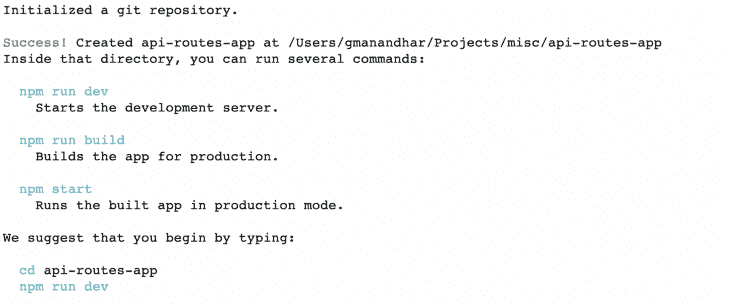
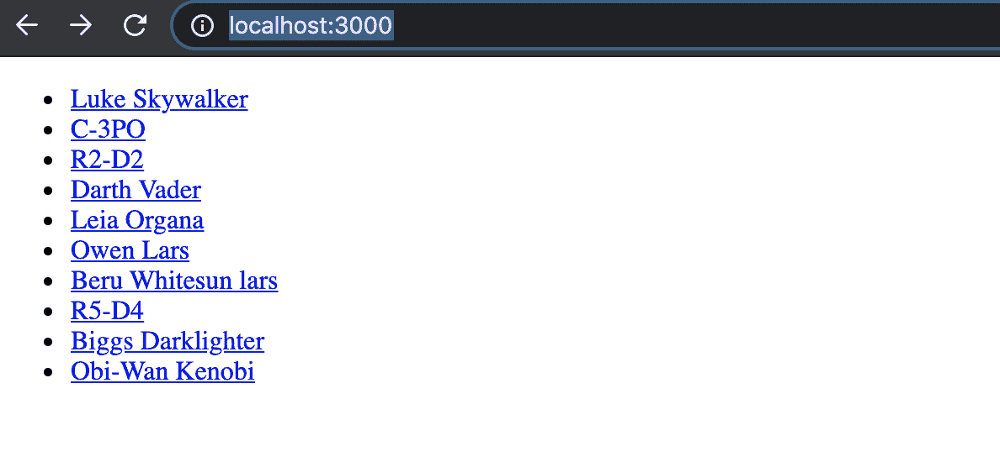
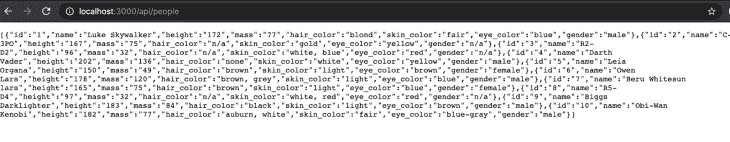
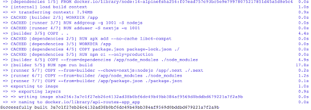
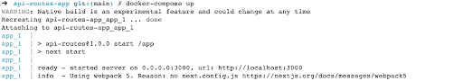
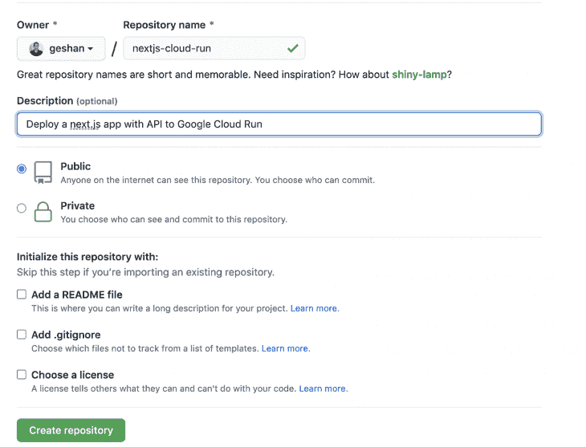
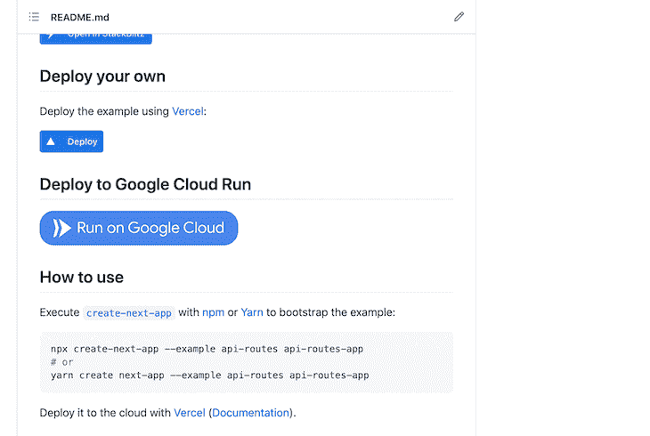
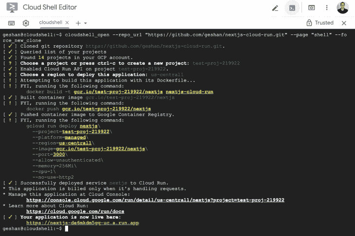
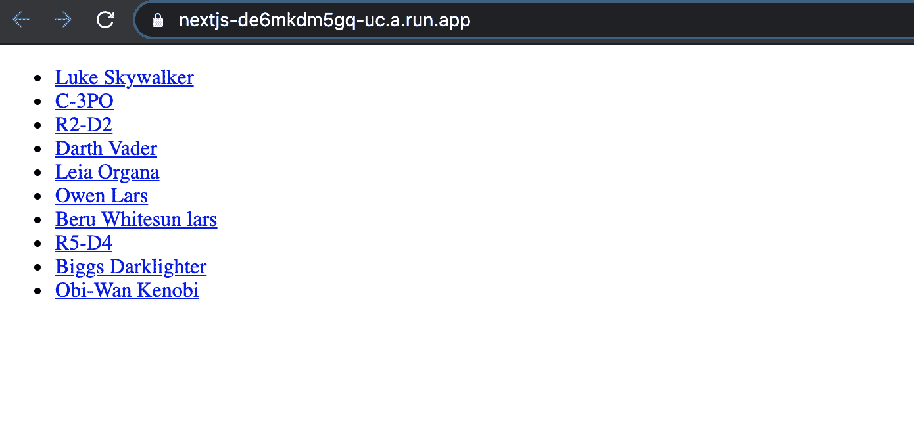

# 如何在 Google Cloud Run - LogRocket 博客上部署 Next.js

> 原文：<https://blog.logrocket.com/how-to-deploy-next-js-on-google-cloud-run/>

Next.js 是一个流行的 React 框架，它填补了典型 React 库的缺失部分，使其成为一个熟练的全栈框架。在本文中，我们将使用一个服务器端渲染(SSR) Next.js 示例，并将其部署在 Google Cloud Run 上，只需点击一个按钮。

## Next.js 是什么？

Next.js 是一个构建在超受欢迎的 React 库之上的框架，它允许开发人员使用全栈框架轻松创建网站。它被称为“生产的 React 框架”,拥有出色的开发人员体验。

Next.js 提供了 Typescript 支持，可以在[静态站点生成(SSG)或服务器端呈现(SSR)](https://blog.logrocket.com/ssg-vs-ssr-in-next-js/) 之间进行选择，是 SEO 友好的，并且提供了开箱即用的图像优化。这些特性使它成为前端开发社区中最受欢迎的 React 框架之一。

## SSR 的优势

服务器端呈现(SSR)的主要明显优势是每个页面都有一个静态 URL，并且因为内容是在服务器上预先生成的，所以对 SEO 友好。如果应用程序中的数据根据权限或登录的用户而频繁更改或动态生成，那么服务器端呈现非常有用。

服务器端呈现的另一个重要好处是内容总是动态的，因为 HTML 是根据每个请求呈现的。对于本教程，记住这一点很重要，因为我们将托管 Next.js 的全栈示例(它有一个模拟 API ), API 的响应在前端呈现。

这就把我们带到了托管你的 API 或任何其他 web 应用程序的最佳选择之一:Google Cloud Run。

## Google Cloud Run 是什么？

Google Cloud Run 可以说是以真正无服务器方式运行容器的最佳全托管服务。我们可以部署和扩展到数百个容器，而不需要编写一行 YAML 或者理解 Kubernetes 和 Knative。

使用 Google Cloud Run，我们可以从一无所有到使用无服务器容器的工作 URL，最棒的是，它是免费的。

接下来，我们将运行 Next.js 的 API 示例，并对其进行 Dockerize。

## 先决条件

在我们开始深入研究代码之前，请确保您具备以下先决条件:

*   NPM 和 NPX 在本地机器上运行的 Node.js
*   Git 和 GitHub 的工作知识
*   Next.js 的工作知识
*   Docker 和 Docker Compose 的工作知识(强烈推荐阅读 Node.js 帖子的 [Docker)](https://blog.logrocket.com/node-js-docker-improve-dx/)
*   Docker 中 [BuildKit](https://docs.docker.com/develop/develop-images/build_enhancements/) 功能的工作知识
*   谷歌云平台(GCP)账户。如果你还没有，你可以在这里免费试用

现在让我们看一些代码示例。

## 构建示例 Next.js 应用程序

Next.js 在 Github 存储库中的 [examples](https://github.com/vercel/next.js/tree/canary/examples) 文件夹中有 270 多个示例。我们将使用这个 [API-routes](https://github.com/vercel/next.js/tree/canary/examples/api-routes) 示例，它包含列出《星球大战》角色及其各种特性的 API。然后我们将 Dockerize，以便更容易部署到 Google Cloud Run。我们开始吧！

为了获得 Next.js API routes 示例，我们将运行以下代码:

```
npx create-next-app --example api-routes api-routes-app

```

下载并在`api-routes-app`文件夹中设置 API routes 示例需要几分钟时间。

完成后，我们应该会看到类似下面的截图:



之后，我们可以使用以下命令检查它在本地是如何运行的:

```
cd api-routes-app
npm run dev

```

然后我们可以在我们最喜欢的浏览器上查看`[http://localhost:3000](http://localhost:3000)`的输出，看起来会像这样:



如果我们点击其中一个名字，它会给出这个角色的某些细节。它使用一个简单的 API 运行，可以在 `[http://localhost:3000/api/people](http://localhost:3000/api/people)`访问该 API，产生如下的 JSON:



您可以继续阅读示例中的代码，了解它是如何工作的。

## 对接 Next.js 示例应用程序

为了对这个 Next.js API 示例应用程序进行 Docker 化，我们将添加一个包含以下内容的新 Docker 文件:

```
# Get NPM packages
FROM node:14-alpine AS dependencies
RUN apk add --no-cache libc6-compat
WORKDIR /app
COPY package.json package-lock.json ./
RUN npm ci --only=production

# Rebuild the source code only when needed
FROM node:14-alpine AS builder
WORKDIR /app
COPY . .
COPY --from=dependencies /app/node_modules ./node_modules
RUN npm run build

# Production image, copy all the files and run next
FROM node:14-alpine AS runner
WORKDIR /app

ENV NODE_ENV production

RUN addgroup -g 1001 -S nodejs
RUN adduser -S nextjs -u 1001

COPY --from=builder --chown=nextjs:nodejs /app/.next ./.next
COPY --from=builder /app/node_modules ./node_modules
COPY --from=builder /app/package.json ./package.json

USER nextjs
EXPOSE 3000

CMD ["npm", "start"]

```

这是一个多级 Docker 文件。第一个阶段是一个依赖项，它运行`npm ci`来获取所有的 npm 包。

第二阶段是构建器，运行`npm run build`构建 Next.js 应用程序。

最后一个阶段是运行阶段，我们从之前的构建阶段复制应用程序及其依赖项，并使用`NODE_ENV`作为生产运行它。

因此，我们将添加一个`Docker-compose.yml`文件来简化 Docker 容器的构建。它将类似于下面的代码:

```
version: '3'
services:
  app:
    build:
      context: ./
    volumes:
      - .:/app
    ports:
      - "3000:3000"

```

在这个`Docker-compose`文件中，我们正在构建应用程序，并将项目的本地根目录映射到容器内的`/app`。然后，我们将容器的端口 3000 暴露给本地端口 3000。

为了更快地构建 Docker，我们将使用 Docker 的 BuildKit 特性。要在打开 BuildKit 特性的情况下构建容器，我们将运行以下命令:

```
COMPOSE_DOCKER_CLI_BUILD=1 DOCKER_BUILDKIT=1 docker-compose build

```

它会给我们一个输出，如下图所示:



要在本地运行应用程序进行测试，我们可以运行:

```
docker-compose up

```

它将向我们展示如下内容:



现在，如果我们转到`[http://localhost:3000](http://localhost:3000)`，它将显示与我们在上一步中看到的相同的人员列表输出。

在这一点上，我推荐大家有兴趣的话多读一些关于 [Node.js 和 Docker](https://blog.logrocket.com/node-js-docker-improve-dx/) 的内容。

恭喜你。您已经成功对接了一个 Next.js 应用程序。

## 为谷歌云运行做好准备

为了将代码部署到 Google Cloud Run，我们将使用方便的 [Cloud Run 按钮](https://github.com/GoogleCloudPlatform/cloud-run-button)。要使用这个神奇的按钮，我们将把下面两行粘贴到`readme.md`:

```
## Deploy to Google Cloud Run

[](https://deploy.cloud.run)

```

然后我们将在根目录下创建一个新的`app.json`文件，如下所示:

```
{
  "name": "nextjs",
  "options": {
    "allow-unauthenticated": true,
    "memory": "256Mi",
    "cpu": "1",
    "port": 3000,
    "http2": false
  }
}

```

默认情况下，Cloud Run 希望应用程序在端口 8080 上运行，因此这个`app.json`文件告诉 Cloud Run 在端口 3000 监听，而不是默认端口。

此外，它还指示 Cloud Run 在`allow-unauthenticated`设置为`true`的情况下打开应用供公众访问。然后指示每个容器使用 1 个 CPU 和 256MB 内存。

最后，它告诉 Cloud Run 不要对这个服务使用 HTTP2。

## 将代码推送到 GitHub

我们需要将代码推送到 GitHub，以便更容易地部署应用程序。为此，我们将创建一个新的存储库，如下图所示:



然后，我们将在项目的根目录下运行以下命令:

```
git remote add origin [email protected]:geshan/nextjs-cloud-run.git #replace with your repo URL
git add .
git commit -m "next.js full application with cloud run config"
git push -u origin main

```

随后，我们将转到回购的根目录，单击蓝色大按钮，上面写着**在 Google Cloud** 上运行，如下所示:


这将把我们带到 Google Cloud 控制台，在那里我们需要授权脚本来部署我们的应用程序，它看起来像下面的 gif:



我们还需要在上述过程中选择项目和地区。

Docker 构建需要几分钟，但是我们的 Next.js 应用程序只需点击一下按钮就可以部署到 Google cloud run。

当部署完成，我们得到一个以`run.app`结尾的 URL 指向我们的服务时，它应该如下所示:



之后，如果我们单击上图中绿色的 URL，我们将看到我们的演示 Next.js 应用程序在 Google Cloud 上运行，如下所示:



如果您只想从我的 [Github 库](https://github.com/geshan/nextjs-cloud-run)进行部署，您也可以这样做。

万岁！我们的 Next.js 示例应用在 Google Cloud Run 上运行良好。

## 后续步骤

这是在 Google Cloud Run 上开始使用 Next.js 进行辅助项目的一种快速而简单的方法。

在团队项目的情况下，我建议探索 [Google Cloud Build](https://cloud.google.com/build) 、 [Google Container Registry](https://cloud.google.com/container-registry) ，以及如何将这些服务结合起来为 Google Cloud 的运行创建一个健壮的 CI/CD 管道。

你也可以看一下[这个](https://github.com/geshan/currency-api/blob/master/cloudbuild.yaml)云构建 YAML 指令文件，它只有三个步骤来将构建好的容器部署到 Google Cloud Run。如果您喜欢[持续部署](https://cloud.google.com/run/docs/continuous-deployment-with-cloud-build)，也可以从 UI 中实现类似的功能。

## 结论

我们已经看到了如何在一个高度可伸缩且最具成本效益的服务上部署一个具有服务器端呈现组件的 Next.js 应用程序:Google Cloud Run。Cloud Run 不仅对开发人员非常友好，而且非常现代，无需服务器。享受在无服务器容器上运行 Next.js 吧！

## [LogRocket](https://lp.logrocket.com/blg/nextjs-signup) :全面了解生产 Next.js 应用

调试下一个应用程序可能会很困难，尤其是当用户遇到难以重现的问题时。如果您对监视和跟踪状态、自动显示 JavaScript 错误、跟踪缓慢的网络请求和组件加载时间感兴趣，

[try LogRocket](https://lp.logrocket.com/blg/nextjs-signup)

.

[](https://lp.logrocket.com/blg/nextjs-signup)[](https://lp.logrocket.com/blg/nextjs-signup)

LogRocket 就像是网络和移动应用的 DVR，记录下你的 Next.js 应用上发生的一切。您可以汇总并报告问题发生时应用程序的状态，而不是猜测问题发生的原因。LogRocket 还可以监控应用程序的性能，报告客户端 CPU 负载、客户端内存使用等指标。

LogRocket Redux 中间件包为您的用户会话增加了一层额外的可见性。LogRocket 记录 Redux 存储中的所有操作和状态。

让您调试 Next.js 应用的方式现代化— [开始免费监控](https://lp.logrocket.com/blg/nextjs-signup)。