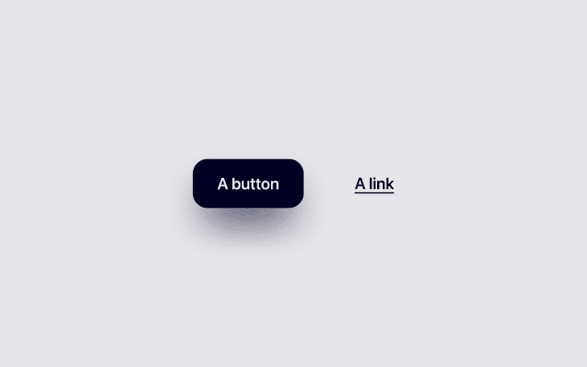
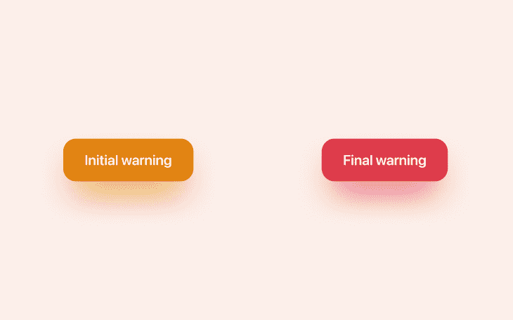
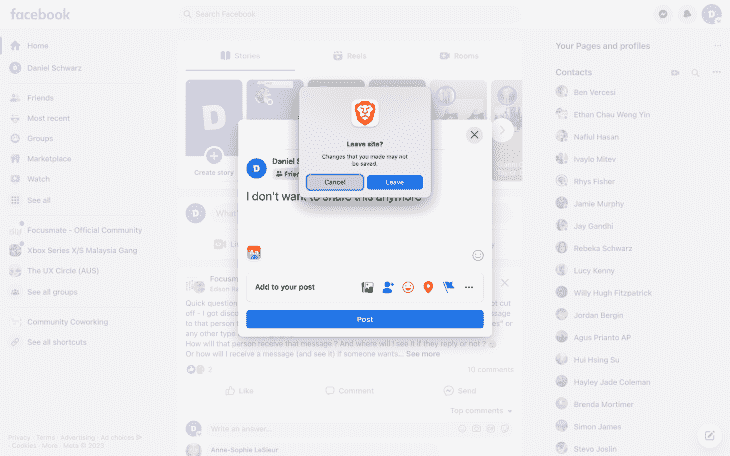
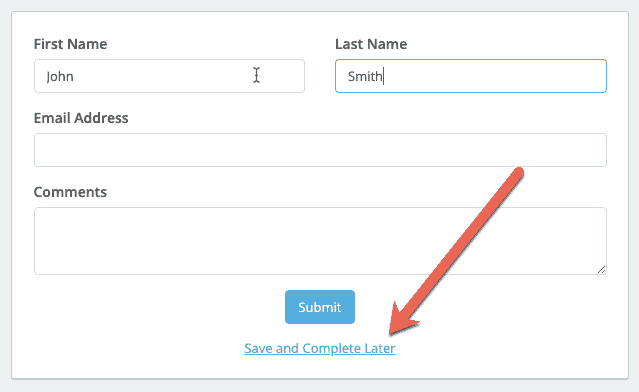
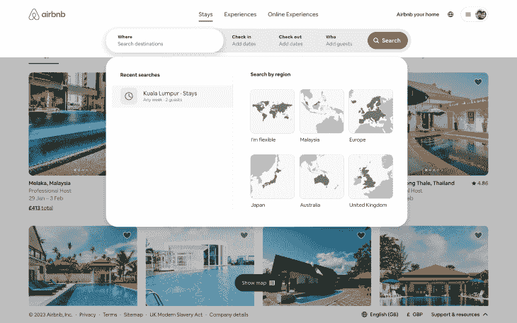
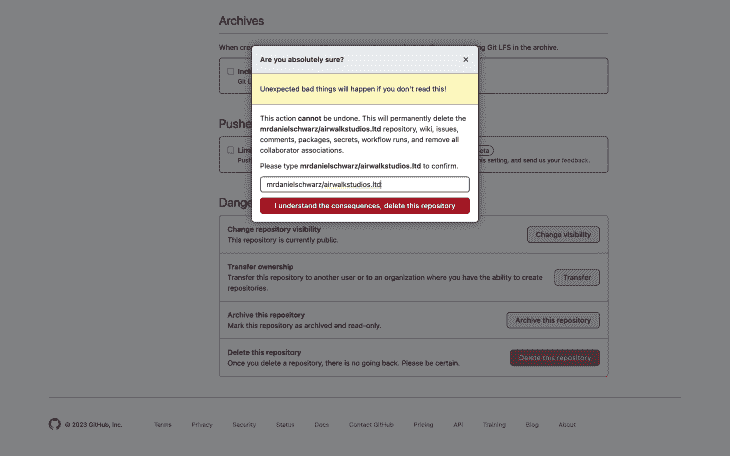

# 如何设计无损取消按钮

> 原文：<https://blog.logrocket.com/ux-design/how-to-design-nondestructive-cancel-buttons/>

我们必须能够以一种让用户尽可能容易导航的方式来设计高挫折感的用户流，特别是因为今天的用户比以往任何时候都更加焦虑和不耐烦。

在这篇文章中，我们将看看取消按钮，有时与它们交互的破坏性后果，以及作为 UX 设计者，我们可以做些什么来确保用户在取消、删除、清除、返回到以前的状态等时有一个轻松的时间并保持完全的控制。

## 什么是取消按钮？

取消按钮是用于触发取消操作的按钮。例如，取消订阅、删除数据或清除输入。自然地，这些行为是破坏性的，所以如果它们设计得不好，用户会报告有负面的体验。在大多数情况下，这些负面体验是由意外丢失数据引起的，在最糟糕的情况下，这是无法挽回的。

正如你所想象的，这些负面的体验是如此糟糕，以至于它们不仅伤害了商业目标，还会导致用户愤怒地立即退出。如果有什么方法可以让用户感到异常愤怒，那么让他们取消/删除所有数据完全是在浪费他们的时间。

让我们看看我们能做些什么来确保这不会发生。

*注意，取消按钮不应与关闭按钮混淆。关闭按钮隐藏东西(例如，它们消除模态，切换标签，等等)，而取消按钮删除东西(例如，数据，输入，等等)。).被隐藏的东西通常很容易被找回，而被取消、删除或清除的东西可能会永远消失。*

## 取消按钮应该是什么样子？

### 取消按钮与取消链接

首先需要明确:取消按钮还是取消链接？

用户希望按钮执行一个动作(即取消)和链接导航到一个新的页面或屏幕(即他们可以从那里取消)，所以正确的选择是任何一个表明你选择的方法，从而满足用户的期望。

最糟糕的可能结果是，用户点击取消链接，以为他们的决定还没有确定，却发现这实际上是一个破坏性的最终决定。

至于为什么你想或不想让用户到另一个页面/屏幕来取消，我们稍后会深入探讨。

### 取消按钮就像其他按钮一样(几乎)

伟大的按钮是:

*   他们是什么，他们将做什么，他们在交互流程的每个点都做了什么，这一点很清楚
*   **可访问性**:由于它们的大小、间距、对比度和 UI 复制，任何人都可以很容易地找到它们并与之互动
*   它们看起来很漂亮，就像你真的很想点击它们一样

我喜欢称之为“三 A”。

我在上一篇文章中更详细地讨论了什么是[优秀的按钮设计](https://blog.logrocket.com/ux-design/design-cta-buttons-ux-best-practices/),总结如下:

*   足够大的目标尺寸(最小:44px)
*   目标之间有足够的间距(最小 8px)
*   足够的色彩对比(使用[鲜明的](https://getstark.co/)进行检查)
*   衬垫(我的建议:0.5 倍高度)
*   圆角(我的建议:0.3×高度)
*   微妙的悬停状态(我的建议:110%亮度)
*   逼真的投影([见文章](https://blog.logrocket.com/ux-design/design-cta-buttons-ux-best-practices/))
*   可识别的 UI 副本(适用于链接和按钮)
*   位于下行线下方的下划线(适用于链接)

### 取消按钮颜色

抛开标准的按钮设计技巧不谈，取消按钮具体需要什么？答案可能会让你吃惊:不多。取消按钮只需要是特定的颜色。

如果与取消按钮交互会导致某种程度的破坏性行为，那么取消按钮应该是橙色或红色的(橙色表示初始警告，红色表示最终警告)。

然而，大多数的取消按钮都只有轻微的破坏性——你应该保持这些按钮的中立性(比如，在灰色光谱上)。如果你看一下 HTML 的原生搜索元素(`<input type="search">`)，你会看到当鼠标悬停在它们上面时，会出现一个“×”图标，帮助用户取消/清除他们的输入——它是灰色的，因为它只有轻微的破坏性(用户只会丢失 1-3 个单词)。出于同样的原因，它是一个小图标而不是大按钮。

参见 [CodePen](https://codepen.io) 上 Daniel Schwarz([@ mrdanielschwarz](https://codepen.io/mrdanielschwarz))
的笔 [搜索输入示例](https://codepen.io/mrdanielschwarz/pen/VwByYgg)。

你的品牌颜色(希望)是积极的颜色，所以它会产生完全相反的效果，让用户停下来思考他们的行为。你肯定会想避免使用这种颜色。

## 取消按钮的设计都是关于摩擦力的

伟大的设计有时需要摩擦。更少的摩擦意味着用户可以更快地完成任务，但是更多的摩擦可以减少他们犯错的可能性。我们不得不牺牲其中的一点来获得另一点，所以正如你可能已经猜到的，这一切都是为了找到最佳的平衡。

在许多情况下，出错的可能性为零，在这种情况下，我们可以将 100%的精力放在速度和便利性上。然而，当涉及到取消按钮时，我们必须根据任何潜在错误的严重性，在速度和摩擦之间找到最佳平衡。

### 清除输入

回到搜索输入的例子——假设您之前已经清除了一个搜索输入，您会注意到根本没有任何冲突。这是因为这几乎不是一个破坏性的动作(你只是丢失了几个容易重新输入的单词)。

但是，如果是长表单输入或由多个输入组成的表单，您会希望取消按钮伴随着摩擦。现在，很难推荐具体的该做什么和不该做什么，因为它们取决于许多因素，但可以考虑以下方法的任意组合:

*   以某种方式取消或离开页面/屏幕/模式时的警告对话框

*   保存进度的选项，以便用户以后可以返回并完成表单

*   自动保存不敏感的输入和过滤器(搜索界面常见的 UX 模式)

### 删除数据和取消订阅

说到删除数据和取消订阅(也可以包括数据删除)，我们需要更加小心。

先说数据。这里有几个你可能熟悉的例子:

*   文档(例如，Figma 或 Google 文档)
*   项目、团队或组织(任何需要时间来组织的事情)
*   大部分个人数据(例如档案或历史/算法数据)

有许多有趣的方法来处理这些场景，每种方法都有利弊。

首先，考虑让用户通过电子邮件确认他们的行为。这可能是我最喜欢的方法，因为它也增加了一层安全性，虽然它也是最慢的方法，但用户不一定需要立即确认他们的操作。如果删除是时间敏感的，要求用户确认他们的密码是一个更好的方法。

如果安全不是一个真正的问题，考虑让用户回忆一些事情，比如他们的电子邮件地址或他们试图删除的内容的名称。

最起码要有一句简单的“你确定吗？”问题。

所有这些方法都会产生摩擦，让用户有机会在采取行动前重新考虑他们的行动。这些方法具有不同程度的安全性和便利性——只需选择一种感觉最合适的方法。

取消订阅会带来潜在的数据丢失，所以方法基本相同。然而，取消订阅也可能会导致支付授权的丧失，这对于 B2C 产品来说是一个小小的不便，但对于 B2B 产品来说则是一个很大的不便，因为要重新授权支付，通常需要得到“更高层”的批准。因此，除了利用已经提到的 UX 设计技巧，确保在不删除支付信息的情况下取消支付授权，使用户更容易从意外取消中恢复。

另外，不要坚持让用户打电话或发邮件来取消(但是我相信你已经知道了！).

### 为停用或取消提供应急计划

作为一种偶然性(或者替代性？)，考虑提供停用或实施宽限期，在此期间数据被锁定而不是丢失。选择这些方法中的一种应该取决于您存储数据的成本(在宽限期内，数据仅存储有限的时间)。

### 附加页面/屏幕

如果你想尽力留住客户，或者需要更多关于删除/取消的信息，那么你可能需要引导用户到另一个页面/屏幕。如前所述，这可能是(初始)取消按钮最好作为链接(特别是橙色警告链接)的唯一场景。

## **如何解决取消流程的问题**

取消流程一开始就令人沮丧，因为它们的结果没有也永远不会有回报。最好的情况是，用户从困境中走到中立地带。从好的方面来说，人们喜欢抱怨像这样令人沮丧的场景，这使得我们作为设计师的工作更容易。如果我们让用户很容易地向我们抱怨，他们会毫不犹豫地向我们详细抱怨(多亏了社交媒体，即使我们不这么做，也很有可能)。

尽可能经常地[获得用户反馈](https://blog.logrocket.com/product-management/customer-feedback-why-you-should-seek-how-to-obtain/)是个好习惯。你最好的办法是提示用户完成反馈调查。然而，在实时聊天和社交媒体上可访问和可用也很重要(特别是如果你的目标之一是运行损害控制)。

用户不太可能对较小的不便大呼小叫，例如丢失输入或无法取消操作并返回到以前的状态，这使我们更难发现和改进它们。诀窍是使用分析来识别刷新次数异常的页面/屏幕。之后，使用会话重放来查看这些刷新是否正在发生，因为用户无法找到稳定的基础(即，通过刷新重新开始)。

总之，只要有机会，就用各种方式收集反馈。对于小问题(包括那些小到用户可能会忘记或觉得不好意思提及的问题)，悄悄地挖掘你的分析，偷看你的会话回放，看看用户实际上在做什么，一个一个播放。

## 结论

作为设计师，我们倾向于关注让用户做我们希望他们做的事情的方法，而不是帮助他们取消那些事情的方法(理所当然地，对某些转换流/业务目标进行优先排序是很重要的)。然而，让用户很难取消、删除、清除、取消订阅、返回等等会让他们非常沮丧，这是一种确保他们不想逗留的快速方法。

重要的是不要迷失在主要的业务目标中，并且记住所有的小事情(包括取消操作)加起来实际上会对大计划中的业务目标产生巨大的影响。为此，取消按钮应该是清晰的，尽管会导致摩擦，以防止用户意外采取行动，而不是模糊或不可预测的。

如果你有什么想补充的，请在下面的评论区留言。

一如既往，感谢您的阅读！

*精选图片来源:* [IconScout](https://iconscout.com/icon/cancel-close-delete-exit-discard-dismiss-remove-2)

## [LogRocket](https://lp.logrocket.com/blg/signup) :无需采访即可获得 UX 洞察的分析

[LogRocket](https://lp.logrocket.com/blg/signup) 让您可以回放用户的产品体验，以可视化竞争，了解影响采用的问题，并结合定性和定量数据，以便您可以创建令人惊叹的数字体验。

查看设计选择、交互和问题如何影响您的用户— [立即尝试 LogRocket】。](hhttps://lp.logrocket.com/blg/signup)