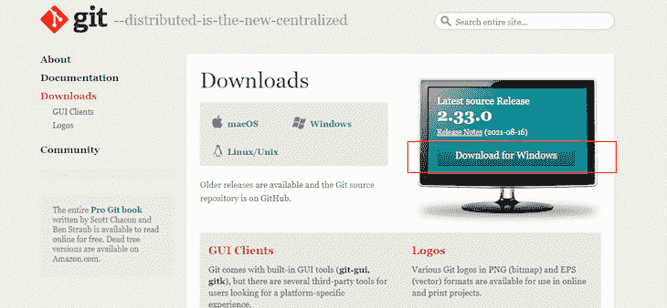
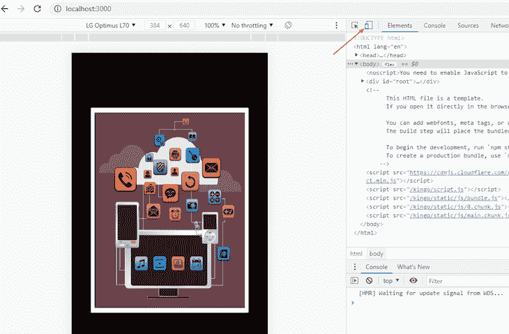
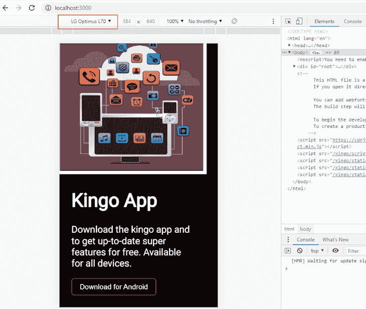
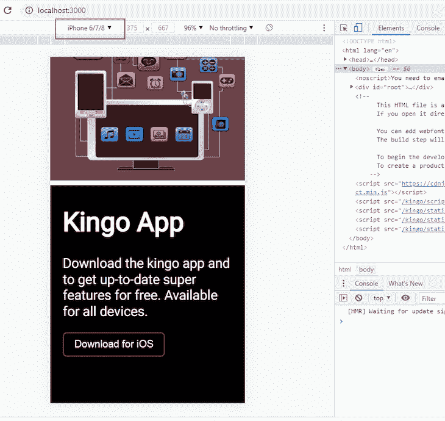
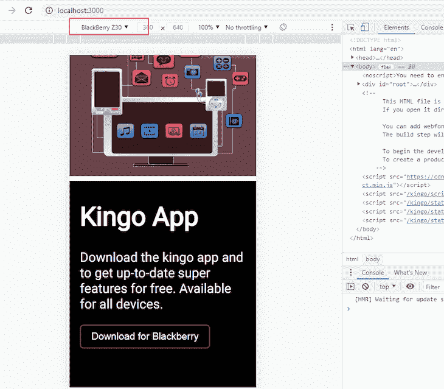

# 如何在 React 中检测和呈现设备类型

> 原文：<https://blog.logrocket.com/how-to-detect-render-device-types-react/>

有相当多的原因使得开发者想要检查用户在什么样的设备上浏览网站。首先，我们有响应式设计，这有助于我们在各种设备上创建一致且有凝聚力的页面。

另一个很好的理由是在不同的设备上呈现不同的内容。Git 下载页面就是一个很好的例子。



该页面运行一个脚本，该脚本自动确定用户使用什么操作系统来查看该页面。

基于该信息，相关的版本出现，例如当用户在 Windows 电脑上时为“Windows 下载”,或者当用户在 Mac 电脑上时为“MacOS 下载”。

我们检测设备类型的项目非常相似。我们将构建的页面有一个按钮，该按钮根据用户代理的操作系统显示不同的文本。

本教程涵盖以下主题:

*   如何创建 React 应用程序并定义组件
*   如何使用`mobile-detect`库
*   如何检测客户端用户设备/操作系统并相应地呈现内容

如果您打算继续编写代码，您可以按照[这个文档(README.md)来学习如何在您的本地机器](https://github.com/KingsleyUbah/Detect-Device/blob/main/README.md)上设置这个项目。

让我们开始吧。

## 了解用户代理字符串

每当客户机(web 浏览器)向 web 服务器请求一个网页时，有关请求的信息就在 HTTP 头内发送，例如用户代理。

用户代理保存一串信息，用于标识请求页面的浏览器、运行该页面的操作系统，甚至设备的名称。所有这些信息都包含在用户代理字符串中。

### 利用用户代理字符串

简单来说，用户代理字符串没有太大的帮助。为了理解用户代理字符串并随后使用它来推断关于客户机的信息，我们必须解析它。

为此，我们从字符串中解构独立的信息，这取决于我们要寻找什么。谢天谢地，有一个非常有用的 JavaScript 库可以帮助我们实现这一点。

## 什么是`mobile-detect.js`？

`[Mobile-detect.js](https://www.npmjs.com/package/mobile-detect)` [是一个设备检测 JavaScript 库](https://www.npmjs.com/package/mobile-detect)，帮助开发者确定用户的操作系统。有了这些信息，我们就可以为每个检测到的系统选择呈现什么样的内容。

对于我们的应用程序，我们将创建一个非常简单的名为“Kingo”的下载页面根据用户的操作系统，此页面上的下载按钮将显示以下文本:

*   “在 Android 上下载”，如果用户从 Android 设备上查看
*   “在 iOS 上下载”，如果用户从苹果移动设备上查看
*   “在 Blackberry 上下载”，如果用户从 BlackBerry 设备上查看
*   “在 Windows 上下载”，如果用户从 Windows 电脑上查看
*   “在 MacOS 上下载”，如果用户从 Macintosh 电脑上查看

首先，让我们运行以下命令:

```
npx create-react-app kingo

```

这个命令在当前目录下创建一个名为`kingo`的文件夹，并为我们安装依赖项。`[create-react-app](https://blog.logrocket.com/getting-started-with-create-react-app-d93147444a27/)` [自动为我们处理配置](https://blog.logrocket.com/getting-started-with-create-react-app-d93147444a27/)。

创建项目文件夹后，让我们开始创建组件。我们的 React 应用程序将只包含两个组件。

*   `App.js`，父组件
*   `button.js`，按钮组件

但是在我们开始定义组件之前，我们必须处理我们的模板文件`index.html`。

### 在 CDN 上使用`mobile-detect.js`

在我们的项目中，我们有各种各样的方法。然而，最简单的方法是通过内容交付网络(CDN)访问它。

为此，导航到`kingo/public/index.html`并将以下链接标签粘贴到`index.html`文件中:

```
<script src="https://cdnjs.cloudflare.com/ajax/libs/mobile-detect/1.4.5/mobile-detect.min.js"></script>

```

有了这个脚本，我们现在可以在 React 应用程序中使用移动检测。

## 创建我们的 React 根组件

接下来，让我们创建我们的根 React 组件，`app.js`。进入`kingo/src/App.js.`

我们必须首先导入 React 库，因为我们正在创建一个 React 组件、`app.css`和`button.js`组件(未定义)以及英雄图像:

```
import React from 'react';
import './App.css';
import Button from './components/Button';
import image from './5.jpg'

function App() {
  return (
    <div className="App">
      <div className="hero">
        
      </div>
      <div className="text">
        <h1>Kingo App</h1>
        <p>Download the kingo app and to get up-to-date super features for free. Available for all devices.</p>
        <Button />
      </div>
    </div>
  );
}

export default App;

```

我们的应用程序视图分为两个部分。第一个`div`、`hero`，保存英雄图像，第二个`div`、`text`，保存英雄文本以及按钮组件。稍后在样式表中，我们将使用 Flexbox 将它们并排对齐。

### 创建我们的按钮组件

这是第二个也是最后一个组成部分。进入`kingo/src/components/Button.js`，在`button.js`中，我们定义了一个简单的输入元素，带有一个`class`和一个唯一的`id`。我们还必须设置一个临时的`Download on your device`的`value`:

```
import React from 'react';

function Button() {
  return (
    <input type="button" id="button" value="Download on your device" />
  )
}

export default Button

```

稍后，我们将根据用户在什么设备上查看我们的 React 应用程序，用其他变化来覆盖这个`value`。

* * *

### 更多来自 LogRocket 的精彩文章:

* * *

### 设计页面样式

要设计我们的页面，请进入`kingo/src/App.css`并添加以下内容:

```
@import url('https://fonts.googleapis.com/css2?family=Roboto&display=swap');

body {
  background-color: black;
  color: white;
  box-sizing: border-box;
  display: flex;
  align-items: center;
  justify-content: center;
  font-family: "roboto",sans-serif;
}

.App {
  display: flex;
  align-items: center;
  justify-content: center;
  margin: 70px auto;
  max-width: 1000px;
  padding: 30px;
}

h1 {
  font-size: 50px;
}

p {
  font-size: 25px;
}

img {
  height: 300px;
  width: 300px;
}

input {
  border: 2px solid brown;
  background: none;
  color: white;
  padding: 10px 20px;
  cursor: pointer;
  font-size: 19px;
  border-radius: 7px;
}

.text {
  padding: 0 40px;
}

@media(max-width: 768px) {
  .App {
    display: flex;
    flex-direction: column;
    padding: 30px;
  }

  img {
    height: 400px;
    width: 400px;
  }
}

```

## 带有`MobileDetect`的检测装置

这里的目标非常简单:我们希望根据用户的设备在下载按钮上显示不同的文本。

为此，我们必须在名为`script.js`的`public`文件夹中创建一个自定义脚本。因此，进入`kingo/public`并创建一个名为`script.js`的新文件。

接下来，编写检测设备的代码。这段代码放在`kingo/public/script.js`中:

```
function detectDevice() {
let type = new MobileDetect(window.navigator.userAgent)
let button = document.getElementById("button")

  if (type.os() === "iOS") {
    button.value = "Download for iOS";
  } else if (type.os() === "AndroidOS") {
    button.value = "Download for Android";
  } else if (type.os() === "BlackBerryOS") {
    button.value = "Download for Blackberry";
  } else if (type.os() === "WindowsOS") {
    button.value = "Download for Windows";
  } else if (type.os() === "MacOS") {
    button.value = "Download for Mac";
  } else {
    button.value = "Download on your device";
  }

}

window.addEventListener("load", detectDevice);

```

让我们来分解这个代码。

首先，我们初始化`MobileDetect()`对象，并将来自`windows`对象的`userAgent`属性作为参数传入。

这样，脚本可以访问查看我们页面的客户端设备的用户代理数据。我们还可以从 DOM 中访问带有`button`的`id`值的`input`元素，并将输入传递给一个变量。

接下来，执行嵌套的`if`语句，使用`os()`方法检查用户的操作系统。根据结果，我们可以使用`textContent`属性为按钮指定不同的值。

### 查看结果

Chrome 网络浏览器自带一个名为 [Chrome DevTool 的内置功能；所有的网络浏览器都有一个](https://blog.logrocket.com/the-most-important-features-of-all-major-browsers/#devtools)。

对于 Chrome 来说，我们只需要通过点击键盘上的 F12 或者点击右上角的三个点来切换 DevTool，然后选择**更多工具**，然后选择**开发者工具**。

要模拟一个设备，我们必须首先切换设备工具栏。



Chrome DevTool 提供了一个我们可以模拟的设备列表。我们可以从顶部的下拉菜单中选择设备，根据我们选择的设备，应用程序中的按钮会显示不同的下载文本。

如果模拟 Android 设备，在重新加载时会呈现一个新页面，并且按钮包含不同的值。



如果模拟 Apple 设备，则会出现不同的相应文本。



黑莓设备也有同样的体验。



这同样适用于 Windows、MacOS 和任何其他指定的操作系统。

## 包扎

在本教程中，我们探讨了如何检测用户在什么设备上查看应用程序页面，以及如何相应地呈现内容。使用来自`mobile-detect`库的`os()`方法，我们解析了一个用户代理字符串来检索我们需要的信息。

感谢您的关注。本教程的[源代码可以从这个 GitHub 资源库](https://github.com/KingsleyUbah/Detect-Device)中获得。

祝你一周愉快！

## 使用 LogRocket 消除传统反应错误报告的噪音

[LogRocket](https://lp.logrocket.com/blg/react-signup-issue-free)

是一款 React analytics 解决方案，可保护您免受数百个误报错误警报的影响，只针对少数真正重要的项目。LogRocket 告诉您 React 应用程序中实际影响用户的最具影响力的 bug 和 UX 问题。

[ ](https://lp.logrocket.com/blg/react-signup-general) [  ](https://lp.logrocket.com/blg/react-signup-general) [LogRocket](https://lp.logrocket.com/blg/react-signup-issue-free)

自动聚合客户端错误、反应错误边界、还原状态、缓慢的组件加载时间、JS 异常、前端性能指标和用户交互。然后，LogRocket 使用机器学习来通知您影响大多数用户的最具影响力的问题，并提供您修复它所需的上下文。

专注于重要的反作用臭虫-[试试今天的 LogRocket】。](https://lp.logrocket.com/blg/react-signup-issue-free)