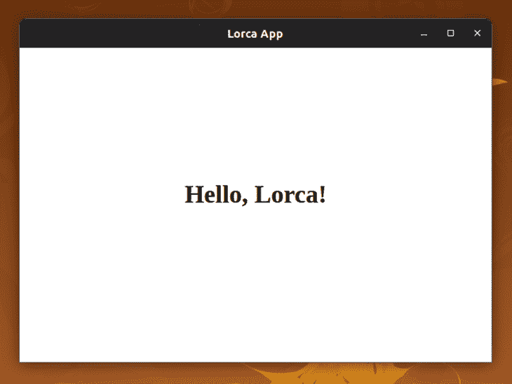
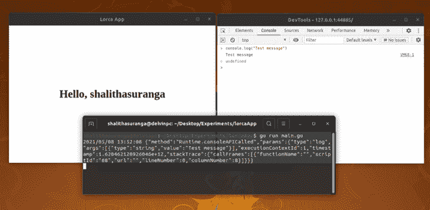

# 如何用 JavaScript 和 Go - LogRocket 博客开发跨平台桌面应用

> 原文：<https://blog.logrocket.com/how-to-develop-cross-platform-desktop-apps-with-javascript-and-go/>

开发人员可以使用几种方法来开发桌面应用程序:特定于平台的 API、本地小部件工具包、混合桌面应用程序开发框架。如果我们计划使用特定于平台的 API，我们通常要么需要为每个操作系统维护多个代码库，要么使用本地小部件工具包，如 Qt 或 GTK，它们通常是跨平台的库。后一种选择在开发人员中很受欢迎，因为它们在跨平台桌面应用程序开发中易于使用。

然而，本地小部件工具包是有限的，开发者在使用它们时很难快速制作定制的 GUI 元素。这就是为什么混合桌面应用程序框架和库如今如此受欢迎——它们允许开发人员使用 JavaScript 开发跨平台的桌面应用程序。

本教程将解释如何用 JavaScript 前端和 Go 后端开发跨平台的桌面应用程序。

## 用 Go 进行 GUI 编程

[Go 编程语言](https://blog.logrocket.com/getting-started-with-go-for-frontend-developers/)是一种速度惊人、内存安全、并发优先的静态类型语言。Go 语法类似于 C 语言，但带有垃圾收集器和我们在现代编程语言中看到的许多改进，这使得它在为桌面应用程序编写 GUI 元素时是一个不错的选择。如果我们选择混合方法，可以使用任何前端框架来创建 GUI，但开发人员可以通过一些不同的方法来使用 Go:

*   使用 Go 使用`[syscall](https://golang.org/pkg/syscall/)`模块和 C 直接调用特定于平台的 GUI APIs
*   使用具有 Go 绑定的本地 GUI 工具包，例如用于 Go 的 [Qt 绑定](https://github.com/therecipe/qt)
*   用 Go 库/框架构建桌面应用，比如支持 web 前端的 [Lorca](https://github.com/zserge/lorca) 和 [Go webview](https://github.com/webview/webview)

在本教程中，我们将关注第三个选项。Lorca 和 Go webview 是两个最流行的 Go 库，用于构建轻量级的、基于 JavaScript 的跨平台桌面应用程序，因为它们允许我们实际使用我们的 web 开发知识。

## 使用 Lorca 库创建桌面应用程序

Lorca 是一个 Go 库，它帮助开发人员创建轻量级的跨平台桌面应用程序，具有 Go 后端和 JavaScript 前端。

Lorca 不像 Electron 那样将应用程序与 web 浏览器捆绑在一起——它使用安装的谷歌 Chrome 浏览器来呈现应用程序的 web 前端，并通过 [WebSocket 协议](https://developer.mozilla.org/en-US/docs/Web/API/WebSockets_API)实现 JavaScript 和 Go 之间的消息通道。(如果你的机器没有安装 Chrome，会提示你下载；用户也是一样。)

这个双向消息通道帮助 Lorca 从 web 前端调用本机代码。这个概念最初是由 Google 用他们的 [Carlo 库](https://github.com/GoogleChromeLabs/carlo)实现的，除了 Carlo 使用 Node 作为后端，而不是 Go。(卡洛项目是[不再积极维护](https://github.com/GoogleChromeLabs/carlo/issues/163#issuecomment-592238093)。)

现在，让我们创建一个简单的 Lorca 应用程序。我们的示例应用程序将在启动时显示“Hello，[username]”，使用本机调用来获取操作系统的当前用户名。

### 设置 Go 和 Lorca 开发人员环境

Lorca 没有特殊的依赖关系，你只需要在电脑上安装 Go 语言工具就可以制作 Lorca apps 了。可以直接从官网[下载安装 Go 语言工具](https://golang.org/dl/)。

安装过程结束后，运行以下命令以确保 Go CLI 正常工作。

```
$ go version

```

### 创建 Lorca 窗口

让我们熟悉一下洛尔卡。创建一个新目录，然后在新创建的目录中创建一个`main.go`文件。之后，将以下代码添加到`main.go`文件中:

```
package main
import (
  "log"
  "net/url"
  "github.com/zserge/lorca"
)
func main() {
  // Pass HTML from data URI.
  ui, err := lorca.New("data:text/html,"+url.PathEscape(`
  <html>
    <head>
      <title>Lorca App</title>
    </head>
    <body>
      <h1 style="padding-top: 40vh; text-align: center;">Hello, Lorca!</h1>
    </body>
  </html>
  `), "", 600, 400)
  if err != nil {
    log.Fatal(err)
  }
  defer ui.Close()
  <-ui.Done()
}

```

`lorca.New`方法通过将所需的配置(如窗口大小和 URL)作为命令行参数发送给 Google Chrome 二进制文件来创建一个最小的 Chrome 窗口。例如，宽度和高度值作为`--window-size=600,400`发送到 Google Chrome 二进制文件。

运行以下命令来执行您的应用程序。注意，您只需要在第一次使用 Lorca 时运行`$ go get`，因为 Go 语言编译器需要从 GitHub 下载 Lorca 代码。稍后，Go 将从硬盘中读取它。

```
$ go get 
$ go run main.go

```



A simple desktop app built using Lorca

这个应用程序从一个 HTML 数据 URI 加载前端，但是 web 前端通常包含几个资源。在下一部分中，我们将通过实现一个静态文件服务器来为我们的 web 资源提供服务，从而扩展这个应用程序以支持常见的 web 前端。

### 实现后端

现在，我们将实现一个静态文件服务器来服务我们的 web 前端。我们还将向 web 前端公开一个新的 Go 函数，以获取操作系统的当前用户名。通过添加以下代码来修改您的`main.go`文件:

```
package main
import (
  "log"
  "net"
  "net/http"
  "fmt"
  "runtime"
  "os"
  "github.com/zserge/lorca"
)
func getUserName() string {
    var envKey string
    if runtime.GOOS == "windows" {
      envKey = "USERNAME"
    } else {
      envKey = "USER"
    }
    return os.Getenv(envKey)
}
func main() {
  // Pass HTML from data URI.
  ui, err := lorca.New("", "", 600, 400)

  ui.Bind("getUserName", getUserName)

  if err != nil {
    log.Fatal(err)
  }

  ln, err := net.Listen("tcp", "127.0.0.1:0")
  if err != nil {
    log.Fatal(err)
  }
  defer ln.Close()

  go http.Serve(ln, http.FileServer(http.Dir("./www")))
  ui.Load(fmt.Sprintf("http://%s", ln.Addr()))

  defer ui.Close()
  <-ui.Done()
}

```

### 实现前端

上面的 Go 代码有一个静态文件服务器，它为`www`目录中的所有资源提供服务，这意味着可以将任何 web 资源放在`www`目录中。在`www`目录下放置一个名为`index.html`的文件，代码如下:

```
<!doctype html>
<html>
<head>
  <title>Lorca App</title>
  <link rel="shortcut icon" href="favicon.png">
  <style>
    #textField {
      padding-top: 40vh;
      text-align: center;
    }
  </style>
</head>
<body>
  <h1 id="textField"></h1>
  <script>
    (async () => {
      try {
        let userName = await getUserName();
        document.getElementById("textField").innerText = `Hello, ${userName}`;
      }
      catch (e) {
        console.error(e);
      }
    })();
  </script>
</body>
</html>

```

Lorca 将`getUserName` Go 函数作为异步函数公开给前端。同样，您可以在 Lorca 中向前端公开任何 Go 方法。运行`main.go`文件来测试您的应用程序。

您还可以从执行`go run`命令的终端看到 web 控制台输出。



Debugging a Lorca app using ChromeDevTools and Terminal

### 构建和发布您的应用程序

您可以编译 Go 源文件来获得 Lorca 应用程序的可执行版本。以下命令将为您当前的操作系统创建一个优化的可执行文件。

```
$ go build -ldflags "-s -w" main.go

```

运行以上命令后，您会注意到项目目录中有一个名为`main`的新二进制文件。双击并打开二进制文件，打开 Lorca 应用程序。二进制文件大小约为 7MB——明显小于 Electron 和 NW.js 产生的包大小。

随意使用 [UPX 压缩](https://upx.github.io/)来进一步减小二进制文件的大小。如果您想隐藏您的 JavaScript 源文件，请将您的资源嵌入到 Go 源文件中，如第一个示例中所述。

您可以使用二进制文件为您的应用程序制作安装程序或包。例如，可以为 Linux 用户制作一个 AppImage，为 Windows 用户制作一个 MSIX 软件包，为 MacOS 用户制作一个 DMG 安装包。

## 使用 Go webview 库创建桌面应用程序

Lorca 使用安装的谷歌 Chrome 浏览器作为 UI 层。谷歌 Chrome 是在单独的进程中执行的，所以我们无法自定义原生窗口。换句话说，Lorca 应用程序不能有自定义的窗口图标、窗口样式等。

使用 Lorca，你需要谷歌 Chrome 来运行应用程序，但[Go webview 库](https://github.com/webview/webview)使用操作系统的内置浏览器组件来实现这一点，并使用平台特定的 API 创建原生窗口。

如果您计划为多个操作系统构建一个类似本机的混合桌面应用程序，Go webview 库是 Lorca 库的一个很好的替代选择。Go webview 库使用同一开发者制作的 webview C++库。Tauri 和 Neutralinojs 框架都是用 webview C++库开发的。

### 创建简单的 Go webview 应用程序

Go webview 库提供了与 Lorca 类似的 API，开发人员环境设置也是一样的。让我们继续使用 Go webview 库构建一个小应用程序。

将下面的代码添加到`main.go`文件中，类似于我们在第一个例子中所做的。

```
package main
import (
    "net/url"
    "github.com/webview/webview"
)
func main() {
  debug := true
  w := webview.New(debug)
  defer w.Destroy()
  w.SetTitle("Go webview app")
  w.SetSize(600, 400, webview.HintNone)
  w.Navigate("data:text/html," + url.PathEscape(`
  <html>
    <body>
      <h1 style="padding-top: 40vh; text-align: center;">Hello, Go webview!</h1>
    </body>
  </html>
  `))
  w.Run()
}

```

以下终端命令将运行您的应用程序；关于`$ go get`的相同注释也适用于此:

```
$ go get
$ go run main.go

```


A simple desktop app built using Go webview

构建和发布过程与我在 Lorca 教程中描述的相同。Go webview 示例的二进制文件大小应该在 2MB 左右，但是请注意，它可能会根据您使用的 Go 库而有所不同。

## Lorca 和 Go webview 与其他 Go 框架的比较

Lorca 和 Go webview 都是库，不是框架。换句话说，这两个库都只为基于 JavaScript 的跨平台桌面应用程序开发提供了一个最小的解决方案。也有构建基于 JavaScript 的桌面应用的 Go 框架，比如 [Wails](https://github.com/wailsapp/wails) ，这是一个基于 Go webview 的框架，用于用 JavaScript 构建跨平台的桌面应用。选择一个库而不是一个框架将帮助你制作轻量级的和非常可定制的桌面应用。

## 结论

虽然没有像 Electron 这样的全功能本机 API，但它的巨大优势是您可以更有选择性地在最终的应用程序包中只包含您需要的东西。正如我们所讨论的，Lorca 的原生窗口定制是有限的，因为它直接使用 Google Chrome 进程，而 Go webview 则为原生窗口定制公开了窗口实例的处理程序。尽管有这些限制，但当你想避免在应用程序中加载过多的未使用代码，并且需要你的最终应用程序比 Electron 所能产生的小得多时，这种方法确实有效。

## 使用 [LogRocket](https://lp.logrocket.com/blg/signup) 消除传统错误报告的干扰

[](https://lp.logrocket.com/blg/signup)

[LogRocket](https://lp.logrocket.com/blg/signup) 是一个数字体验分析解决方案，它可以保护您免受数百个假阳性错误警报的影响，只针对几个真正重要的项目。LogRocket 会告诉您应用程序中实际影响用户的最具影响力的 bug 和 UX 问题。

然后，使用具有深层技术遥测的会话重放来确切地查看用户看到了什么以及是什么导致了问题，就像你在他们身后看一样。

LogRocket 自动聚合客户端错误、JS 异常、前端性能指标和用户交互。然后 LogRocket 使用机器学习来告诉你哪些问题正在影响大多数用户，并提供你需要修复它的上下文。

关注重要的 bug—[今天就试试 LogRocket】。](https://lp.logrocket.com/blg/signup-issue-free)