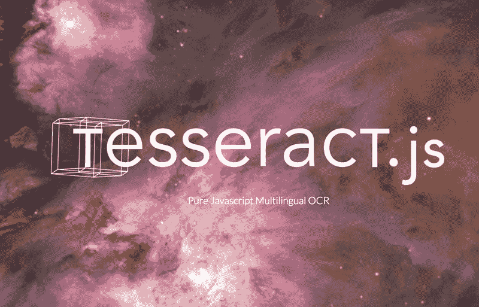
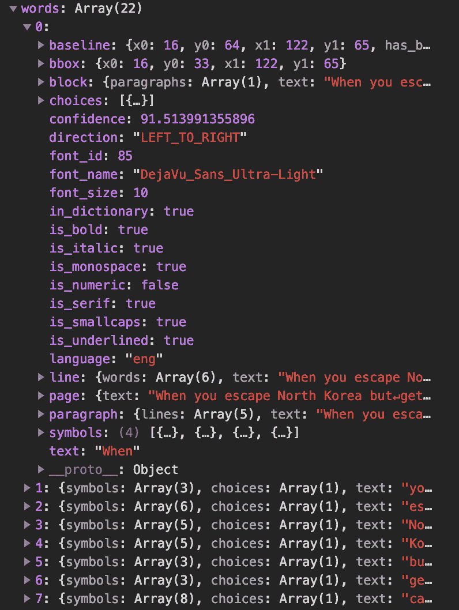
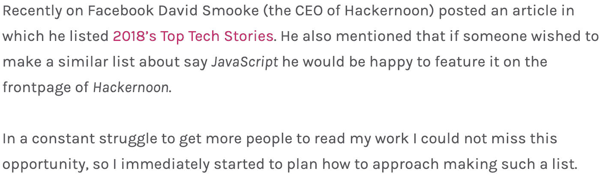
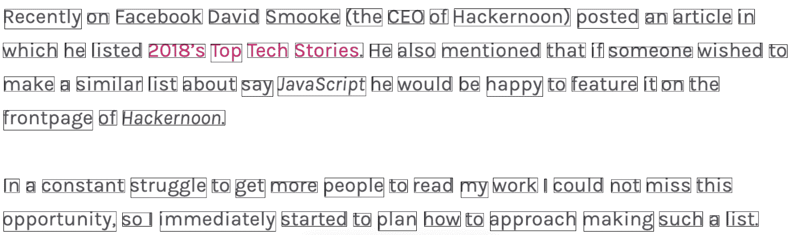

# 如何使用 JavaScript - LogRocket Blog 从图像中提取文本

> 原文：<https://blog.logrocket.com/how-to-extract-text-from-an-image-using-javascript-8fe282fb0e71/>



Tesseract.js

现在许多笔记应用程序都提供给文档拍照并将其转换成文本的功能。我很好奇，决定再深入一点，看看到底发生了什么。

做了一点研究后，我遇到了*光学字符识别*——模式识别和人工智能的一个研究领域，围绕着我们感兴趣的东西，从图像中读取文本。有一个非常有前途的实现 *OCR* 的 JavaScript 库叫做 *tesseract.js* ，它不仅可以在*节点*中工作，也可以在浏览器中工作——不需要服务器！

我想重点研究如何将 *tesseract.js* 添加到应用程序中，然后通过创建一个标记图像中所有匹配单词的函数来检查它的工作表现如何。

这里有一个[链接](https://github.com/maciejcieslar/OCR)到存储库。

[](https://logrocket.com/signup/)

### Tesseract.js

要将 tesseract 添加到项目中，我们只需在终端中键入以下内容:

```
npm install tesseract.js
```

将它导入我们的代码库后，一切都应该像预期的那样工作。至少根据包装上的文件是这样的。但实际上，我一直收到一个关于丢失 worker.js 文件的错误，由于文档和非常彻底的谷歌搜索没有多大帮助，我使用了一个变通方法。我从*node _ modules/tessera CT . js*中复制了一个名为 *worker.min.js* 的文件，并将其粘贴到我的 *public* 文件夹中，我从该文件夹中提供我的静态文件。之后，我将*宇宙魔方*内部的工作者路径改为如下所示:

```
tesseract.workerOptions.workerPath = ‘http://localhost:8080/worker.min.js';
```

一切正常。

### 应用

让我们创建一个简单的应用程序来识别图像中的文本。我们希望它渲染图像两次。一次向用户显示他们选择的原始图像，一次突出显示匹配的单词。最后，我们还希望我们的应用程序为用户显示迄今为止取得的进展(一直)。

### HTML markup

```
<label for="recognition-image-input">Choose image</label>
<input type="file" accept="image/jpeg, image/png" id="recognition-image-input" /><br />
<label for="recognition-confidence-input">Confidence</label>
<input type="number" max="100" min="0" id="recognition-confidence-input" value="70" /><br />
<label for="recognition-progress">File recognition progress:</label>
<progress id="recognition-progress" max="100" value="0">0%</progress>
<div id="recognition-text"></div>
<div id="recognition-images">
  <div id="original-image"></div>
  <div id="labeled-image"></div>
</div>
```

`<input type=”file”>`让用户选择一张图片和`<input type=”number”>`——期望的可信度，这表明用户希望应用程序对结果有多确定。不符合置信度要求的匹配不会出现在结果中。`<progress>`告知用户识别进行到什么程度，`<div id=”recognition-text”>`显示已识别的文本，`<div id=”recognition-images”>`充当图像的占位符。

通过监听`<input type=”file” />`的`change`事件，我们可以获得用户选择的图像并呈现结果。

但是，在此之前，让我们将对 HTML 元素的引用保存在变量中，以便将来的代码片段更具可读性:

```
const recognitionImageInputElement = document.querySelector(
 '#recognition-image-input',
);
const recognitionConfidenceInputElement = document.querySelector(
 '#recognition-confidence-input',
);
const recognitionProgressElement = document.querySelector('#recognition-progress');
const recognitionTextElement = document.querySelector('#recognition-text');
const originalImageElement = document.querySelector('#original-image');
const labeledImageElement = document.querySelector('#labeled-image');
```

### 监听更改事件

当用户在他们的计算机上选择一个图像时，触发`change`事件。

`<input type=”file”>`元素有一个名为 files 的属性，它保存用户选择的所有文件。然而，我们不接受多个文件，所以在第 0 个索引处总是只有一个文件。

```
recognitionImageElement.addEventListener('change', () => {
 if (!recognitionImageElement.files) {
   return null;
 }
const file = recognitionImageElement.files[0];
})
```

### 如何识别图像

*Tesseract* 有一个名为 recognize 的方法，它接受两个参数——an`imageLike`和`options`。一个`[imageLike](https://github.com/naptha/tesseract.js#imagelike)`可以是很多东西。在我们的例子中，我们将使用一个`File`对象，一旦用户选择了一个图像，这个对象就可用了。`options`仅用于设置图像的语言或者(在一些高级情况下)改变*镶嵌的默认值*。然而，我们对此不感兴趣。

由*宇宙魔方*识别的每个文本都有一个置信度值(从 0 到 100 ),它告诉我们*宇宙魔方*对结果有多确定。

### 关于信心的一个注记

自信可能会因为两件事而变得棘手。

第一，段落有自己的自信，文字和符号也一样。一行的置信度等于其组成词的置信度中最低的。根据同样的原理，一个单词的置信度等于宇宙魔方最不信任的符号*的置信度。*

这意味着，仅仅因为一行的可信度低，并不一定意味着整行都被错误识别——可能只是一个单词引起了麻烦。

其次，置信度表示一个对象与某个角色的相似程度。

例如，如果图像是一个人的脸，那么他眼睛的虹膜很有可能被误认为是字母“O”。这通常意味着过滤掉低于给定置信水平的所有内容，只会给我们留下好的匹配。

### 识别图像

现在我们有了一个文件，让我们通过调用`.recognize()`方法从中提取文本。此外，通过向`.progress()`方法添加一个处理程序，我们可以更新`<progress>`元素。

```
return tesseract
  .recognize(file, {
    lang: 'eng',
  })
  .progress(({ progress, status }) => {
    if (!progress || !status || status !== 'recognizing text') {
      return null;
    }
  const p = (progress * 100).toFixed(2);
  recognitionProgressElement.textContent = `${status}: ${p}%`;
  recognitionProgressElement.value = p;
})
```

在`.progress()`处理程序中，我们得到以下信息，`progress`(一个从 0 到 1 的数字)告诉我们处理进行到什么程度，`status`只是一条消息，告诉我们正在发生什么。

我们将`progress`乘以 100，因此在`status`中我们看到的是 50 而不是 0.50。

### 处理结果

至少可以说，`.recognition()`方法的结果是令人困惑的。它没有被很好地记录，所以我们必须自己推断一些事情:

```
{
    blocks: Array[1]
    confidence: 87
    html: "<div class='ocr_page' id='page_1' ..."
    lines: Array[3]
    oem: "DEFAULT"
    paragraphs: Array[1]
    psm: "SINGLE_BLOCK"
    symbols: Array[33]
    text: "Hello World↵from beyond↵the Cosmic Void↵↵"
    version: "3.04.00"
    words: Array[7]
}
```

`html`是将提取的文本嵌入 HTML 标签中。`text`是提取的文本，`paragraphs`、`words`、`symbols`(分别是文本中的段落、单词和字符)是如下所示的对象数组:



我们将使用`paragraphs`属性在`<p>`元素中向用户显示提取的文本，并使用`words`属性创建黑边框，并将它们放在第二张图片上，向用户显示匹配单词的确切位置。

### 向用户显示提取的文本

我们希望将段落呈现给用户，最好的方法是为每个段落创建一个`<p>`元素。一个段落有一个`text`属性，可以设置为`<p>`元素的`textContent`。

在之前创建的`<div id=”#recognition-text”>`元素中，我们可以使用`.append()`方法来呈现段落:

```
const paragraphsElements = res.paragraphs.map(({ text }) => {
  const p = document.createElement('p');
  p.textContent = text;
  return p;
});
recognitionTextElement.append(...paragraphsElements);
```

### 渲染图像

为了渲染图像，我们必须首先创建它们，因为到目前为止我们只有作为容器的`<div>`元素:

```
const originalImage = document.createElement('img');

const labeledImage = originalImage.cloneNode(true);
```

然而，设置它们的`src`属性有一个小问题，因为我们没有指向图像的 URL 相反，我们有一个`File`对象。

要在``标签中呈现一个`File`对象，我们必须像这样使用`FileReader`构造函数:

```
const setImageSrc = (image: HTMLImageElement, imageFile: File) => {
 return new Promise((resolve, reject) => {
   const fr = new FileReader();
   fr.onload = function() {
     if (typeof fr.result !== 'string') {
       return reject(null);
     }
     image.src = fr.result;
     return resolve();
   };
   fr.onerror = reject;
   fr.readAsDataURL(imageFile);
 });
};
```

我们将`File`对象传递给`.readAsDataURL()`方法，然后等待传递给`.onload()`方法的处理程序触发结果。现在可以将结果设置为图像的`src`。

代码将如下所示:

```
const originalImage = document.createElement('img');
await setImageSrc(originalImage, file);
const labeledImage = originalImage.cloneNode(true);
```

### 标记匹配的单词

为了显示每个匹配单词的方框，我们必须首先过滤掉每个`confidence`低于先前设置值的单词(在`<input id=”recognition-confidence-input”>`元素内):

```
const wordsElements = res.words
  .filter(({ confidence }) => {
    return confidence > parseInt(recognitionConfidenceInputElement.value, 10);
})
```

然后，由于每个 word 对象都有一个`bbox`属性，我们知道每个匹配单词的坐标。坐标为`x0`、`x1`、`y0`、`y1`，其中:

`x0` —水平轴上单词的开始，它成为`left` CSS 属性

* * *

### 更多来自 LogRocket 的精彩文章:

* * *

`y0` —纵轴上单词的开始，它成为`top` CSS 属性

`x1` —横轴上单词的结尾(减去`x1` — `x0`得到`width`属性)

`y1` —纵轴上单词的结尾(减去`y1` — `y0`得到`height`属性)

```
const wordsElements = res.words
  .filter(({ confidence }) => {
    return confidence > parseInt(recognitionConfidenceInputElement.value, 10);
  })
  .map((word) => {
    const div = document.createElement('div');
    const { x0, x1, y0, y1 } = word.bbox;
    div.classList.add('word-element');
    Object.assign(div.style, {
      top: `${y0}px`,
      left: `${x0}px`,
      width: `${x1 - x0}px`,
      height: `${y1 - y0}px`,
      border: '1px solid black',
      position: 'absolute',
    });
    return div;
});
```

最后要做的事情是将图像和单词附加到它们各自的父代，对于原始图像是`<div class=”original-image”>`，对于带有标记匹配的图像是`<div class=”labeled-image”>`。

```
originalImageElement.appendChild(originalImage);
labeledImageElement.appendChild(labeledImage);
labeledImageElement.append(...wordsElements);
```

为了让带有`position: absolute;`的框显示在图像上，让我们添加所需的 CSS:

```
#labeled-image {
position: relative;
}
```

解决了这个问题，让我们来看看应用程序的运行吧！

### 测试它

我对我最近的[帖子](https://hackernoon.com/how-i-used-my-programming-skills-to-save-over-8-hours-of-writing-work-7aba154d4232)进行了截图，看看它在单色背景上处理格式良好的文本有多好。

原始图像:



标签图像:



以下是摘录的文本:

最近，在脸书上，大卫·斯穆克(Hackernoon 的首席执行官)发布了一篇文章，他在文章中列举了 2018 年的顶级科技故事。他还提到，如果有人想列出一个类似的清单，比如说 JavaScript，他很乐意在 Hackernoon 的首页上展示。

为了让更多的人阅读我的作品，我一直在努力。我不能错过这个机会，索尔立即开始计划如何列出这样一个清单。

现在你知道了！

### 结论

*tesseract.js* 库为我们提供了一个现成的 OCR 实现，它是高效的，并且在很大程度上是准确的。该库的额外优势是其巨大的灵活性，因为它与 *Node.js* 和浏览器兼容。甚至有一个选项，包括定制的培训数据，可以使它更好地为您的特定应用。

## 200 只显示器出现故障，生产中网络请求缓慢

部署基于节点的 web 应用程序或网站是容易的部分。确保您的节点实例继续为您的应用程序提供资源是事情变得更加困难的地方。如果您对确保对后端或第三方服务的请求成功感兴趣，

[try LogRocket](https://lp.logrocket.com/blg/node-signup)

.

[](https://lp.logrocket.com/blg/node-signup)[https://logrocket.com/signup/](https://lp.logrocket.com/blg/node-signup)

LogRocket 就像是网络和移动应用程序的 DVR，记录下用户与你的应用程序交互时发生的一切。您可以汇总并报告有问题的网络请求，以快速了解根本原因，而不是猜测问题发生的原因。

LogRocket 检测您的应用程序以记录基线性能计时，如页面加载时间、到达第一个字节的时间、慢速网络请求，还记录 Redux、NgRx 和 Vuex 操作/状态。

[Start monitoring for free](https://lp.logrocket.com/blg/node-signup)

.