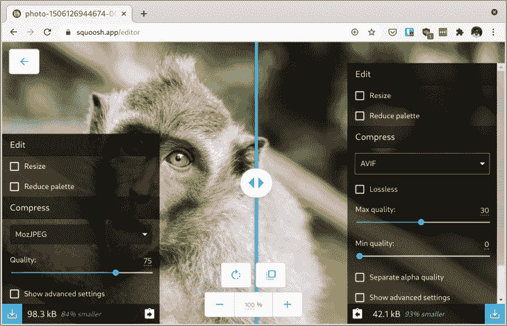
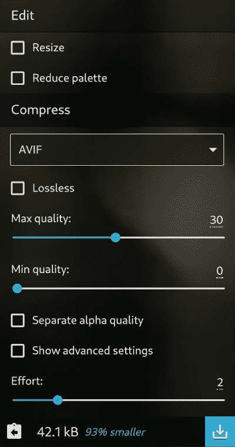
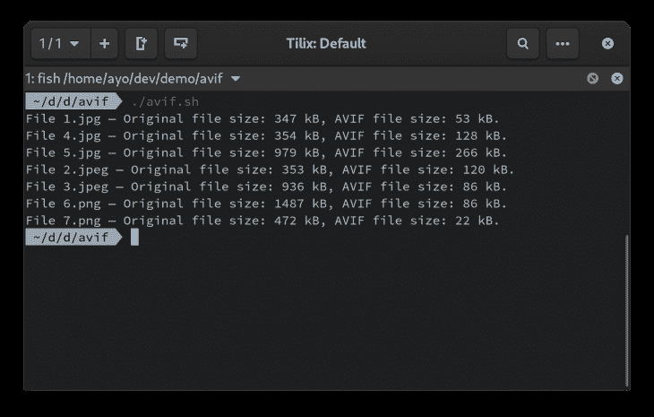
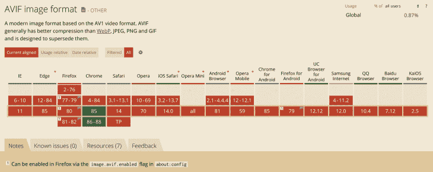

# 如何使用 AVIF、Squoosh 和 go-avif 格式化高质量的图像

> 原文：<https://blog.logrocket.com/how-to-format-quality-images-using-avif-squoosh-and-go-avif/>

[AVIF](https://aomediacodec.github.io/av1-avif/) (AV1 图像文件格式)是一种基于 [AV1 视频编解码器](https://en.wikipedia.org/wiki/AV1)的关键帧的开源、免版税的图像格式。它是由[开放媒体联盟](http://aomedia.org/)作为 VP9 的继任者开发的，该联盟包括几家视频点播提供商，如谷歌、亚马逊、微软和网飞。

在 2018 年发布后，它迅速确立了自己作为顶级视频编解码器的地位。脸书和网飞等公司对其进行了测试，以了解其在自己的流媒体视频基础设施中的表现，结果给他们留下了深刻的印象。

AV1 编解码器背后的大脑还决定创建一种图像文件格式，该格式使用相同的压缩算法以较低的文件大小产生高质量的图像，最终导致了 AVIF 格式的发展，该格式于 2019 年 2 月获得正式批准。

本文将向您展示如何使用这种图像格式来压缩图像，同时保持视觉保真度，最终为您的用户提供更好的体验。

## 将 AVIF 与 JPEG 和 WebP 进行比较

与 JPEG 和 WebP 格式相比，AVIF 格式显著减小了文件大小。以下是每种格式在大致相同的视觉质量下的比较:


Left to right: JPEG, WebP, and AVIF. Can you tell the difference?

上述示例显示了文件大小之间的显著差异，尽管视觉差异可以忽略不计。JPEG 版本最大，为 98.3kB，而 WebP 版本则小了约 30%，为 69 kb。kB。AVIF 版本的大小为 42.1kB，比 JPEG 版本小 58%，这是一个相当大的差异。

上面的图片是用默认设置的 [Squoosh](https://squoosh.app/index.html) 创建的。如果你想亲自尝试，这里有一个[主图像](https://images.unsplash.com/photo-1506126944674-00c6c192e0a3?ixlib=rb-1.2.1&ixid=eyJhcHBfaWQiOjEyMDd9&auto=format&fit=crop&w=1500&q=100)的链接。

## 如何塑造 AVIF 形象

# 

Squoosh 简单易用。您可以从文件系统中选择一个图像，或者使用编辑器提供的一个示例图像。

一旦加载了图像，您可以从许多压缩方法中进行选择，包括 MozJPEG、AVIF、WebP 和 OptiPNG。您可以使用编辑器的左右两侧来完成此操作，这样您就可以将一种压缩方法与另一种压缩方法或原始图像进行比较。您还可以调整压缩级别，以及进入更高级的设置。

当您对设置进行更改时，您会看到结果的预期文件大小与编辑器另一侧的设置进行了比较，并且在中间有一个滑块按钮，您可以向任一方向拖动它，以便您可以轻松地比较两个结果。

AVIF 格式的设置很容易理解。您可以调整最低和最高图像质量(在 0 和 62 之间)，并选择一个效果级别(值越高，产生结果所需的时间越长)。如果你调整这些设置，你会看到令人印象深刻的结果在可接受的质量水平。



## 转换一批图像

使用 Squoosh 创建 AVIF 文件的缺点是它一次只能转换一个图像。要批量处理图像，你可以依靠开源工具[`go-avif`](https://github.com/Kagami/go-avif)。它是用 Go 编写的，支持 JPEG 和 PNG 文件编码到 AVIF。

首先，您需要安装工具。如果您的计算机上安装了 Go，使用下面的命令编译该工具，并将二进制文件安装到您的`$GOPATH/bin`:

```
go get github.com/Kagami/go-avif/...

```

否则，你可以在[发布页面](https://github.com/Kagami/go-avif/releases)下载预编译的 Windows、macOS 或 Linux 二进制文件，并将其复制到你的`$PATH`。`go-avif`最简单的用法如下所示。这将使用默认设置将单个 JPEG 图像转换为 AVIF。

```
avif -e cat.jpg -o kitty.avif

```

让我们创建一个脚本，以便我们可以轻松地同时处理许多图像。创建一个新的`avif.sh`文件，并在其中键入以下代码:

```
#!/bin/bash
for f in *.{jpg,jpeg,png}
  do
    name=$(echo "$f" | cut -f 1 -d '.') # Extract the filename without the extension
    avif -e $f -o $name.avif # Encode to AVIF

    # Fetch and print size information
    input=`wc -c $f | cut -d' ' -f1`
    output=`wc -c $name.avif | cut -d' ' -f1`
    echo "File $f — Original file size: $(($input/1000)) kB, AVIF file size: $(($output/1000)) kB."
  done

```

该脚本将处理当前文件夹中的所有 JPEG 和 PNG 图像，并使用`go-avif`工具的默认设置将它们转换为 AVIF 格式。您可以使用`avif --help`显示其他可用的设置，并试验它们以获得不同的结果。

将脚本移动到包含图像的文件夹中，将其标记为可执行，然后执行它:

```
chmod +x avif.sh
./avif.sh

```

这将处理每个图像，并将 AVIF 输出放在同一个文件夹中。每次转换后，您还会看到文件大小的比较。正如你从下面的图片中看到的，即使不调整任何设置，你也可以节省很多钱。



如何在网上使用 AVIF

## 让我们先解决浏览器支持的问题。AVIF 目前获得的支持非常有限。它仅在桌面 Chrome(85 版及更高版本)中受支持，尽管官方 Firefox 支持预计将很快到来(您可以通过`about:config`中的`image.avif.enabled`标志在 Firefox 77 或更高版本中启用实验性支持)。至于 Safari，就让我们不要花 10 年时间来添加像 WebP 这样的支持。



无论如何，在你的网站和应用程序中使用 AVIF 之前，你不必等待所有的浏览器都支持它。当不支持 AVIF 时，您可以使用`<picture>`元素来提供 JPEG 或 WebP 的支持:

上面的代码片段可以在任何浏览器中运行，甚至是那些不支持`<picture>`元素的浏览器(所有版本的 Internet Explorer)。在这种情况下，将显示在``标签中指定的源。如果你需要`<picture>`在任何地方工作，这里有一个[聚合填充](https://github.com/scottjehl/picturefill)可以使用。

```
<picture>
  <source srcset="image.avif" type="image/avif">
  <source srcset="image.webp" type="image/webp">
  <source srcset="image.jpg" type="image/jpeg">
  
</picture>

```

avi 的局限性

## 除了 AVIF 格式明显的浏览器支持限制(随着时间的推移，它一定会变得更好)之外，在 web 使用中采用 AVIF 还有两个主要缺点。

不支持渐进式渲染

### 标准 JPEG 和 WebP 图像从上到下逐行加载，直到图像完全加载。JPEG 格式还支持渐进式编码方法，该方法会首先加载完整图像的模糊版本，随着其余字节的到达，该图像会逐渐变得清晰。

渐进式渲染的优点是，即使只下载了文件的一小部分，也可以看到整个图像。它还使图像加载感觉比从上到下渲染更快，因为整个图像从一开始就是可见的。


不幸的是，AVIF 既不支持自顶向下也不支持渐进式渲染。你要么看到完全加载的图像，要么什么也看不到，如上面的视频所示(感谢杰克·阿奇博尔德制作了这个演示)。这使得这种格式可能不适合大图像。这是你在网站上部署 AVIF 之前要考虑的事情。

软件支持乏善可陈

### AVIF 是一种新的格式，所以它缺乏像 JPEG 和 PNG 这样的长期格式所具有的普遍支持。目前，只有极少数图片浏览者支持 AVIF 文件，而且这种情况短期内不太可能改变。如果你网站的用户倾向于将图片保存到他们的设备上，这就造成了一个潜在的问题，因为他们最终会下载一个他们什么也做不了的文件。

更多来自 LogRocket 的精彩文章:

* * *

### 缓解这个问题的一个方法是提供一个指向图像的 JPEG 或 PNG 版本的显式下载链接，以便即使采用 AVIF 也能保留这两种格式的兼容性优势。

* * *

结论

## 尽管当前浏览器支持有限，并且存在上面讨论的其他缺点，但 AVIF 格式是一种非常值得研究的格式，因为与 JPEG、PNG 和 WebP 文件相比，在同等视觉质量水平下，它大大节省了文件大小。

通过在你的网站上采用 AVIF，你可以在不降低图像质量的情况下降低页面加载时间。您可以从为图像子集部署它开始，然后随着时间的推移扩展您的用途。所以，今天就去尝试吧，这是值得的！

使用 [LogRocket](https://lp.logrocket.com/blg/signup) 消除传统错误报告的干扰

## [LogRocket](https://lp.logrocket.com/blg/signup) 是一个数字体验分析解决方案，它可以保护您免受数百个假阳性错误警报的影响，只针对几个真正重要的项目。LogRocket 会告诉您应用程序中实际影响用户的最具影响力的 bug 和 UX 问题。

[](https://lp.logrocket.com/blg/signup)

然后，使用具有深层技术遥测的会话重放来确切地查看用户看到了什么以及是什么导致了问题，就像你在他们身后看一样。

LogRocket 自动聚合客户端错误、JS 异常、前端性能指标和用户交互。然后，LogRocket 使用机器学习来告诉您哪些问题对大多数用户有影响，并提供您需要修复的上下文。

关注重要的 bug—[今天就试试 LogRocket】。](https://lp.logrocket.com/blg/signup-issue-free)

Focus on the bugs that matter — [try LogRocket today](https://lp.logrocket.com/blg/signup-issue-free).