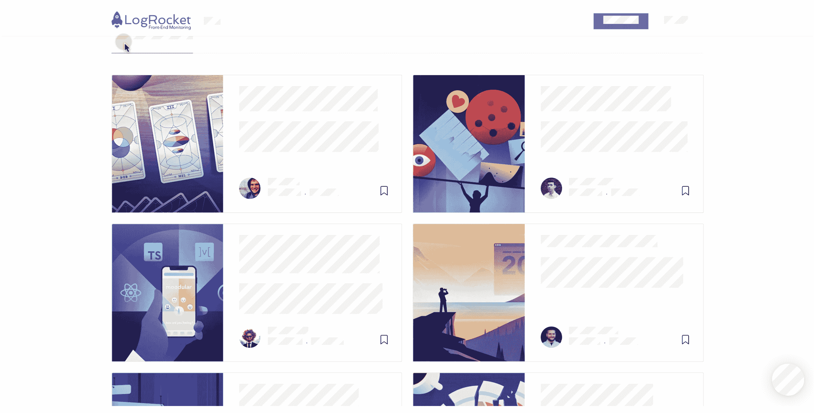

# 如何在网站和网络应用中处理 PII

> 原文：<https://blog.logrocket.com/how-to-handle-pii-websites-web-apps/>

许多网站在其正常业务过程中收集并存储[个人身份信息(PII)](https://en.wikipedia.org/wiki/Personal_data) ，不幸的是，收集到的 PII 可能会通过多种方式遭到破坏。当这种情况发生时，网站的用户面临个人风险，网站的声誉受损，网站所有者可能面临严重的法律和经济后果。

## PII 的重要性

PII 是与特定个人相关的信息，或者可用于识别他们的信息。一些常见的例子有:

*   名字
*   地址
*   电话号码
*   性别
*   出生日期
*   社会保险号
*   驾照号码
*   护照号码

这类信息可能会被窃取以方便身份盗窃，这是一种越来越常见的犯罪。2018 年，FTC [估计](https://www.thebalance.com/identity-theft-crimes-by-the-numbers-4157714)超过 444，000 人提交了身份盗窃报告，最常见的身份盗窃类型是信用卡欺诈。

你可以把一套 PII 看作是开启人们个人生活的钥匙。通过给你他们的 PII，你的用户委托你来照顾它。

在许多情况下，法律要求这样做。例如，[通用数据保护条例(GDPR)](https://en.wikipedia.org/wiki/General_Data_Protection_Regulation) 、[加州消费者保护法(CCPA)](https://en.wikipedia.org/wiki/California_Consumer_Privacy_Act) 和[健康保险携带和责任法案(HIPAA)](https://en.wikipedia.org/wiki/Health_Insurance_Portability_and_Accountability_Act) 都规定了公司需要如何处理个人数据。

## 数据泄露

公司通常非常重视他们收集的数据；有些人甚至把数据称为新的石油。然而越来越多的人认为这是 T2 的债务。安全方面的一个失误可能导致 PII 的大量损失，这通常伴随着负面的新闻标题。想想 Equifax 的数据泄露，这导致了数周的[媒体报道](https://www.nytimes.com/interactive/2017/your-money/equifax-data-breach-credit.html)和最终 6 . 5 亿美元的罚款。

数据泄露已经变得如此普遍，以至于安全专家 Troy Hunt 建立了一项名为 T2 的服务，该服务跟踪数据泄露，并让人们检查他们的电子邮件地址和个人信息是否被包括在内。

## 保护 PII

为了避免成为丢失数据的网站之一，让我们考虑一下可能的攻击媒介以及如何防范它们。请记住，与安全的其他方面一样，只需一个故障点，PII 就会丢失。避免 PII 泄露的最好方法是首先避免收集它。然而，收集一些 PII 对许多网站来说是至关重要的。

下面的一些建议将与通常的安全最佳实践重叠，但总的来说，我们要考虑如何收集、运输、存储和访问 PII。

还要记住，信息的重要性是相对的。清点你收集的所有数据，并根据其敏感度进行分类。社会安全号码比电话号码更有保障。

### 使用 HTTPS

基本上所有的网站现在都应该在使用 T2 HTTPS T3。通过加密网站和服务器之间的连接，我们可以防止第三方拦截通信和读取发送的内容，包括提交的数据，如表单字段中的 PII。

[让我们加密](https://letsencrypt.org/)提供免费的 TLS 证书，使它的设置变得经济实惠，并提供了一道防御[中间人](https://en.wikipedia.org/wiki/Man-in-the-middle_attack)攻击的防线。

### 在屏幕上隐藏信息

您可能希望防止某些信息一直显示。这样做的目的是防止其他人仅仅通过查看他们的屏幕就能看到你的用户信息。例如，您可以将输入的类型设置为`“password”`:

```
<input type="password">
```

这将产生一个输入字段，用星号替换用户键入的内容。您可以对其他数据做类似的事情，比如屏蔽一个社会保险号，以便在用户输入后显示为`XXX-XX-XXX`。

### 第三方服务

当您集成第三方服务时，了解您发送给他们的数据是很重要的。如果你不加选择地发送它，你一定会在某个时候发送 PII。谷歌分析有一个避免发送 PII 的建议列表。

如果你使用 UI 记录工具，你会想要仔细考虑什么信息应该被隐藏。例如，LogRocket 提供了[隐私机制](https://docs.logrocket.com/docs/privacy)来轻松过滤传输的数据，包括一种方法来[识别 PII 字段](https://docs.logrocket.com/docs/security#section-tools-to-block-pii)，这样它们的值就不会被发送。

### 记录

考虑如何设置日志记录以及如何存储日志。例如，如果您将每个请求记录到您的服务器上，那么像用户的社会保险号这样的东西很容易以明文形式出现在您的日志中。设置过滤器来防止这种情况发生。

### 储存；储备

在像 [AWS S3](https://aws.amazon.com/s3/) 这样的对象存储系统中存储 PII 时要特别小心。S3 水桶频繁[意外](https://github.com/nagwww/s3-leaks)暴露在公众面前。默认[显式阻止桶的公共访问](https://docs.aws.amazon.com/AmazonS3/latest/dev/access-control-block-public-access.html)是一个好的做法。

### 加密

根据特定信息的敏感性，您可能希望对其进行静态加密。这意味着，即使黑客能够获得您的数据库的副本，如果他们无法窃取加密密钥，加密的信息也将受到保护。

### 员工访问

考虑哪些员工可以访问哪些信息。理想情况下，您将有一个许可系统，这样员工就不会在没有合法商业理由的情况下访问信息。您可能还想实现一个审计系统，以便知道谁在什么时候访问了什么信息。

做好这一点意味着要制定一个数据访问策略，并确保员工接受过理解该策略的培训。您还需要确保他们在事后遵守规定。

例如，脸书[不得不解雇滥用特权获取用户数据的员工](https://www.vice.com/en_us/article/bjp9zv/facebook-employees-look-at-user-data)。优步[也因为“上帝视角”惹上了麻烦，该视角允许员工在未经许可的情况下跟踪客户，结果不得不改变他们对个人数据的处理方式。](https://www.theverge.com/2016/1/6/10726004/uber-god-mode-settlement-fine)

### 不保留数据

与一开始就不收集 PII 一样，你也应该避免在实际需要的时间之外保留 PII。如果它不再提供价值，那么保留它实际上是消极的，因为你保持了它被盗的风险。你可以通过定期修剪数据来减少暴露。

最近的一个趋势是将存储敏感信息的工作交给其他公司。例如， [Stripe](https://stripe.com/) 提供了一种收集信用卡和借记卡号码的方法，而这些号码不会接触到您的系统。这使得[更容易实现 PCI 合规性](https://stripe.com/guides/pci-compliance#how-stripe-helps-organizations-achieve-and-maintain-pci-compliance)。

另一个更一般的例子是[非常好的安全性](https://www.verygoodsecurity.com/)。他们推广一种[零数据方法](https://blog.verygoodsecurity.com/posts/announcing-very-good-security's-zero-data-mission/)，在这种方法中，他们收集并存储你想要的任何敏感信息，你得到无害的令牌存储在你的系统中，然后你在以后实际需要数据时使用这些令牌。这有效地允许您将保护数据的工作转移给其他人。

这就是“你不能失去你没有的东西”的哲学。

## 结论

保护 PII 是一项永无止境的挑战。请记住，您的服务只需要一个漏洞就可以泄漏其收集的所有 PII。即使目前您的安全状况很好，也需要时刻保持警惕来保证用户的安全。

了解可能导致网站失去 PII 的方法很重要，但是定期检查你是否真的受到这些方法的保护也同样重要。通过这样做，你使你的网站值得用户的信任。

## 你和 PII 一起开发应用程序吗？使用强大的分析功能保护 PII。

LogRocket 是一个前端应用程序监控解决方案，它将性能监控、自动 bug 重现和用户回放结合在一起，帮助您了解问题如何影响您的用户。

LogRocket 包括各种选项，以确保 PII 永远不会离开你的应用程序，你保持合规。其中包括内部部署、自动清理和立即删除用户数据的能力。点击了解有关这些隐私控制的更多信息[。](https://docs.logrocket.com/docs/privacy)

[](https://logrocket.com/signup/)

LogRocket 可以完美地与任何应用程序一起工作，不管是什么框架，并且有插件可以记录来自 Redux、Vuex 和@ngrx/store 的额外上下文。

LogRocket 记录控制台日志、页面加载时间、堆栈跟踪、慢速网络请求/响应(带有标题+正文)、浏览器元数据和自定义日志。

[免费试用](https://logrocket.com/signup/)。