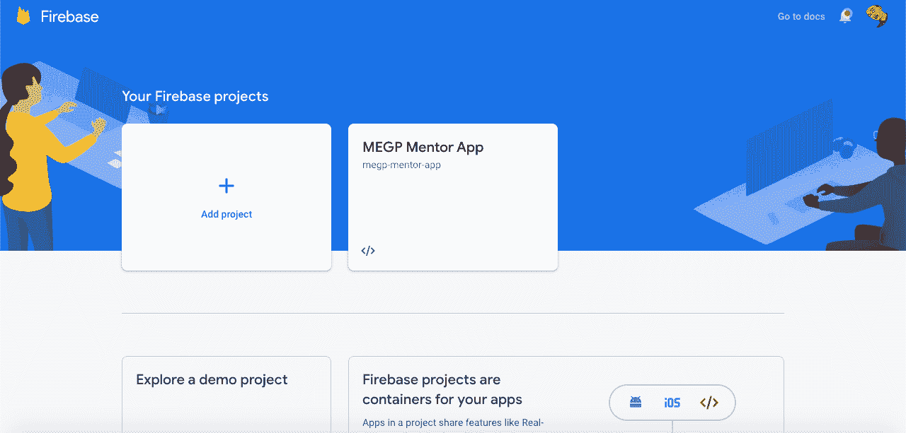
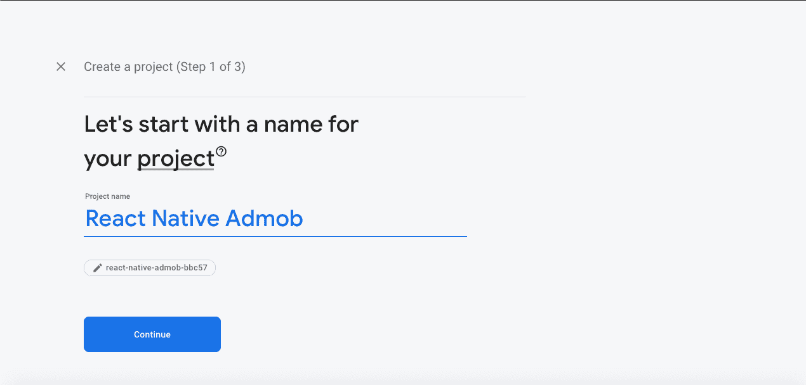
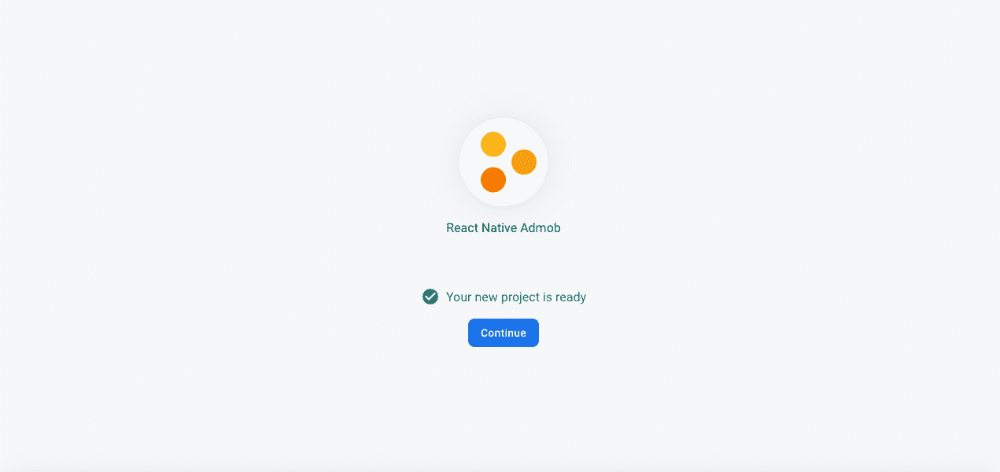
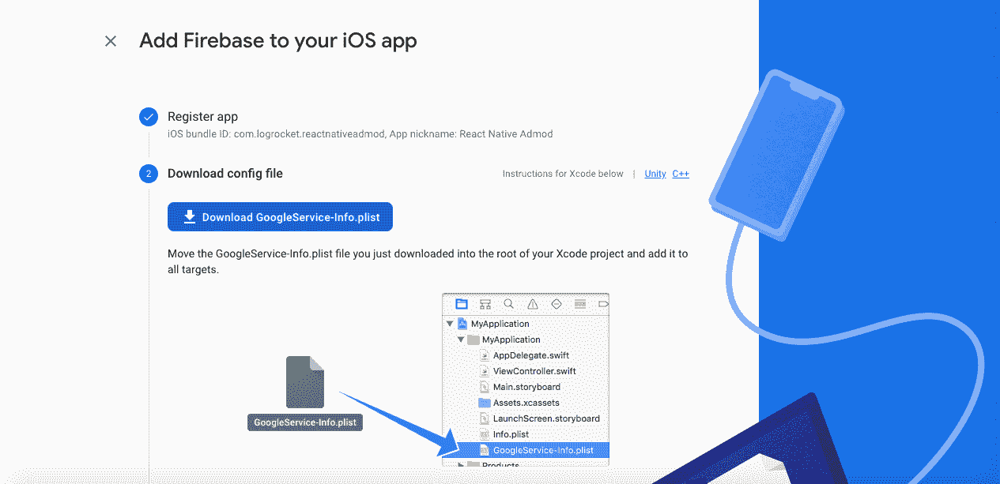
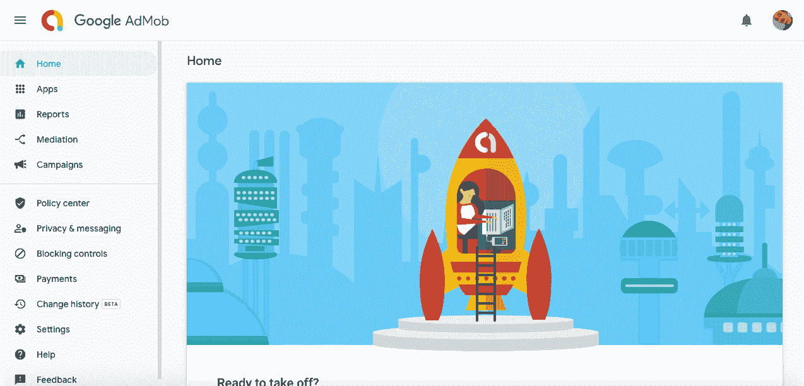
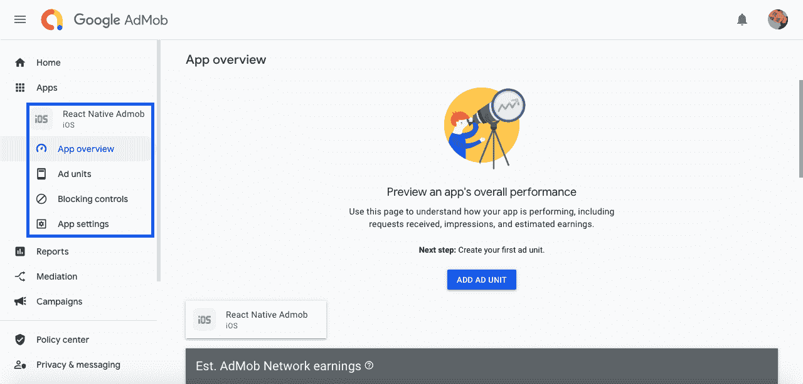
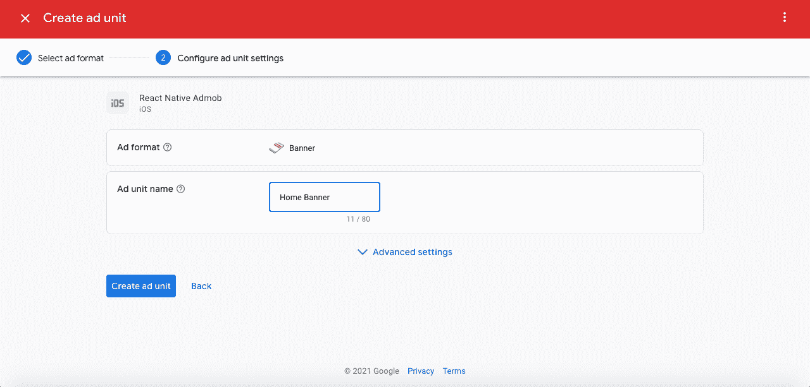
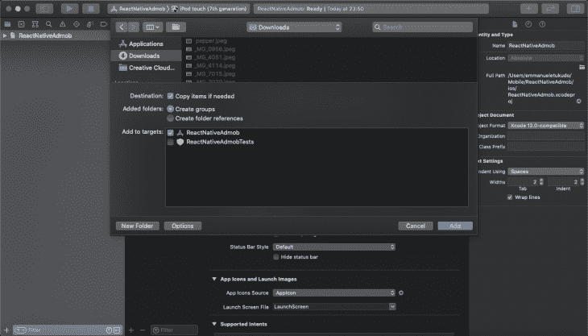

# 如何在 React Native 中实现 AdMob

> 原文：<https://blog.logrocket.com/how-to-implement-admob-in-react-native-with-firebase/>

## 介绍

网络货币化已经存在了几十年，它的受欢迎程度还在继续增长，尤其是新技术每天都在涌现。除了通过你的网站流量赚取额外收入，另一种赚钱的方式是通过移动广告的移动应用货币化。

移动应用的货币化与网站的货币化略有不同，主要区别在于广告的放置和配置。

在本教程中，我将向您展示如何通过在 React Native 中实现 Google AdMob 来通过广告产生额外收入。我还将演示 AdMob 如何在 React Native 中工作，通过使用 [Firebase](https://firebase.google.com/) 和 [React Native Firebase](https://rnfirebase.io/) 构建一个示例应用程序来显示应用程序中的不同广告。

以下是我们将要介绍的内容:

*   什么是 AdMob？
*   AdMob 广告格式
*   创建 Firebase 应用程序
*   创建 AdMob 帐户
*   用 AdMob 示例反应本地应用程序
*   在 React 本地应用中显示 AdMob 广告
*   破解密码

要跟随 React 原生样式教程，您应该具备:

*   熟悉 CSS、HTML 和 Javascript (ES6)
*   Node.js 和 Watchman 安装在您的开发机器上
*   用于测试的 iOS 模拟器或 Android 模拟器
*   安装在开发机器上的代码编辑器(例如 VS Code)
*   对 React 和 React Native 的基本理解

## 什么是 AdMob？

AdMob 是谷歌旗下的移动广告公司，由奥马尔·哈穆伊(Omar Hamoui)于 2016 年创立。该公司使移动应用程序开发者和公司能够利用移动应用程序广告来增加收入。

## AdMob 广告格式

尽管赚点外快很令人兴奋，但理解在你的应用上显示合适的广告是持续盈利的关键。以下是 AdMob 广告的列表和展示位置的描述。

*   奖励:你可以向用户展示广告来换取应用内的奖励，例如，更多的生命，额外的积分和游戏提示
*   原生:这些是典型的广告，看起来和感觉上都像是你的应用程序的一部分
*   横幅:矩形广告，可以放在应用程序屏幕的顶部或底部
*   插播广告:在应用程序断点或转换点显示的视频广告

现在您已经熟悉了 AdMob 及其可用的广告，让我们创建一个 Firebase 项目来演示 AdMob 的运行。

## 创建 Firebase 应用程序

Firebase 是一种全功能后端技术，用于构建移动和 web 应用程序。它是构建实时功能(如推送通知、实时消息和实时数据库)的首选。

我选择用 Firebase 构建本教程，因为它支持 AdMob 开箱即用。更容易与更少的配置集成。

### 第一步

访问[https://firebase.google.com](https://firebase.google.com)，点击**开始**按钮。在您的控制台中，点击**添加产品**，如下图所示:



### 第二步

为您的项目键入一个首选名称。对于本教程，我使用的是 **React Native Admob** 。点击**继续**进入下一步:



### 第三步

点击**继续**直到到达**第 3 步，共 3 步**，然后点击**创建项目**。创建项目后，您应该会看到如下所示的屏幕:



### 第四步

要在 Firebase 中实现 AdMob，你只需要从 Firebase 中获得 iOS 版的`GoogleService-Info.plist`或者 Android 版的`google-services.json`。

您可以通过向您在步骤 1 中创建的项目添加一个 iOS 或 Android 文件来实现这一点，如下图所示:



现在，您已经注册了一个 iOS 应用程序并获得了`GoogleService-Info.plist`，让我们继续设置一个 AdMob 帐户，以便我们可以使用 React Native 构建我们的第一个货币化移动应用程序。

## 创建 AdMob 帐户

要创建和设置您的 AdMob 帐户，请遵循以下简单步骤。

### 第一步

访问[https://apps.admob.com](http://apps.admob.com)，登录您的谷歌账户访问 AdMob，同意服务条款，点击**创建 AdMob 账户**。如果你感兴趣，接受特别优惠和提示，点击**继续**。您应该会被重定向到与下面的屏幕截图类似的页面:



### 第二步

在侧边栏中，点击**应用**(如下图所示)。如果您之前已将应用程序连接到您的 AdMob 帐户，您应该会看到它们列在那里。否则，您会找到一个链接来创建一个新的应用程序。



### 第三步

接下来，点击**添加广告单元**按钮创建一个新的广告单元。你需要设置一个广告单元，以便在你的应用程序上显示。请注意，您将始终需要一个广告单元 ID 来在应用程序的不同部分显示广告单元。见下面截图:



## 用 AdMob 反应原生应用

在我们继续之前，让我们创建一个新的 React 本机应用程序，安装所需的依赖项，并执行必要的配置。

在本教程中，我们将使用 React Native Firebase 与 AdMob 通信并显示广告。

首先让我们初始化一个新的 React 原生应用。运行下面的代码开始:

```
npx react-native init ReactNativeAdmob

```

接下来，用下面的代码安装 React Native Firebase:

```
npm install --save @react-native-firebase/app

```

打开 Xcode，将从 Firebase 下载的`GoogleService-Info.plist`添加到 iOS 项目中。



然后，我们需要初始化 Firebase 来使用我们来自`AppDeligate.m`的凭证。从您的 iOS 文件夹中打开`AppDelegate.m`,将下面的代码粘贴到文件的顶部，以导入 Firebase 模块:

```
#import <Firebase.h>

```

将下面的代码粘贴到`didFinishLaunchingWithOptions`函数中，以配置 Firebase:

```
if ([FIRApp defaultApp] == nil) {
[FIRApp configure];
}

```

使用下面的命令重新构建项目:

```
cd ios/
pod install --repo-update
cd ..
npx react-native run-ios

```

接下来，我们需要使用以下代码安装 Firebase AdMob 依赖项:

```
npm install @react-native-firebase/admob

```

然后，在 React Native 应用程序的根目录下创建`firebase.json`，粘贴以下代码进行配置，并将您的应用程序链接到您的 AdMob 帐户:

```
{
"react-native": {
"admob_android_app_id": "ca-app-pub-xxxxxxxx~xxxxxxxx",
"admob_ios_app_id": "ca-app-pub-xxxxxxxx~xxxxxxxx"
}
}

```

用适当的应用 id 替换`admob_android_app_id`和`admob_ios_app_id`值。

重新构建应用程序以应用更改:

```
cd ios/ && pod install
npx react-native run-ios

```

## 在 React 本地应用中显示 AdMob 广告

我们将使用 Firebase AdMob 依赖项附带的默认测试 ID，因为不建议在开发期间使用您的应用程序 ID。一旦您的应用程序准备好投入生产，您就可以替换应用程序 ID。

### 显示横幅广告

Firebase AdMob 依赖项使您可以访问一组标记，这些标记用于在 React Native 中显示不同类型的广告。

* * *

### 更多来自 LogRocket 的精彩文章:

* * *

对于横幅广告，我们将使用`<Banner/>`标签。要实现，请粘贴下面的代码开始:

```
import { TestIds, BannerAd, BannerAdSize} from '@react-native-firebase/admob';

<BannerAd
unitId={TestIds.BANNER}
size={BannerAdSize.SMART_BANNER}
requestOptions={{
requestNonPersonalizedAdsOnly: true,}}
onAdLoaded={() => {
console.log('Advert loaded');}}
onAdFailedToLoad={(error) => {
console.error('Advert failed to load: ', error);}}
/>

```

如果你注意到了，我们使用了`TestIds.BANNER`来通知 AdMob 依赖项我们想要使用`test ID`来实现广告。我们还使用`onAdLoaded`事件处理程序在广告加载时记录到控制台。

### 显示插播广告

间隙广告通常由事件触发，因为它们是整页广告，所以可以将它们包装在事件中或用户触发的事件旁边。

为了实现插播广告，我们需要将`<InterstitialAd/>`类导入到我们的 App.js 中:

```
import { InterstitialAd, TestIds, AdEventType} from '@react-native-firebase/admob';

...
showInterstitialAd = () => { 
interstitialAd.onAdEvent((type, error) => { 
if (type === AdEventType.LOADED) { 
interstitialAd.show(); 
}}); 
interstitialAd.load(); 
}

```

由于插播广告的加载需要时间，因此建议在`.LOADED`事件中调用`.show()`方法。注意，如果您试图在`.LOADED`事件之外调用`.show()`方法，您可能会面临崩溃的风险。

### 显示奖励广告

奖励广告会显示给你的用户，以换取应用内的奖励。它也采用类似于插播广告的方法来实现:

```
import { TestIds, RewardedAd, RewardedAdEventType } from '@react-native-firebase/admob';
....
showRewardAd = () => { 
// Create a new instance 
const rewardAd = RewardedAd.createForAdRequest(TestIds.REWARDED); 
// Add event handlers 
rewardAd.onAdEvent((type, error) => { 
if (type === RewardedAdEventType.LOADED) { 
rewardAd.show();
} 

if (type === RewardedAdEventType.EARNED_REWARD) {
console.log('User earned reward of 3 stars'); 
Alert.alert( 'New Reward', 'You just earned a reward of 3 stars', [ {text: 'OK', onPress: () => console.log('OK Pressed')}, ], { cancelable: true } ) 
}}); 

// Load a new advert 
rewardAd.load(); 
}

```

同样，悬赏广告也需要时间来加载，这也是我们在`RewardedAdEventType.LOADED`处理程序中调用`.show()`方法的原因。你也可以使用`.EARNED_REWARD`最终给你的用户承诺的应用内奖励。

## 结论

无论你有一个生产就绪的 React 原生应用程序，还是你的应用程序已经部署到 iOS 或 Android 商店，而且之前没有盈利，AdMoetub 都可以作为弥合这一差距的技术。

## [LogRocket](https://lp.logrocket.com/blg/react-native-signup) :即时重现 React 原生应用中的问题。

[](https://lp.logrocket.com/blg/react-native-signup)

[LogRocket](https://lp.logrocket.com/blg/react-native-signup) 是一款 React 原生监控解决方案，可帮助您即时重现问题、确定 bug 的优先级并了解 React 原生应用的性能。

LogRocket 还可以向你展示用户是如何与你的应用程序互动的，从而帮助你提高转化率和产品使用率。LogRocket 的产品分析功能揭示了用户不完成特定流程或不采用新功能的原因。

开始主动监控您的 React 原生应用— [免费试用 LogRocket】。](https://lp.logrocket.com/blg/react-native-signup)