# 如何在 React - LogRocket 博客中实现特性标志

> 原文：<https://blog.logrocket.com/how-to-implement-feature-flags-react/>

特性标志是开发者可以用来安全发布软件的强大机制。它们使开发团队能够动态地添加或删除软件系统的特性，而不需要对部署进行任何代码更改。

对于开发人员来说，能够区分部署和发布是一项非常重要的技能。代码部署是一项技术任务，而向客户发布特性更像是一项商业活动。通过对功能标志的高级使用，如果新功能出现任何问题，向客户子集发布功能会显著降低爆炸半径。

## 为什么要使用功能标志？

特性标志允许我们安全地构建，而不会破坏生产中应用程序的正常行为。这是在建设一个不断发展的大型项目时所需要的必要结构之一。我们的目标是要有一个稳定的、正常运行的生产应用，即使有这么多移动的部分。

当主动添加新特性，或者基于用户角色显示某些特性时，它们对于特定的用例特别有用，例如 A/B 测试。

对于 A/B 测试，特性标志可以让我们轻松地测试不同的面向用户的界面以及用户对它们的反应。例如，这个实验可以帮助测试不同登录页面的转换率，以及它如何影响底线。此外，一旦我们对结果感到满意，就可以删除标志，而无需任何重大的代码更改。

此外，当向开发环境中添加多个新特性时，有可能一个特性比其他特性先准备好。为了部署到生产中，我们使用标志向用户隐藏未完成的特性。

功能标志还允许我们向具有不同角色和权限的用户显示不同的功能。这在所有用户都使用同一个应用程序的情况下非常有用。

## 入门指南

在本帖中，我们将探讨如何在 React 应用中实现一个简单的功能标志，从 Algolia 上的非官方 [HN 搜索 API](https://hn.algolia.com/api) 中获取故事。该功能标志将在 [Flagsmith](https://flagsmith.com/) 上托管，将用于显示和隐藏每个黑客新闻故事的分数。

我们走吧！

### 先决条件

在我们深入研究代码之前，您应该做好以下准备:

1.  Node.js 和 npm，最好是最新的 LTS
2.  React 和 JavaScript 的工作知识

一些关于特性标志或远程配置的先验知识会有所帮助，但并不要求您必须遵循。

是时候进入代码了！

## 构建一个样本黑客新闻克隆

要用 React 创建一个基本的黑客新闻首页，我们首先要用 Create React app 创建一个新的 React App。

要使用 CRA 创建一个新的 react 应用程序，我们将运行以下命令:

```
npx create-react-app hn-react

```

这个命令在几分钟内为我们创建了一个基本的 React 应用程序。当 npx 脚本完成执行时，它将看起来像下面这样:

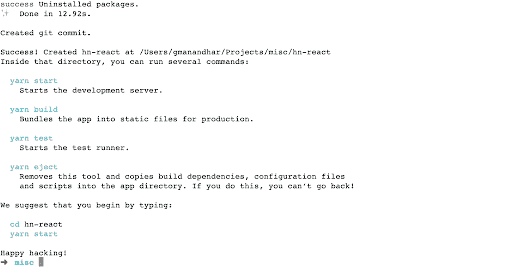

之后，我们可以用`cd hn-react`进入新创建的`hn-react`文件夹。要运行开发服务器，请执行以下命令:

```
yarn start

```

该命令运行开发服务器，并在`[http://localhost:3000](http://localhost:3000)`打开默认浏览器，将显示如下内容:

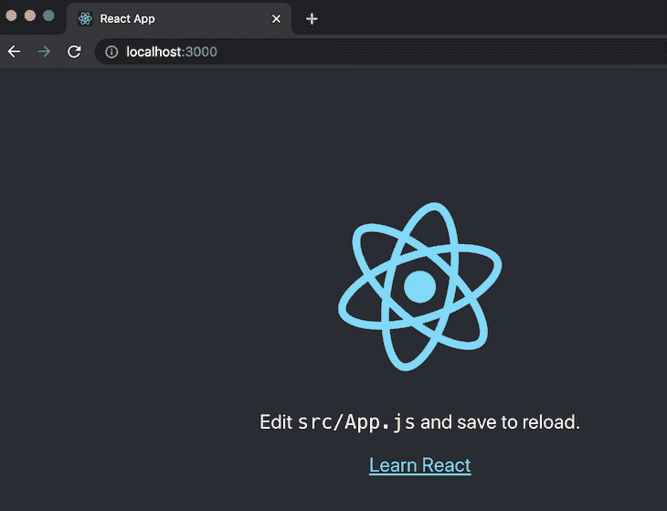

万岁！我们的 React 应用程序框架正在运行。接下来，我们将更改 React 应用程序以显示来自黑客新闻的故事。

## 将黑客新闻添加到我们的示例应用程序中

为了更改样板文件 React 应用程序以显示来自黑客新闻的故事，我们将把`src/app.js`更改为如下所示:

```
import React, { useState, useEffect } from 'react';
import './App.css';

function App() {
  const [stories, setStories] = useState([]);
  const [message, setMessage] = useState('loading...');
  useEffect(() => {
    async function fetchNewsStories () {
      try {
        const data = await (await fetch('https://hn.algolia.com/api/v1/search_by_date?tags=front_page')).json();
        setStories(data.hits)
        const message = data.hits.length ? '' : 'No stories found';
        setMessage(message);
      } catch (err) {
        console.log(`err: ${err.mesasge}`, err);
        setMessage('could not fetch stories');
      }
    }
    fetchNewsStories()
  }, []);

  return (
    <div className="App">
      <header className="App-header">
        <h2>Latest HN Stories</h2>
        {message}
        <div className="stories">
          {Array.isArray(stories) && stories.map(
            story => story.url && <h3><a href={story.url} target="_blank" rel="noreferrer">{story.title}</a> - by {story.author}</h3>
          )}
        </div>
      </header>
    </div>
  );
}

export default App;

```

我们在 App.js 文件中所做的主要更改是在`[useEffect](https://blog.logrocket.com/guide-to-react-useeffect-hook/)`钩子中调用 Algolia 提供的 Hacker News API，然后在组件中呈现从 API 获取的故事。

我们利用`useState`钩子来设置两个变量:`stories`和`message`。这两者都是在调用上述 API 的`fetchNewsStories`异步函数中设置的。

如果在获取故事时出现任何错误，`stories`数组默认设置为`empty`，消息设置为“无法获取故事”，首先设置为“正在加载”如果故事提取成功，那么消息被设置为空字符串。

一个基本的循环与带有地图的`stories`变量一起使用，在故事中循环。对于每个有 URL 的故事，它的标题、链接和作者都作为一个`H3`元素打印出来。

同样，我们也将改变`src/App.css`中的样式，如下所示:

```
.App-header {
  min-height: 100vh;
  display: flex;
  flex-direction: column;
  align-items: center;
  justify-content: center;
  font-size: calc(10px + 2vmin);
  color: black;
}

h3 {
  padding-left: 0.5em;
}

.App-link {
  color: #61dafb;
}

```

我们已经移除了背景色，并将`.App-header`的文本设为黑色。我们还删除了与徽标动画相关的任何样式，因为徽标已被删除。

为了使文本更具可读性，我们给`H3`添加了 0.5em 的填充。如果我们用`yarn start`再次运行这个应用程序，它看起来会像下面的`[http://localhost:3000](http://localhost:3000)`一样:


恭喜你。调用非官方黑客新闻 API 的基本 React 应用程序正在运行。为了方便起见，这些代码更改可以作为[拉请求](https://github.com/geshan/hn-react/pull/1)找到。

接下来，我们将在 Flagsmith 上设置一个特征标志来显示或隐藏这些点。

## 在 Flagsmith 上设置特征标志

Flagsmith 是一个令人惊叹的功能标志服务，它也有一个我们可以自己托管的[开源版本](https://flagsmith.com/open-source/)。对于本教程，我们将使用 Flagsmith 云。

首先，在 app.flagsmith.com 使用 GitHub 登录。

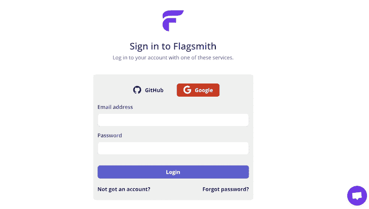

您将被要求授权 Flagsmith 使用您的 GitHub，如下所示:

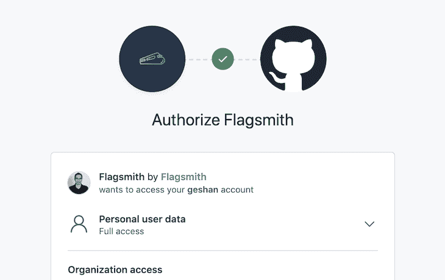

在屏幕下方，可以点击**授权 Flagsmith** 按钮。它可能会询问你的 GitHub 密码，然后你会被重定向到 Flagsmith 用户界面。

您可以通过点击左侧 Flagsmith 标志下方的 **+** 按钮来创建一个新项目。我们可以将项目命名为`HN-react`，并点击**创建项目**的紫色按钮:

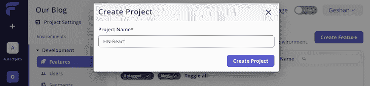

因此，在创建项目后，Flagsmith 将自动创建**开发**和**生产**环境。

之后，我们将创建我们的第一个特征标志。点击页面末尾的**创建您的第一个特征**按钮:

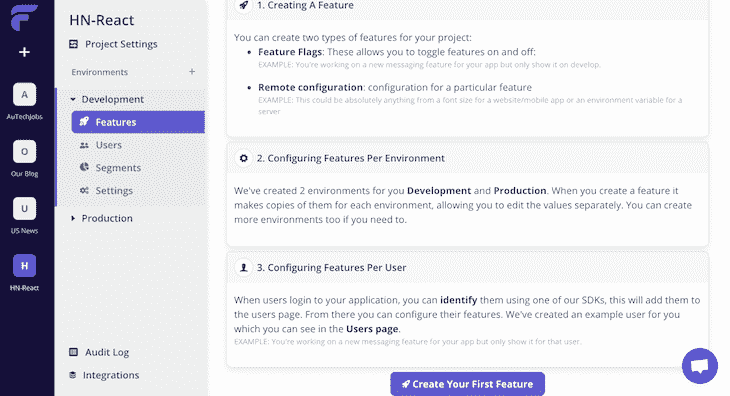

我们将添加 ID 为`show_story_points,`，确保默认启用的**开启，并点击**创建特征**:**

 **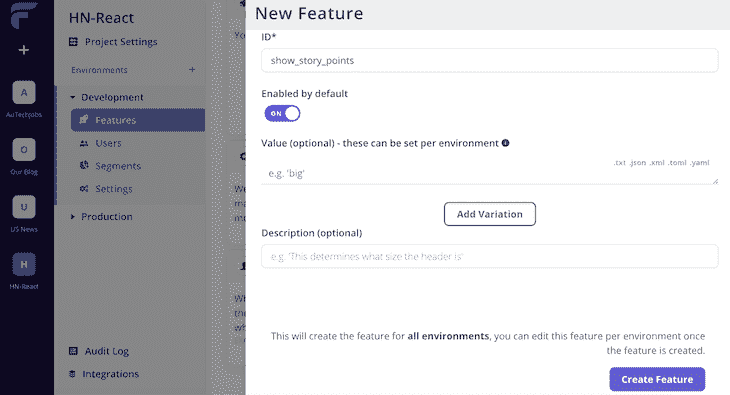

随后，功能标志将可供我们使用，如下所示:

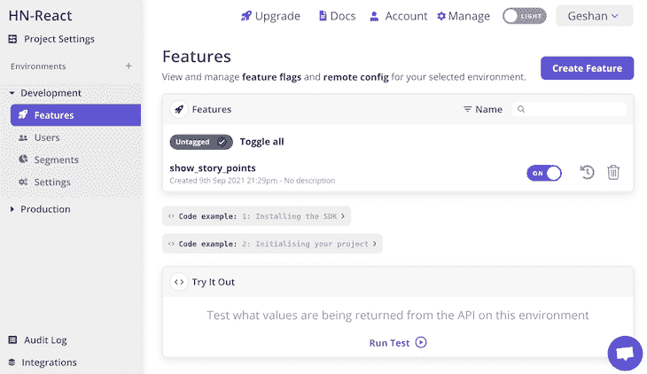

下一步，我们将添加 Flagsmith JavaScript SDK，并使用它来获取我们刚刚创建的在 React 应用程序中运行的特性标志。

## 安装并使用特性标志 JavaScript SDK

我们已经在 Flagsmith 的 UI 上创建了特性标志，现在我们将在我们的样本 Hacker News clone 应用程序中使用它。为此，我们将通过运行以下命令从 npm 添加 Flagsmith JavaScript SDK:

```
yarn add flagsmith

```

在 package.json 文件中添加 Flagsmith 客户端需要一些时间。在写的时候是版本`1.6.4`。

一旦我们安装了 Flagsmith 客户端，我们将再次更改`src/App.js`来合并客户端，并启用功能标志来显示或隐藏每个黑客新闻故事的要点。

为了使用，我们将在`src/Apps.js`文件的第二行添加以下行:

```
import flagsmith from 'flagsmith';

```

然后，我们将在第八行添加以下内容来初始化`showStoryPoints`变量:

```
const [showStoryPoints, setShowStoryPoints] = useState(false);

```

之后，我们将在第 22 行的`fetchNewsStories`调用下面的`useEffect`函数中添加下面的代码，如下所示:

```
flagsmith.init({
  environmentID:"DRLDV3g6nJGkh4KZfaSS5c",
  cacheFlags: true,
  enableAnalytics: true,
  onChange: (oldFlags, params) => {
    setShowStoryPoints(flagsmith.hasFeature('show_story_points'));
  }
});

```

在这个代码块中，标志缓存在本地存储中，我们启用分析并检查该功能是否在更改时可用。您必须从 feature flag 页面的部分获取环境 ID，如下所示:

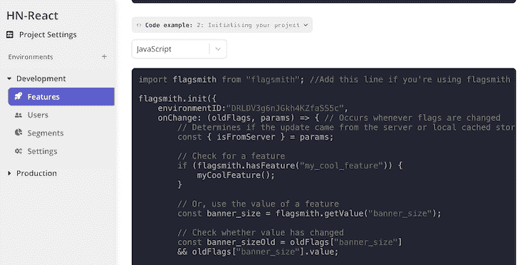

下一步是添加下面的代码，您可以在第 40 行看到故事的循环:

```
{Array.isArray(stories) && stories.map(
            story => story.url && <h3><a href={story.url} target="_blank" rel="noreferrer">{story.title}</a> - by {story.author} {showStoryPoints ? '- points '+ story.points : ''}</h3>
)}

```

在上面的循环中，我们检查`showStoryPoints`变量是否为`true`，这是根据我们的特征标志的状态设置的。如果这是真的，我们显示故事的要点；否则我们显示一个空字符串。

更改后，如果您使用`yarn start`再次运行应用程序，它将显示以下内容:

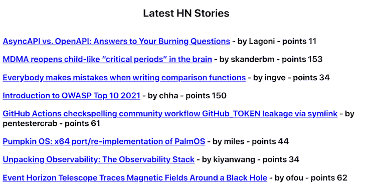

现在，转到 Flagsmith 界面，关闭特性标志，如下所示:

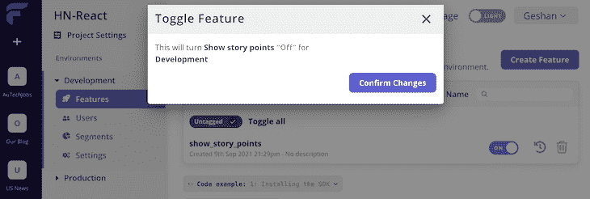

随后，如果您在`[http://localhost:3000](http://localhost:3000)`刷新页面，将显示以下内容:

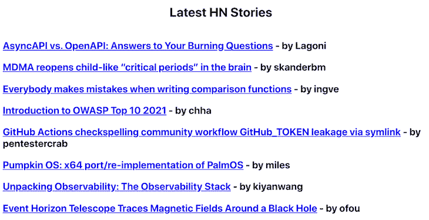

万岁！您已经成功地实现了您的第一个特性标志，并且在没有任何代码更改的情况下更改了应用程序的特性。

此部分的代码可作为[拉取请求](https://github.com/geshan/hn-react/pull/2)供您参考。带有故事要点的最终产品可以在[网上](https://hn-react-1.netlify.app/)看到。

## React 的特征标志库

另一种方法是直接在代码库中使用库来处理特性标志。一些最常用的 React 库是 [react-feature-flags](https://github.com/romaindso/react-feature-flags) 和 [flagged](https://github.com/sergiodxa/flagged) 。他们不需要像 flagsmith 那样的任何可视化平台或按键；相反，一切都在代码库中实现，标志列表直接硬编码在代码库中或一个`.env`文件中。

## 结论

在本教程中，我们学习了如何使用 Flagsmith 在 React 应用程序中使用基本功能标志。特性标志使得任何主要特性的发布变得简单而安全。

每一次改变都有风险，每一次部署都是对正在运行的系统的改变。有了特性标志，我们可以在需要时最小化变更的风险。特性标志还为非技术团队成员(如产品所有者)提供了启用或禁用特性的能力，而不需要任何代码更改或部署。

功能标志的最有效使用可以是仅向客户的子集进行推广，例如您组织的员工。有了这些实践，即使是像支付网关变更这样重要的事情，发布的风险也比一次向所有客户发布一个功能要低得多。

我希望您能够用特性标志很好地实践“部署不是发布”的理念。

## [LogRocket](https://lp.logrocket.com/blg/react-signup-general) :全面了解您的生产 React 应用

调试 React 应用程序可能很困难，尤其是当用户遇到难以重现的问题时。如果您对监视和跟踪 Redux 状态、自动显示 JavaScript 错误以及跟踪缓慢的网络请求和组件加载时间感兴趣，

[try LogRocket](https://lp.logrocket.com/blg/react-signup-general)

.

[ ](https://lp.logrocket.com/blg/react-signup-general) [](https://lp.logrocket.com/blg/react-signup-general) 

LogRocket 结合了会话回放、产品分析和错误跟踪，使软件团队能够创建理想的 web 和移动产品体验。这对你来说意味着什么？

LogRocket 不是猜测错误发生的原因，也不是要求用户提供截图和日志转储，而是让您回放问题，就像它们发生在您自己的浏览器中一样，以快速了解哪里出错了。

不再有嘈杂的警报。智能错误跟踪允许您对问题进行分类，然后从中学习。获得有影响的用户问题的通知，而不是误报。警报越少，有用的信号越多。

LogRocket Redux 中间件包为您的用户会话增加了一层额外的可见性。LogRocket 记录 Redux 存储中的所有操作和状态。

现代化您调试 React 应用的方式— [开始免费监控](https://lp.logrocket.com/blg/react-signup-general)。**