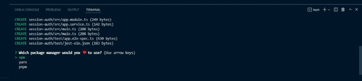
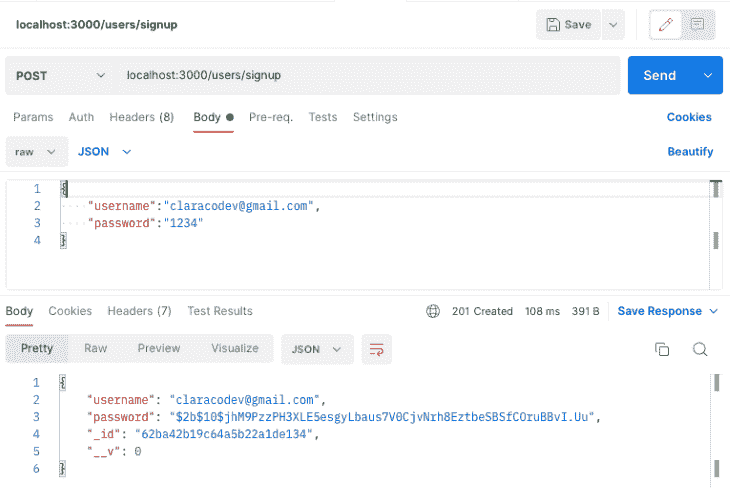
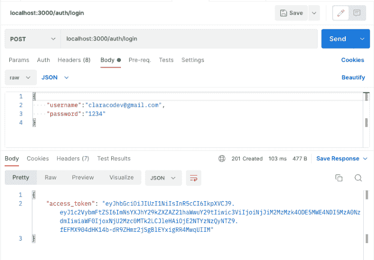

# 如何在 NestJS 中实现 JWT 认证

> 原文：<https://blog.logrocket.com/how-to-implement-jwt-authentication-nestjs/>

身份验证是任何应用程序最重要的方面之一。它通过在授权用户访问应用程序的不同部分之前验证用户来提高应用程序的安全性。认证还能让公司跟踪有多少人在使用他们的产品。

正确配置身份验证至关重要。事实上，[开放 web 应用程序安全项目(OWASP)](https://owasp.org/www-project-top-ten/) 在其十大 Web 应用程序安全风险列表中确定了身份识别和身份验证失败。

本教程将演示在 NestJS 中实现 JWT 用户认证的一步一步的过程。

*向前跳转:*

## 先决条件

本教程是一个实践演示。要继续操作，请确保您安装了以下软件:

*   [Node.js](https://nodejs.org/) v14 及以上
*   [MongoDB](https://www.mongodb.com)
*   全球安装的纱线；使用命令`npm install --global yarn`

## 什么是 NestJS？

NestJS 是 Node.js 的服务器端应用程序框架，允许您创建可伸缩的高效应用程序。它用 TypeScript 编写，用 Express.js 构造，这是一个轻量级框架，它本身很棒，但缺乏结构。

Nest 支持面向对象编程、函数式编程和函数式反应式编程。如果你希望你的应用程序后端有很多结构，这个框架是一个很好的选择。

Nest 的语法和结构与 Angular 类似，Angular 是一个前端框架。它还使用了类型脚本、服务和依赖注入，就像 Angular 一样。Nest 使用模块和控制器，并允许您使用命令行界面为文件创建控制器。

## 入门指南

要设置项目，首先需要使用以下命令全局安装 Nest CLI:

```
npm i -g @nestjs/cli

```

安装完成后，创建一个新项目，如下所示:

```
nest new auth-with-nest

```

接下来，会提示您选择一个包管理器来安装依赖项。在这个演示中，我们将使用纱线。



选择`yarn`并按下**回车**键。现在，等待 Yarn 安装运行应用程序所需的所有依赖项。

## 设置 MongoDB 数据库

要设置和连接数据库，使用以下命令安装 Mongoose 包、bcrypt 和 NestJS 包装器:

```
npm install --save @nestjs/mongoose @types/bcrypt mongoose bcrypt

```

现在，更新`app.module.ts`文件并设置 Mongoose，就像这样:

```
import { MongooseModule } from '@nestjs/mongoose';
@Module({
  imports: [MongooseModule.forRoot('mongodb://localhost/authentication')],
})

```

在上面的代码片段中，我们将`MongooseModule`导入到根`AppModule`中。

## 创建用户模块

为了保持代码整洁有序，请通过运行以下命令，专门为 NestJS CLI 用户创建一个模块:

```
nest g module users

```

上面的代码用一个`users.module.ts`文件和一个`app.module.ts`更新文件创建了一个用户文件夹。

## 创建用户模式

要创建用户模式，在`src/users`文件夹中创建一个`users.model.ts`文件，并添加以下代码:

```
import { Prop, Schema, SchemaFactory } from '@nestjs/mongoose';
import { Document } from 'mongoose';

export type UserDocument = User & Document;

@Schema()
export class User {
  @Prop()
  username: string;

  @Prop()
  password: string;
}

export const UserSchema = SchemaFactory.createForClass(User);

```

这里，我们用`@Schema()`装饰器和`@Prop()`装饰器定义了`User`模式的形状。

Mongoose 会将模式映射到一个 MongoDB 集合。该模式定义了集合文档的形状。

现在，替换`user/user.module.ts`文件中的代码，并使用以下代码使`userSchema`在导入中可用:

```
import { Module } from '@nestjs/common';
import { UsersService } from './user.service';
import { UsersController } from './user.controller';
import { MongooseModule } from "@nestjs/mongoose"
import { UserSchema } from "./user.model"

@Module({
  imports: [MongooseModule.forFeature([{ name: "user", schema: UserSchema }])],
  providers: [UsersService],
  controllers: [UsersController]
})
export class UserModule {}

```

## 创建用户服务

创建用户模式后，运行以下命令创建用户服务:

```
nest g service users

```

这段代码创建一个`users.service.ts`文件并更新`app.module.ts`文件。

***注意，*** *您可以选择手动创建您的文件和文件夹，但是 NestJS CLI 将通过自动更新必要的文件夹使您的生活更加轻松*

现在，将以下代码添加到`users.service.ts`文件中:

```
import { Injectable } from '@nestjs/common';
import { InjectModel } from '@nestjs/mongoose';
import { Model } from 'mongoose';
import { User, UserDocument } from './users.model';

@Injectable()
export class UsersService {
    constructor(@InjectModel('user') private readonly userModel: Model<UserDocument>) { }
    async createUser(username: string, password: string): Promise<User> {
        return this.userModel.create({
            username,
            password,
        });
    }
    async getUser(query: object ): Promise<User> {
        return this.userModel.findOne(query);
    }
}

```

这里，我们使用`@InjectModel()`装饰器将`userModel`注入到`UsersService`中。

## 创建用户控制器

现在让我们创建一个用户控制器来定义 API 路由:

```
nest g service users

```

将代码添加到`users.controller.ts`文件:

```
import { Body, Controller, Post, Get, Param } from '@nestjs/common';
import { UsersService } from './users.service';
import { User } from './users.model';
import * as bcrypt from 'bcrypt';

@Controller('auth')
export class UsersController {
    constructor(private readonly usersService: UsersService) { }

    @Post('/signup')
    async createUser(
        @Body('password') password: string,
        @Body('username') username: string,
    ): Promise<User> {
        const saltOrRounds = 10;
        const hashedPassword = await bcrypt.hash(password, saltOrRounds);
        const result = await this.usersService.createUser(
            username,
            hashedPassword,
        );
        return result;
    }
}

```

这里，我们定义了两个 API 路由，并使用了我们创建的服务。我们使用`bcrypt`来[散列用户密码](https://blog.logrocket.com/building-a-password-hasher-in-node-js/)。

## 创建身份验证模块

让我们首先创建一个 auth 模块，如下所示:

```
nest g module auth

```

该命令将创建一个新文件夹`auth`，并带有一个`auth.module.ts`文件；它还会更新`app.module.ts`文件。

## 配置 JWT

现在，让我们实现一个 [JSON web 令牌来验证用户](https://blog.logrocket.com/jwt-authentication-best-practices/)进入应用程序。

要开始使用，请安装以下依赖项:

```
npm install --save @nestjs/jwt passport-jwt
npm install --save-dev @types/passport-jwt

```

接下来，创建一个新文件`local.auth.ts`，并添加以下代码:

```
import { Strategy } from 'passport-local';
import { PassportStrategy } from '@nestjs/passport';
import { Injectable, UnauthorizedException } from '@nestjs/common';
import { AuthService } from './auth.service';

@Injectable()
export class LocalStrategy extends PassportStrategy(Strategy) {
  constructor(private authService: AuthService) {
    super();
  }

  async validate(username: string, password: string): Promise<any> {
    const user = await this.authService.validateUser(username, password);
    if (!user) {
      throw new UnauthorizedException();
    }
    return user;
  }
}

```

这里，我们实现了一个 [passport-local 策略](https://www.passportjs.org/packages/passport-local/)来认证 JSON web 令牌。默认情况下，passport-local 策略期望请求体中有`username`和`password`属性。

我们还实现了`validate()`方法，Passport 中间件将调用该方法使用一组适当的特定于策略的参数来验证用户。

接下来，用以下代码替换`AuthModule`中的代码:

```
import { Module } from "@nestjs/common"
import { UserModule } from "src/user/user.module";
import { AuthService } from "./auth.service"
import { PassportModule } from "@nestjs/passport"
import { JwtModule } from '@nestjs/jwt';
import { AuthController } from './auth.controller';
import { UsersService } from "src/user/user.service";
import { MongooseModule } from "@nestjs/mongoose"
import { UserSchema } from "../user/user.model"
import { LocalStrategy } from './local-strategy';

@Module({
  imports: [UserModule, PassportModule, JwtModule.register({
    secret: 'secretKey',
    signOptions: { expiresIn: '60s' },
  }), MongooseModule.forFeature([{ name: "user", schema: UserSchema }])],
  providers: [AuthService, UsersService, LocalStrategy],
  controllers: [AuthController],
})
export class AuthModule { }

```

这里，我们将`PassportModule`和`JwtModule`导入到导入数组中。然后，我们使用`register`方法注册 JWT，提供秘密和到期时间。

我们还使`UserSchema`在导入中可用，并将`UserService`和我们的`LocalStrategy`添加到提供者数组中。

***注意，*** *为了安全起见，总是把你的 JWT 秘密保存在一个环境变量里*

## 创建授权服务和控制器

现在，让我们向应用程序添加身份验证功能。

配置好 JWT 和护照后，运行以下命令在`auth`文件夹中创建`auth.service.ts`和`auth.controller.ts`文件。：

```
nest generate service auth
nest generate controller auth

```

接下来，打开`auth/auth.service.ts`文件，用下面的代码验证用户:

```
import { Injectable, NotAcceptableException } from '@nestjs/common';
import { UsersService } from 'src/user/user.service';
import * as bcrypt from 'bcrypt';
import { JwtService } from '@nestjs/jwt';

@Injectable()
export class AuthService {
    constructor(private readonly usersService: UsersService, private jwtService: JwtService) { }
    async validateUser(username: string, password: string): Promise<any> {
        const user = await this.usersService.getUser({ username });
        if (!user) return null;
        const passwordValid = await bcrypt.compare(password, user.password)
        if (!user) {
            throw new NotAcceptableException('could not find the user');
        }
        if (user && passwordValid) {
            return user;
        }
        return null;
    }
    async login(user: any) {
        const payload = { username: user.username, sub: user._id };
        return {
            access_token: this.jwtService.sign(payload),
        };
    }
}

```

这里，我们创建了`validateUser`方法来检查来自`user.model`的用户是否与来自数据库的用户记录相匹配。如果不匹配，该方法返回一个`null`值。

我们还创建了`login`方法，它使用`jwtService.sign`方法为来自`LocalStrategy`的`validate`返回的用户生成一个 JWT 访问令牌。

现在，将下面的代码片段添加到`auth/auth.controller.ts`文件中，为用户`login`创建一条路线。

```
import { Controller, Request, Post, UseGuards } from '@nestjs/common';
import { AuthService } from './auth.service';
import { AuthGuard } from '@nestjs/passport';

@Controller()
export class AuthController {
    constructor(private authService: AuthService) { }

    @UseGuards(AuthGuard('local'))
    @Post('auth/login')
    async login(@Request() req) {
        return this.authService.login(req.user);
    }
}

```

这里，当用户请求登录路径时，我们使用了`@UseGuards()`装饰器来加强认证。使用`AuthGuard`类，我们能够使用`local`策略对用户进行身份验证。

## 测试应用程序

现在让我们使用 Postman 测试应用程序。我们从`signup route`开始。

首先，启动应用程序:

```
npm run start

```

接下来，打开 Postman，通过向端点发送 post 请求来测试注册路由。`localhost:3000/users/signup`。



现在，通过向端点发送 post 请求来测试登录端点。`localhost:3000/auth/login`。



如果数据库中存在`username`和`password`，用户将收到如上图所示的`access_token`。使用`access_token`，用户将能够访问 API 中受保护的路线。

## 结论

在本教程中，我们概述了 NestJS，然后演示了如何在 NestJS API 上实现 JWT 用户认证。

现在您已经了解了这些知识，那么您将如何在下一个 Nest 项目中处理用户认证呢？要了解关于 NestJS JWT 认证的更多信息，请参考官方文档。

## 使用 [LogRocket](https://lp.logrocket.com/blg/signup) 消除传统错误报告的干扰

[](https://lp.logrocket.com/blg/signup)

[LogRocket](https://lp.logrocket.com/blg/signup) 是一个数字体验分析解决方案，它可以保护您免受数百个假阳性错误警报的影响，只针对几个真正重要的项目。LogRocket 会告诉您应用程序中实际影响用户的最具影响力的 bug 和 UX 问题。

然后，使用具有深层技术遥测的会话重放来确切地查看用户看到了什么以及是什么导致了问题，就像你在他们身后看一样。

LogRocket 自动聚合客户端错误、JS 异常、前端性能指标和用户交互。然后 LogRocket 使用机器学习来告诉你哪些问题正在影响大多数用户，并提供你需要修复它的上下文。

关注重要的 bug—[今天就试试 LogRocket】。](https://lp.logrocket.com/blg/signup-issue-free)