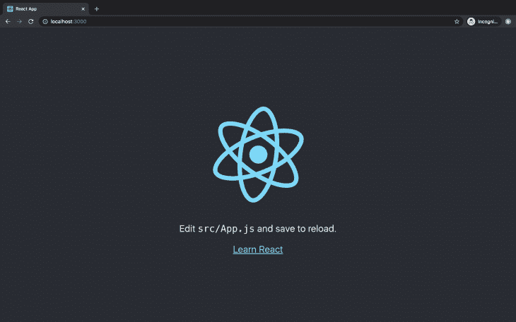
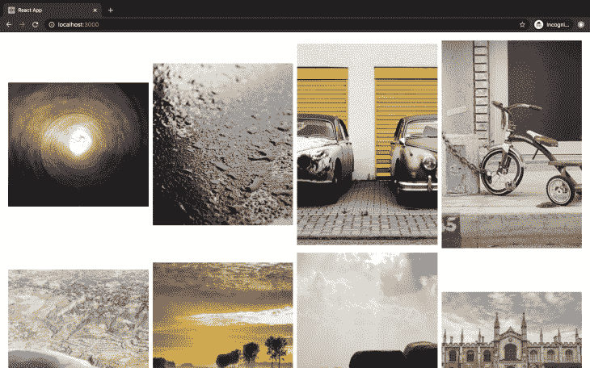

# 如何用 React-gridlist 实现滚动

> 原文：<https://blog.logrocket.com/how-to-implement-scroll-with-react-gridlist/>

## 介绍

React-gridlist 是一个基于 CSS 网格的虚拟滚动网格组件。回购列举了它的一些特点和优势:

*   它可以呈现已知宽度/高度的项目
*   您可以在同一行上显示不同高度的项目
*   高性能的虚拟滚动(也称为窗口)可实现流畅的操作
*   可定制且响应迅速
*   小捆绑大小(根据[捆绑恐惧](https://bundlephobia.com/result?p=react-gridlist@1.0.1)缩小 4.7kB、缩小 1.6kB 并压缩)

如果您不熟悉虚拟滚动，它只向用户显示项目的子集。如果您试图显示大型数据集，并且不想对项目进行分页，同时呈现所有项目可能会导致应用程序性能下降。你可能会问自己虚拟滚动和无限滚动有什么不同？在无限滚动中，当您滚动时会加载更多的项目，而在虚拟滚动中，当用户滚动经过给定的项目列表时，会显示新的项目并删除旧的项目。如果你想了解更多，可以看看这篇关于[虚拟滚动](https://blog.logrocket.com/virtual-scrolling-core-principles-and-basic-implementation-in-react/)的优秀文章。React-gridlist 使您能够轻松快速地实现虚拟滚动。

## 先决条件

*   本教程假设您具备[反应](https://reactjs.org/)的工作知识
*   在我们开始之前，确保您的环境中安装了[节点](https://nodejs.org/en/)、[纱线](https://yarnpkg.com/)或 [npm](https://npmjs.com/) 。如果您还没有安装它们，您可以通过链接获得安装说明
*   尽管这对于本教程来说有点矫枉过正，但我们将使用 [create-react-app](https://github.com/facebook/create-react-app) 来引导我们的项目

## 入门指南

让我们继续创建我们的项目。您可以使用下面突出显示的三个可用选项中的任何一个来创建您的项目。

### npx:

```
$ npx create-react-app gridlist
```

### npm ( `npm init <initializer`在 npm 6+中可用):

```
$ npm init react-app gridlist
```

### 纱线(`[yarn create](https://yarnpkg.com/lang/en/docs/cli/create/)`有纱线 0.25+):

```
$ yarn create react-app gridlist
```

创建完项目文件夹后，您可以打开并运行它:

```
cd gridlistnpm start //or
yarn start
```

这将在开发模式下运行应用程序，您可以使用链接 [http://localhost:3000/](http://localhost:3000/) 在浏览器中查看它。

通过运行以下命令安装 react-gridlist:

```
$ yarn add react-gridlist
```

运行应用程序时，您应该会看到以下视图:



让我们将它改为显示一个可滚动的图像列表。

## 组件设置

我们的 GridList 应用程序将完全包含在`src/app.js`中的应用程序组件中。第一步是用我们自己的代码替换现有的代码。用下面的代码替换文件的内容。这将是我们应用程序的框架:

```
import React, { Fragment } from "react";
import GridList from "react-gridlist";

const App = () => {
  return (
    <GridList></div>
  )
}
export default App
```

## 获取图像

在我们开始滚动组件之前，我们需要显示图像。我们将从 Lorem Picsum 获取我们的图像，Lorem Ipsum 用于照片。因为我们想要展示这个库的一个特性，在同一行上显示不同高度的图像，所以我们想要检索不同高度和宽度的图像。您可以通过将您想要的图像宽度和高度添加到 Lorem Piscusm URL 来获得具有定义尺寸的图像:

```
// Get a random picture of a given width and heigh
https://picsum.photos/200/300

// Get a random square image
https://picsum.photos/200

// Get a given image(append /id/{image} to the start of the url)
https://picsum.photos/id/237/200/300

```

GridList 组件采用以下格式的图像数组:

```
{
  url,
  width,
  height,
}
```

创建一个函数，以上面的格式构建一个图像数组。我正在生成 50 幅图像。您可以将其更改为您喜欢的任何数字:

```
const images = Array.from({ length: 50 }, (_, i) => {
  let width = 300
  let height = Math.floor(Math.random() * 300) + 200;
  return {
    url: `https://i.picsum.photos/id/${Math.floor(Math.random() * 100) + 100}/${width}/${height}.jpg`,
    width,
    height,
  }
})
```

这将创建一个 50 张图片的数组，宽度为 300，高度可变，ID 在 0 到 200 之间。

## 网格列表组件

GridList 组件负责项目的实际呈现。它需要之前列出的道具:

*   `items`–接收要渲染的数据数组
*   `getGridGap`–生成网格项目间距的功能
*   `getColumnCount`–根据项目的宽度计算每行呈现多少列/项目的函数。在我们的例子中，这将是 300
*   `getWindowMargin`–确定装有物品的容器高度的功能
*   `getItemData`–调整项目高度以适合行的功能
*   `renderItem`–渲染单个项目的功能

添加要作为道具传递给 GridList 组件的函数:

```
import React, { Fragment } from "react";
....

const getGridGap = (elementWidth, windowHeight) => (elementWidth > 720 && windowHeight > 480) ? 10 : 5;

const getColumnCount = (elementWidth) => Math.floor(elementWidth / 300);

const getWindowMargin = (windowHeight) => Math.round(windowHeight * 1.5);

const getItemData = (image, columnWidth) => {
  let imageRatio = image.height / image.width
  let adjustedHeight = Math.round(columnWidth * imageRatio)
  return {
    key: image.url,
    height: adjustedHeight,
  }
}
const App = () => {
  ...
}
export default App
```

现在我们已经有了图像和所需的适当函数，我们可以使用 GridList 组件呈现图像。

将以下代码添加到您的应用程序组件中:

```
const App = () => {
  return (
    <div>
      <GridList
        items={images}
        getGridGap={getGridGap}
        getColumnCount={getColumnCount}
        getWindowMargin={getWindowMargin}
        getItemData={getItemData}
        renderItem={(image) => {
          return (
            
          )
        }}
      />
    </div>
  )
}
```

当应用程序重新加载时，它应该看起来像这样:


我们将需要一些风格，使它看起来更好一点。React-gridlist [的例子](https://jamiebuilds.github.io/react-gridlist/)有一些风格会让它看起来很棒。然而，悬停样式需要 CSSinJS 库来支持选择器:

```
let styles = {
  container: {
    margin: "20px auto",
    padding: "0 20px"
  },
  image: {
    position: "relative",
    width: "100%",
    height: "auto",
    verticalAlign: "top",
    background: "hsl(0, 0%, 98%)"
  }
}
```

当我们将样式应用于各自的元素时，我们的最终代码应该如下所示:

```
import React from "react";
import GridList from "react-gridlist";
const images = Array.from({ length: 50 }, (_, i) => {
  let width = 300
  let height = Math.floor(Math.random() * 300) + 200;
  return {
    url: `https://i.picsum.photos/id/${Math.floor(Math.random() * 100) + 100}/${width}/${height}.jpg`,
    width,
    height,
  }
})
let styles = {
  container: {
    margin: "20px auto",
    padding: "0 20px"
  },
  image: {
    position: "relative",
    width: "100%",
    height: "auto",
    verticalAlign: "top",
    background: "hsl(0, 0%, 98%)"
  }
}
const getGridGap = (elementWidth, windowHeight) => (elementWidth > 720 && windowHeight > 480) ? 10 : 5;
const getColumnCount = (elementWidth) => Math.floor(elementWidth / 300);
const getWindowMargin = (windowHeight) => Math.round(windowHeight * 1.5);
const getItemData = (image, columnWidth) => {
  let imageRatio = image.height / image.width
  let adjustedHeight = Math.round(columnWidth * imageRatio)
  return {
    key: image.url,
    height: adjustedHeight,
  }
}
const App = () => {
  return (
    <div style={styles.container}>
      <GridList
        items={images}
        getGridGap={getGridGap}
        getColumnCount={getColumnCount}
        getWindowMargin={getWindowMargin}
        getItemData={getItemData}
        renderItem={(image) => {
          return (
            
          )
        }}
      />
    </div>
  )
}
export default App
```

我们完整的 app 现在应该是这样的:


仅此而已。我们已经使用 React-gridlist 构建了一个简单的可滚动组件:


## 结论

如今，可滚动元素是大多数 web 应用程序不可或缺的一部分。让 scroll 完美地工作通常需要大量的试验和错误，以使 CSS 恰到好处。对于没有太多经验的人来说，这尤其令人望而生畏。React-gridlist 提供了一种在应用程序中实现滚动的简单快捷的方法。如果你想看看这篇文章的代码，你可以在 [GitHub](https://github.com/jkithome/gridlist) 上找到它。如果你喜欢这个图书馆，别忘了在[推特](https://twitter.com/buildsghost)上给它加星，并对作者表示一些感谢。

## [LogRocket](https://lp.logrocket.com/blg/react-signup-general) :全面了解您的生产 React 应用

调试 React 应用程序可能很困难，尤其是当用户遇到难以重现的问题时。如果您对监视和跟踪 Redux 状态、自动显示 JavaScript 错误以及跟踪缓慢的网络请求和组件加载时间感兴趣，

[try LogRocket](https://lp.logrocket.com/blg/react-signup-general)

.

[ ](https://lp.logrocket.com/blg/react-signup-general) [](https://lp.logrocket.com/blg/react-signup-general) 

LogRocket 结合了会话回放、产品分析和错误跟踪，使软件团队能够创建理想的 web 和移动产品体验。这对你来说意味着什么？

LogRocket 不是猜测错误发生的原因，也不是要求用户提供截图和日志转储，而是让您回放问题，就像它们发生在您自己的浏览器中一样，以快速了解哪里出错了。

不再有嘈杂的警报。智能错误跟踪允许您对问题进行分类，然后从中学习。获得有影响的用户问题的通知，而不是误报。警报越少，有用的信号越多。

LogRocket Redux 中间件包为您的用户会话增加了一层额外的可见性。LogRocket 记录 Redux 存储中的所有操作和状态。

现代化您调试 React 应用的方式— [开始免费监控](https://lp.logrocket.com/blg/react-signup-general)。