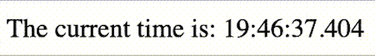
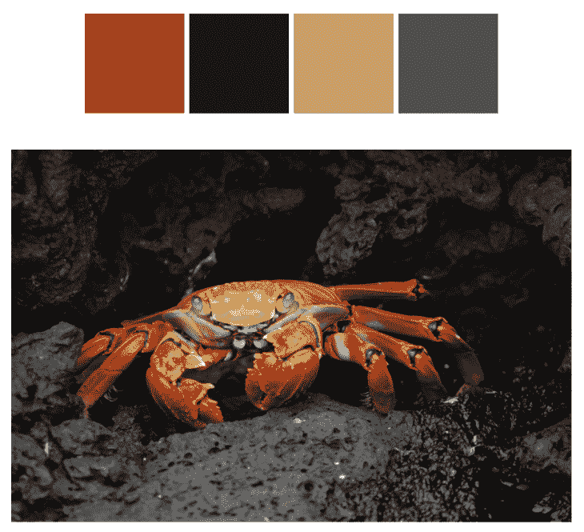
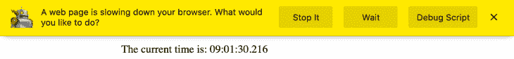
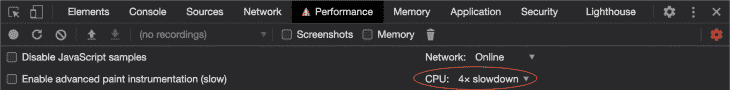

# 如何提高网络工作者的界面响应能力

> 原文：<https://blog.logrocket.com/how-to-improve-interface-responsiveness-with-web-workers/>

JavaScript 是单线程的，所以任何运行的 JavaScript 都会阻止网页的响应。这在很多情况下都不是问题，因为代码运行得足够快，任何用户界面的停顿都不会被用户察觉。

然而，如果代码的计算量很大，或者用户的硬件能力不足，这就会成为一个严重的问题。

## 网络工作者

缓解这个问题的一个方法是通过将工作卸载到后台线程上来避免在主线程上放置太多的工作。其他平台，如 Android T1 和 T2 iOS T3，强调让主线程处理尽可能少的非 UI 工作的重要性。

[Web Workers API](https://developer.mozilla.org/en-US/docs/Web/API/Web_Workers_API) 是 Android 和 iOS 后台线程的 Web 等价物。[超过 97%的浏览器支持工人。](https://caniuse.com/#feat=webworkers)

## 演示

让我们创建一个演示来演示问题和解决方案。你也可以在这里查看最终结果[，在](https://www.dannyguo.com/web-worker-demo) [GitHub](https://github.com/dguo/web-worker-demo) 上查看源代码。我们先从最基本的开始。

```
<!DOCTYPE html>
<html lang="en">
  <head>
    <meta charset="utf-8" />
    <meta name="viewport" content="width=device-width, initial-scale=1.0" />
    <title>Web Worker Demo</title>
    <script src="./index.js" async></script>
  </head>
  <body>
    <p>The current time is: <span id="time"></span></p>
  </body>
</html>
```

接下来，我们将添加`index.js`来持续更新时间，并像这样显示:`21:45:08.345`。

```
// So that the hour, minute, and second are always two digits each
function padTime(number) {
  return number < 10 ? "0" + number : number;
}

function getTime() {
  const now = new Date();
  return (
    padTime(now.getHours()) +
    ":" +
    padTime(now.getMinutes()) +
    ":" +
    padTime(now.getSeconds()) +
    "." +
    now.getMilliseconds()
  );
}

setInterval(function () {
  document.getElementById("time").innerText = getTime();
}, 50);
```

通过将时间间隔设置为 50 毫秒，我们将看到时间更新非常快。



### 设置服务器

接下来，我们将使用`npm init`或`yarn init`启动 Node.js 项目，并安装[包](https://parceljs.org/)。我们想使用 package 的第一个原因是，在 Chrome 的[中，工人需要被服务](https://parceljs.org/)，而不是从本地文件加载。

所以当我们以后添加一个工人时，如果我们使用的是 Chrome，我们就不能直接打开`index.html`。第二个原因是 Parcel 内置了对 Web Workers API 的支持，不需要为我们的演示进行任何配置。其他捆扎机如 [webpack](https://webpack.js.org/) 需要[更多的设置](https://webpack.js.org/loaders/worker-loader/)。

我建议给`package.json`加一个开始命令:

```
{
  "scripts": {
    "start": "parcel serve index.html --open"    
  }
}
```

这将允许您运行`npm start`或`yarn start`来构建文件，启动服务器，在浏览器中打开页面，并在您更改源文件时自动更新页面。

### imagej

现在让我们添加一些计算量很大的东西。

我们将安装 [image-q](https://github.com/ibezkrovnyi/image-quantization) ，一个图像[量化](https://en.wikipedia.org/wiki/Color_quantization)库，我们将使用它来计算给定图像的主要颜色，从图像创建调色板。

这里有一个例子:



让我们更新一下`body`:

```
<body>  
  <div class="center">
    <p>The current time is: <span id="time"></span></p>

    <form id="image-url-form">
      <label for="image-url">Direct image URL</label>
      <input
        type="url"
        name="url"
        value="https://upload.wikimedia.org/wikipedia/commons/1/1f/Grapsus_grapsus_Galapagos_Islands.jpg"
      />
      <input type="submit" value="Generate Color Palette" />
      <p id="error-message"></p>
    </form>
  </div>

  <div id="loader-wrapper" class="center">
    <div id="loader"></div>
  </div>

  <div id="colors-wrapper" class="center">
    <div id="color-0" class="color"></div>
    <div id="color-1" class="color"></div>
    <div id="color-2" class="color"></div>
    <div id="color-3" class="color"></div>
  </div>

  <a class="center" id="image-link" target="_blank">
    
  </a>
</body>
```

因此，我们添加了一个直接链接到图像的表单。然后，我们有一个加载器在处理过程中显示旋转动画。我们将修改[这个代码笔](https://codepen.io/mandelid/pen/vwKoe)来实现它。我们还有四个 div，我们将使用它们来显示调色板。最后，我们将显示图像本身。

给`head`添加一些内联样式。这包括一个用于旋转加载器的 CSS 动画。

```
<style type="text/css">
  .center {
    display: block;
    margin: 0 auto;
    max-width: max-content;
  }

  form {
    margin-top: 25px;
    margin-bottom: 25px;
  }

  input[type="url"] {
    display: block;
    padding: 5px;
    width: 320px;
  }

  form * {
    margin-top: 5px;
  }

  #error-message {
    display: none;
    background-color: #f5e4e4;
    color: #b22222;
    border-radius: 5px;
    margin-top: 10px;
    padding: 10px;
  }

  .color {
    width: 80px;
    height: 80px;
    display: inline-block;
  }

  img {
    max-width: 90vw;
    max-height: 500px;
    margin-top: 25px;
  }

  #image-link {
    display: none;
  }

  #loader-wrapper {
    display: none;
  }

  #loader {
    width: 50px;
    height: 50px;
    border: 3px solid #d3d3d3;
    border-radius: 50%;
    border-top-color: green;
    animation: spin 1s ease-in-out infinite;
    -webkit-animation: spin 1s ease-in-out infinite;
  }

  @keyframes spin {
    to {
      -webkit-transform: rotate(360deg);
    }
  }
  @-webkit-keyframes spin {
    to {
      -webkit-transform: rotate(360deg);
    }
  }

  #error-message {
    display: none;
    background-color: #f5e4e4;
    color: #b22222;
    border-radius: 5px;
    margin-top: 10px;
    padding: 10px;
  }
</style>
```

更新`index.js`:

```
import * as iq from "image-q";

// Previous code for updating the time

function setPalette(points) {
  points.forEach(function (point, index) {
    document.getElementById("color-" + index).style.backgroundColor =
      "rgb(" + point.r + "," + point.g + "," + point.b + ")";
  });

  document.getElementById("loader-wrapper").style.display = "none";
  document.getElementById("colors-wrapper").style.display = "block";
  document.getElementById("image-link").style.display = "block";
}

function handleError(message) {
  const errorMessage = document.getElementById("error-message");
  errorMessage.innerText = message;
  errorMessage.style.display = "block";
  document.getElementById("loader-wrapper").style.display = "none";
  document.getElementById("image-link").style.display = "none";
}

document
  .getElementById("image-url-form")
  .addEventListener("submit", function (event) {
    event.preventDefault();

    const url = event.target.elements.url.value;
    const image = document.getElementById("image");

    image.onload = function () {
      document.getElementById("image-link").href = url;

      const canvas = document.createElement("canvas");
      canvas.width = image.naturalWidth;
      canvas.height = image.naturalHeight;
      const context = canvas.getContext("2d");
      context.drawImage(image, 0, 0);
      const imageData = context.getImageData(
        0,
        0,
        image.naturalWidth,
        image.naturalHeight
      );

      const pointContainer = iq.utils.PointContainer.fromImageData(imageData);
      const palette = iq.buildPaletteSync([pointContainer], { colors: 4 });
      const points = palette._pointArray;
      setPalette(points);
    };

    image.onerror = function () {
      handleError("The image failed to load. Please double check the URL.");
    };

    document.getElementById("error-message").style.display = "none";
    document.getElementById("loader-wrapper").style.display = "block";
    document.getElementById("colors-wrapper").style.display = "none";
    document.getElementById("image-link").style.display = "none";

    image.src = url;
  });
```

`setPalette`函数设置颜色分区的背景颜色，以便显示调色板。我们还有一个`handleError`功能，以防图像加载失败。

然后，我们听取表单提交。每当我们得到一个新的提交，我们设置图像元素的`onload`函数，以适合`image-q`的格式提取图像数据。

所以我们[在画布](https://developer.mozilla.org/en-US/docs/Web/API/Canvas_API)中绘制图像，以便我们可以检索一个 [ImageData](https://developer.mozilla.org/en-US/docs/Web/API/ImageData) 对象。

我们将该对象传递给`image-q`，并调用`iq.buildPaletteSync`，这是计算开销较大的部分。它返回四种颜色，我们将其传递给`setPalette`。

我们也适当地隐藏和取消隐藏元素。

### 问题是

尝试生成一个调色板。请注意，当`image-q`正在处理时，时间停止更新。如果你试图点击输入的网址，用户界面也不会有反应。但是，旋转动画可能仍然有效。解释是 CSS 动画有可能由一个[单独的合成器线程代替](https://www.viget.com/articles/animation-performance-101-browser-under-the-hood/)来处理。

在 Firefox 上，浏览器最终会显示一条警告:



如果你有一台速度很快的电脑，这个问题可能不会那么明显，因为你的 CPU 可以很快地完成工作。要模拟一个较慢的设备，你可以使用 Chrome，它有一个开发者工具设置来调节 CPU。

打开性能选项卡，然后打开其设置以显示选项:



### 添加工人

要修复没有响应的 UI，让我们使用一个 worker。首先，我们将在表单中添加一个复选框，以指示站点是否应该使用该员工。在提交输入之前添加这个 HTML。

```
<input type="checkbox" name="worker" />
<label for="worker"> Use worker</label>
<br />
```

接下来，我们将在`index.js`中设置 worker。尽管有广泛的浏览器支持，我们还是用`if (window.Worker)`添加一个特性检测检查以防万一。

```
let worker;
if (window.Worker) {
  worker = new Worker("worker.js");
  worker.onmessage = function (message) {
    setPalette(message.data.points);
  };
}
```

[onmessage](https://developer.mozilla.org/en-US/docs/Web/API/Worker/onmessage) 方法是我们从 worker 接收数据的方式。

然后，当复选框被选中时，我们将更改图像`onload`处理程序以使用 worker。

```
// From before
const imageData = context.getImageData(
    0,
    0
    image.naturalWidth,
    image.naturalHeight
);

if (event.target.elements.worker.checked) {
    if (worker) {
        worker.postMessage({ imageData });
    } else {
        handleError("Your browser doesn't support web workers.");
    }
    return;
}

// From before
const pointContainer = iq.utils.PointContainer.fromImageData(imageData);
```

worker 的`[postMessage](https://developer.mozilla.org/en-US/docs/Web/API/Worker/postMessage)`方法就是我们如何向 worker 发送数据。

最后，我们需要在`worker.js`中创建工人本身。

```
import * as iq from "image-q";

onmessage = function (e) {
  const pointContainer = iq.utils.PointContainer.fromImageData(
    e.data.imageData
  );
  const palette = iq.buildPaletteSync([pointContainer], { colors: 4 });
  postMessage({ points: palette._pointArray });
};
```

注意，我们仍然使用`onmessage`和`postMessage`，但是现在`onmessage`从`index.js`接收一个消息，并且`postMessage`向`index.js`发送一个消息。

尝试用 worker 生成一个调色板，您应该看到时间在处理过程中不断更新。表单也保持交互而不是冻结。

## 结论

Web Workers API 是一种有效的方法，可以让网站感觉响应更快，尤其是当网站更像一个应用程序，而不是主要显示静态数据时。正如我们所看到的，设置一个 worker 也可以相当简单，因此识别 CPU 密集型代码并将其转移到一个 worker 可能是一件轻而易举的事情。

工人确实有限制，主要是他们没有权限访问 DOM。总的思路应该是让主线程尽可能地关注 UI，包括更新 DOM，同时将昂贵的工作转移给工人。通过在有意义的时候这样做，你可以给你的用户一个界面，它不会冻结，并且始终令人愉快地使用。

## 通过理解上下文，更容易地调试 JavaScript 错误

调试代码总是一项单调乏味的任务。但是你越了解自己的错误，就越容易改正。

LogRocket 让你以新的独特的方式理解这些错误。我们的前端监控解决方案跟踪用户与您的 JavaScript 前端的互动，让您能够准确找出导致错误的用户行为。

[](https://lp.logrocket.com/blg/javascript-signup)

LogRocket 记录控制台日志、页面加载时间、堆栈跟踪、慢速网络请求/响应(带有标题+正文)、浏览器元数据和自定义日志。理解您的 JavaScript 代码的影响从来没有这么简单过！

[Try it for free](https://lp.logrocket.com/blg/javascript-signup)

.