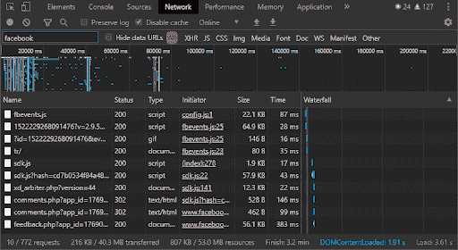
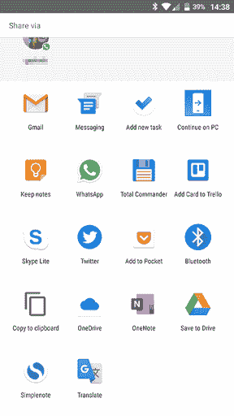
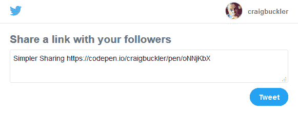

# 如何通过网络共享 API 提高社交参与度

> 原文：<https://blog.logrocket.com/how-to-improve-social-engagement-with-the-web-share-api/>

在本教程中，我们将讨论:

*   为什么社交媒体按钮会损害你的网站
*   替代社交媒体参与选项，以及
*   如何使用 Web Share API 与设备上的社交媒体和/或其他应用程序共享数据

## 社交媒体按钮

大多数流行的社交媒体平台都提供简单的按钮，你可以把它们添加到任何网页上。


脸书“赞”，推特推文/转发/赞，LinkedIn 分享，等等。理论上，这些按钮允许用户分享和讨论你的内容。

现实情况有些不太有利。

## 共享按钮参与度低

很少使用社交分享按钮。这取决于你的网站，但大多数网站能达到 1%的点击率就很幸运了。GOV.UK 网站[在网站上线后不久发布了他们自 2014 年](https://insidegovuk.blog.gov.uk/2014/02/20/gov-uk-social-sharing-buttons-the-first-10-weeks/)以来的分享统计数据:

*   总的来说，只有 0.21%，即 476 名用户中有 1 人点击了分享按钮
*   移动用户使用分享按钮的可能性是桌面用户的两倍

[Moovweb 报道](https://www.moovweb.com/anyone-use-social-sharing-buttons-mobile/)类似的点击率为 0.2%。访问者点击广告的可能性增加了 12 倍！

## 共享系统提供了糟糕且不一致的用户界面

每个社交媒体网站都有一个不同的按钮，必须添加到您网站的页面上。

提交过程也可能让用户感到困惑。表单不一致，术语可能不同，用户界面可能很笨拙——尤其是在移动设备上。

## 支持每个社交媒体系统是不可能的

对于想在 Pinterest 上分享的人来说，你的脸书、Twitter 和 LinkedIn 按钮毫无用处！增加每一个社交媒体选项是不切实际的，甚至像 [AddThis](https://www.addthis.com/) 这样的第三方服务也可能无法迎合国际受众的流行系统。有些服务，如 Instagram，不提供共享设施。

## 分享按钮影响网站性能

大多数共享按钮都可以通过几行代码添加到您的站点中。不幸的是，看起来无害的 HTML 有一个隐藏的成本。仅脸书的分享按钮就下载了 786Kb 的代码(216Kb gzipped)。Twitter 增加了 151Kb (52Kb)，LinkedIn 增加了 182Kb (55Kb)。

您可以通过打开浏览器 DevTools 中的网络选项卡来评估您站点上共享按钮的总大小。选中禁用缓存，在过滤器中输入特定的域，如“facebook ”,然后刷新页面:



The status bar at the bottom shows the number of requests, the total (compressed) data downloaded, the uncompressed file sizes, and load timings. The total of all third-party requests can be examined by entering “-domain:*.yourdomain.com” in the filter box.

添加一些社交媒体按钮会大大增加页面的重量。处理一两兆字节的 JavaScript 也会对性能产生不利影响，尤其是在移动设备上。

## 社交分享引发隐私担忧

脸书的 JavaScript 代码没有闲着。不管他们是否点击按钮，你的所有访问者都在你的网站和其他网站上被监控，所以他们的活动可以被货币化。虽然这可能与您无关，但社交媒体网站收集用户数据是为了他们的利益，而不是您的利益。

## 您可能在数据使用方面合法合规

添加“喜欢”按钮会让你对社交网络使用或滥用个人数据负责吗？

欧洲法院最近裁定，[网站所有者在使用分享按钮时可能需要对数据收集负责。一个网站自愿与一个社交网络共享访问者信息，所以它被认为是一个联合数据控制者。](https://curia.europa.eu/jcms/upload/docs/application/pdf/2019-07/cp190099en.pdf)

你能确定这些共享按钮在你经营的每个地区都是合法的吗？你确定社交媒体平台的行为是负责任的吗？

## 第三方 JavaScript 存在安全风险

添加第三方`<script>`标签运行 JavaScript，其权限与您自己的代码相同。该脚本可以做任何事情-您的安全性取决于最弱的提供商。

[英国航空公司](https://www.bbc.com/news/business-48905907)在 2018 年被罚款 2.32 亿美元，当时 50 万名客户的姓名、电子邮件地址和完整的信用卡信息在网站交易中被盗。攻击很可能源自第三方脚本，该脚本可能在其供应商不知情或未经其许可的情况下被修改。

社交媒体公司将努力防止问题，但没有人能幸免于安全问题。

## 可以减少现场参与

社交媒体平台只有被利用才能生存。点击“分享”按钮会把你的访问者带到那个系统，在那里他们会被鼓励留下来，不再与你的品牌或服务互动。

## 基于 URL 的社交共享 API

尽管有风险和低使用率，分享按钮可以增加曝光率，并提供一些搜索引擎优化的好处。你的下一个客户可能会从脸书、推特、LinkedIn 等网站上的对话中了解你的服务。

通过使用基于 URL 的共享 API，可以显著减少页面权重、性能、隐私和安全性方面的问题。这些不需要第三方 JavaScript，也不会跟踪用户，除非他们选择使用按钮。

加载网址即可将任何网页分享给脸书:
[https://www.facebook.com/sharer/sharer.php?u=${url}](https://www.facebook.com/sharer/sharer.php?u=%24%7Burl%7D)

或者推特:
[https://twitter.com/intent/tweet?url=${url}&text = $ { title }](https://twitter.com/intent/tweet?url=%24%7Burl%7D&text=%24%7Btitle%7D)

或者 LinkedIn:
[https://www.linkedin.com/shareArticle?mini=true&URL = $ { URL }&title = $ { title }](https://www.linkedin.com/shareArticle?mini=true&url=%24%7Burl%7D&title=%24%7Btitle%7D)

其中${url}是页面 url，${title}是标题(通常是 HTML `<title>`标记的内容)。

在可能的情况下，访问者还可以使用浏览器的共享功能将 URL 发布到其他应用程序，如电子邮件、消息、Pocket、WhatsApp 等。然而，该选项对用户来说很少是显而易见的——直到现在…

## Web 共享 API

在几次[失败](https://en.wikipedia.org/wiki/Web_Intents)之后，[的网络共享 API](https://w3c.github.io/web-share/) 终于[登陆安卓系统的 Chrome 76](https://caniuse.com/#feat=web-share)、iOS 系统的 Safari 12.3 和 Mac OS 系统的 Safari 12.1。使用时，浏览器将信息传递给主机操作系统上的共享工具。操作系统知道哪些应用程序支持共享，并相应地传递数据。

优点:

*   分享可以通过页面按钮而不是不太明显的浏览器菜单来触发
*   全屏渐进式网络应用隐藏了浏览器界面，共享成为可能
*   提供一致的用户界面和体验。比如 Android 用户会看到一个类似这样的分享面板:



The sharing UI can be launched in reaction to a user click. The following JavaScript checks whether the Web Share API is supported then adds a button click handler which passes a ShareData object to `navigator.share`:

```
// is Web Share API supported?
if ( navigator.share ) {

  // share button click handler
  document.getElementById('share').addEventListener('click', () => {

    // share page information
    navigator.share({
      url: 'https://example.com/',
      title: 'My example page',
      text: 'An example page implementing the Web Share API.'
    });

  });

}
```

ShareData 对象包含:

*   url–正在共享的 URL(空字符串表示当前页面)
*   标题——文档标题(可能是页面 HTML `<title>`字符串)
*   正文–任意正文(也许是页面 描述 meta 标签)

`navigator.share` 返回一个承诺，因此如果需要执行其他动作或对失败做出反应，可以使用`.then()` 和`.catch()` 块。

## 改善社交分享

网络共享 API 的支持[相当有限](https://caniuse.com/#feat=web-share)，尤其是在桌面浏览器上。出于这个原因，下面的代码提供了一个逐步增强的解决方案，它实现了一个共享按钮，还使用轻量级和安全的基于 URL 的 API 定义了 Twitter、脸书、LinkedIn 和电子邮件选项。

完整演示可在 [Codepen.io](https://codepen.io/craigbuckler/full/oNNjKbX) 上查看:

参见 [CodePen](https://codepen.io) 上 Craig Buckler([@ Craig Buckler](https://codepen.io/craigbuckler))
的笔 [更简单的分享](https://codepen.io/craigbuckler/pen/oNNjKbX)。

没有跨桌面或移动平台的标准共享图标，但三节点图形是可识别的，文本标签应使其明显。当点击时，它显示标准的操作系统共享用户界面，如上面显示的 Android 示例。

Twitter、脸书和 LinkedIn 按钮在一个小弹出窗口或移动设备上的另一个标签中打开分享网址:



弹出窗口对用户体验来说很糟糕，但这是社交按钮通常的操作方式，它允许用户返回原始页面。

最后，email 按钮是一个 mailto:链接，它启动默认的邮件应用程序。

## HTML 代码

带有“share”类的任意数量的无序列表可以添加到 HTML 中的任意位置。

下面显示的第一个项目是共享图标。这被分配了一个类“webshare ”,并且链接 href 目标是“#webshare ”,因此它可以被识别。

所有其他列表项使用${url}、${title}和${text}占位符定义共享 url，因此相同的代码可以在任何页面上使用。

```
<ul class="share">

  <li class="webshare">
    <a href="#webshare">share</a>
  </li>

  <li>
    <a href="https://twitter.com/intent/tweet?url=${url}&amp;text=${title}">Twitter</a>
  </li>

  <li>
    <a href="https://www.facebook.com/sharer/sharer.php?u=${url}">Facebook</a>
  </li>

  <li>
    <a href="https://www.linkedin.com/shareArticle?mini=true&url=${url}&amp;title=${title}">LinkedIn</a>
  </li>

  <li>
    <a href="mailto:?subject=${title}&amp;body=${url}">email</a>
  </li>

</ul>

```

*(未显示 SVG 图标代码以帮助阅读。)*

## CSS 代码

默认情况下，共享图标是隐藏的:

```
.share, .webshare {
  display: none;
}
```

JavaScript(见下文)在运行时会将一个. social 类附加到 HTML 头中。额外的。当 Web 共享 api 可用时，将添加 webshareapi 类。因此，只有在支持列表和共享按钮时，CSS 才会显示它们:

```
/* URL sharing is enabled */
.social .share {
  display: flex;
  flex-wrap: wrap;
}

/* Web Share API is supported */
.webshareapi .webshare {
  display: block;
}
```

其他属性定义颜色、样式、悬停效果等。

```
/* basic share styling */
.share, .share li {
  list-style-type: none;
  padding: 0;
  margin: 0;
}

.share a {
  display: block;
  text-decoration: none;
  color: #fff;
  background-color: #557;
  border-radius: 1.5em;
}

.share a:hover, .share a:focus {
  background-color: #779;
}
```

## JavaScript 代码

当 DOM 准备就绪时，一旦 DOMContentLoaded 事件触发，JavaScript 功能就会启动。该函数从页面中提取以下信息来创建 pageInfo 对象:

*   url——从规范的 URL(T2)中提取，在 HTML(T0)或页面 URL 中定义
*   标题–HTML`<head>`中定义的文档`<title>`
*   文本–描述元标记(如果有)

当 navigator.share 可用时,`<html>`元素应用了一个. webshareapi 类。用于指示脚本正在运行的社交类。这将触发 CSS 显示链接:

```
// web sharing detection
document.addEventListener('DOMContentLoaded', () => {

  'use strict';

  // get page information
  const
    html = document.documentElement,
    canonical = document.querySelector('link[rel=canonical]'),
    desc = document.getElementsByName('description'),
    pageInfo = {
      url: canonical ? canonical.href : location.href,
      title: document.title || '',
      text: desc.length ? desc[0].content : ''
    };

   // Web Share API support?
  if (navigator.share) html.classList.add('webshareapi');

  // social sharing enabled
  html.classList.add('social');

  //...

});
```

定义了一个处理程序事件，它监听整个文档上的点击事件。当被触发时，它会检查是否在. share 列表中单击了共享按钮，并取消默认操作:

```
// click event
  document.body.addEventListener('click', (e) => {

    // on share button?
    let t = e.target.closest('A');
    if (!t || !t.closest('.share')) return;

    // cancel link
    e.preventDefault();

    // ...

  });

```

然后，该代码检查共享链接是否已被单击，并将 pageInfo 对象传递给 Web 共享 API，然后返回:

```
 // Web Share API
    if (t.hash === '#webshare') {

      navigator.share(pageInfo);
      return;

    }
```

如果使用了任何其他链接，则提取其 href 地址，并使用`urlParse()`函数将占位符替换为 pageInfo 信息:

```
// social media link
    let popup, newUrl = urlParse(t.href, pageInfo);
```

urlParse()函数(在代码的末尾)使用正则表达式来替换和编码字符串:

```
// URL template parser
  function urlParse(str, token) {

    for (let t in token) {
      str = str.replace(
        new RegExp('\\$\\{' + t + '\\}', 'g'), 
        encodeURIComponent(token[t])
      );
    }
    return str;

  }

```

最后，任何 http 链接处理程序都在一个居中的弹出窗口中打开，该窗口大小为 600x600px，或者适合较小屏幕上的可用空间:

```
// open popup
    if (t.protocol.startsWith('http')) {

      let
        sw = screen.availWidth || 1024,
        sh = screen.availHeight || 700,
        pw = Math.min(600, (sw - 40)),
        ph = Math.min(600, (sh - 40)),
        px = Math.floor((sw - pw) / 2),
        py = Math.floor((sh - ph) / 2);

      popup = window.open(
        newUrl,
        'social',
        `width=${pw},height=${ph},left=${px},top=${py},\
        location=0,menubar=0,toolbar=0,personalbar=0,\
        status=0,scrollbars=1,resizable=1`
    );
    }

```

焦点被设置为弹出窗口，但是，如果弹出窗口无法打开或者需要非 HTTP 处理程序(例如 mailto: links)，则窗口位置被设置为 URL:

```
if (popup) popup.focus();
else location.href = newUrl;

```

## 结论

完整演示可在 [Codepen.io](https://codepen.io/craigbuckler/full/oNNjKbX) 查看。

上面的 JavaScript 代码少于 1Kb，并且不需要框架(它应该与任何兼容)。它允许将共享按钮添加到您的网站，而没有社交媒体公司提供的性能、隐私或安全问题。

## 使用 [LogRocket](https://lp.logrocket.com/blg/signup) 消除传统错误报告的干扰

[](https://lp.logrocket.com/blg/signup)

[LogRocket](https://lp.logrocket.com/blg/signup) 是一个数字体验分析解决方案，它可以保护您免受数百个假阳性错误警报的影响，只针对几个真正重要的项目。LogRocket 会告诉您应用程序中实际影响用户的最具影响力的 bug 和 UX 问题。

然后，使用具有深层技术遥测的会话重放来确切地查看用户看到了什么以及是什么导致了问题，就像你在他们身后看一样。

LogRocket 自动聚合客户端错误、JS 异常、前端性能指标和用户交互。然后 LogRocket 使用机器学习来告诉你哪些问题正在影响大多数用户，并提供你需要修复它的上下文。

关注重要的 bug—[今天就试试 LogRocket】。](https://lp.logrocket.com/blg/signup-issue-free)