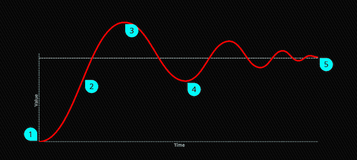
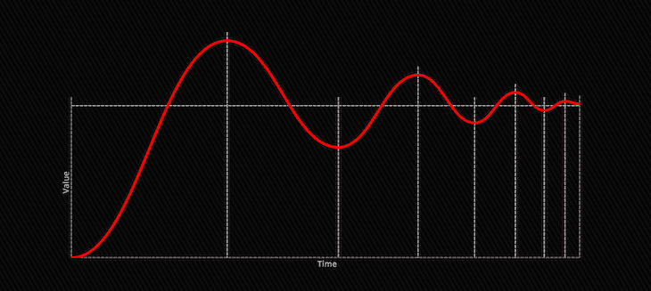

# 在 CSS 动画中加入弹性易用性

> 原文：<https://blog.logrocket.com/how-to-incorporate-elastic-ease-in-css-animations/>

作为一个创作了无数 CSS 动画的人，我一直怀念的一件事是`keyframes`和`transition`的弹性放松。是的，您可以使用 JavaScript 库和其他技巧(我们稍后会谈到)，但是，作为最纯粹的人，我已经深入到这个主题中，检查了当前的解决方案，了解了所有这些背后的数学原理，并构建了一个 CSS 弹性缓动生成器，它可以输出纯净、干净和准确的 CSS 动画代码。

## CSS 中的弹性缓和是什么？

首先，让我们试着更好地理解物体的弹性运动。让我们看一个红球从 A 点移动到 B 点:

球从 A 点开始，向它的目的地 B 点移动，但是它超过了 B 点一段距离，实际上是离开了 B 点。然后，它开始减速，停止，并开始向另一个方向移动，回到 B 点。它再次超过 B 点，这一次是以更小的幅度，并继续重复这一模式，每次都减少幅度，直到最后停止。

这是弹性缓动在图上的样子。



1.  球的起点
2.  初始运动
3.  过度拍摄目的地
4.  重复这个模式
5.  端点

## 在 JavaScript 中使用动画库

如果你使用的是像[格林斯托克](https://greensock.com)这样的动画库，只需添加`ease:Elastic.easeOut`并继续编码。应该注意的是，虽然第三方解决方案可以帮助您克服许多障碍，但它们确实有代价——有时是字面上的——并且它们可能会影响您的加载时间、包大小等等。

## JavaScript 中的弹性易用性编码

如果你不想(或不能)使用 JS 库，不用担心，你仍然可以用纯代码实现一个缓和函数。是的，它需要不止一行代码，但是它非常简单，并且我已经为您完成了大部分工作:

> 没有描述

我们这里有一个简单的`elastic()`函数，它接受一个 0 到 1 之间的值(T1)，并将其转换为点的正确 X 位置(T2)。该函数还接受两个常量:影响动画持续时间的速度和运动速度。随意摆弄这些数字，看看它们是如何影响圆点的运动的。

当我们点击**运行**时，`dotValue`重置为 0，功能开始。然后它不断运行，使用`requestAnimationFrame`函数，在每次迭代中增加`speed`值，并为新值重新计算点的位置。当`dotValue`到达`1`时，它停下来。

至于数学，我必须承认我的数学技能远不足以正确解释那里发生的事情，但我确实从几个不同的资源中检查了这个函数的一些变体，并最终得到了这个版本，它基于 easings.net 使用的数学，加上一些小的改进。

在这个例子中，我使用了`setProperty`函数，它设置了一个 CSS 自定义属性来控制点的`left`位置，但是您可以很容易地使用它来控制元素的大小、不透明度、角度、颜色等等。只要确保输入值在 0 和 1 之间，并根据您的需要正确定义两个`const`即可。

使用 CSS `cubic-bezier`轻松实现单步弹性

## 一个简单而神奇的解决方案是使用`cubic-bezier` ease 获得单步松紧带。为此，您可以给函数的第四个参数一个足够高的值，使动画通过其目的地，然后返回到其最终值。

它不像其他解决方案那样丰富，但它不使用 JS，很简单，有时它就是您需要的全部。我已经基于这个方法创建了几个例子，你可以使用 Lea Verou 的[这个伟大的工具](https://cubic-bezier.com)来试验`cubic-bezier`得到你想要的精确结果。

没有描述

> 在 CSS 中使用关键帧以增加弹性

实现纯 CSS 弹性轻松的另一种方法是用动画关键帧手动定义移动的每一步，以便更好地理解这种方法。让我们再看一次图表上的运动:

## 

在这里，你可以看到运动被分成几段，由一条垂直的虚线分开。请注意，每个片段上的运动就像我们都知道的内置 CSS 渐入渐出计时功能，因此我们可以将每个片段转换为一个关键帧，并使用纯 CSS 获得完全弹性的运动。

这种方法的问题是，首先需要计算每个关键帧的位置和值，这不是一件容易的事情。而且，如果你不准确，结果可能看起来不稳定和不一致。为了解决这个问题，我构建了一个简单的生成器，它可以根据您的参数为您创建关键帧。

为了实现最大的通用性，我们需要控制三个变量，进而控制运动的轨迹:

**步数**:来回重复的次数

**减速**:控制每次重复之间的关系

*   **速度**:设置缓动从原始路径的偏移
*   为动画创建分段大小
*   我们来分析一下。我们将从动画的步数(分段)和它们之间的减速开始。这一点很重要，因为每一步都将被转换成一个关键帧，而每一步的大小将决定关键帧的位置。

## 没有描述

如果您移动**步数**滑块，您就可以控制移动的分段数。**减速条**设定尺寸关系。当滑块一直移到最左侧时，所有线段的大小都相同。如果滑块位于最右侧，每个片段的大小将是前一个片段的一半。请注意，如果您使用了太多具有高减速值的步骤，则最后几步可能太小而没有任何效果。

> 设定速度

现在我们有了关键帧的位置，让我们来讨论一下值。我们会说初始值总是 0，终值总是 1。这样，我们以后可以将这些值映射到任何 CSS 属性，速度级别将决定每一步与最终值的偏差。

没有描述

## 现在我们已经有了一个漂亮的弹性图，我们要完成的最后一步是添加一个持续时间滑块来设置动画的总时间，然后决定我们要制作什么动画。

在这个生成器中，我添加了一些选项来制作一些常用属性的动画，比如`width`、`height`和`transform`，但是你可以很容易地调整它来制作你需要的几乎任何属性的动画。

> 更多来自 LogRocket 的精彩文章:

使用发电机

没有描述

现在，[全屏打开发生器](https://codepen.io/amit_sheen/full/57c932ba5730a4d512adc8ab49059892)。使用生成器的输入来控制运动，复制输出代码，并在项目中使用它来增加动画的弹性。

* * *

### 您可以根据需要编辑和更改动画。例如，如果你想让你的动画循环，你可以放下`animation-fill-mode`并添加`animation-iteration-count: infinite;`。或者，可以添加`animation-direction: alternate;`、`animation-delay`，甚至可以针对不同的属性组合两个动画。

* * *

## 下面是一个很酷的动画示例，它使用了由此发生器创建的关键帧:

> 没有描述

结论

我梦想有一天 CSS 会有一个内置的弹性函数，这个生成器会变得没用。想想看，如果有一个简单的弹性函数接受这三个参数，并产生一个干净漂亮的弹性放松，该多好，就像这样:

在那之前，你可以随意使用这个生成器来做任何你需要的事情，如果你对如何改进这个方法有任何想法或建议，请写在评论中。谢谢！

> 你的前端是否占用了用户的 CPU？

随着 web 前端变得越来越复杂，资源贪婪的特性对浏览器的要求越来越高。如果您对监控和跟踪生产环境中所有用户的客户端 CPU 使用、内存使用等感兴趣，

## .

LogRocket 就像是网络和移动应用的 DVR，记录你的网络应用或网站上发生的一切。您可以汇总和报告关键的前端性能指标，重放用户会话和应用程序状态，记录网络请求，并自动显示所有错误，而不是猜测问题发生的原因。

```
.elasticObject {
  animation-name: goElastic;
  animation-duration: 1.5s;
  animation-timing-function: elastic(7, 1.9, 0.5);
}

```

现代化您调试 web 和移动应用的方式— [开始免费监控](https://lp.logrocket.com/blg/css-signup)。

## Is your frontend hogging your users' CPU?

As web frontends get increasingly complex, resource-greedy features demand more and more from the browser. If you’re interested in monitoring and tracking client-side CPU usage, memory usage, and more for all of your users in production,

[try LogRocket](https://lp.logrocket.com/blg/css-signup)

.

[](https://lp.logrocket.com/blg/css-signup)[https://logrocket.com/signup/](https://lp.logrocket.com/blg/css-signup)

[LogRocket](https://lp.logrocket.com/blg/css-signup) is like a DVR for web and mobile apps, recording everything that happens in your web app or site. Instead of guessing why problems happen, you can aggregate and report on key frontend performance metrics, replay user sessions along with application state, log network requests, and automatically surface all errors.

Modernize how you debug web and mobile apps — [Start monitoring for free](https://lp.logrocket.com/blg/css-signup).