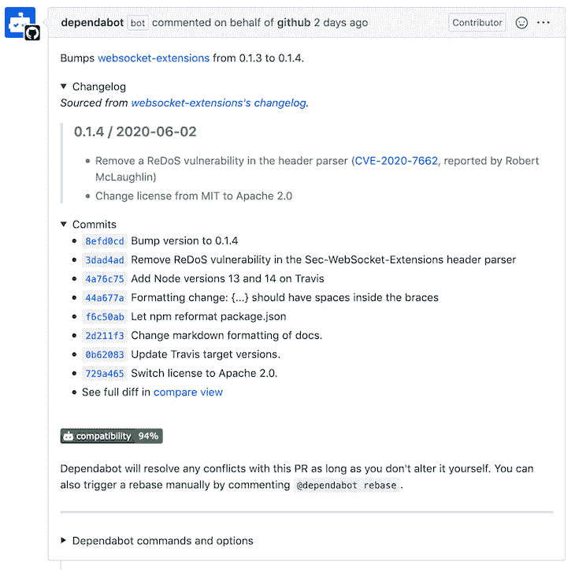

# 如何让你的 JavaScript 库保持最新

> 原文：<https://blog.logrocket.com/how-to-keep-javascript-libraries-up-to-date/>

保持 JavaScript 库最新的工作可能比偶尔运行`npm update`或`yarn up`更微妙。新项目通常以最新版本的库开始，但它们很快就会过时。

对于 JavaScript 开发人员来说，这是一个特别重要的话题，因为与用其他语言编写的项目相比，用 JS 编写的项目往往具有相对较大的依赖树。

## 为什么有这么多依赖？

这种趋势有几个原因。首先，JS 生态系统与 Node.js 和 T2 的 npm 注册中心紧密相连。这很重要，因为 Node.js 有一个[故意变小的](https://medium.com/the-node-js-collection/keeping-the-node-js-core-small-137f83d18152)标准库。就[把它](https://nodejs.org/api/)比作 [Python 的标准库](https://docs.python.org/3/library/)。

这种方法有利有弊，但实际结果是 JS 开发人员习惯于求助于第三方库来解决问题，即使是添加`mkdir -p`功能这样的任务。mkdirp 库每周被下载超过 2000 万次。

由于依赖项本身可以有依赖项，这种习惯会导致一个大的`node_modules`目录。它的大小已经成为了[模因](https://devrant.com/rants/760537/heaviest-objects-in-the-universe)，npm 的`package-lock.json`和[纱’](https://yarnpkg.com/)s`yarn.lock`有几千行甚至上万行之长是很常见的。


与其他生态系统相比，JS 开发人员在更大程度上也信奉创建和使用[小而集中的依赖关系](https://blog.sindresorhus.com/small-focused-modules-9238d977a92a)的哲学。这有时是[批评的目标](https://www.reddit.com/r/programming/comments/c0zwxb/one_liner_npm_package_iswindows_has_25_million/)，尤其是当包只包含一行代码的时候。

不考虑这种现实的权衡，开发人员将需要在某个时候考虑他们的依赖性更新策略。

## 为什么要更新

你可能会问为什么首先保持依赖关系的最新是值得的，特别是当一个项目运行良好的时候。

第一个原因是防止安全漏洞。即使您能够编写完美的代码，您使用的任何第三方代码，无论是直接的还是间接的，都可能存在安全问题。这可能导致灾难性的后果。2017 年的 Equifax 数据泄露事件是由 Equifax 未能更新一个[框架](https://struts.apache.org/)引起的，该框架用于其一个网站，此前该框架修补了一个安全漏洞。

同样的想法也适用于其他错误修复、功能改进和性能改进。通过更新您的依赖项，您可以轻松地将这些改进引入到您的项目中。

第二个原因是为了避免以后因为任何原因被迫升级时不得不做出巨大的改变。例如，您可能从 1.0 版本的库开始。你长时间不升级，然后你尝试直接升级到 4.0 版本。这可能涉及到重大的变化，如果您在此期间升级到 2.0 和 3.0，这些变化可能不会那么痛苦。

这种情况并不少见。也许你想升级到 Node 的一个新的主版本，但是你的一个库的当前版本不支持它。

类似地，也许你的库在某种程度上相互依赖，使得更新一个库而不更新另一个库变得困难。例如，您可以使用一个 React 组件库，它对 React 具有对等依赖关系。您只想更新组件库，但随后您发现自己也被迫更新 React。

这种级联效应会导致比您最初打算的更大的变化，尤其是当您必须更改一些自己的代码时。你越长时间不更新你的库，你就越有可能遇到这种情况。

一些库的作者试图通过深思熟虑的方式引入突破性的改变来简化迁移，比如在移除它们之前取消一些特性。如果你很少更新，你可能会被迫在一个不方便的时间做出大的改变，而不是有一个预警和制定计划的机会。

更新依赖关系也是保持消息灵通的一种方式。它给你一个图书馆发展的感觉。你可能会学到一个对你有帮助的新功能。或者你可能意识到一个库正在以这样一种方式改变，它不能满足你未来的需求，你应该开始研究替代方案。如果你安装了一个库，并且不再考虑它，就很容易错过这些事情。

最后，如果您自己就是一个库作者，那么代表您的最终用户更新您的依赖项是有意义的。他们不容易控制子依赖的版本，所以如果一个版本有问题，如果你不更新你的`package.json`来允许他们引入子依赖的新版本，他们可能会被这个问题所困扰。

## 为什么不更新

但是，也有不更新库的原因。最大的问题是，任何改变都有引发问题的风险。虽然您可能获得了一个您甚至没有意识到的 bug 的修复，但是更新的库也有可能引入一个新的 bug 或性能退化。

一个[学派](https://kevin.burke.dev/kevin/dont-update-dependencies/)认为你应该只在有特定原因的时候更新依赖关系，而不是仅仅为了更新而更新。拥有一个好的测试套件有助于减轻风险，但它仍然是一个风险。

更新依赖关系还会占用构建新功能或修复已知问题的时间。当库发生重大变化时，这是一项耗时的工作。

不管您决定多久更新一次库，让我们考虑一下这样做的实际机制。

## 更新相关性

记住[语义版本化(semver)](https://semver.org/) 的思想。这是一个主要的版本化程序的实践。未成年人。补丁方式。新的主要版本表示重大变更，新的次要版本表示向后兼容的新功能，新的补丁版本表示向后兼容的错误修复。

JS 库倾向于遵循语义版本化，但是版本号仅仅反映了作者的意图和理解。他们可能会发布一个新的次要版本，该版本实际上意外地发生了重大变化，或者您可能以一种意想不到的方式使用该库，从而导致更新版本出现问题。

默认情况下，npm 和 Yarn 希望库遵循语义版本控制。当您使用任一选项添加库时，`package.json`中的条目将在版本前面有一个脱字符号(`^`):

```
{
  "dependencies": {
    "lodash": "^3.1.0"
  }
}
```

这意味着您将接受次要版本和补丁版本更新，但不接受主要版本更新。

* * *

### 更多来自 LogRocket 的精彩文章:

* * *

要检查您的依赖项是否过期，您可以运行`[npm outdated](https://docs.npmjs.com/cli-commands/outdated.html)`:

```
Package  Current  Wanted   Latest  Location
lodash     3.1.0  3.10.1  4.17.15  npm-test
```

当你更新的时候，最重要的事情是读取库的 [changelog](https://keepachangelog.com/) 。这通常是弄清楚你带来了什么变化的最有效的方法，最关键的是突破性的变化。

如果您发现自己不幸地更新了一个没有 changelog 但却是开源的库，那么您可能需要查看提交历史来找出发生了什么变化。较大的项目也倾向于有博客，为新版本提供更多的细节。

更新包的标准方法是使用`[npm update](https://docs.npmjs.com/cli/update)`，它将所有包更新到根据 semver 可以接受的最新版本。在这种情况下，您将把 Lodash 更新到版本 3.10.1。

即使版本 4.17.15 可用，默认情况下您也不会更新到它，因为脱字符号限制您只能进行较小的更新和补丁更新。如果不想一次更新所有的包，也可以将特定的包传递给该命令。

在许多情况下，无论指定的版本如何，您都希望更新到最新的可用版本。不幸的是，`npm update`没有办法做到这一点，所以您需要使用`npm install [[email protected]](/cdn-cgi/l/email-protection)`。

为了使这个过程更有效，特别是当你有很多依赖项时，考虑使用`[npm-check](https://github.com/dylang/npm-check)`或`[npm-check-updates](https://github.com/raineorshine/npm-check-updates)`。这些 CLI 工具允许您以交互方式进行更新，并提供有用的信息，如指向项目网站的链接，以便您可以轻松检查更改。

```
$ npm-check

lodash   😎  MAJOR UP  Major update available. https://lodash.com/
                      npm install --save [email protected] to go from 3.1.0 to 4.17.15

Use npm-check -u for interactive update.

$ npm-check -u
? Choose which packages to update.

 Major Update Potentially breaking API changes. Use caution.
❯◯ lodash  3.1.0  ❯  4.17.15  https://lodash.com/
```

Yarn 甚至内置了这个特性。只需运行`[yarn upgrade-interactive](https://yarnpkg.com/cli/upgrade-interactive)`。

```
$ yarn upgrade-interactive
 Press <up>/<down> to select packages.         Press <enter> to install.
 Press <left>/<right> to select versions.      Press <ctrl+c> to abort.

? Pick the packages you want to upgrade.       Current      Range/Latest

 > lodash                                      ◯  3.1.0    ◯  3.10.1   ◉  4.17.15
```

Yarn 没有一个`outdated`命令，所以`upgrade-interactive`基本上将 npm 的`outdated`和`update`合二为一，尽管你也可以使用`[yarn up](https://yarnpkg.com/cli/up)`。

请注意，如果您仍然使用纱线 v1，则会有一些差异。升级命令是`[yarn upgrade](https://classic.yarnpkg.com/en/docs/cli/upgrade/)`而不是`yarn up`。Yarn v1 也有一个`[outdated](https://classic.yarnpkg.com/en/docs/cli/outdated)`命令。

## 自动更新

此外，还有一种利用外部服务简化更新流程的趋势。用于此目的的一些工具包括 Gemnasium、 [Greenkeeper](https://github.com/greenkeeperio/greenkeeper) 和[dependent bot](https://dependabot.com/)，尽管它们已经分别被 [GitLab](https://about.gitlab.com/press/releases/2018-01-30-gemnasium-acquisition.html) 、 [Snyk](https://snyk.io/blog/snyk-partners-with-greenkeeper-to-help-developers-proactively-maintain-dependency-health/) 和 [GitHub](https://dependabot.com/blog/hello-github/) 收购或归入。

总的想法是要有一个服务来监控项目的依赖项，甚至打开拉请求来更新它们。当在依赖关系树中发现安全漏洞时，它们还会提醒您。这里有一张由 GitHub 的[安全更新](https://help.github.com/en/github/managing-security-vulnerabilities/configuring-automated-security-updates)生成的 Dependabot PR 的截图。



像这样的服务可以使你的库保持最新变得相当容易，因为你不需要自己去记着这么做。

## 结论

使库保持最新表面上看起来似乎很简单，但是在每个项目的基础上对更新策略进行一些思考是很好的。一个项目可能永远不需要再次更新，而另一个项目可能需要使用 Dependabot、Snyk 或其他服务来积极地保持最新。或者，您可能对及时的方法很满意，在这种方法中，您在发现问题时更新依赖关系。无论如何，做出明确的决定。

## 通过理解上下文，更容易地调试 JavaScript 错误

调试代码总是一项单调乏味的任务。但是你越了解自己的错误，就越容易改正。

LogRocket 让你以新的独特的方式理解这些错误。我们的前端监控解决方案跟踪用户与您的 JavaScript 前端的互动，让您能够准确找出导致错误的用户行为。

[](https://lp.logrocket.com/blg/javascript-signup)

LogRocket 记录控制台日志、页面加载时间、堆栈跟踪、慢速网络请求/响应(带有标题+正文)、浏览器元数据和自定义日志。理解您的 JavaScript 代码的影响从来没有这么简单过！

[Try it for free](https://lp.logrocket.com/blg/javascript-signup)

.