# 如何用 React Spring 制作五彩纸屑炮

> 原文：<https://blog.logrocket.com/how-to-make-a-confetti-cannon-with-react-spring/>

你知道每个人在日常生活中喜欢什么吗？一点肯定，一点鼓励，一点庆祝——还有一点纸屑。

在本教程中，您将学习如何使用 React Spring 从头开始实现一个可以从任何元素发射的五彩纸屑炮。不需要以前的 React Spring 经验！唯一的先决条件是对 React 和钩子有一个基本的了解。

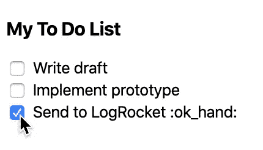

如果你想往前跳，可以跳到[完成的 CodeSandbox 例子](https://codesandbox.io/s/confetti-complete-1ntnk)。

注:本教程使用 [`styled-components`](https://blog.logrocket.com/new-in-styled-components-5-0/) 。如果你以前从未用过`styled-components`，不要担心。这是一个功能强大的 React 组件内联样式库，但可读性很强，所以只要看一下代码就能明白其中的要点。

## 策略

当我开始实现一些我从未见过的东西时，我喜欢把它分成几个阶段，从核心部分开始，然后再完善。我们将一步步推进这个项目:

1.  在页面上显示一些东西
2.  设置反作用弹簧
3.  写一些基本的伪物理学助手
4.  锚定一个点
5.  让许多小点移动起来，就像它们从五彩纸屑炮中发射出来一样
6.  为五彩纸屑添加变化，例如不同的形状、颜色和大小

我们开始吧！

## 1.页面上的内容

先来编个小 app。我们将使它成为一个待办事项应用程序，并设置它在您完成一个项目时从复选框中发射五彩纸屑。

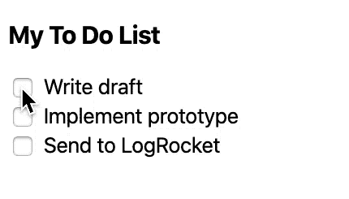

现在，让我们添加一个五彩纸屑点，我们将在本教程的下几个步骤中使用它。

```
const StyledConfettiDot = styled.svg`
  position: absolute;
  will-change: transform;
`;
const Dot = () => (
  <StyledConfettiDot>
    <circle cx="5" cy="5" r="5" fill="blue" />
  </StyledConfettiDot>
);

```

## 2.反作用弹簧设置

React Spring 是我们将在本教程中使用的动画库。这是一个独特的库，其立场是由弹簧而不是关键帧驱动的动画看起来更自然。您可以指定弹簧的张力、摩擦力和质量，以及动画的开始值和结束值，并让 React Spring 计算出它们与弹簧的关系，而不是指定动画的长度以及在什么时间发生什么变化。

让我们用我们的五彩纸屑点做好春天的准备。运行以下任一项。

*   `npm install react-spring`
*   `yarn add react-spring`

将以下导入内容添加到`ConfettiDot.js.`

```
import { animated, config, useSpring } from 'react-spring';
```

*   `animated`用于包装现有组件，以允许它们使用`react-spring`
*   `config` s 是`react-spring`附带的预设 spring 配置(我们将使用`default`配置)
*   `useSpring`是`react-spring`的主要出口商品之一(还有少量其他出口商品，但我们将重点关注`useSpring`)

用`react-spring`使能的`ConfettiDot`看起来像这样:

```
const AnimatedConfettiDot = animated(StyledConfettiDot);
const Dot = () => {
  const { y } = useSpring({
    config: config.default,
    from: { y: 0 },
    to: { y: -50 }
  });
  return (
    <AnimatedConfettiDot
      style={{
        transform: y.interpolate(yValue => `translate3d(0,${yValue}px,0)`)
      }}
    >
      <circle cx="5" cy="5" r="5" fill="blue" />
    </AnimatedConfettiDot>
  );
};

```

我们已经用`animated`包装了我们的`StyledConfettiDot`组件。我们所要做的就是给`animated(<component>)`打电话。

`useSpring`取具有各种属性的对象。首先，一个`config`对象——我们将使用`react-spring`附带的`default`对象，因为它没有反弹。接下来是一个声明任意初始值的`from`对象，后面是一个声明匹配终值的`to`对象。整个钩子返回一个匹配`from`和`to`对象的对象。在这个例子中，我们已经设置了一个`y`初始值和结束值，并且我们正在析构结果以获得`y`动画值。

我们现在使用`animated`调用的结果`AnimatedConfettiDot`，而不是在渲染中使用`ConfettiDot`或`StyledConfettiDot`。

在`AnimatedConfettiDot`的`style`属性中，我们使用`useSpring`中对象的结果将值转换成有效的样式值。

让我们更详细地分解一下`style`属性。首先，我们使用的是`style`属性，而不是 props，因为当值改变时，因为它使用的是`animated`，它只会改变 DOM 元素的样式值，而不是在 React 中重新呈现。这意味着你可以在一次渲染中完成复杂的动画。如果没有这一点，性能将会非常慢。

其次，我们使用`y`上的`interpolate`函数将它转换成一个真正的字符串值。对于已经等于最终样式值的值，比如颜色或百分比值，你不需要使用`interpolate`。我们稍后将演示这一点。

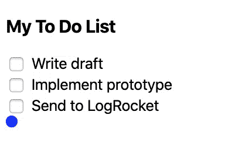

## 3.伪物理学

虽然一个圆圈向上移动很有趣，但我们希望它看起来像是从五彩纸屑大炮中发射出来的。为了完成这个，我们要做一些伪物理。

*   当五彩纸屑从大炮中射出时，速度很快
*   五彩纸屑很快慢了下来
*   最终，重力超过了它的速度，它开始回落

我们将使用`react-spring`来模拟时间 *t* 时五彩纸屑的速度。让我们做一个从 100 到 0 的弹簧。

```
const { upwards } = useSpring({
  config: config.default,
  from: { upwards: 100 },
  to: { upwards: 0 },
});

```

让我们假设这个速度代表每秒的像素，从每秒 100 像素到每秒 0 像素。

为了实际使用它来移动五彩纸屑点，我们将做以下事情。

```
const initialY = 0;
let totalUpwards = 0;
const startTime = new Date().getTime() / 1000;
let lastTime = startTime;

return (
  <AnimatedConfettiDot
    style={{
      transform: upwards.interpolate(upwardsValue => {
        const currentTime = new Date().getTime() / 1000;
        const duration = currentTime - lastTime;
        const verticalTraveled = upwardsValue * duration;
        totalUpwards += verticalTraveled;
        lastTime = currentTime;

        return `translate3d(0, ${initialY - totalUpwards}px, 0)`;
      })
    }}
  >
    <circle cx="5" cy="5" r="5" fill="blue" />
  </AnimatedConfettiDot>
);

```

这是一个有趣的把戏。由于在`react-spring`的每个滴答都调用`interpolate`，我们计算当前滴答和最后一个滴答之间的时间，获得当前速度，并计算行进的距离(速度*自最后一个滴答以来的持续时间)，然后将其添加到在`totalUpwards`中行进的总距离。然后我们使用`totalUpwards`作为结果转换值(使用减法，因为正向上移动是负的`y`轴在 DOM 中的移动)。

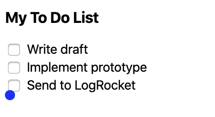

目前为止看起来很棒！我们已经成功地将速度转换成一个`translate`值。然而，仍然缺少的是恒定重力。从物理学的角度来说，这很容易实现，因为在时间`t`的重力仅仅是`t * total time`。

```
const initialY = 0;
  let totalUpwards = 0;
  const startTime = new Date().getTime() / 1000;
  let lastTime = startTime;
  const gravityPerSecond = 30;
  return (
    <AnimatedConfettiDot
      style={{
        transform: upwards.interpolate(upwardsValue => {
          const currentTime = new Date().getTime() / 1000;
          const duration = currentTime - lastTime;
          const verticalTraveled = upwardsValue * duration;
          const totalDuration = currentTime - startTime;
          totalUpwards += verticalTraveled;
          lastTime = currentTime;
          const totalGravity = gravityPerSecond * totalDuration;
          const finalY = initialY - totalUpwards + totalGravity;
          return `translate3d(0, ${finalY}px, 0)`;
        })
      }}
    >
      <circle cx="5" cy="5" r="5" fill="blue" />
    </AnimatedConfettiDot>
  );
};

```

将初始向上速度更改为 300 会产生以下结果。

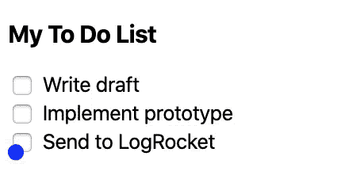

让我们也加入水平运动。是类似的机制，我就开门见山了。

```
const { horizontal, upwards } = useSpring({
    config: config.default,
    from: {
      horizontal: 200,
      upwards: 300
    },
    to: {
      horizontal: 0,
      upwards: 0
    }
  });
  const initialX = 0;
  const initialY = 0;
  let totalUpwards = 0;
  let totalHorizontal = 0;
  const startTime = new Date().getTime() / 1000;
  let lastTime = startTime;
  const gravityPerSecond = 30;
  return (
    <AnimatedConfettiDot
      style={{
        transform: interpolate([upwards, horizontal], (v, h) => {
          const currentTime = new Date().getTime() / 1000;
          const duration = currentTime - lastTime;
          const totalDuration = currentTime - startTime;
          const verticalTraveled = v * duration;
          const horizontalTraveled = h * duration;
          totalUpwards += verticalTraveled;
          totalHorizontal += horizontalTraveled;
          lastTime = currentTime;
          const totalGravity = gravityPerSecond * totalDuration;
          const finalX = initialX + totalHorizontal;
          const finalY = initialY - totalUpwards + totalGravity;
          return `translate3d(${finalX}px, ${finalY}px, 0)`;
        })
      }}
    >
      <circle cx="5" cy="5" r="5" fill="blue" />
    </AnimatedConfettiDot>
  );

```

与向上速度类似，我们在现有的`from`和`to`值中添加了一个水平速度弹簧，并计算了弹簧每个节拍移动的水平距离。

一个新的事情是，我们不再只是插值一个值，所以我们需要使用从`react-spring`导出的`interpolate`函数。这个函数的第一个参数是一个弹簧数组，第二个参数是一个对该数组中的每个弹簧值进行处理的函数。在这个特殊的例子中，第一个参数是向上和水平速度的列表，第二个参数是一个函数，向上速度是它的第一个参数，水平速度是它的第二个参数。

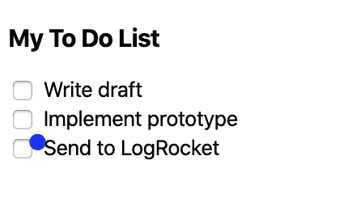

## 4.锚定

在我们开始让许多五彩纸屑飞起来之前，让我们让这一片看起来像是从一个特定的元素中出来的。

第一步是当复选框被点击时，使五彩纸屑出现。

```
const ToDo = ({ text }) => {
  const [done, setDone] = useState(false);
  return (
    <StyledToDo>
      <input type="checkbox" onChange={() => setDone(!done)} />
      <span>
        {text} {done ? ":ok_hand:" : ""}
      </span>
      {done && <ConfettiDot />}
    </StyledToDo>
  );
};

```

在每个`ToDo`组件中，当`done`状态为真时，渲染一个`ConfettiDot`。


它看起来与复选框对齐，但如果仔细观察，您可能会注意到动画从复选框的左上角开始。它看起来不错，但是如果它是一个不同的元素，比如一个文本框输入，这看起来会很奇怪。

我们将使用`ref` s 将动画与复选框对齐。

```
const alignWithAnchor = anchorRef => {
  if (anchorRef.current == null) {
    return {
      initialX: 0,
      initialY: 0
    };
  }
  const { height, width } = anchorRef.current.getBoundingClientRect();
  return {
    initialX: width / 2,
    initialY: height / 2
  };
};

const Dot = ({ anchorRef }) => {
  const { initialX, initialY } = alignWithAnchor(anchorRef);
  // ...
}

const ToDo = ({ text }) => {
  const confettiAnchorRef = useRef();
  const [done, setDone] = useState(false);
  return (
    <StyledToDo>
      <input
        ref={confettiAnchorRef}
        type="checkbox"
        onChange={() => setDone(!done)}
      />
      <span>
        {text} {done ? ":ok_hand:" : ""}
      </span>
      {done && <ConfettiDot anchorRef={confettiAnchorRef} />}
    </StyledToDo>
  );
};

```

要使用`ref`，请遵循以下步骤:

1.  在`ToDo`中，调用`useRef()`
2.  通过使用`ref={confettiAnchorRef}`将结果`ref`附加到`input`(现在 ref 将包含`input`的 DOM 元素)
3.  将 ref 传给`ConfettiDot`
4.  在`ConfettiDot`中，访问`ref`并将其传递给助手
5.  在帮助器中，计算`ref`元素的中间值

现在动画有点清理了。

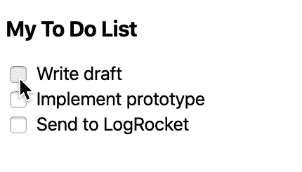

## 5.制造大炮

现在我们已经有了一个五彩纸屑点，当我们想要它移动的时候，让我们把它做成一个五彩纸屑炮，喷射一个随机的五彩纸屑扇形。我们希望我们的五彩纸屑炮组件:

*   用锚`ref`支撑对准
*   有一个垂直范围
*   有一个水平范围
*   发射一定数量的纸屑点

```
const ToDo = ({ text }) => {
const confettiAnchorRef = useRef();
const [done, setDone] = useState(false);
return (
// ...
{done && }
);
};const ConfettiCannon = ({ anchorRef, dotCount }) => (
<>
{new Array(dotCount).fill().map((_, index) => ())}
</>
);
```


看起来没太大区别吧？尽管我们渲染了五个五彩纸屑点，但它们都有相同的动画，因为五彩纸屑点有它们的向上和水平移动道具。让我们把它们提取出来，在一个范围内随机排列。

```
const randomInRange = (min, max) => {
  return Math.random() * (max - min) + min;
};

const ConfettiCannon = ({ anchorRef, dotCount }) => (
  <>
    {new Array(dotCount).fill().map((_, index) => (
      <ConfettiDot
        key={index}
        anchorRef={anchorRef}
        initialHorizontal={randomInRange(-250, 250)}
        initialUpwards={randomInRange(200, 700)}
      />
    ))}
  </>
);

const Dot = ({ anchorRef, initialHorizontal, initialUpwards }) => {
  const { initialX, initialY } = alignWithAnchor(anchorRef);
  const { horizontal, upwards } = useSpring({
    config: config.default,
    from: {
      horizontal: initialHorizontal,
      upwards: initialUpwards
    },
    to: {
      horizontal: 0,
      upwards: 0
    }
  });

  // ...
}

```

现在，我们将随机化每个点，而不是固定的初始水平和向上的速度。水平速度从-250 到 250，代表点在锚的左边和右边飞行，向上的速度从 200 到 700。请随意使用这些值。

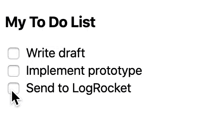

## 6.抛光剂

至此，我们已经完成了这个项目所需的所有艰苦工作。为了润色它，我们将做以下事情。

1.  当五彩纸屑落下时淡出
2.  随机颜色
3.  随机形状
4.  随机尺寸

让我们一步一步地分解这个。

### 淡出

五彩纸屑应该会在动画接近尾声时消失。为了实现这一点，我们需要做的就是在`ConfettiDot`中添加以下内容。

```
const Dot = ({ anchorRef, initialHorizontal, initialUpwards }) => {
  const { initialX, initialY } = alignWithAnchor(anchorRef);
  const { horizontal, opacity, upwards } = useSpring({
    config: config.default,
    from: {
      horizontal: initialHorizontal,
      opacity: 80,
      upwards: initialUpwards
    },
    to: {
      horizontal: 0,
      opacity: 0,
      upwards: 0
    }
  });

// ...

  return (
    <AnimatedConfettiDot
      style={{
        opacity,
        transform: interpolate([upwards, horizontal], (v, h) => {
          // ...
        })
      }}
    >
      <circle cx="5" cy="5" r="5" fill="blue" />
    </AnimatedConfettiDot>
  );
}

```

由于 opacity 实际上返回一个数字，这就是有效的`style`值，我们不需要对它进行插值。我们可以把它放到`AnimatedConfettiDot`的`style`属性中。

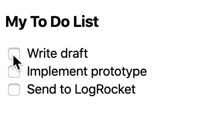

### 随机颜色

蓝色很好，但是当然，变化越大越好。让我们给`ConfettiDot`添加一个`color`道具，给`ConfettiCannon`添加一个`colors`道具，然后从那里随机挑选颜色分配给创建的`ConfettiDot`

```
const Dot = ({ anchorRef, color, initialHorizontal, initialUpwards }) => {
  // ...

  return (
    <AnimatedConfettiDot
      // ...
    >
      <circle cx="5" cy="5" r="5" fill={color} />
    </AnimatedConfettiDot>
  );
}

const randomInRange = (min, max) => {
  return Math.random() * (max - min) + min;
};

const randomIntInRange = (min, max) => Math.floor(randomInRange(min, max));

const ConfettiCannon = ({ anchorRef, colors, dotCount }) => (
  <>
    {new Array(dotCount).fill().map((_, index) => (
      <ConfettiDot
        key={index}
        anchorRef={anchorRef}
        color={colors[randomIntInRange(0, colors.length)]}
        initialHorizontal={randomInRange(-250, 250)}
        initialUpwards={randomInRange(200, 700)}
      />
    ))}
  </>
);

```

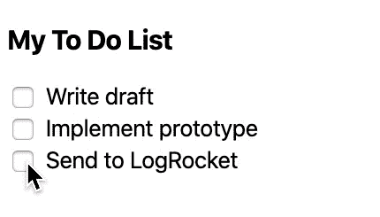

如果你想用这个库的应用程序的品牌颜色来风格化你的五彩纸屑，这可能特别有用。

### 随机形状

圆圈也很好，但它们看起来不像是世界上最有说服力的纸屑。让我们随机制作正方形和三角形。

```
const Circle = ({ color, size }) => (
  <circle
    cx={`${size / 2}`}
    cy={`${size / 2}`}
    r={`${(size / 2) * 0.6}`}
    fill={color}
  />
);
const Triangle = ({ color, size }) => {
  const flipped = flipCoin();
  return (
    <polygon
      points={`${size / 2},0 ${size},${randomInRange(
        flipped ? size / 2 : 0,
        size
      )} 0,${randomInRange(flipped ? 0 : size / 2, size)}`}
      fill={color}
    />
  );
};
const Square = ({ color, size }) => {
  const flipped = flipCoin();
  return (
    <rect
      height={`${randomInRange(0, flipped ? size : size / 2)}`}
      width={`${randomInRange(0, flipped ? size / 2 : size)}`}
      fill={color}
    />
  );
};
const getRandomShape = color => {
  const Shape = randomFromArray([Circle, Square, Triangle]);
  return <Shape color={color} size={10} />;
};

return (
  <AnimatedConfettiDot
    // ...
  >
    {getRandomShape(color)}
  </AnimatedConfettiDot>
);

```

现在我们将随机得到一个三角形、正方形或圆形。三角形和正方形中有一些额外的代码，以确保你永远不会得到一个只有一条线的正方形或一个只有一条线的三角形。我已经从这个片段中省略了`flipCoin`和`randomFromArray`的代码，但是它在 CodeSandbox 中。

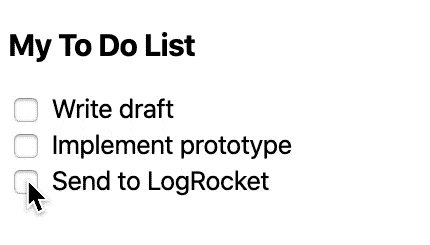

最后一件需要改进的事情是:到目前为止，没有旋转，这使得每个三角形都有一个点直接朝上，每个矩形要么完全垂直，要么完全水平。让我们解决这个问题。

```
const ConfettiCannon = ({ anchorRef, colors, dotCount }) => (
  <>
    {new Array(dotCount).fill().map((_, index) => (
      <ConfettiDot
        key={index}
        anchorRef={anchorRef}
        color={colors[randomIntInRange(0, colors.length)]}
        initialHorizontal={randomInRange(-250, 250)}
        initialUpwards={randomInRange(200, 700)}
        rotate={randomInRange(0, 360)}
      />
    ))}
  </>
);

const Dot = ({
  anchorRef,
  color,
  initialHorizontal,
  initialUpwards,
  rotate
}) => {
  // ...
  return (
    <AnimatedConfettiDot
      style={{
        opacity,
        transform: interpolate([upwards, horizontal], (v, h) => {
          // ...
          return `translate3d(${finalX}px, ${finalY}px, 0) rotate(${rotate}deg)`;
        })
      }}
    >
      {getRandomShape(color)}
    </AnimatedConfettiDot>
  );
};

```


### 随机尺寸

随机化的最后一个方面是每个点的大小。目前，所有的点都是一样大的，尤其是圆圈。让我们用一个和旋转相似的方法。

```
const getRandomShape = (color, size) => {
  const Shape = randomFromArray([Circle, Square, Triangle]);
  return <Shape color={color} size={size} />;
};

const Dot = ({
  anchorRef,
  color,
  initialHorizontal,
  initialUpwards,
  rotate,
  size
}) => {
  // ...
  return (
    <AnimatedConfettiDot
      // ...
    >
      {getRandomShape(color, size)}
    </AnimatedConfettiDot>
  );
};

const ConfettiCannon = ({ anchorRef, colors, dotCount }) => (
  <>
    {new Array(dotCount).fill().map((_, index) => (
      <ConfettiDot
        key={index}
        anchorRef={anchorRef}
        color={colors[randomIntInRange(0, colors.length)]}
        initialHorizontal={randomInRange(-250, 250)}
        initialUpwards={randomInRange(200, 700)}
        rotate={randomInRange(0, 360)}
        size={randomInRange(8, 12)}
      />
    ))}
  </>
);

```


## 结论

恭喜你！您已经使用 React 和 React Spring 从头开始制作了五彩纸屑。现在你应该更熟悉使用 React Spring 的`useSpring`钩子来创建强大的高性能动画。

我会给你留下这些烙印五彩纸屑炮！

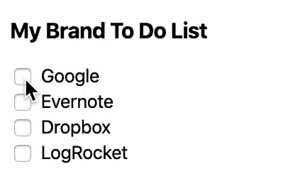

## 使用 LogRocket 消除传统反应错误报告的噪音

[LogRocket](https://lp.logrocket.com/blg/react-signup-issue-free)

是一款 React analytics 解决方案，可保护您免受数百个误报错误警报的影响，只针对少数真正重要的项目。LogRocket 告诉您 React 应用程序中实际影响用户的最具影响力的 bug 和 UX 问题。

[ ](https://lp.logrocket.com/blg/react-signup-general) [  ](https://lp.logrocket.com/blg/react-signup-general) [LogRocket](https://lp.logrocket.com/blg/react-signup-issue-free)

自动聚合客户端错误、反应错误边界、还原状态、缓慢的组件加载时间、JS 异常、前端性能指标和用户交互。然后，LogRocket 使用机器学习来通知您影响大多数用户的最具影响力的问题，并提供您修复它所需的上下文。

关注重要的 React bug—[今天就试试 LogRocket】。](https://lp.logrocket.com/blg/react-signup-issue-free)