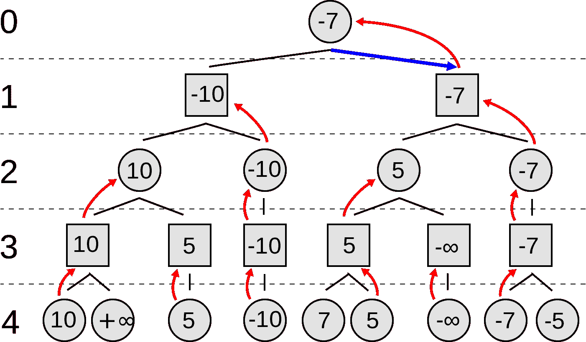
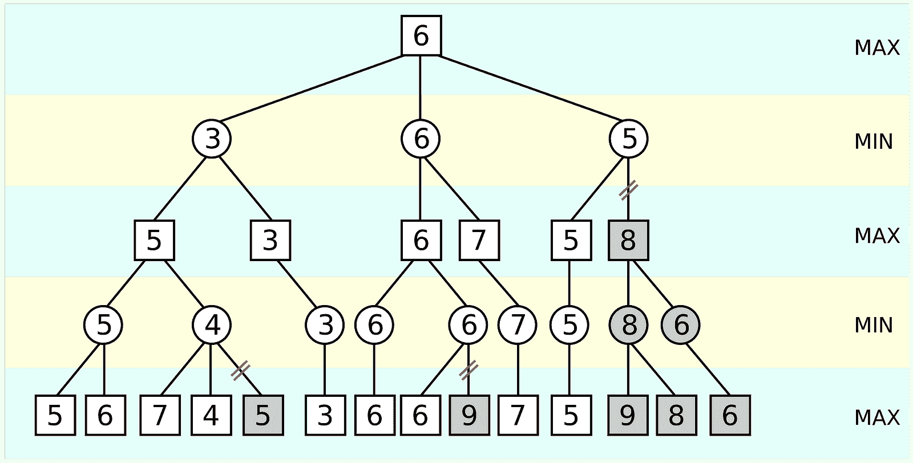
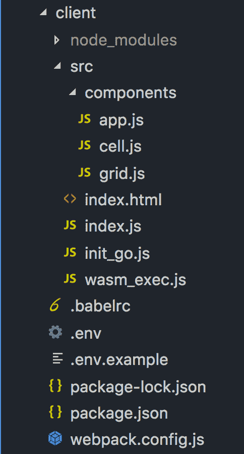

# 如何用 WebAssembly 为 Go - LogRocket 博客制作井字机器人

> 原文：<https://blog.logrocket.com/how-to-make-a-tic-tac-toe-bot-with-webassembly-for-go-e01800a874c9/>

不久前，我写了一篇关于 React 应用程序中 Go WebAssembly 的基本设置的文章。我们将借用我们在那里所做的工作，所以请确保先阅读一下(或者下载[入门模板](https://github.com/Chrischuck/React-Go-WASM))！

如果您需要下载模板，请运行以下命令:

`git clone [https://github.com/Chrischuck/React-Go-WASM.git](https://github.com/Chrischuck/React-Go-WASM.git)`

另外，确保你已经下载了 Chrome 浏览器，因为我们需要它来进行开发。

上次我们使用 Go 只是简单地将内容记录到控制台。这很酷，但这一次我们将通过制作一个在井字游戏中无与伦比的机器人来使用 Go。

本教程将依次涵盖以下主题:

*   一字棋
*   极大极小算法
*   在 Go 中实现 MiniMax
*   让它在 React 中工作
*   面向 Go 的 WebAssembly 的要点/缺陷

正如你所看到的，我们将涵盖很多不同的主题，从人工智能理论，写一些围棋，和一点点的网络开发。你不需要成为这些方面的专家，所以让我们直接开始吧。

这里有一个完整的[演示](https://chris-tac-toe.netlify.com/)(仅限☹️桌面和 Chrome)及其[回购](https://github.com/Chrischuck/ai-tic-tac-toe)的链接。

作为另一个资源，链接到这篇文章的[回购](https://github.com/Chrischuck/React-Go-WASM)。

### 井字游戏基础

如果你不熟悉井字游戏，这是一种到处都是小学生玩的游戏。它的起源可以追溯到古埃及(远至公元前 1300 年)！游戏比较简单，大家来看看吧！

[Image](https://en.wikipedia.org/wiki/Tic-tac-toe#/media/File:Tic-tac-toe-game-1.svg) from Wikipedia

你有一个 3×3 矩阵(如上所示)，一个玩家是 O，另一个是 x。玩家轮流用他们的符号填充空白位置。第一个连续获得三个符号的人获胜！经典的井字游戏包括一个 3×3 的棋盘，但是只要它是正方形的，你就可以玩到任何大小。对于本教程，出于简单和性能原因，我们将坚持使用 3×3(稍后将详细介绍性能原因)。

### 如何一直赢——MiniMax

我们首先应该检查的是为井字游戏机器人提供动力的实际算法。来自维基百科的该算法的定义陈述如下:

> [**Minimax**](https://en.wikipedia.org/wiki/Minimax) 是在[人工智能](https://en.wikipedia.org/wiki/Artificial_intelligence "Artificial intelligence")、[决策理论](https://en.wikipedia.org/wiki/Decision_theory "Decision theory")、[博弈论](https://en.wikipedia.org/wiki/Game_theory "Game theory")、[统计学](https://en.wikipedia.org/wiki/Statistics "Statistics")和[哲学](https://en.wikipedia.org/wiki/Philosophy "Philosophy")中使用的决策规则，用于*Minimax*mizing the possible[loss](https://en.wikipedia.org/wiki/Loss_function "Loss function")for a worst case(*max*imum loss)场景。

这意味着我们的算法不一定要赢，而是不要输。将这种想法应用到我们的井字游戏中，我们的机器人将选择给对手最低获胜机会的路径。

请看下图:



[Image](https://en.wikipedia.org/wiki/File:Minimax.svg) from Wikipedia

上面有圆圈的关卡代表对手的选择(0，2，4)，而有方块的关卡代表机器人的选择(1 和 3)。分支代表可能的选择。对于机器人的每个可能的移动，它将遍历树，直到它到达一个终止状态，即不能再移动。沿着树的每条路径代表一系列的移动。看第一层，我们有 6 对，(10，inf)，(5)，(-10)，(7，5)，(-inf)，和(-7，-5)。既然是对手的选择，我们就选择每对的最小值，所以 10，5，-10，5，-inf，和-7。然后，我们将相同的算法应用于我们的值新值，但不是取最小值，而是取最大值。

这种朴素的 MiniMax 版本工作得很好，但是我们可以用一种叫做 alpha-beta 修剪的东西来改进它。

有了 alpha-beta 剪枝，我们可以完全忽略树的一些分支，大大加快我们寻找最佳解决方案的速度。



[Image](https://en.wikipedia.org/wiki/Alpha%E2%80%93beta_pruning#/media/File:AB_pruning.svg) from Wikipedia

让我们开始应用极大极小算法来看看阿尔法-贝塔剪枝在起作用。查看对(5，6)，最小值是 5。我们知道，我们现在必须在 5 和我们在正确的分支上得到的任何值之间选择一个最大值。现在对比(7，4)，我们的最小值是 4。4 小于 5，所以我们在比较时会选择 5 作为最大值。因此，我们不必检查第三个分支，在本例中是 5，因为它不可能在树中向上传播超过与 5 的最大比较。

### 围棋中的极小极大

从我们上次停止的地方开始(或者在下载初学者模板之后)，您的文件夹结构应该如下所示:

将`server/go`文件夹中的`main.go`文件编辑如下:

```
package main

import "syscall/js"

func findNextComputerMove(args []js.Value) {
    grid := args[0]
    turnCount := args[1].Int()

    nextMove := GetNextMove(grid, turnCount)
    js.Global().Set("nextMove", js.TypedArrayOf(nextMove))
}

func checkGameState(args []js.Value) {
    grid := args[0]
    lastMoveArg := args[1]
    turnCount := args[2].Int()
    player := args[3].String()

    lastMove := []int8{
        int8(lastMoveArg.Index(0).Int()),
        int8(lastMoveArg.Index(1).Int()),
    }
    gameState := StateValue(grid, lastMove, player, turnCount)

    js.Global().Set("gameState", js.ValueOf(gameState))
}

func registerCallbacks() {
    js.Global().Set("findNextComputerMove", js.NewCallback(findNextComputerMove))
    js.Global().Set("checkGameState", js.NewCallback(checkGameState))
}

func main() {
    done := make(chan bool, 0)
    registerCallbacks()
    <-done
}
```

与上次相比，我们实际上只添加了三样东西，一个发现机器人下一步行动的函数，一个检查游戏状态的函数(机器人赢，用户赢，平局或游戏未结束)，以及计算完成后的游戏状态本身。这两个函数本质上都是包装器，将我们即将编写的代码展示给 JavaScript 客户机。请记住，在我们的 React 应用程序中，变量`gameState`和函数`findNextComputerMove`以及`checkGameState`将作为全局变量公开。

记下这两个函数的参数，`args []js.Value`。我们有一个包含 JavaScript 值的数组，而不是多个参数。所以在客户端，我们可以传递尽可能多的参数，它们将在`args`数组中被索引。

查看`checkGameState`函数，您可以看到我们使用索引从数组中提取我们需要的参数。

现在在您的`server/go`文件夹中创建一个名为`tictactoe.go`的文件。我们要做的第一件事是创建一个检查游戏状态的函数:

```
package main

import "syscall/js"

func StateValue(grid js.Value, lastMove []int8, player string, turnCount int) int {
    // return 0 for more moves to be played, 1 for Computer win, 2 for hooman win, and 3 for tie!
    rowIndex := lastMove[0]
    columnIndex := lastMove[1]
    gridSize := grid.Length()

    // check columns and rows
    rowEqual := true
    columnEqual := true
    for i := 0; i < gridSize; i++ {
        if grid.Index(int(rowIndex)).Index(i).String() != player {
            rowEqual = false
        }

        if grid.Index(i).Index(int(columnIndex)).String() != player {
            columnEqual = false
        }

        if !rowEqual && !columnEqual {
            break
        }
    }

    if rowEqual || columnEqual {
        if player == "COMPUTER" {
            return 1
        }
        return 2
    }

    // check upper left to bottom right diagonal
    if rowIndex == columnIndex {
        firstDiagonalEqual := true
        for i := 0; i < gridSize; i++ {
            if grid.Index(i).Index(i).String() != player {
                firstDiagonalEqual = false
            }
        }
        if firstDiagonalEqual {
            if player == "COMPUTER" {
                return 1
            }
            return 2
        }
    }

    // check top right to bottom left diagonal
    if int(rowIndex) == gridSize-1-int(columnIndex) {
        secondDiagonalEqual := true

        for i := 0; i < gridSize; i++ {
            if grid.Index(i).Index(gridSize-1-i).String() != player {
                secondDiagonalEqual = false
            }
        }
        if secondDiagonalEqual {
            if player == "COMPUTER" {
                return 1
            }
            return 2
        }
    }

    if gridSize*gridSize == turnCount {
        return 3
    }
    return 0
}
```

这个函数的作用是检查游戏是否是平局，机器人赢了，人类赢了，或者是否还有棋可走。它将代表游戏状态的一个`js.Grid`作为它的第一个参数，最后一次玩的棋，最后一次玩的棋的玩家，以及到目前为止的回合数。该函数返回四种不同的状态:

*   如果还有更多棋要走，则为 0
*   1 如果机器人赢了
*   2 如果人类赢了
*   3 如果是平局

首先，该函数检查受此移动影响的行或列是否在一行中创建了三个。如果有一个获胜状态，该函数将根据谁获胜返回 1 或 2。如果没有人通过列或行获胜，则检查对角线，如果最后一步是在对角线上。同样，如果有一个赢的状态，根据谁赢了，返回 1 或 2。如果不是，该函数通过检查圈数是否等于网格大小的平方来检查是否有平局。如果有平局，则返回 3，如果没有，则返回 0。

现在我们有能力检查游戏的状态，我们可以建立我们的极大极小算法。将以下更改添加到您的`tictactoe.go`文件中:

```
package main

import (
    "math"
    "syscall/js"
)

type SuccessorState struct {
    Grid     js.Value
    LastMove []int8
    Rating   int
}

/*
 * StateValue function...
 */

func GetNextMove(grid js.Value, turnCount int) []int8 {
    successorStates := getSuccessorStates(grid, "COMPUTER")
    var maxState SuccessorState

    // kicking off the minimax algo, we can assume the move is from the computer
    for index, state := range successorStates {
        state.Rating = miniMax(state.Grid, state.LastMove, "COMPUTER", turnCount, math.MinInt32, math.MaxInt32)

        if index == 0 || state.Rating > maxState.Rating {
            maxState = state
        }
    }
    return maxState.LastMove
}
```

这个`GetNextMove`函数简单地迭代所有下一个可能的状态，并在每个后续状态上运行 Minimax 算法。完成后，它返回具有最大值的状态。

现在让我们添加一些实用函数。将以下内容添加到文件中:

```
func intMax(x int, y int) int {
    if x > y {
        return x
    }
    return y
}

func intMin(x int, y int) int {
    if x < y {
        return x
    }
    return y
}

func getSuccessorStates(grid js.Value, player string) []SuccessorState {
    var states []SuccessorState

    // slice version of our grid so we can copy it
    baseGrid := duplicateGrid(grid)

    for i := 0; i < grid.Length(); i++ {
        for j := 0; j < grid.Length(); j++ {
            if grid.Index(i).Index(j).String() == "" {
                // copy the base grid
                newGrid := make([]interface{}, len(baseGrid))
                copy(newGrid, baseGrid)
                jsGrid := js.ValueOf(newGrid)
                // apply the next move
                jsGrid.Index(i).SetIndex(j, player)

                newState := SuccessorState{
                    Grid:     jsGrid,
                    LastMove: []int8{int8(i), int8(j)},
                }
                states = append(states, newState)
            }
        }
    }
    return states
}

func duplicateGrid(grid js.Value) []interface{} {
    // I wish there was an easier way... but as of now I don't
    // think you can create a duplicate of a js array :(
    // so we just pass the values into a slice
    // pls lmk if you have an optimal solution
    gridSize := grid.Length()

    newGrid := make([]interface{}, gridSize)

    for i := 0; i < gridSize; i++ {
        newGridRow := make([]interface{}, gridSize)
        for j := 0; j < gridSize; j++ {
            newGridRow[j] = grid.Index(i).Index(j).String()
        }
        newGrid[i] = newGridRow
    }
    return newGrid
}
```

前两个函数`intMin`和`intMax`只是返回两个数的最小值和最大值。`getSuccessorStates`获取一个当前的游戏状态，为玩家找到所有可能的走法，应用每个走法，然后返回应用了每个可能走法的状态数组。最后一个效用函数是`duplicateGrid`函数。该函数获取类型为`js.Value`的网格，并将其转换成一个切片。到目前为止，我不认为有更简单的方法来做这个手术，这是一个明显的痛点。但稍后会详细介绍。

现在我们有了先决条件，我们可以创建极小极大函数的核心。将以下函数添加到您的`tictactoe.go`文件中:

```
func miniMax(grid js.Value, lastMove []int8, player string, turnCount int, alpha int, beta int) int {
    gameState := StateValue(grid, lastMove, player, turnCount)

    if gameState == 1 {
        return 1
    } else if gameState == 2 {
        return -1
    } else if gameState == 3 {
        return 0
    }

    if player == "COMPUTER" {
        return miniMaxMin(grid, "HUMAN", turnCount, alpha, beta)
    } else {
        return miniMaxMax(grid, "COMPUTER", turnCount, alpha, beta)
    }
}
```

这个函数非常简单。首先，它获取当前状态的值，并返回 1 表示计算机获胜，-1 表示人类获胜，0 表示平局。接下来，我们应用算法的最小/最大部分。如果轮到计算机，我们选择返回计算机最大值的回合。如果轮到人类，我们为人类选择获胜最少的回合。

让我们构建`miniMaxMin`函数。将此函数添加到您的`tictactoe.go`文件中:

```
func miniMaxMin(grid js.Value, player string, turnCount int, alpha int, beta int) int {
    successorStates := getSuccessorStates(grid, player)

    minStateRating := int(math.MaxInt32 + 1)
    for _, state := range successorStates {
        minStateRating = intMin(minStateRating, miniMax(state.Grid, state.LastMove, player, turnCount+1, alpha, beta))

        if minStateRating <= alpha {
            return minStateRating
        }
        beta = intMin(beta, minStateRating)
    }
    return minStateRating
}
```

这个函数取一个给定的状态，对于每个子状态，它找到带来最低净值的状态。然而，我们应用 alpha-beta 剪枝，所以我们不必遍历树上的每个节点。

* * *

### 更多来自 LogRocket 的精彩文章:

* * *

现在我们来看一下`miniMaxMax`函数。将此函数添加到您的`tictactoe.go`文件中:

```
func miniMaxMax(grid js.Value, player string, turnCount int, alpha int, beta int) int {
    successorStates := getSuccessorStates(grid, player)

    maxStateRating := int(math.MinInt32 - 1)
    for _, state := range successorStates {

        maxStateRating = intMax(maxStateRating, miniMax(state.Grid, state.LastMove, player, turnCount+1, alpha, beta))

        if maxStateRating >= beta {
            return maxStateRating
        }
        alpha = intMax(alpha, maxStateRating)
    }
    return maxStateRating
}
```

这个函数取一个给定的状态，对于每个子状态，它找到带来最高净值的状态。然而，我们再次应用 alpha-beta 剪枝，因此我们不必遍历树上的每个节点。

围棋中的极小极大算法到此为止！

是时候建立 WASM 档案了。`cd`进入`server/go`目录，并在您的终端中运行以下程序:

```
GOOS=js GOARCH=wasm go build -o main.wasm
```

这应该会在您的`server/go`目录中创建一个`main.wasm`文件。

从这里，`cd`返回到根目录`/server`并运行`npm run dev`来启动一个快速服务器来提供你的 WASM 文件。

### 连接 React 中的点

现在我们需要把我们的逻辑放到前端。

打开一个新的终端，`cd`进入`/client`目录。

运行以下命令:

```
npm install --save react react-dom && npm install --save-dev
@babel/core @babel/plugin-proposal-class-properties @babel/plugin-proposal-decorators @babel/plugin-syntax-dynamic-import @babel/polyfill @babel/preset-env @babel/preset-react add-asset-html-webpack-plugin babel-loader html-webpack-plugin webpack webpack-cli webpack-dev-server webpack-dotenv-plugin
```

```
通过这样做，我们更新了依赖关系，并确保我们拥有构建 React 应用程序所需的一切。
接下来，更新我们的文件结构，如下所示:

首先，像这样更新你的`webpack.config.js`:

```
const HtmlWebpackPlugin = require('html-webpack-plugin');
const AddAssetHtmlPlugin = require('add-asset-html-webpack-plugin');
const DotenvPlugin = require('webpack-dotenv-plugin');

module.exports = {
  resolve: {
    modules: ['src', 'node_modules']
  },
  devtool: 'source-map',
  entry: {
    vendor: ['@babel/polyfill', 'react', 'react-dom'],
    client:     './src/index.js',
  },
  output: {
    path: __dirname + '/dist',
    filename: '[name].chunkhash.bundle.js',
    chunkFilename: '[name].chunkhash.bundle.js',
    publicPath: '/',
  },
  module: {
    rules: [
      {
        test: /.js$/,
        exclude: /node_modules/,
        use: {
          loader: "babel-loader"
        }
      },
     ]
  },
  devServer: {
    historyApiFallback: true,
    disableHostCheck: true
  },
  plugins: [
    new DotenvPlugin({
      sample: './.env.example',
      path: './.env'
    }),
    new HtmlWebpackPlugin({
      title: 'GoWasm!',
      template: './src/index.html',
      filename: './index.html',
      inject: true,
      minify: {
        collapseWhitespace: true,
        collapseInlineTagWhitespace: true,
        minifyCSS: true,
        minifyURLs: true,
        minifyJS: true,
        removeComments: true,
        removeRedundantAttributes: true
      }
    }),
    // Make sure to add these in this order, so the wasm_exec.js gets injected first
    // yes, it's backwards, I know :/
    new AddAssetHtmlPlugin({ filepath: require.resolve('./src/init_go.js') }),
    new AddAssetHtmlPlugin({ filepath: require.resolve('./src/wasm_exec.js') })
  ]
};
```

所有改变的是我们增加了 Dotenv 插件。
不，在您的`.env.example`和`.env`文件中添加以下内容:

```
DEV_SERVER_URI=http://localhost:3000
```

现在让我们更新`App.js`，粘贴以下内容:

```
import React from 'react'

import Grid from './grid'

export default class App extends React.Component {
  constructor(props) {
    super(props)

    this.state = {
      isLoading: true
    }
  }

  componentDidMount() {
    const { DEV_SERVER_URI } = process.env

        WebAssembly.instantiateStreaming(fetch(DEV_SERVER_URI), go.importObject).then(async (result) => {
      go.run(result.instance)
      this.setState({ isLoading: false })
    });
  }

  render() {
    return (
      <div style={{ height: '100%', display: 'flex', justifyContent: 'center', alignItems: 'center'}}>
        { 
          this.state.isLoading ? 
            <div>
              { /* https://codepen.io/aurer/pen/jEGbA for this cool loader and more! */ }
              <svg version="1.1" id="Layer_1"  x="0px" y="0px" width="24px" height="30px" viewBox="0 0 24 30" style={{enableBackground: 'new 0 0 50 50'}}>
                <rect x="0" y="0" width="4" height="20" fill="#333">
                  <animate attributeName="opacity" attributeType="XML"
                    values="1; .2; 1" 
                    begin="0s" dur="0.6s" repeatCount="indefinite" />
                </rect>
                <rect x="7" y="0" width="4" height="20" fill="#333">
                  <animate attributeName="opacity" attributeType="XML"
                    values="1; .2; 1" 
                    begin="0.2s" dur="0.6s" repeatCount="indefinite" />
                </rect>
                <rect x="14" y="0" width="4" height="20" fill="#333">
                  <animate attributeName="opacity" attributeType="XML"
                    values="1; .2; 1" 
                    begin="0.4s" dur="0.6s" repeatCount="indefinite" />
                </rect>
              </svg>
            </div> : 
            <Grid /> 
        }
      </div>
    )
  }
}
```

这个组件实际上并没有做很多事情，它只是初始化 web assembly，并在加载完成后显示我们的网格组件。
现在让我们创建网格的每个单元。这个组件也不复杂，只包含一点点逻辑。将此添加到您的`cell.js`文件中。

```
import React from 'react'

export default class Cell extends React.Component {

  renderIcon() {
    const { fill } = this.props
    if (!fill) {
      return null
    }

    if (fill === 'HUMAN') {
      return (
        // Thanks w3schools! https://www.w3schools.com/graphics/svg_line.asp
        <svg height="50" width="50">
          <line x1="0" y1="0" x2="50" y2="50" style={{stroke:'black', strokeWidth:3}} />
          <line x1="0" y1="50" x2="50" y2="0" style={{stroke:'black', strokeWidth:3}} />
        </svg>
      )
    }

    if (fill === 'COMPUTER') {
      return (
        // Thanks again w3schools! https://www.w3schools.com/graphics/svg_circle.asp
        <svg height="100" width="100">
          <circle cx="50" cy="50" r="40" style={{stroke:'black', strokeWidth:3, fill: 'white' }} />
        </svg>
      )
    }
  }

  clickCell = () => {
    const { cell, fillCell, fill, turn, isGameOver } = this.props
    if (fill || turn !== 'HUMAN' || isGameOver) {
      return
    }
    fillCell(cell, 'HUMAN')
  }

  render() {
    const { cell, gridSize, fill, isGameOver, } = this.props
    const [row, column] = cell

    return (
      <div 
        onClick={this.clickCell}
        style={{
          width: '100px',
          height: '100px',
          display: 'flex',
          justifyContent: 'center',
          alignItems: 'center',
          borderRight: column < gridSize - 1 ? '1px solid red' : 'none',
          cursor: !fill && !isGameOver ? 'pointer' : 'default'
        }}
      >
        {
          this.renderIcon()
        }
      </div>
    )
  }
}
```

这个组件相当简单。它需要一些来自网格组件的支持。最重要的道具是`fill`道具，它表示单元格是由人还是由计算机填充。基于这个道具，如果它是自由移动，它将什么都不返回；如果它是人，它将返回一个圆圈；如果它是计算机，它将返回 X。
现在，我们来到了前端应用程序的最后一部分:网格组件。
继续将它添加到您的`grid.js`文件中，然后让我们分解它:

```
import React from 'react'

import Cell from './cell'

const DEFAULT_GRID_SIZE = 3
const DEFAULT_TURN = 'HUMAN' 

const initGrid = (size) => {
  const grid = []
  const gridSize = size || DEFAULT_GRID_SIZE

  for (let i = 0; i < gridSize; i++) {
    const row = []
    for (let j = 0; j < gridSize; j++) {
      row.push('')
    }
    grid.push(row)
  }
  return grid
}

export default class Grid extends React.Component {
  constructor(props) {
    super(props)

    this.state = {
      isGameOver: false,
      startTurn: DEFAULT_TURN,
      turn: DEFAULT_TURN, 
      gridSize: DEFAULT_GRID_SIZE,
      lastMove: null,
      turnCount: 1,
      message: '',
      grid: initGrid()
    }
  }

  componentDidMount() {
    const { turn } = this.state

    if (turn === 'COMPUTER') {
      this.calculateComputerMove()
    }
  }

  componentDidUpdate(prevProps, prevState, snapshot) {
    const { turn, isGameOver } = this.state

    if (!isGameOver && turn === 'COMPUTER') {
      this.calculateComputerMove()
    }
  }

  calculateComputerMove = async () => {
    const { grid, turnCount } = this.state
    await new Promise((resolve, reject) => {
      findNextComputerMove(grid, turnCount)
      // let the other threads finish
      setTimeout(resolve, 0)
    })

    this.fillCell(nextMove, 'COMPUTER')
  }

  fillCell = async (cell, player) => {
    const { grid, turnCount } = this.state
    const [row, column] = cell

    const gridCopy = [ ...grid ] // we do this so we don't mutate state itself!

    gridCopy[row][column] = player

    const turn = player === 'HUMAN' ? 'COMPUTER' : 'HUMAN'

    await new Promise((resolve, reject) => {
      checkGameState(grid, cell, turnCount, player)
      // let the other threads finish
      setTimeout(resolve, 0)
    })

    switch (gameState) {
      case 1:
        this.endGame('Computer has won. Press reset to play again!', gridCopy)
        return
      case 2:
        this.endGame('Congrats Hackerman. Press reset to play again!', gridCopy)
        return
      case 3:
        this.endGame('Nobody won. Press reset to play again!', gridCopy)
        return
    }

    this.setState({
      turn,
      grid: gridCopy,
      turnCount: turnCount + 1,
      lastMove: cell
    })
  }

  endGame = (message, grid) => {
    this.setState({
      grid,
      message,
      isGameOver: true
    })
  }

  resetGame = (turn) => {

    this.setState((prevState, _) => ({
      message: 'Restarting Game..',
      isGameOver: false,
      startTurn: turn || prevState.startTurn,
      turn: turn || prevState.startTurn || DEFAULT_TURN, 
      gridSize: DEFAULT_GRID_SIZE,
      lastMove: null,
      turnCount: 1,
      grid: initGrid()
    }), () => this.setState({ message: ''}))
  }

  render() {
    const { grid, gridSize, turn, isGameOver, message } = this.state

    return (
      <div style={{ display: 'flex', flexDirection: 'column', justifyContent: 'center'}}>
        <h1 style={{textAlign: 'center', marginBottom: '5px'}}>Tic Tac Toe</h1>
        <h2 style={{textAlign: 'center', marginTop: '5px'}}>{message ? message : (!isGameOver && turn === 'COMPUTER') ? 'Computer is thinking 🤔' : ' '}</h2>
        <div style={{ display: 'flex', marginBottom: '10px' }}>
          <select onChange={(e) => this.resetGame(e.target.value)} style={{ flex: 1, marginRight: '3px'}}>
            <option value='HUMAN'>Human</option>
            <option value='COMPUTER'>Computer</option>
          </select>
          <button style={{ flex: 1}} onClick={(e) => this.resetGame()}>Reset</button>
        </div>
        <div style={{marginLeft: 'auto', marginRight: 'auto'}}>
          {
            grid.map((row, rowIndex) => (
              <div key={`row-${rowIndex}`} style={{ display: 'flex', flexDirection: 'row', maxWidth: `${gridSize*100 + gridSize - 1}px`,borderBottom: rowIndex < gridSize - 1 ? '1px solid red' : 'none'}}>
                {
                  row.map((fill, columnIndex) => (
                    <Cell
                      key={`col-${columnIndex}`}
                      isGameOver={isGameOver}
                      turn={turn}
                      fill={fill} // This determines if this cell is empty or not!
                      cell={[rowIndex, columnIndex]}
                      gridSize={gridSize}
                      fillCell={this.fillCell}
                    />
                  ))
                }
              </div>
            ))
          }
        </div>
      </div>
    )
  }
}
```

这个组件做两件事。首先，它跟踪游戏状态，并渲染单元格以反映游戏状态。然后，它使用我们通过 web assembly 公开的助手函数来计算计算机的移动并更新游戏状态。
计算机计算的核心在于`fillCell`函数。该函数简单地获取网格的状态表示，应用玩家或计算机的移动，并使用 web assembly 模块公开的`checkGameState`函数检查游戏是否已经获胜。在计算出游戏状态后，我们通过检查通过 WebAssembly 全局设置的`gameState`变量的值来检查游戏是否结束。最后，我们交换玩家的回合。
接下来，使用`componentDidUpdate`，每当状态更新时，我们检查是否轮到计算机。如果轮到计算机，我们只需使用之前在 Go 中创建的`findNextComputerMove`函数。
一旦`gameState`达到一个终止状态，我们就结束游戏。

### 运行应用程序

1.  创建两个终端窗口

2.  将`cd`放入`/server`文件夹并运行`npm install && npm run dev`

3.  另一方面，将`cd`放入`/client`文件夹并运行`npm run dev`

4.  在您的 Chrome 浏览器中导航至`[localhost:8080](http://localhost:8080/)`

### Go 的 WebAssembly 问题

#### 1.初始开销

当使用 WebAssembly 时，我们需要请求获取 WASM 文件，然后在它到达浏览器时初始化它。对于中等大小的 WASM 文件，这会导致很长的初始加载时间。除此之外，Go 的 WebAssembly 变种还附带了 Go 运行时和垃圾收集器，这会增加它的 WASM 文件。

#### 2.在单独的线程上运行

这有好有坏。好的一面是它允许你在应用程序的后台进行处理。然而，这意味着当你在等待数据时，你必须变得有点狡猾。我们必须全局存储变量，以便 Go 代码可以与 React 代码共享信息。

#### 3.表现平平

在开销之后，我期望计算快如闪电。虽然我还没有测试过，但我相信用 JavaScript 编写 MiniMax 算法几乎和围棋一样快。最重要的是，当电路板尺寸达到 4×4 时，计算量变得太大，你的浏览器很可能会崩溃。

#### 4.Go WASM JavaScript 结构的有限功能

我相信 Go 代码比我预期的要慢的部分原因是因为从 JavaScript 数据结构到 Go 数据结构的转换，反之亦然。例如，`duplicateGrid`函数是为了在 go 中克隆一个 JS 数组而产生的。这样做是因为我无法将一个 2d 数组深入转换成一个可用的 Go 数据结构。不幸的是，`duplicateGrid`函数是用双 for 循环天真地构建的，这无疑破坏了性能。对于常规的 Go 数组，你可以用`make`函数克隆一个数组，如果能在 Go 中看到这一点就太好了。

### 结论

WebAssembly for Go 允许我们将低级代码带到浏览器中，理论上，允许我们编写更多计算密集型程序。虽然我喜欢将 Go 用于 WebAssembly 的想法，但我相信在它被完善并可用于生产之前还有一段路要走。然而，由于这是 Go 进入 WebAssembly 的第一步，它还有很大的成长和改进空间。

我希望你喜欢这个教程，我希望你学到了新的东西！

## 使用 LogRocket 消除传统反应错误报告的噪音

[LogRocket](https://lp.logrocket.com/blg/react-signup-issue-free) 

是一款 React analytics 解决方案，可保护您免受数百个误报错误警报的影响，只针对少数真正重要的项目。LogRocket 告诉您 React 应用程序中实际影响用户的最具影响力的 bug 和 UX 问题。

 [](https://lp.logrocket.com/blg/react-signup-general) 
 [](https://lp.logrocket.com/blg/react-signup-general) 
[LogRocket](https://lp.logrocket.com/blg/react-signup-issue-free) 

自动聚合客户端错误、反应错误边界、还原状态、缓慢的组件加载时间、JS 异常、前端性能指标和用户交互。然后，LogRocket 使用机器学习来通知您影响大多数用户的最具影响力的问题，并提供您修复它所需的上下文。

关注重要的 React bug—[今天就试试 LogRocket】。](https://lp.logrocket.com/blg/react-signup-issue-free)

```