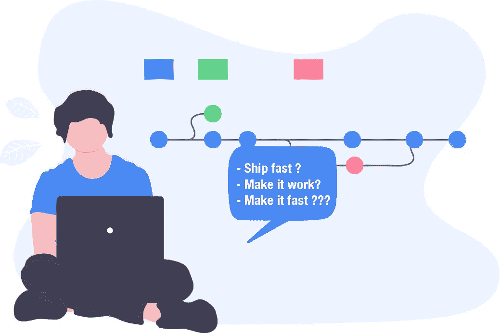
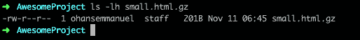
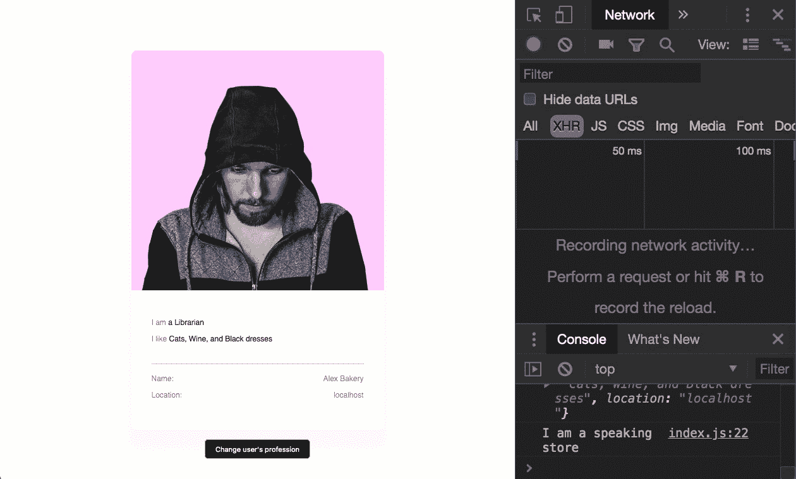
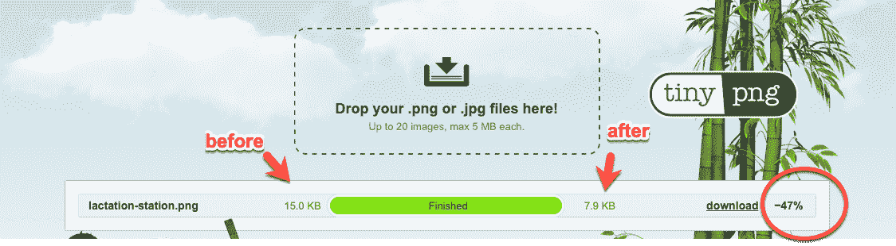
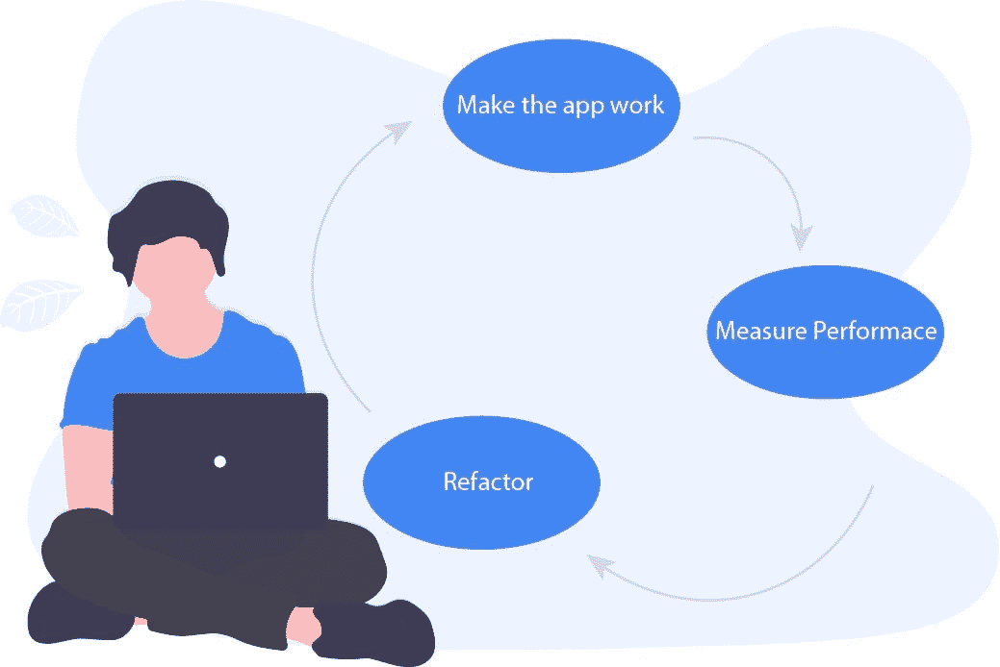
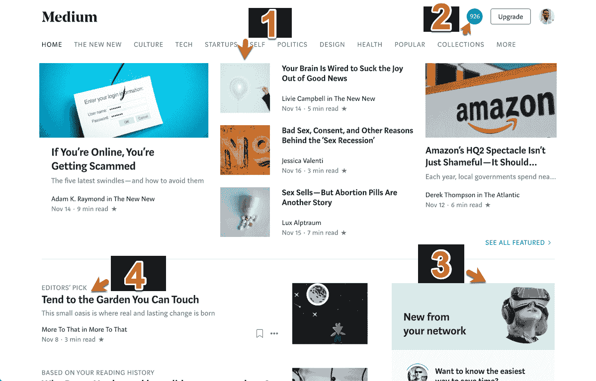
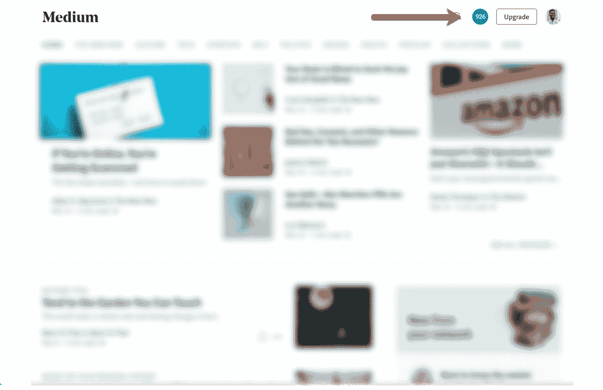
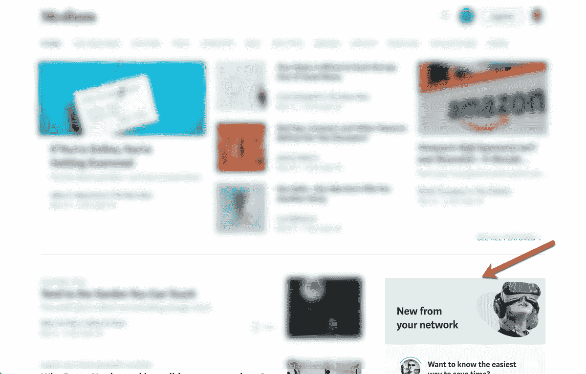

# 如何让任何网站更快

> 原文：<https://blog.logrocket.com/how-to-make-any-website-faster-65111ced2923/>


#### 介绍

几年前，当我开始接触编程时，我真的对我可以抓住的无限机会感到兴奋。

当我那时开发网站的时候，我记得它们没有我今天构建的网络“应用程序”做得多。


*The web can do that. More features, please.*

如今，网络做得更多，其功能超出了之前的预期。

而且这还没有结束。

现在，大多数网络应用程序都在移动设备上使用，连接速度慢且不可靠，而且可以从世界上任何一个国家访问。从尼日利亚到印度。


作为一个生活在尼日利亚的人，一个第三世界国家，为她的人民开发产品，确保我开发的应用程序是快速的并不是一种奢侈。这不是什么技术幻想。这是我每天都要面对的现实。

现在，我不再只考虑如何建立网页，我也关心如何让网页更快。

你知道吗？



Ship fast, make it work, make it fast?

多沉重的负担啊。

你看，我分享的故事不仅仅是我要讲的。大多数 web 开发人员会告诉你同样的事情。

大多数人从构建能够正常工作的应用程序开始他们的职业生涯，然后他们开始关心如何让它们变得更快。

这种关注催生了 web 性能领域。

* * *

Web 性能非常重要。事实上，你网站的表现可以决定你是继续经营还是赔钱。

那么，如何构建持续快速运行的 web 应用程序呢？

这是有答案的！

在这篇文章中，我将提供一些你可以马上使用的技巧，让任何一个网站都变得更快。不管它是建立在什么技术之上的，都有让*任何*网站快速运行的普遍原则。

> 免责声明:您不必应用我在这里讨论的每一种技术。无论你选择应用哪一个，都一定会提高你网站的速度——这是必然的。此外，web 性能是一个广阔的领域——我不可能解释所有的技术。但是，我相信我已经很好地提炼了它们。

如果你准备好了，我也准备好了！

#### 这篇文章的结构

本文中的所有技术都用简单易懂的语言进行了解释。然而，为了吸引不同技能水平的工程师，我将这些技术分成了三个不同的部分——初级、中级和高级技术。

你会在下面找到相应的标题。

* * *

### 更多来自 LogRocket 的精彩文章:

* * *

如果您是 web 性能的新手，或者很难真正理解 web 性能是如何工作的，那么您肯定应该从第一组技术开始。

对于中级和高级开发人员，我有一些有趣的考虑。随意浏览你熟悉的技术。

### 初级技术

这不是一个问题，以新的艺术来改善您的网站的性能。其实大家都是从初学者开始的！

不管你的技能水平如何，都有一些简单的技巧你可以马上尝试——对你网站的加载速度有显著的影响。

首先，让我解释一下您应该如何看待 web 性能。

#### 作为初学者如何看待 web 性能

为了让你的网络应用更快，你必须理解每次用户访问你的网站时不断发生的“对话”。

每当用户访问您的网站时，他们都会向您的服务器请求某些资源，例如用于您的 web 应用程序的`HTML`、`CSS`和`JS`文件。


Assets required from your server

你就像一个厨师，要为很多饥饿的人服务。

作为一名厨师，你必须关心你给每个人提供多少食物。如果你端的太多，他们的盘子会满满的溢出来。

你还必须注意你端食物的方式。如果你做得不对，你会把食物洒得到处都是。

最后，你必须关心你提供的是什么食物。这食物加香料了吗？盐太多了？

要想在构建高性能的 web 应用程序方面取得成功，您必须学会成为一名优秀的厨师。

你必须关心**你发送给用户多少**资产、**你如何发送**这些资产、**这些资产被“烹饪”得有多好**。

如果这听起来含糊不清，它真的很简单。让我们从学习减少发送给用户的资产数量的技巧开始。

#### 1.消除不必要的资源，并保持残忍

大多数应用程序都很臃肿，因为其中有太多“无用”的代码。这些被更恰当地称为*不必要的资源*。例如，您可能不需要所有的 jQuery，只是因为您想要查询 DOM。移除 jQuery，并使用浏览器特定的 API，如`document.querySelector`

另一个很好的例子是，如果你真的不需要 Bootstrap，那就不要放在那里。CSS 本身是一个[渲染阻塞资源](https://blog.logrocket.com/how-browser-rendering-works-behind-the-scenes-6782b0e8fb10?source=user_profile---------6------------------&gi=b21b157832e8)，引导模块会让你下载很多你可能最终不会用到的 CSS。拥抱 [Flexbox 和 CSS 网格](https://medium.com/flexbox-and-grids)进行布局。尽可能使用好的旧 CSS。

问自己的问题是:

(I)资源是否真的提供了如此多的价值？例如，我并不总是使用 Bootstrap，尽管我写了一份关于这个主题的详尽指南。

(ii)我是否可以使用相同的资源，但将其分解为我正在使用的确切模块？例如，您可以导入一个[子集](https://stackoverflow.com/questions/35250500/correct-way-to-import-lodash)，而不是导入整个`Lodash`包。

(iii)我可以一起替换资源吗？例如，只需移除`JQuery`并使用特定于浏览器的 API 来查询 DOM。

这些问题可能会继续下去，但前提是不变的。列出你的网络应用的资源清单，确定它们是否提供了足够的价值，并痛苦地坦诚它是如何影响你的网站性能的。

#### 2.永远缩减你的资产

即使在去除了应用程序中不必要的资源之后，还是会有一些资源是你不可或缺的。一个很好的例子就是你 app 的一些文本内容，即`HTML`、`CSS`和`JS`。

消除你网站上所有的`HTML`、`CSS`和`JS`会让你的网站不存在。那不是要走的路线。不过，我们还是可以做点什么。

考虑下面显示的简单的`HTML`文档:

```
<!DOCTYPE html>
<html lang="en">
<head>
  <!-- comment: this is some important meta stuff here -->
  <meta charset="UTF-8">
  <meta name="viewport" content="width=device-width, initial-scale=1.0">
  <meta http-equiv="X-UA-Compatible" content="ie=edge">
  <title>Document</title>
</head>
<body>
  <!-- Note to self 3 weeks from now: Here's the body -->
</body>
</html>
```

本文档包含注释、有效的`HTML`字符、适当的缩进和间距以适应可读性。

将上面的文档与下面的缩略版本进行比较:

```
<!DOCTYPE html><html lang="en"><head> <meta charset="UTF-8"> <meta name="viewport" content="width=device-width, initial-scale=1.0"> <meta http-equiv="X-UA-Compatible" content="ie=edge"> <title>Document</title></head><body> </body></html>
```

您可能已经注意到，文档的缩小版去掉了注释和空格。你看起来不可读，但计算机可以阅读和理解这个。

简单来说，缩小意味着在不改变文本用途的情况下，删除文本中的空白和不必要的字符。

作为一个经验法则，你的生产应用应该总是把它们的`HTML`、`CSS`和`JS`文件缩小。全部都是。

在这个虚构的例子中，缩小的`HTML`文档是 263 字节，未缩小的版本是 367 字节。文件大小减少了 28%!

你可以想象这对一个拥有许多不同文件的大型项目的影响——这些文件有`HTML`、`CSS`和`JS`。

对于这个例子，我使用了一个简单的[基于网络的迷你器](https://www.willpeavy.com/minifier/)。然而，对于一个足够大的应用程序来说，这是一个繁琐的过程。那么，这个过程可以自动化吗？

耶！绝对的。

如果你曾经用`React`或`Vue`(或者任何其他现代前端框架)构建过一个应用程序，你很可能会在他们的配置/设置工具中内置一个构建发布周期，比如`create-react-app`和`vue-cli`。

这些工具会自动为你处理文件缩小。如果你正在从头开始建立一个新项目，你应该考虑使用一个现代的构建工具，比如 [Webpack](https://webpack.js.org) 或者 [Parcel](https://parceljs.org) 。

你的`HTML`、`CSS`或`JS`中的每一个角色都必须从服务器下载到浏览器中，这可不是一件小事。通过缩小你的`HTML`、`CSS`和`JS`，你已经减少了下载这些资源的开销。

这是一个好厨师会做的。

#### 3.通过 Gzip 进一步压缩文本资源

你已经做了一件很棒的工作，在你的网络应用程序(`HTML`、`CSS`和`JS`)中缩小你的文本内容

缩减资源后，让我们假设您继续将应用程序部署到某个服务器上。

当用户访问您的应用程序时，他们从服务器请求这些资源，服务器响应，并开始下载到浏览器。

如果在整个过程中，服务器可以在向客户机发送资源之前执行更多的压缩，那会怎么样呢？

这就是`Gzip`的用武之地。

奇怪的名字，是吧？

我第一次听到`Gzip`这个词的时候，似乎除了我，每个人都知道它的意思。

简单来说，`Gzip`指的是最初为 GNU 项目编写的数据压缩程序。同样，你可以通过一个在线程序或一个现代捆绑包，如`Wepback`或`Rollup`，`Gzip`来缩小资产，这也是一个数据压缩程序。

值得注意的是，即使是缩小的文件也可以通过`Gzip`进一步压缩。记住这一点很重要。

如果您想亲自查看，请将以下内容复制、粘贴并保存到名为`small.html`的文件中

```
<!DOCTYPE html><html lang="en"><head> <meta charset="UTF-8"> <meta name="viewport" content="width=device-width, initial-scale=1.0"> <meta http-equiv="X-UA-Compatible" content="ie=edge"> <title>Document</title></head><body> </body></html>
```

这代表了我们一直在处理的缩小的`HTML`文档。

打开您的终端，将工作目录切换到`small.html`文档所在的位置，然后运行以下命令:

```
gzip small.html
```

如果你用的是 Mac，这个`gzip`程序会自动安装在你的电脑上。

如果你做的正确，现在你会有一个名为`small.html.gz`的压缩文件

如果您想知道通过`Gzip`进一步压缩我们节省了多少数据，请运行以下命令:

```
ls -lh small.html.gz
```

这将显示文件的详细信息，包括其大小。



这个文件现在大小为 201 字节！

让我正确地看待这件事。我们已经从 **367** 字节发展到 **263** 字节，现在 **201** 字节。

这比已经缩小的文件又减少了 24%。事实上，如果你考虑到文件的原始大小(缩小前)，我们已经达到了超过 45%的大小减少。

对于较大的文件，`gzip`可以实现高达 70%的压缩！

下一个逻辑问题是，我如何在服务器上设置一个`gzip`压缩？

如果您是一名前端工程师，在部署您的前端应用程序时，您可以设置一个简单的 node/express 服务器来服务您的客户端文件。

对于一个 express 应用程序，使用`gzip`压缩只需要两行代码:

```
const compression = require('compression');
const app = express();
app.use(compression());
```

不管怎样，`compression`模块是来自 express 后面的同一个团队的[包](https://github.com/expressjs/compression)。

不管你的服务器设置如何，一个简单的谷歌搜索“如何在 XXX 服务器上通过 gzip 压缩”将会把你引向正确的方向。

值得一提的是，并不是所有的资源都值得被 gzip。对于文本内容，如`HTML`、`CSS`和`JS`文档，您将获得最佳结果。

如果用户在现代浏览器上，浏览器会在下载后自动解压缩 gzipped 文件。所以，你不用担心这个。我发现这个[很有启发性，所以如果你想知道答案的话。](https://stackoverflow.com/questions/32172704/is-gzip-automatically-decompressed-by-browser)

记住，通过 Gzip 在服务器上缩小和进一步压缩你的文本内容是很棒的。明白了吗？

#### 4.优雅地处理图像。

图像的问题在于它们占据了大量的视觉空间。如果一个图像坏了，或者不能快速加载，这通常是很明显的。更不用说图片也是网页上下载量最大的部分了。不注意形象优化几乎是一种犯罪。

那么，你能做些什么来优化你的形象呢？

#### (a)完全删除图像？

如果你所寻求的效果可以通过使用 CSS 效果来实现，比如渐变和阴影，你应该明确地考虑不要使用图像来实现这样的效果。您可以在 CSS 中用图像文件所需的一小部分字节完成同样的事情。

#### (b)选择正确的图像类型

这可能很棘手，但随着时间的推移，你会习惯于更快地做出决定。如果你需要插图，几何形状等。无论如何，您应该选择一个 SVG。对于其他一切，光栅图形是你最好的选择。

即使光栅图形也有许多不同的风格。GIF，PNG，JPEG，WebP？

如果您需要 PNG 提供的透明度，请选择它，否则，同一图像文件的大多数 JPEGs 往往会比 PNG 文件小。好吧，你知道什么时候你需要 gif，但是有一个问题，你将在下面看到。

#### (d)用视频取代 gif

我建过一些网站，在这些网站上，为动画内容和小视频放一张 GIF 图片要容易得多。尽管很方便，但问题是 gif 文件的尺寸通常比视频文件要大。有时候要大很多！

这不是一条永远正确的铁定规则。

例如，下面是我曾经制作的一个截屏:



GIF 的大小是 2.2mb。然而，将截屏导出为视频会产生同样大小的文件，2.2mb！

根据 GIF 的质量、帧速率和长度，你必须自己测试。

要将 GIF 转换成视频，你可以使用一个在线转换器或者用一个 T2 CLI 解决方案。

#### (e)压缩所有图像

请记住，图像占用了大量的互联网带宽——主要是因为它们的文件大小。图像压缩可能还需要 15 分钟才能真正解释清楚，我怀疑你会等得够久。

Addy Osmani 提供的[图片指南](https://images.guide)是一个很好的资源。然而，如果你不想在这方面花太多心思，你可以使用在线工具，比如 [TinyPNG](https://tinypng.com) 来压缩你的光栅图像。对于 SVG，考虑从命令行使用 [SVGO](https://github.com/svg/svgo) ，或者 web 界面，Jake Archibald 的 [SVGOMG](https://jakearchibald.github.io/svgomg/) 。

这些工具将保留您的图像质量，但大大减少了它们的大小！



TinyPNG is use here.

#### (e)提供合适的图像尺寸

如果您为计算机和较小的设备提供相同的超大图像，这就是性能漏洞！一个更容易理解的例子是从服务器加载一个大图片作为缩略图。这几乎没有任何意义。

在大多数情况下，您可以通过使用`HTML`图像`srcset`和`sizes`属性来避免这种情况。

首先，让我给你看看我们正在努力解决的问题。`img`元素的默认用法如下:

```

```

`img`标签具有`src`和`alt`属性。`src`指向宽度为`800px`的单幅图像。这意味着，移动设备和更大的屏幕都将使用相同的大图像。你会同意这不是最有效的解决方案。

但是，请考虑以下情况:

```

```

你能理解吗？

嗯，`srcset`就像一个可供浏览器选择的图像大小的桶。`srcset`值是一个用逗号分隔的字符串。

`sizes`是决定选项桶中哪个图像分配给哪个设备尺寸的属性。

例如，`sizes`值中的初始声明为，*如果设备宽度为 320px 或更小，则使用宽度最接近 280px 的任何图像，即检查我们的选项桶*

这很容易推理。通常，较小的图像意味着图像的尺寸较小。这意味着用户在较小的屏幕上使用较小的带宽。每个人都赢了。

如果作为一个初学者，你应用了这些原则，你一定会拥有一个比以前更快的 web 应用程序。Web 性能是一个不断变化的目标。不要让你对题目的了解到此为止。如果你对更多的技术感兴趣，请看下面我分享的中级技术。

### 中间技术

作为一名中级开发人员，我认为你对一些基本的 web 性能技术有经验。那么，你能做些什么来让你的知识更上一层楼呢？

#### 作为一个中级开发人员如何看待 web 性能

当你不再是一个制作更快的 web 应用程序的新手时，你对 web 性能的心态就会改变。

以下是一些需要考虑的事项:

#### 1.加载速度快是好事。越快越好。

人们普遍认为，用户花费大部分时间等待网站对他们的输入做出响应，而不是等待网站加载，但这还不是全部。

我的观点是:用户会等待你的网站加载，但是如果你的网站在初次加载后运行缓慢，他们就没有耐心了。

那是有争议的，不是吗？

我在可怕的网络连接上浏览过互联网。我见过加载网站需要几十秒钟。这已经没什么大不了的了。我会等的。然而，当你的网站加载时，我希望它能“快速工作”。那对我来说是交易的破坏者。

不要误解我。对于你的网络应用来说，快速加载是非常重要的，但是，我的观点仍然成立。从心理学上来说，当你的网页加载时，用户会比实际使用你的网站时更加关注你。用户希望你的网站能够流畅地互动。

在你开发思维的某个地方，开始考虑不仅要让你的 web 应用加载得更快，还要让你的工作和感觉更快。

#### 2.测试驱动性能，赢得胜利

在测试驱动的性能中，不像 TDD，你不“写测试”。该过程如下图所示。



The test driven performance cycle

当构建 web 应用程序时，通常我会对我正在做的任何项目执行“通用”性能技术，但会测量*实际用户性能*以找到特定的瓶颈，因为所有的 web 应用程序本质上都是不同的。

那么，如何最好地衡量绩效呢？

当你第一次开始测量性能时，你最好的选择是使用一些工具，比如 Chrome dev 工具。这很好，直到您选择从真实世界的用户那里获取更加多样和精确的度量。

以下是我对此的看法。

初学者通常会在开发应用程序时测量性能。他们将借助现有的浏览器开发工具(如 Chrome DevTools)来完成这项工作。

中级开发人员明白，仅仅在他们的计算机上测量性能并不能完全代表实际用户感受到的性能，因此他们通过进行**实际用户测量**将事情做得更好。

要做到这一点有点棘手，但概念很简单。

您可以编写一个应用程序附带的测量脚本。当用户加载你的网页时，脚本开始读取某些测量指标，并将它们发送到分析服务，如谷歌分析(GA)。它不一定是 GA——但是 GA 是一个非常受欢迎的选择。

关于如何测量真实用户的性能指标的实际例子，请查看这个 [Google CodeLab](https://codelabs.developers.google.com/codelabs/performance-analytics/index.html?index=..%2F..%2Findex#0) 。

在您的分析服务器上，您将看到来自不同地区的多个用户在不同的网络条件和不同的计算机处理能力下的分布式性能测量。这就是真实用户测量非常强大的原因。

应用程序的加载时间是不同用户在不同条件下的加载时间的总和。永远记住这一点。

#### 3.游戏心理学和感知速度目标

用户是人类，人类往往有一些共同的行为。有趣的是，对这些行为的了解有助于你构建更能引起人类共鸣的应用。

“人类”的说法已经说得够多了，下面是我的意思的一个例子。

你有没有想过为什么很多电梯都有镜子？仔细想想这个。

我想到的是，它们允许人们在 30 层以上的楼层上旅行，而不会感觉到他们已经等了很久！

同样的事情也可以在网上进行。当你的目标是感知速度时，你可以让你的网站“看起来”加载得更快！

在这样做的时候，一定要记住实际速度仍然很重要。

可以尝试的一些技巧包括:

#### (一)懒加载内容


[Source](https://blog.iamsuleiman.com/stop-using-loading-spinner-theres-something-better/)

就像 Medium lazy 加载图像一样，lazy 加载图像的症结(作为一个例子)是首先在页面上显示一个占位符图像。当这个图像加载时，它以不同的阶段显示，从模糊到清晰。类似的概念可以用于文本内容，而不仅仅是图像。

#### (b)当用户导航到一个页面时，他们正在寻找视觉反馈。给他们一个！

一种常见的技术是尽快向用户显示页面中最重要的部分。一旦他们导航到一个页面，向他们展示一些东西——最好是有用的东西。如果你做得好，用户可能几秒钟都不会注意到页面的其余部分。

通常所做的是在页面上显示最顶端的可见内容，即用户设备的初始视窗上的内容。这可以更好地描述为*之上的*内容。

此时不会加载文件夹下的内容。然而，您已经快速地向用户提供了重要的信息。这就引出了下一个技巧。

#### 优先考虑上面的内容

如果你要首先向用户展示上面的内容，那么你就必须对内容进行优先排序。

通常所做的是在你的`HTML`文档中嵌入上面的内容。这样就不需要服务器往返。如果你使用像[盖茨比](https://www.gatsbyjs.org)这样的静态网站生成器来开发静态网站，那么你是幸运的，因为它们有助于自动化这个过程。如果你选择自己做这件事，你需要考虑优化上面的内容(文本或图形)，例如通过缩小，同时选择一个工具[自动化过程](https://github.com/addyosmani/critical)。

### 先进的技术

你已经阅读了文档，有了多年的经验，你非常自信你可以快速制作任何网站。

太棒了。

#### 作为一名高级开发人员，如何看待 web 性能

作为一名高级开发人员，大多数性能技术都不会让您感到困惑。你知道它们是如何工作的，以及它们为什么重要。

即使在这个层面上，我也有一些有趣的想法给你。

#### 如果我们都错了呢？

考虑一下我们都是如何对待加载性能的。用户在非常慢的网络上访问您的 web 应用程序，而不是让他们痛苦地一次接收所有字节的资源，您首先显示页面最重要的部分。

实现这一点的技术包括优先考虑页面上的折叠内容，并使第一次有意义的绘画计数。

这很棒，也很有效——就目前而言，但并非没有瑕疵。

这里的问题是，我们已经(在很大程度上)假设了页面上向用户展示的最重要的部分(尽管他们可怜的互联网很糟糕，或者为什么他们在低端 CPU 机器上)是上面的内容。

这是一个假设，但它有多真实呢？

大多数时候这可能是真的，但是假设本身就有缺陷。

让我给你举一个我如何使用 Medium 的例子。

首先，我每天都访问 Medium。它就在我最常访问的网站中。


My list of frequently visited sites. See Medium?

每次我访问 medium，我都会访问位于[*【www.medium.com】*的主页。](http://www.medium.com.)

所以，这就是当你用慢速连接访问时会发生的情况。


Medium loading…

他们确实采取了值得称赞的性能措施来确保加载时间不会永远拖延。

如果你没有注意到，这里是他们在主页上逐渐呈现内容的实际顺序。



The order in which content is loaded. Note that this order isn’t always the same. For the most part, 1 and 2 get loaded before any other content

正如所料，上面的内容优先。最初的文章集是媒体成员预览，然后我的通知计数出现，然后来自我的网络的新文章被呈现，最后是由编辑挑选的文章。

那么，这种看似完美的渐进式渲染有什么坏处呢？

主要问题是，呈现这些项目的顺序是如何确定的？充其量这是基于研究“大多数”用户的假设。这不是一个个人的解决方案，只是另一个通用的解决方案吗？

如果有任何想法被用来研究实际的日常行为，那么随着时间的推移，其中的一些就会变得显而易见:

#### 1.我从不在主页上阅读我的通知



我收到很多通知。我不可能坐着看完成百上千的通知。我相信重要的通知会发到我的邮箱里，我只回复那些。我唯一一次点击通知徽章是为了去掉那里的任何数字。所以它又从零开始计数。

虽然这个放在折叠上方，但对我来说真的不重要。

#### 2.我几乎从不阅读会员专用的预览版文章


这是我看到的第一个内容(在一个超级慢的网络上),但我几乎从来没有看过。

你会问为什么？

我写和读了很多媒体的文章。当 Medium 开始允许作者在平台上付费时，我试着注册了，但我办不到。这与我的国家没有被这个项目接受有关。所以，我放弃了。

当时，我想如果他们不让我作为作者获得报酬，为什么他们会让我付钱给他们成为高级读者呢？

这就是我不是高级媒体用户的原因。如果他们解决了这个问题，我会考虑订阅。出于这个原因，我一个月不能阅读超过 3 篇仅限会员的文章(除非我以匿名浏览模式打开它们)。

随着时间的推移，我已经训练我的眼睛和头脑去阅读主页顶部吸引人的标题，并且完全忽略它们。

以上内容对我来说不是最有用的。

#### 3.我总是从我的网络上阅读新文章

几乎最后呈现的内容似乎是我几乎每次点击主页都要寻找的内容。我想知道我的网络有什么新消息。我浏览并阅读了至少一篇有趣的文章。



本质上，对我有意义的内容恰好是最后出现的。言外之意是，除了发出视觉反馈信号之外，第一幅有意义的画对我来说没什么用。

这种行为在手机上更加糟糕。加载时第一个充满整个屏幕的内容对我来说并不重要，我必须向下滚动才能找到来自我的网络的新文章——对我来说有意义的实际资源。

#### 那么，我们能弥补吗？

每个问题都有解决方法。这只是我的一个想法，我正在努力实现它。问题的关键有点简单。有必要进一步应用机器学习，而不仅仅是个性化用户故事、反馈和建议。我们还可以提高网络性能。

作为一个用户，我更希望第一幅有意义的画能够个性化，真正有价值。个性化展示对我来说最重要的东西。是的，我。不是一般的结果。

如果你和我一样，对新的主题有很多疑问，我会回答你对这个提议的方法的一些担忧。

#### 我们目前优化折叠以上内容的方法有什么优点？

我们目前的解决方案(如 Medium 的)优化折叠以上的内容是伟大的。确实有效。

用户只需等待几秒钟，但与此同时，他们会得到内容正在加载的视觉提示。这已经够好了，但是它很棒吗？这是我们作为一个社区所能做的最好的事情吗？

#### 额外的技术责任值得吗？

如果采用一种个性化的方法来绘制第一幅有意义的画，并优化上面的内容，这将是一个技术责任太大而收益太少的问题吗？

也许不是。那么值得吗？

是的，从用户的角度来看。尤其是如果你服务于全球用户群，用户遍布世界各地，而不仅仅是那些人们吹嘘拥有高速互联网的地区。

你最终将获得个性化的表现——这种“产品”非常了解我的感觉。

这也为更好的性能技术打开了大门，比如在用户发起请求之前准确地预加载和预取资源。基于用户的重复使用，你现在可以使用机器学习做出近乎准确的决定。

#### 我对高级开发人员的结论

我确实认为作为一个社区，我们在 web 性能方面做得很好。我认为也有改进的余地。我也认为我们需要这样思考才能得到真正进步的结果。

未来 5 年、10 年，网络性能会是怎样的？变味还是更好？

不管你的技术水平如何，去开发快速的 web 应用程序吧。

## 使用 [LogRocket](https://lp.logrocket.com/blg/signup) 消除传统错误报告的干扰

[](https://lp.logrocket.com/blg/signup)

[LogRocket](https://lp.logrocket.com/blg/signup) 是一个数字体验分析解决方案，它可以保护您免受数百个假阳性错误警报的影响，只针对几个真正重要的项目。LogRocket 会告诉您应用程序中实际影响用户的最具影响力的 bug 和 UX 问题。

然后，使用具有深层技术遥测的会话重放来确切地查看用户看到了什么以及是什么导致了问题，就像你在他们身后看一样。

LogRocket 自动聚合客户端错误、JS 异常、前端性能指标和用户交互。然后 LogRocket 使用机器学习来告诉你哪些问题正在影响大多数用户，并提供你需要修复它的上下文。

关注重要的 bug—[今天就试试 LogRocket】。](https://lp.logrocket.com/blg/signup-issue-free)

* * *