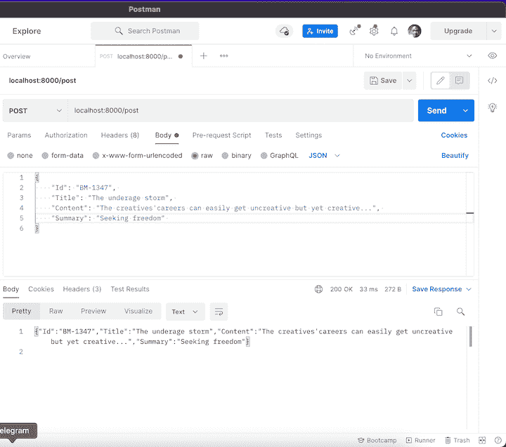

# 如何在 Go - LogRocket 博客中用 JSON 主体发出 HTTP POST 请求

> 原文：<https://blog.logrocket.com/how-to-make-http-post-request-with-json-body-in-go/>

Go 是一种开源编程语言，旨在构建简单、快速、可靠的 web 应用程序。从基本的 web 编程，比如路由器和模板，到中间件和 WebSockets，CLIs 和数据库，你可以使用 Go，有时也称为 Golang，来创建你需要的后端 web 服务。

在本教程中，我们将演示如何将数据从其在 JSON 中的原始状态(原始字符串或字节)转换为 Golang 的数据类型，包括结构化类型(例如，结构、数组和切片)和非结构化类型(例如，地图)。

一旦我们建立了这个知识，我们将通过发送一个带有 JSON 主体的 HTTP POST 请求到一个简单的 web 服务器来应用它，我们稍后将设置这个服务器。

我们将通过实际例子介绍以下内容:

## 在 Go 中解组 JSON 数据

将原始 JSON 数据转换成 Go 对象的过程称为解组。Go 的 [JSON 标准库](https://pkg.go.dev/encoding/json)提供了`Unmarshal`函数，使您能够解析以`[]byte`变量形式的原始 JSON 数据。

JSON 是一种独立于语言的数据格式。Go 在标准库中提供了一个内置的编码/JSON 包来执行与 JSON 相关的操作。

创建一个`./main.go`文件；我们将在其中编写本教程所需的所有源代码。然后，用以下代码更新它:

```
package main

type Article struct {
  Id string 
  Title string
  Content string
  Summary string
}

article := `{"id": "BM-1347", "title": "The underage storm", "Content": "The creatives' careers can easily get uncreative but yet creative...", "Summary": "Seeking freedom"}`

...

```

在上面的代码片段中，我们创建了一个结构数据类型，struct **，**，它镜像了我们想要解析的数据。在我们的例子中，我们创建了一个有四个属性的`Article`结构:`Id`、`Title`、`Content`和`Summary`。

现在，让我们将原始 JSON 数据转换成 Go 数据类型，如下所示:

```
...

import (
  "encoding/json"
  "fmt"
)
...

func main {
  var post Article        
  json.Unmarshal([]byte(article), &post)

  fmt.Printf("Recently posted article: %s", post)
}

```

现在，使用`go run`命令在终端上运行这个文件:

```
$ go run main.go
// Recently posted article: {BM-1347 The underage storm The creatives' careers can easily get uncreative but yet creative... Seeking freedom}

```

## 在 Go 中编组 JSON 数据

在 Go 中，编组与解组正好相反。`encoding/json`包也有`json.Unmarshal()`方法，用于将 s struct 转换成 JSON。

```
...
func main {
  ...
  newData, err := json.Marshal(post)

  if err != nil {
    fmt.Println(err)
  } else {
    fmt.Println(string(newData))
  }
}

```

使用`go run`命令运行上述代码，在终端上获得以下输出:

```
$ go run main.go
// {"Id":"BM-1347","Title":"The underage storm","Content":"The creatives' careers can easily get uncreative but yet creative...","Summary":"Seeking freedom"}

```

## 使用 gorilla/mux 设置 web 服务器

在我们的演示中，让我们设置一个非常简单的服务器来处理传入的 HTTP 请求。然后，我们将在函数旁边定义一个路由来处理 POST 请求。

我们将定义一个`createNewArticle`函数来处理对`localhost:8000/post` URL 的所有传入请求。当一个请求命中这个 URL 路径时，`handleReqs`函数将触发`createNewArticle`函数。

```
...
import (
  "encoding/json"
  "fmt"
  "io/ioutil"
  "log"
  "net/http"

  "github.com/gorilla/mux"
)

type Article struct {
  Id string `json:"Id"`
  Title string `json:"Title"`
  Content string `json:"Content"`
  Summary string `json:"Summary"`
}

...

func createNewArticle(w http.ResponseWriter, r *http.Request) {
  reqBody, _ := ioutil.ReadAll(r.Body)
  var post Article 
  json.Unmarshal(reqBody, &post)

  json.NewEncoder(w).Encode(post)

  newData, err := json.Marshal(post)
  if err != nil {
    fmt.Println(err)
  } else {
    fmt.Println(string(newData))
  }
}

func handleReqs() {
  r := mux.NewRouter().StrictSlash(true)
  r.HandleFunc("/post", createNewArticle).Methods("POST")

  log.Fatal(http.ListenAndServe(":8000", r))
}

func main() {
  handleReqs();
}

```

上面的代码代表了向服务器发出 HTTP POST 请求所需的全部源代码。在`Article`结构中使用的语法`json:"Id"`明确地告诉我们的代码哪个 JSON 属性映射到哪个属性。

接下来，我们定义`createNewArticle`函数。这里，我们使用`r.Body`来访问附加到请求主体的数据。然后，我们将它存储在`reqBody`变量中。使用`json.Unmarshal`，我们将传入的 JSON 数据解析成 Go 类型。

接下来，在`handleReqs`函数中，我们使用 [gorilla/mux](https://github.com/gorilla/mux) 库来定义一个新的路由器。有了这个新的路由器，我们可以在`handleReqs`功能中将`r.HandleFunc("/post", createNewArticle).Methods("POST")`这样的路由添加到我们的 web 服务器中。

我们将把`.Methods("POST")`添加到我们的路由的末尾，以指定当传入的请求是一个`HTTP POST`请求时，我们只想调用`createNewArticle`函数。

确保运行`go mod init`和`go mod tidy`命令来设置和安装 gorilla/mux 包。

对于本教程，我们将使用 [Postman](https://www.postman.com/) 向我们的应用程序发出 HTTP POST 请求。这样，我们可以确保一切都处于最佳状态。

使用以下命令启动服务器:

```
go run main.go

```

然后打开 Postman，向 localhost:8000/post 发出 HTTP POST 请求，如下图:



一旦我们成功地向服务器发出 HTTP POST 请求，我们就可以检查本地终端，查看通过请求体传递的数据的输出，这些数据已经成功地转换回 JSON 数据。

## 结论

本教程提供了使用 Go 构建一个简单的 web 服务器的基本步骤。我们还讨论了 Go 中的解组和编组的概念。然后，我们通过一个简单的过程来设置和向服务器发出 HTTP POST 请求。

在一个真实的项目中，您通常会将您的服务器连接到一个数据库，这样您就可以[发出 CRUD 请求](https://blog.logrocket.com/crud-golang-cockroachdb/)来返回对您的应用程序很重要的实数值。

本教程的源代码可以在 [GitHub](https://github.com/IkehAkinyemi/http-post-go) 上获得。

## 使用 [LogRocket](https://lp.logrocket.com/blg/signup) 消除传统错误报告的干扰

[](https://lp.logrocket.com/blg/signup)

[LogRocket](https://lp.logrocket.com/blg/signup) 是一个数字体验分析解决方案，它可以保护您免受数百个假阳性错误警报的影响，只针对几个真正重要的项目。LogRocket 会告诉您应用程序中实际影响用户的最具影响力的 bug 和 UX 问题。

然后，使用具有深层技术遥测的会话重放来确切地查看用户看到了什么以及是什么导致了问题，就像你在他们身后看一样。

LogRocket 自动聚合客户端错误、JS 异常、前端性能指标和用户交互。然后 LogRocket 使用机器学习来告诉你哪些问题正在影响大多数用户，并提供你需要修复它的上下文。

关注重要的 bug—[今天就试试 LogRocket】。](https://lp.logrocket.com/blg/signup-issue-free)