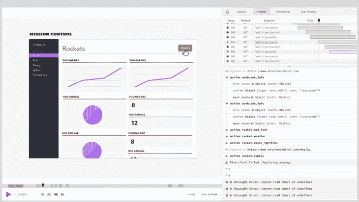

# 如何用 Axios - LogRocket Blog 发出 HTTP 请求

> 原文：<https://blog.logrocket.com/how-to-make-http-requests-like-a-pro-with-axios/>

***编者按**:这篇 Axios 教程最后一次更新是在 2021 年 1 月 26 日。*

[Axios](https://github.com/axios/axios) 是基于浏览器提供的`XMLHttpRequest`接口的客户端 HTTP API。

在本教程中，我们将通过清晰的示例演示如何使用 Axios 发出 HTTP 请求，包括如何使用`axios.post()`发出 Axios POST 请求，如何使用`axios.all()`同时发送多个请求，等等。

我们将详细介绍以下内容:

如果你更喜欢视觉学习，看看下面的视频教程:

 [https://www.youtube.com/embed/rzGGK7BHCAA?version=3&rel=1&showsearch=0&showinfo=1&iv_load_policy=1&fs=1&hl=en-US&autohide=2&wmode=transparent](https://www.youtube.com/embed/rzGGK7BHCAA?version=3&rel=1&showsearch=0&showinfo=1&iv_load_policy=1&fs=1&hl=en-US&autohide=2&wmode=transparent)

视频

## 为什么要用 Axios？

前端程序与服务器通信的最常见方式是通过 HTTP 协议。您可能熟悉[获取 API](https://blog.logrocket.com/axios-or-fetch-api/) 和`XMLHttpRequest`接口，它允许您获取资源并发出 HTTP 请求。

如果您使用的是 JavaScript 库，那么它很可能附带了一个客户端 HTTP API。例如，jQuery 的`$.ajax()`函数特别受前端开发人员的欢迎。但是，随着开发人员放弃这种库，转而支持本地 API，专用的 HTTP 客户机出现了，填补了这一空白。

和 Fetch 一样，Axios 也是基于承诺的。但是，它提供了更强大、更灵活的特性集。

与原生获取 API 相比，使用 Axios 的优势包括:

*   请求和响应拦截
*   简化的错误处理
*   XSRF 防护
*   支持上传进度
*   响应超时
*   取消请求的能力
*   对旧浏览器的支持
*   自动 JSON 数据转换

## 安装 Axios

您可以使用以下工具安装 Axios:

## 如何提出 Axios POST 请求

发出 HTTP 请求就像将 config 对象传递给 Axios 函数一样简单。您可以使用 Axios 发出 POST 请求，将数据“发布”到给定的端点并触发事件。

要在 Axios 中执行 HTTP POST 请求，调用`axios.post()`。

在 Axios 中发出 POST 请求需要两个参数:服务端点的 URI 和一个包含要发送给服务器的属性的对象。

对于一个简单的 Axios POST 请求，对象必须有一个`url`属性。如果没有提供方法，`GET`将被用作默认值。

让我们看一个简单的 Axios POST 示例:

```
// send a POST request
axios({
  method: 'post',
  url: '/login',
  data: {
    firstName: 'Finn',
    lastName: 'Williams'
  }
});
```

这对那些使用过 [jQuery 的](https://blog.logrocket.com/the-history-and-legacy-of-jquery/) `$.ajax`函数的人来说应该很熟悉。这段代码只是指示 Axios 向`/login`发送一个 POST 请求，将一个键/值对对象作为其数据。Axios 会自动将数据转换成 JSON，并作为请求体发送。

## Axios HTTP 请求的简化方法

Axios 还为执行不同类型的请求提供了一套简化方法。这些方法如下:

*   `axios.request(config)`
*   `axios.get(url[, config])`
*   `axios.delete(url[, config])`
*   `axios.head(url[, config])`
*   `axios.options(url[, config])`
*   `axios.post(url[, data[, config]])`
*   `axios.put(url[, data[, config]])`
*   `axios.patch(url[, data[, config]])`

例如，下面的代码显示了如何使用`axios.post()`方法编写前面的示例:

```
axios.post('/login', {
  firstName: 'Finn',
  lastName: 'Williams'
});
```

## `axios.post`回报什么？

一旦发出 HTTP POST 请求，Axios 将根据后端服务的响应返回一个完成或拒绝的承诺。

要处理结果，您可以使用`then()`方法，如下所示:

```
axios.post('/login', {
  firstName: 'Finn',
  lastName: 'Williams'
})
.then((response) => {
  console.log(response);
}, (error) => {
  console.log(error);
});
```

如果承诺兑现，会调用`then()`的第一个自变量；如果承诺被拒绝，将调用第二个参数。根据[文档](https://www.npmjs.com/package/axios#response-schema)，履行值是包含以下信息的对象:

```
{
  // `data` is the response that was provided by the server
  data: {},

  // `status` is the HTTP status code from the server response
  status: 200,

  // `statusText` is the HTTP status message from the server response
  statusText: 'OK',

  // `headers` the headers that the server responded with
  // All header names are lower cased
  headers: {},

  // `config` is the config that was provided to `axios` for the request
  config: {},

  // `request` is the request that generated this response
  // It is the last ClientRequest instance in node.js (in redirects)
  // and an XMLHttpRequest instance the browser
  request: {}
}
```

例如，下面是从 GitHub API 请求数据时的响应:

```
axios.get('https://api.github.com/users/mapbox')
  .then((response) => {
    console.log(response.data);
    console.log(response.status);
    console.log(response.statusText);
    console.log(response.headers);
    console.log(response.config);
  });

// logs:
// => {login: "mapbox", id: 600935, node_id: "MDEyOk9yZ2FuaXphdGlvbjYwMDkzNQ==", avatar_url: "https://avatars1.githubusercontent.com/u/600935?v=4", gravatar_id: "", …}
// => 200
// => OK
// => {x-ratelimit-limit: "60", x-github-media-type: "github.v3", x-ratelimit-remaining: "60", last-modified: "Wed, 01 Aug 2018 02:50:03 GMT", etag: "W/"3062389570cc468e0b474db27046e8c9"", …}
// => {adapter: ƒ, transformRequest: {…}, transformResponse: {…}, timeout: 0, xsrfCookieName: "XSRF-TOKEN", …}
```

## 使用`axios.all`发送多个请求

Axios 更有趣的特性之一是它能够通过向 [`axios.all()`方法](https://blog.logrocket.com/using-axios-all-make-concurrent-requests/)传递一组参数来并行发出多个请求。此方法返回单个 promise 对象，该对象仅在作为数组传递的所有参数都已解析时解析。

下面是一个简单的例子，说明如何使用`axios.all`来发出同步 HTTP 请求:

```
// execute simultaneous requests 
axios.all([
  axios.get('https://api.github.com/users/mapbox'),
  axios.get('https://api.github.com/users/phantomjs')
])
.then(responseArr => {
  //this will be executed only when all requests are complete
  console.log('Date created: ', responseArr[0].data.created_at);
  console.log('Date created: ', responseArr[1].data.created_at);
});

// logs:
// => Date created:  2011-02-04T19:02:13Z
// => Date created:  2017-04-03T17:25:46Z
```

这段代码向 GitHub API 发出两个请求，然后记录对控制台的每个响应的`created_at`属性值。请记住，如果任何一个论点被拒绝，那么承诺将立即拒绝，原因是第一个承诺拒绝。

为了方便起见，Axios 还提供了一个名为`axios.spread()`的方法，将响应数组的属性分配给单独的变量。你可以这样使用这个方法:

```
axios.all([
  axios.get('https://api.github.com/users/mapbox'),
  axios.get('https://api.github.com/users/phantomjs')
])
.then(axios.spread((user1, user2) => {
  console.log('Date created: ', user1.data.created_at);
  console.log('Date created: ', user2.data.created_at);
}));

// logs:
// => Date created:  2011-02-04T19:02:13Z
// => Date created:  2017-04-03T17:25:46Z
```

这段代码的输出与前面的示例相同。唯一的区别是`axios.spread()`方法用于从响应数组中解包值。

用 Axios 发送自定义头非常简单。只需传递一个包含头的对象作为最后一个参数。例如:

```
const options = {
  headers: {'X-Custom-Header': 'value'}
};

axios.post('/save', { a: 10 }, options);
```

## 用 Axios 发布 JSON

当作为第二个参数传递给`axios.post`函数时，Axios 自动将 JavaScript 对象序列化为 JSON。这消除了将 POST 主体序列化到 JSON 的需要。

Axios 还将`Content-Type`头设置为`application/json`。这使得 web 框架能够自动解析数据。

如果您想将一个预先序列化的 JSON 字符串作为 JSON 发送给`axios.post()`，您需要确保设置了`Content-Type`头。

## 转换请求和响应

尽管 Axios 默认情况下会自动将请求和响应转换为 JSON，但它也允许您覆盖默认行为并定义不同的转换机制。这在处理只接受特定数据格式(如 XML 或 CSV)的 API 时特别有用。

要在将请求数据发送到服务器之前对其进行更改，请在 config 对象中设置`transformRequest`属性。注意，这个方法只对`PUT`、`POST`和`PATCH`请求方法有效。

下面是一个如何在 Axios 中使用`transformRequest`的例子:

```
const options = {
  method: 'post',
  url: '/login',
  data: {
    firstName: 'Finn',
    lastName: 'Williams'
  },
  transformRequest: [(data, headers) => {
    // transform the data

    return data;
  }]
};

// send the request
axios(options);
```

要在将数据传递给`then()`或`catch()`之前修改数据，您可以设置`transformResponse`属性:

```
const options = {
  method: 'post',
  url: '/login',
  data: {
    firstName: 'Finn',
    lastName: 'Williams'
  },
  transformResponse: [(data) => {
    // transform the response

    return data;
  }]
};

// send the request
axios(options);
```

## 拦截请求和响应

HTTP 拦截是 Axios 的一个流行功能。有了这个特性，您可以检查和更改从您的程序到服务器的 HTTP 请求，反之亦然，这对于各种隐式任务非常有用，比如日志记录和身份验证。

乍一看，拦截器看起来非常像转换，但是它们在一个关键方面有所不同:与只接收数据和头作为参数的转换不同，拦截器接收整个响应对象或请求配置。

您可以像这样在 Axios 中声明一个请求拦截器:

```
// declare a request interceptor
axios.interceptors.request.use(config => {
  // perform a task before the request is sent
  console.log('Request was sent');

  return config;
}, error => {
  // handle the error
  return Promise.reject(error);
});

// sent a GET request
axios.get('https://api.github.com/users/mapbox')
  .then(response => {
    console.log(response.data.created_at);
  });
```

每当发送请求时，这段代码都会向控制台记录一条消息，然后一直等待，直到从服务器获得响应，此时它会将 GitHub 上的帐户创建时间打印到控制台。使用拦截器的一个优点是，您不必再为每个 HTTP 请求分别实现任务。

Axios 还提供了一个响应拦截器，允许您将来自服务器的响应转换回应用程序:

```
// declare a response interceptor
axios.interceptors.response.use((response) => {
  // do something with the response data
  console.log('Response was received');

  return response;
}, error => {
  // handle the response error
  return Promise.reject(error);
});

// sent a GET request
axios.get('https://api.github.com/users/mapbox')
  .then(response => {
    console.log(response.data.created_at);
  });
```

## 针对 XSRF 保护的客户端支持

跨站点请求伪造(或简称为 XSRF)是一种攻击 web 托管应用程序的方法，攻击者将自己伪装成合法的可信用户，以影响应用程序与用户浏览器之间的交互。执行这样的攻击有很多种方式，包括`XMLHttpRequest`。

幸运的是，Axios 通过允许您在发出请求时嵌入额外的身份验证数据来抵御 XSRF。这使服务器能够发现来自未授权位置的请求。以下是使用 Axios 实现这一点的方法:

```
const options = {
  method: 'post',
  url: '/login',
  xsrfCookieName: 'XSRF-TOKEN',
  xsrfHeaderName: 'X-XSRF-TOKEN',
};

// send the request
axios(options);
```

## 200 只显示器出现故障，生产中的 Axios 请求变慢

虽然 Axios 有一些调试请求和响应的功能，但确保 Axios 继续为生产中的应用程序提供资源是事情变得更加困难的地方。如果您对确保对后端或第三方服务的请求成功感兴趣，请尝试 LogRocket 。[](https://logrocket.com/signup/)[https://logrocket.com/signup/](https://logrocket.com/signup/)

LogRocket 就像是网络应用的 DVR，记录下你网站上发生的每一件事。您可以汇总并报告有问题的 Axios 请求，以快速了解根本原因，而不是猜测问题发生的原因。

LogRocket 检测您的应用程序以记录基线性能计时，如页面加载时间、到达第一个字节的时间、慢速网络请求以及日志 Redux、NgRx。和 Vuex 动作/状态。[开始免费监控](https://logrocket.com/signup/)。

## 监控发布请求进度

Axios 的另一个有趣特性是监控请求进度的能力。这在下载或上传大文件时特别有用。Axios 文档中的[提供的示例](https://github.com/axios/axios/blob/master/examples/upload/index.html)让您很好地了解了如何做到这一点。但是为了简单和风格，我们将在本教程中使用 [Axios 进度条](https://github.com/rikmms/progress-bar-4-axios/)模块。

要使用这个模块，我们需要做的第一件事是包含相关的样式和脚本:

```
<link rel="stylesheet" type="text/css" href="https://cdn.rawgit.com/rikmms/progress-bar-4-axios/0a3acf92/dist/nprogress.css" />

<script src="https://cdn.rawgit.com/rikmms/progress-bar-4-axios/0a3acf92/dist/index.js"></script>
```

然后我们可以像这样实现进度条:

```
loadProgressBar()

const url = 'https://media.giphy.com/media/C6JQPEUsZUyVq/giphy.gif';

function downloadFile(url) {
  axios.get(url)
  .then(response => {
    console.log(response)
  })
  .catch(error => {
    console.log(error)
  })
}

downloadFile(url);
```

要更改进度条的默认样式，我们可以覆盖以下样式规则:

```
#nprogress .bar {
    background: red !important;
}

#nprogress .peg {
    box-shadow: 0 0 10px red, 0 0 5px red !important;
}

#nprogress .spinner-icon {
    border-top-color: red !important;
    border-left-color: red !important;
}
```

## 取消请求

在某些情况下，你可能不再关心结果，想取消已经发出的请求。这可以通过使用取消令牌来完成。Axios 1.5 版本增加了取消请求的功能，该功能基于[可取消承诺提议](https://github.com/tc39/proposal-cancelable-promises)。这里有一个简单的例子:

```
const source = axios.CancelToken.source();

axios.get('https://media.giphy.com/media/C6JQPEUsZUyVq/giphy.gif', {
  cancelToken: source.token
}).catch(thrown => {
  if (axios.isCancel(thrown)) {
    console.log(thrown.message);
  } else {
    // handle error
  }
});

// cancel the request (the message parameter is optional)
source.cancel('Request canceled.');
```

您还可以通过向`CancelToken`构造函数传递一个 executor 函数来创建一个取消令牌，如下所示:

```
const CancelToken = axios.CancelToken;
let cancel;

axios.get('https://media.giphy.com/media/C6JQPEUsZUyVq/giphy.gif', {
  // specify a cancel token
  cancelToken: new CancelToken(c => {
    // this function will receive a cancel function as a parameter
    cancel = c;
  })
}).catch(thrown => {
  if (axios.isCancel(thrown)) {
    console.log(thrown.message);
  } else {
    // handle error
  }
});

// cancel the request
cancel('Request canceled.');
```

## 流行的 Axios 库

Axios 在开发人员中越来越受欢迎，这导致了丰富的第三方库选择来扩展其功能。从测试人员到日志记录人员，在使用 Axios 时，您可能需要的几乎所有附加功能都有一个库。以下是目前可用的一些流行库:

## 浏览器支持

说到浏览器支持，Axios 是非常可靠的。即使是 IE 11 等较老的浏览器也能很好地与 Axios 配合使用。

| 铬合金 | 火狐 | 狩猎之旅 | 边缘 | IE |
|  |  |  |  | 11 |

## 包扎

Axios 在开发者中如此受欢迎有一个很好的原因:它包含了许多有用的功能。在这篇文章中，我们仔细研究了 Axios 的几个关键特性，并学习了如何在实践中使用它们。但是 Axios 还有很多方面我们没有讨论。因此，请务必查看 Axios GitHub 页面以了解更多信息。

有没有一些使用 Axios 的小技巧？请在评论中告诉我们！