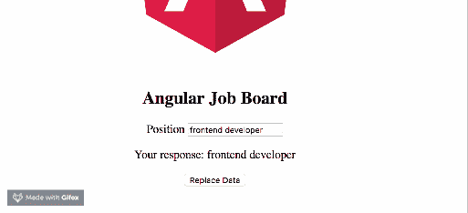

# 如何让你的八角反应式博客

> 原文：<https://blog.logrocket.com/how-to-make-your-angular-8-forms-reactive/>

## 开始之前

为了能够完成本文的演示，您应该具备:

```
// run the command in a terminal
ng version
```

确认您使用的是版本 8，如果不是，请更新到 8。

*   点击这里下载本教程的起始项目[来完成演示](https://github.com/viclotana/ng_canvas)
*   使用以下命令解压缩项目并初始化终端中的节点模块:

```
npm install
```

其他值得拥有的东西包括:

*   初级水平的角度框架的工作知识
*   熟悉 Angular 构造函数将是一个优势，但不是一个要求

## 角形

Angular 提供了两种处理表单的主要方法——模板驱动方法和模型驱动方法，后者涉及到反应式表单。

**模板方法**是 Angular 中表单处理的默认方法，你必须使用 ng 指令在模板中构建你的表单。它非常适合简单的表单，如品牌页面中的基本联系表单，它与旧的 Angular JS 表单处理方式有很多相似之处，并在幕后隐式创建了表单控制等概念。另一种方法是**反应式方法**。

## 什么是反应式？

反应式表单是一个平台，用于在 Angular 中实现模型驱动的表单处理方法。它是 Angular 在 Angular 2 发布后推出的。尽管据说它很冗长，但它是 Angular 中最强大和可伸缩的表单处理方式。与使用模板指令构建表单框架的模板驱动表单相反，反应式表单允许您构建表单并对组件类中值的变化做出反应。

## 为什么反应式很重要？

使用反应式表单，您会发现构建更简洁的表单更容易，因为每个 JavaScript 框架都建议不要将模板集群化，这是一个优先事项，因为表单逻辑现在位于组件类中。此外，它减少了使用大量指令甚至端到端测试的需要，因为您现在可以轻松地测试您的表单。它也给了开发者所有的控制权，没有什么是隐含的了。关于输入和控制的每一个选择都必须是有意的，当然也是明确的。

## 演示

为了设置一个反应式表单，我们将通过代码演示一步一步地介绍如何开始创建一个简单的工作公告板申请表单。如果你从一开始就阅读这篇文章，你将在你的 VS 代码中打开你的 starter 项目。首先，在 VS 代码中打开一个新的终端，并为表单生成两个新组件:

```
ng generate component Employer
ng generate component Employee
```

你需要采取几个步骤来在你的 Angular 项目中设置反应式表单。让我们来看看。

## 反应形式的注册

第一步是通过导入模块并在 imports 下注册，告诉 Angular 您想要使用反应式表单。您的`app.module.ts`文件应该如下所示:

```
import { BrowserModule } from '@angular/platform-browser';
import { NgModule } from '@angular/core';
import { ReactiveFormsModule } from '@angular/forms';
import { AppRoutingModule } from './app-routing.module';
import { AppComponent } from './app.component';
import { EmployerComponent } from './employer/employer.component';
import { EmployeeComponent } from './employee/employee.component';
@NgModule({
  declarations: [
    AppComponent,
    EmployerComponent,
    EmployeeComponent
  ],
  imports: [
    BrowserModule,
    AppRoutingModule,
    ReactiveFormsModule
  ],
  providers: [],
  bootstrap: [AppComponent]
})
export class AppModule { }
```

## 表单控件

表单控件是可以保存任何表单元素的数据值和验证信息的类，也就是说，您在反应式表单中的每个表单输入都应该由表单控件绑定。它们是组成反应形式的基本单位。

要使用表单控件，您必须将模块导入到要在其中创建反应式表单的组件中。打开您的`employer.component.ts`文件，并将这段代码块复制到其中:

```
import { Component, OnInit } from '@angular/core';
import { FormControl } from '@angular/forms'
@Component({
  selector: 'app-employer',
  templateUrl: './employer.component.html',
  styleUrls: ['./employer.component.css']
})
export class EmployerComponent implements OnInit {
  position = new FormControl('');
constructor() { }
ngOnInit() {
  }
}
```

在这里，表单控件被导入，并在类内部用 position 的构造函数实例化。为了在界面中反映它，您已经确保将它与模板文件中的 input 元素相关联。

```
// copy into employer.component.html file
<label>
  Position
  <input type="text" [formControl]="position">
</label>
```

要显示它，请打开您的 app.component.html 文件并粘贴到下面的代码块中:

```
<div style="text-align:center">
  <h2>Angular Job Board </h2>
  <app-employer></app-employer>
</div>
```

## 反应形式的数据绑定

在这个阶段，您可能看不出这与您习惯的普通模板表单有什么大的区别，但是当您想要开始管理从表单中获得的数据值时，这就变得很有意义了。对于数据插值，回想一下您必须如何使用 ng-bind 指令将属性绑定到模板中的值，现在您所要做的就是调用值，reactive forms API 将绑定数据并为您显示它。

```
<label>
  Position
  <input type="text" [formControl]="position">
</label>
<p>
  Your response: {{ position.value }}
</p>
```

只需`property.value`，给定时间的数据值的快照被捕获并显示在界面上。


## 替换数据值

使用[反应式表单 API](https://angular.io/guide/reactive-forms#reactive-forms-api) 中的表单控件属性和方法，您可以实现更多的事情。让我们看看用新数据更新数据值。前面提到的 API 提供了一个名为 setValue()的方法，用于设置输入元素的数据值。语法如下所示:

```
callingFunction() {
 this. propertyName.setValue('new data value');
}
```

为了在您的示例演示表单中实现它，您将在模板中添加一个替换数据按钮来触发该函数，以便可以更新数据值。在您的`employer.component.ts`文件中，复制下面的代码块:

```
import { Component, OnInit } from '@angular/core';
import { FormControl } from '@angular/forms'
@Component({
  selector: 'app-employer',
  templateUrl: './employer.component.html',
  styleUrls: ['./employer.component.css']
})
export class EmployerComponent implements OnInit {
  position = new FormControl('');
constructor() { }
ngOnInit() {
  }
  callingFunction() {
    this.position.setValue('backend engineer');
   }
}
```

现在在`employer.component.ts`文件中复制下面的代码块:

```
<label>
  Position
  <input type="text" [formControl]="position">
</label>
<p>
  Your response: {{ position.value }}
</p>
<p>
  <button (click)="callingFunction()">Replace Data</button>
</p>
```

您将看到它无缝地替换了您指定的数据值。



## 结论

这是一本在 Angular 中使用反应式表单的“入门”指南，向您展示了表单处理的各种方法(以及这些方法的差异)。还向您展示了反应式表单方法的重要性和高效性，以及它如何鼓励编写更简洁的代码。请继续关注博客，关于 Angular 中的反应式表单的更多内容将很快发布。

## 像用户一样体验 Angular 应用程序

调试 Angular 应用程序可能很困难，尤其是当用户遇到难以重现的问题时。如果您对监视和跟踪生产中所有用户的角度状态和动作感兴趣，

[try LogRocket](https://lp.logrocket.com/blg/angular-signup)

.

[](https://lp.logrocket.com/blg/angular-signup)[https://logrocket.com/signup/](https://lp.logrocket.com/blg/angular-signup)

LogRocket 就像是网络和移动应用程序的 DVR，记录你网站上发生的一切，包括网络请求、JavaScript 错误等等。您可以汇总并报告问题发生时应用程序的状态，而不是猜测问题发生的原因。

LogRocket NgRx 插件将角度状态和动作记录到 LogRocket 控制台，为您提供导致错误的环境，以及出现问题时应用程序的状态。

现代化调试 Angular 应用的方式- [开始免费监控](https://lp.logrocket.com/blg/angular-signup)。