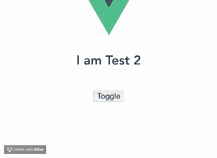

# 如何在 Vue.js 中让你的组件动态化

> 原文：<https://blog.logrocket.com/how-to-make-your-components-dynamic-in-vue-js/>

这篇文章介绍了在 Vue.js 的组件中引用 HTML 元素的方法。你可以通过使用 [Vue router](https://blog.logrocket.com/router-options-compared/) 或创建动态组件在视图或组件模板之间切换。

Vue 路由器用于在 DOM 中的视图或组件模板之间导航。要使用 Vue 路由器，请在 routes 组件中定义路由，并向 Vue 指示应该在事件(如 click)上安装新组件。

这是处理用户界面中侧边栏和菜单组件导航的正确方式。

如果您曾经想要在 DOM 中安装的两个任意组件之间切换而不创建路由，那么您可能想要使用动态组件。

### 动态组件

Vue 动态组件使用户能够在两个或更多组件之间切换，而无需路由，甚至在切换回初始组件时保留数据的状态。

中心思想是让用户在用户界面中动态地安装和卸载组件，而不使用路由器。

### 为什么动态组件很重要？

在设计用户界面时，您会想要某种形式的灵活性，以便根据应用程序状态显示或隐藏嵌套组件。动态组件以一种高效而简单的方式提供了这个平台。

该特性可以节省大量代码，因为您可以轻松地使用 Vue 条件结构(如 v-if 和 v-else)实现动态组件。通过使用占位符方法轻松地将逻辑绑定到组件，您可以使用条件结构来实现动态组件。

这种方法可以确保你的陈述总是干净和明确的。

### 在您可以在 Vue.js 中创建动态组件之前，您需要在您的 PC 中安装以下组件:

*   已安装 node . js 10 . x 及以上版本。您可以通过在终端/命令提示符下运行以下命令来验证您是否拥有 Node.js 版本 10 . x:
    `node -v`
*   代码编辑器(我强烈推荐使用 Visual Studio 代码)。
*   Vue 的最新版本，全球安装在您的机器上。
*   安装在您机器上的 Vue CLI 3.0。为此，请先卸载旧版本的 CLI:

`npm uninstall -g vue-cli`
然后，安装新的:

`npm install -g @vue/cli`
——在这里下载一个 Vue starter 项目[。
–解压下载的项目。
–导航到解压缩后的文件，并运行命令以保持所有依赖项最新:](https://github.com/viclotana/vue-canvas)

`npm install`

### 动态组件语法

Vue 为动态组件提供了一个特殊的模板元素，简称为**组件**。语法如下所示:

```
<component v-bind:is=”currentComponent”></component>
```

**组件元素**也可以是自结束标签:

```
<component v-bind:is=”currentComponent”/>
```

第一个选项最适合浏览兼容性目的。

### 演示

下载[启动项目](https://github.com/viclotana/vue-canvas)并在 VS 代码中打开它，查看一些动态组件的例子。starter 项目允许您访问一个现有的测试组件，创建第二个测试组件，并在两者之间切换。

导航到 components 文件夹并创建一个新文件。将文件命名为`Test2.vue`，并将以下代码块复制到文件中:

```
<template>
  <div><h1>I am Test 2</h1>
  </div>
</template>
<script>
export default {
  name: 'Test2',
  props: {
    msg: String
  }
}
</script>
<!-- Add "scoped" attribute to limit CSS to this component only -->
<style scoped>
h3 {
  margin: 40px 0 0;
}
ul {
  list-style-type: none;
  padding: 0;
}
li {
  display: inline-block;
  margin: 0 10px;
}
a {
  color: #42b983;
}
</style>
```

现在您有了第二个组件，转到`App.vue`文件并注册该组件:

```
<template>
  <div id="app">
    
    <Test />
    <Test2 />
  </div>
</template>
<script>
import Test from './components/Test.vue'
import Test2 from './components/Test2.vue'
export default {
  name: 'app',
  components: {
    Test, Test2
  }
}
</script>
```

这两个测试组件现在嵌套在根应用程序组件中。如果您只想挂载一个组件，然后动态地切换到另一个组件，那么您必须创建一个动态组件。

将下面的代码块复制到您的`app.vue`文件的模板部分:

```
<template>
   <div id="app">
    
    <component is="Test" />
   </div>
</template>
```

接下来，使用以下 serve 命令运行应用程序:

`npm run serve`

您将看到只有 Test 1 组件显示出来。


如果仅在模板中指定了 Test 1 元素，那么这就是您将得到的确切响应。为了使组件成为动态的，我们可以用 v-bind 指令将它绑定到一个 set 属性。

```
<template>
  <div id="app">
    
    <component v-bind:is="component" />
  </div>
</template>
<script>
import Test from './components/Test.vue'
import Test2 from './components/Test2.vue'
export default {
  name: 'app',
  components: {
    Test, Test2
  },
  data (){
    return {
      component:"Test"
    }
  }
}
</script>
```

您的组件现在与数据中的组件属性绑定在一起。如果您将组件切换到`Test2`，它将自动安装 Test 2 组件。

在你的浏览器上测试一下。

### 添加方法调用

您可以添加方法调用来控制组件动态显示的逻辑。组件元素使您可以访问 Vue 实例中的每个构造。

下面是切换这两个组件的小方法的示例:

```
<template>
  <div id="app">
    
    <component v-bind:is="component" />
    <button v-on:click="toggle">Toggle</button>
  </div>
</template>
<script>
import Test from './components/Test.vue'
import Test2 from './components/Test2.vue'
export default {
  name: 'app',
  components: {
    Test,
     Test2
  },
  data (){
    return {
      component:"Test2"
    }
  },
  methods: {
    toggle(){
      if (this.component === Test) {
        this.component = Test2;
      } else {
        this.component = Test;
      }
    }
  }
}
</script>
```

### 切换时保持数据值不变

当 Vue 团队构建这个特性时，他们选择扩展它的功能，以包括存储每个状态的数据值。

* * *

### 更多来自 LogRocket 的精彩文章:

* * *

为了存储这些数据，Vue 提供了一个名为 **keep-alive** 的模板元素。使用 keep-alive，您可以确保在从一个组件切换回另一个组件后，组件状态保持不变。

例如，如果您单击一个链接或在文本框中输入一个值，然后切换组件，keep-alive 会将您带回到切换回来时使用的同一链接或文本框。

要启用 keep-alive，请转到您的`app.vue`文件的模板部分，并用 keep-alive 元素包装组件元素:

```
<keep-alive>
  <component v-bind:is="component" />
</keep-alive>
```

要查看它是否工作，通过将以下代码块添加到模板部分，将一个表单元素添加到您的`Test.vue`文件中:

```
<template>
  <div><h1>I am Test 1</h1>
       <form>
         First name:<br>
         <input type="text" name="firstname"><br>
         Last name:<br>
         <input type="text" name="lastname">
       </form>
  </div>
</template>
```

保存所有项目文件后，再次运行应用程序。在输入框中键入内容，切换组件，然后切换回原始组件。您会注意到在切换组件之前键入的值与您离开时完全一样。



## 使用 [LogRocket](https://www2.logrocket.com/vue-performance-monitoring) 确保 Vue 组件在生产中正确(快速)渲染。

调试 Vue.js 应用程序可能会很困难，尤其是当用户会话期间有几十个(如果不是几百个)突变时。如果您对监视和跟踪生产中所有用户的 Vue 突变感兴趣，[请尝试 LogRocket](https://www2.logrocket.com/vue-performance-monitoring) 。[](https://www2.logrocket.com/vue-performance-monitoring)[https://logrocket.com/signup/](https://www2.logrocket.com/vue-performance-monitoring)

LogRocket 就像是 web 应用程序的 DVR，记录你的 Vue 应用程序中发生的一切，包括网络请求、JavaScript 错误、性能问题等等。您可以汇总并报告问题发生时应用程序的状态，而不是猜测问题发生的原因。

LogRocket Vuex 插件将 Vuex 突变记录到 LogRocket 控制台，为您提供导致错误的环境，以及出现问题时应用程序的状态。

现代化您调试 Vue 应用的方式-[开始免费监控](https://www2.logrocket.com/vue-performance-monitoring)。

### 结论

这是对在 Vue.js 工作流中使用动态组件的介绍。您现在还可以通过保持活动来扩展组件元素的能力。

这是构建用户界面的一个很好的工具，可以应用于各种不同的用例。黑客快乐！

## 像用户一样体验您的 Vue 应用

调试 Vue.js 应用程序可能会很困难，尤其是当用户会话期间有几十个(如果不是几百个)突变时。如果您对监视和跟踪生产中所有用户的 Vue 突变感兴趣，

[try LogRocket](https://lp.logrocket.com/blg/vue-signup)

.

[](https://lp.logrocket.com/blg/vue-signup)[https://logrocket.com/signup/](https://lp.logrocket.com/blg/vue-signup)

LogRocket 就像是网络和移动应用程序的 DVR，记录你的 Vue 应用程序中发生的一切，包括网络请求、JavaScript 错误、性能问题等等。您可以汇总并报告问题发生时应用程序的状态，而不是猜测问题发生的原因。

LogRocket Vuex 插件将 Vuex 突变记录到 LogRocket 控制台，为您提供导致错误的环境，以及出现问题时应用程序的状态。

现代化您调试 Vue 应用的方式- [开始免费监控](https://lp.logrocket.com/blg/vue-signup)。