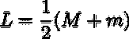
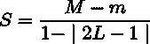
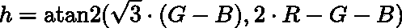
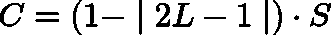
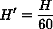
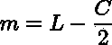
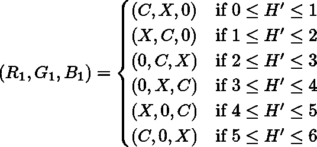
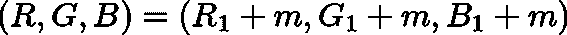

# 如何用 JavaScript 操纵 CSS 颜色

> 原文：<https://blog.logrocket.com/how-to-manipulate-css-colors-with-javascript-fb547113a1b8/>

## 彩色模型 101

我知道你是来学习处理颜色的——我们会实现的。但是在此之前，我们需要对 CSS 如何表示颜色有一个基本的了解。CSS 使用两种不同的颜色模型:RGB 和 HSL。让我们快速浏览一下两者。

### RGB

“红、绿、蓝、[、RGB](https://codepen.io/AdamGiese/full/5783951de51e0db0f569d5abbd9cb2f7) 的首字母由三个数字组成，每个数字表示最终颜色中包含了多少相应颜色的光。在 CSS 中，每个数字都在 0-255 的范围内，可以写成 CSS `rgb`函数的逗号分隔参数。比如`rgb(50,100,0)`。

RGB 是一种“加色”颜色系统，这意味着每个数字越高，最终颜色就越亮。如果所有值相等，则颜色为灰度；如果所有值都为零，结果将是黑色的；如果所有值都是 255，结果将是白色的。

或者，您可以使用十六进制记数法来表示 RGB 颜色，其中每种颜色的整数都从基数 10 转换为基数 16。例如，`rgb(50,100,0)`就是`#326400`。

虽然我通常发现自己出于习惯而接触 RGB(尤其是十六进制)，但我经常发现它很难阅读，尤其难以操作。输入 HSL。

### high-speedlaunch 高速快艇

“色调、饱和度、亮度”的首字母组合 [HSL](https://codepen.io/AdamGiese/full/989988044f3b8cf6403e3c60f56dd612) 也由三个值组成。色调值对应于色轮上的位置，由 CSS 角度值表示；最常用的是 deg 单位。

饱和度是指颜色的强度，用百分比表示。当饱和度为 100%时，它是全彩色的；饱和度越低，颜色越浅，直到灰度达到 0%。

明度，也用百分比表示，指的是颜色有多亮。“常规”亮度为 50%。100%的明度将是纯白，0%的明度将是纯黑，与色调和饱和度值无关。

我发现 HSL 是一个更直观的模型。颜色之间的关系更加明显，对颜色的处理往往就像调整其中一个数字一样简单。

[](https://logrocket.com/signup/)

## 颜色模型之间的转换

RGB 和 HSL 颜色模型都将颜色分解成各种属性。为了在语法之间进行转换，我们首先需要计算这些属性。

除了色调之外，我们所讨论的每一个值都可以用百分数来表示。甚至 RGB 值也是字节大小的百分比表示。在下面的公式和函数中，这些百分比将由 0 到 1 之间的小数表示。

我想指出的是，我不会深入讨论这些问题的数学；相反，我将简要回顾一下原始的数学公式，然后将其转换成 JavaScript 公式。

### 从 RGB 计算亮度

亮度是三个 HSL 值中最容易计算的。数学上，公式显示如下，其中`M`是 RGB 值的最大值，`m`是最小值:



The mathematic formula for lightness

下面是与 JavaScript 函数相同的公式:

```
const rgbToLightness = (r,g,b) => 
    1/2 * (Math.max(r,g,b) + Math.min(r,g,b));
```

### 从 RGB 计算饱和度

饱和度只是比明度稍微复杂一点。如果亮度为 0 或 1，则饱和度值将为 0。否则，它遵循下面的数学公式，其中`L`代表亮度:



The mathematical formula for saturation

作为 JavaScript:

```
const rgbToSaturation = (r,g,b) => {
  const L = rgbToLightness(r,g,b);
  const max = Math.max(r,g,b);
  const min = Math.min(r,g,b);
  return (L === 0 || L === 1)
   ? 0
   : (max - min)/(1 - Math.abs(2 * L - 1));
};
```

### 从 RGB 计算色调

从 RGB 坐标计算色相角的公式有点复杂:



The mathematical formula for hue

作为 JavaScript:

```
const rgbToHue = (r,g,b) => Math.round(
  Math.atan2(
    Math.sqrt(3) * (g - b),
    2 * r - g - b,
  ) * 180 / Math.PI
);
```

最后与`180 / Math.PI`相乘就是把结果从弧度转换成度。

### 计算 HSL

所有这些功能都可以打包成一个单一的实用功能:

```
const rgbToHsl = (r,g,b) => {
  const lightness = rgbToLightness(r,g,b);
  const saturation = rgbToSaturation(r,g,b);
  const hue = rgbToHue(r,g,b);
  return [hue, saturation, lightness];
}
```

### 从 HSL 计算 RGB

在开始计算 RGB 之前，我们需要一些先决条件值。

首先是“色度”值:



The mathematical formula for chroma

我们也有一个临时色调值，我们将使用它的范围来决定我们属于哪个“段”的色调圈:



The mathematical formula for hue prime

接下来，我们有一个“x”值，它将用作中间(第二大)分量值:


The mathematical formula for a temporary “x” value

我们有一个“m”值，用于调整每个亮度值:



The mathematical formula for lightness match

根据色调素值，`r`、`g`和`b`值将映射到`C`、`X`和`0`:



The mathematical formula for RGB values without accounting for lightness

最后，我们需要映射每个值来调整亮度:



The mathematical formula to account for lightness with RGB

将所有这些放到一个 JavaScript 函数中:

```
const hslToRgb = (h,s,l) => {
  const C = (1 - Math.abs(2 * l - 1)) * s;
  const hPrime = h / 60;
  const X = C * (1 - Math.abs(hPrime % 2 - 1));
  const m = l - C/2;
  const withLight = (r,g,b) => [r+m, g+m, b+m]; if (hPrime <= 1) { return withLight(C,X,0); } else
  if (hPrime <= 2) { return withLight(X,C,0); } else
  if (hPrime <= 3) { return withLight(0,C,X); } else
  if (hPrime <= 4) { return withLight(0,X,C); } else
  if (hPrime <= 5) { return withLight(X,0,C); } else
  if (hPrime <= 6) { return withLight(C,0,X); }
}
```

### 创建颜色对象

为了在操作它们的属性时易于访问，我们将处理一个 JavaScript 对象。这可以通过包装先前编写的函数来创建:

```
const rgbToObject = (red,green,blue) => {
  const [hue, saturation, lightness] = rgbToHsl(red, green, blue);
  return {red, green, blue, hue, saturation, lightness};
} const hslToObject = (hue, saturation, lightness) => {
  const [red, green, blue] = hslToRgb(hue, saturation, lightness);
  return {red, green, blue, hue, saturation, lightness};
}
```

### 例子

我强烈建议你花一些时间[来玩这个例子](https://codepen.io/AdamGiese/full/86b353c35a8bfe0868a8b48683faf668)。当您调整其他属性时，查看每个属性如何相互作用，可以让您更深入地了解这两种颜色模型是如何配合在一起的。

## 颜色处理

既然我们已经有了在颜色模型之间转换的能力，让我们看看如何操纵这些颜色！

### 更新属性

我们介绍的每个颜色属性都可以单独操作，返回一个新的颜色对象。例如，我们可以编写一个旋转色调角度的函数:

```
const rotateHue = rotation => ({hue, ...rest}) => {
  const modulo = (x, n) => (x % n + n) % n;
  const newHue = modulo(hue + rotation, 360); return { ...rest, hue: newHue };
}
```

`rotateHue`函数接受一个`rotation`参数并返回一个新函数，该函数接受并返回一个颜色对象。这样就可以轻松创建新的“旋转”功能:

```
const rotate30 = rotateHue(30);
const getComplementary = rotateHue(180); const getTriadic = color => {
  const first = rotateHue(120);
  const second = rotateHue(-120);
  return [first(color), second(color)];
}
```

按照同样的思路，你可以写函数给`saturate`或`lighten`一种颜色——或者，反过来，`desaturate`或`darken`。

```
const saturate = x => ({saturation, ...rest}) => ({
  ...rest,
  saturation: Math.min(1, saturation + x),
}); const desaturate = x => ({saturation, ...rest}) => ({
  ...rest,
  saturation: Math.max(0, saturation - x),
}); const lighten = x => ({lightness, ...rest}) => ({
  ...rest,
  lightness: Math.min(1, lightness + x)
}); const darken = x => ({lightness, ...rest}) => ({
  ...rest,
  lightness: Math.max(0, lightness - x)
});
```

### 颜色谓词

除了颜色操作，您还可以编写“谓词”——即返回布尔值的函数。

```
const isGrayscale = ({saturation}) => saturation === 0;
const isDark = ({lightness}) => lightness < .5;
```

## 处理颜色数组

### 过滤

JavaScript `[].filter`方法接受一个谓词，并返回一个包含所有“通过”的元素的新数组。我们在上一节中写的谓词可以用在这里:

```
const colors = [/* ... an array of color objects ... */];
const isLight = ({lightness}) => lightness > .5;
const lightColors = colors.filter(isLight);
```

### 整理

要对颜色数组进行排序，首先需要编写一个“比较器”函数。这个函数接受一个数组的两个元素，并返回一个数字来表示“获胜者”正数表示第一个元素应该先排序，负数表示第二个元素应该先排序。零值表示平局。

例如，下面是一个比较两种颜色亮度的函数:

```
const compareLightness = (a,b) => a.lightness - b.lightness;
```

下面是一个比较饱和度的函数:

```
const compareSaturation = (a,b) => a.saturation - b.saturation;
```

为了防止代码重复，我们可以编写一个高阶函数来返回一个比较函数来比较任何属性:

```
const compareAttribute = attribute =>
  (a,b) => a[attribute] - b[attribute]; const compareLightness = compareAttribute('lightness');
const compareSaturation = compareAttribute('saturation');
const compareHue = compareAttribute('hue');
```

### 平均属性

您可以通过组合各种 JavaScript 数组方法来平均颜色数组的特定属性。首先，您可以通过用 reduce 求和并除以数组长度来计算属性的平均值:

```
const colors = [/* ... an array of color objects ... */];
const toSum = (a,b) => a + b;
const toAttribute = attribute => element => element[attribute];
const averageOfAttribute = attribute => array =>
  array.map(toAttribute(attribute)).reduce(toSum) / array.length;
```

您可以使用它来“正常化”颜色数组:

```
/* ... continuing */
```

```
const normalizeAttribute = attribute => array => {
  const averageValue = averageOfAttribute(attribute)(array);
  const normalize = overwriteAttribute(attribute)(averageValue);
  return normalize(array);
} const normalizeSaturation = normalizeAttribute('saturation');
const normalizeLightness = normalizeAttribute('lightness');
const normalizeHue = normalizeAttribute('hue');
```

## 结论

颜色是网络不可或缺的一部分。将颜色分解成不同的属性，可以让你对颜色进行巧妙的处理，并为各种各样的可能性打开大门。

## 你的前端是否占用了用户的 CPU？

随着 web 前端变得越来越复杂，资源贪婪的特性对浏览器的要求越来越高。如果您对监控和跟踪生产环境中所有用户的客户端 CPU 使用情况、内存使用情况等感兴趣，

[try LogRocket](https://lp.logrocket.com/blg/css-signup)

.

[](https://lp.logrocket.com/blg/css-signup)[https://logrocket.com/signup/](https://lp.logrocket.com/blg/css-signup)

LogRocket 就像是网络和移动应用的 DVR，记录你的网络应用或网站上发生的一切。您可以汇总和报告关键的前端性能指标，重放用户会话和应用程序状态，记录网络请求，并自动显示所有错误，而不是猜测问题发生的原因。

现代化您调试 web 和移动应用的方式— [开始免费监控](https://lp.logrocket.com/blg/css-signup)。