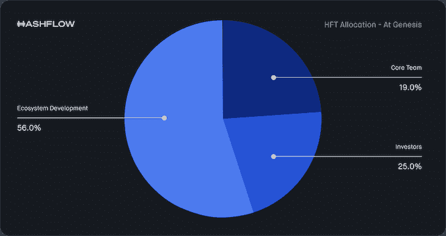
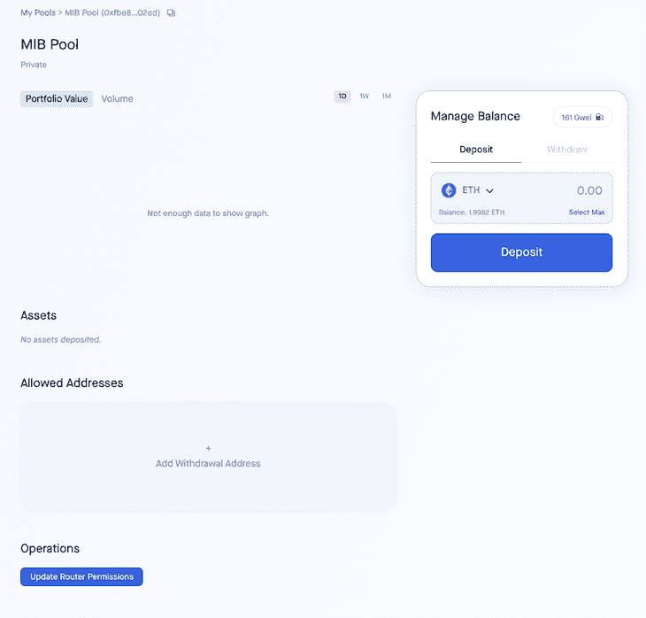

# 如何利用 Hashflow 进行营销和交易

> 原文：<https://blog.logrocket.com/how-to-market-make-transact-hashflow/>

近年来，DeFi 交易者的数量有所增加，这也导致了更多分散式交易所(dex)进入市场。

[Web3](https://blog.logrocket.com/tag/web3/) 正在加大对各大行业的影响，贸易行业也不例外。我们已经看到了集中交易的缺陷，如缺乏透明度、不安全性、金融排他性和隐私性，这就提供了对 dex 的需求。

DEX 是一种不需要像经纪人或第三方这样的中介来交换加密货币的方式。它们遵循一种不同于集中式交易所的方法，依靠智能合约来处理点对点交易。

这种商业模式注重用户的隐私，即使交易细节存储在区块链上，交易也是匿名进行的。

市场上有很多 DEX 平台，比如比特币基地和币安，但是在本文中，我们将重点讨论 Hashflow。

我们将看看交易者如何通过 Hashflow 令牌与 pinpoints 连接，它的工作方式如何不同于其他方式，如何做市，以及如何交易。

## 什么是 Hashflow，它的目标是什么？

首先，Hashflow 以其无桥跨链交换而闻名，这意味着它具有高度的互操作性，具有零滑移，并且没有 MEV。

这是可能的，因为 Hashflow 确保做市商签署报价，因此在交易期间保持不变。

流动性提供者和交易者与 Hashflow 上的专业做市商联系在一起，其核心功能为其做市商提供了更好的灵活性——无滑点、抗 MEV、更好的报价和更便宜的交易费用都是它的优势。

上面提到的所有这些都是可能的，因为 Hashflow 使用的架构是基于池的架构。

## Hashflow 如何工作

从交易开始，用户必须将他的钱包连接到 Hashflow，输入他们想要交易的号码，然后报价就会显示给他们。

如果用户接受，订单被提交，交易被验证并添加到 Hashflow 网络(或区块链)中。另一方面，做市商市场负责发布用户已经接受的报价。

然后，做市商在交易上签字，交易被无滑动地执行(不管用户提交的是什么订单)。与其他 dex 不同，它们通常有 AMMs(自动做市商)使用[惰性流动性条款](https://papers.ssrn.com/sol3/papers.cfm?abstract_id=3674178)处理做市和资产定价，Hashflow 传统上就像订单簿机制一样。

定价是在链外完成的，但交易是在链上进行的。

Hashflow 于 2021 年成立，并已显著增长，由于其优化的汽油费和零滑动，提供了最好的价格。截至本文发表时，Hashflow 目前支持无桥跨链互换，这使您可以在 EVM 兼容的链上启动互换，预计未来将包括 Solana integration、智能订单路由、gasless trading、限价单和 Hashverse。

总之，Hashflow 是一个 DeFi 协议，作为以太坊区块链上运行的分散式交换。

## 现金流代币

Hashflow 提供了其名为 HFT (Hashflow token)的令牌，这是 2021 年 12 月 22 日部署的以太坊链上的 ERC-20。有 10 亿单位的 HFT 供应，Hashflow 以这样的方式分配这种加密货币:19%给核心团队；25%给早期投资者；56%贡献给生态系统。再给早期用户 6.75%作为奖励。



Hashflow NFT，也称为 Hashbots，将在未来发布的 Hashverse 中使用。NFT 持有者将获得与 NFT 价值相符的 HFT，因为每个 NFT 都有一个 HFT 价值。Hashflow 声明，四年后，5%的 HFT 将发放给社区。

## 如何进行市场营销

市场标记在 Hashflow 和整个市场中非常重要。他们是流动性提供者，通过买卖资产使市场运转。这并不是说他们马上就可以随时买卖，而是随时待命，随时准备买卖。

在大多数分散式交易所中，做市商是自动的，智能合约被部署来在 AMMs(自动做市商)中寻找市场对，但它们容易受到攻击，并且还有点滞后，因为价格报价是在链上处理的。

* * *

### 更多来自 LogRocket 的精彩文章:

* * *

在 Hashflow 中，做市商是公司、机构或个人，他们被赋予特权，利用他们的专业知识做出这些市场决策，这是在链外完成的，这反过来减少了汽油费和滑点，如前所述。

为了在 Hashflow 上进行市场营销，我们将遵循以下步骤。作为做市商与 Hashflow 集成非常简单。

## 连接到 WebSocket

您将需要从 Hashflow API 连接到 WebSocket，就像您在下面第 10 行看到的那样，并且您可能需要通过 Telegram 或 Discord 联系团队以添加到“allowlist”生成器。

```
const PING_PONG_INTERVAL_MS = 30000;
const PING_PONG_GRACE_PERIOD_MS = 1000;

function getWebsocketConnection(
  marketMakerName,
  onMessageCallBack,
  onCloseCallback,
  onHeartbeatCallback,
) {
  const ws = new WebSocket(`${process.env.HASHFLOW_WS_API}/maker/v1`, {
    headers: { marketmaker: marketMakerName, }
  });
  const heartbeat = () => {
    if (ws.pingTimeout) {
      clearTimeout(ws.pingTimeout);
    }
    ws.pingTimeout = setTimeout(() => {
      ws.terminate();
    }, PING_PONG_INTERVAL_MS + PING_PONG_GRACE_PERIOD_MS);

    onHeartbeatCallback();
  }
  ws.on('open', heartbeat);
  ws.on('ping', heartbeat);
  ws.on('message', message => onMessageCallBack(message));

  ws.on('close', () => {
    if (ws.pingTimeout) {
      clearTimeout(ws.pingTimeout);
    }
    setTimeout(() => {
      ws.removeAllListeners();
      onCloseCallback();
    }, 5000);
  });

  ws.on('error', err => {});

  ws.on('unexpected-response', (_, res) => {
    let message = '';
    res.on('data', (chunk) => {
      message += chunk;
    });
    res.on('end', () => {
      if (res.statusCode === 401) {
        logger.error(`WS access not authorized. ${message}`);
      } else {
        logger.error(`Unexpexted response from server: [${res.statusCode}] ${message}.`);
      }
      ws.close()
    });
  });
  return ws;
}

```

Hashflow 连接到您，如下所示:

```
// TODO: Replace this with your market maker name (once added to the backend)
const MARKET_MAKER_NAME = 'TestMM';
// TODO: Set true if you want to MM on 1inch, etc – and have signed legal agreements
const SUPPORT_AGGREGATORS = false;
const levelsInterval = SUPPORT_AGGREGATORS 
  ? setInterval(() => publishPriceLevels(mainSocket), 1000)
  : undefined;
const onMessageCallback = message => processMessage(mainSocket, message);
const onHeartbeatCallback = () => {
  for (const networkId of Object.keys(SUPPORTED_PAIRS)) {
    sendMessage(mainSocket, 'subscribeToTrades', { networkId, pool: POOL });
  }
};
const onCloseCallback = () => {
  if (SUPPORT_AGGREGATORS) {
    clearInterval(levelsInterval);
  }
  mainSocket = connectToHashflow();
};

const connectToHashflow = () => {
  return getWebsocketConnection(
    MARKET_MAKER_NAME,
    onMessageCallback,
    onCloseCallback,
    onHeartbeatCallback,
  );
}
let mainSocket = connectToHashflow();

```

与团队联系后,“TestMM”将被替换为您的。你也应该参考这个示例 [codebase](https://github.com/hashflownetwork/sample-market-maker) 来看看如何从 Hashflow 连接到 WebSocket。

## 创建一个池

连接到 web 服务器后，您需要连接到您的钱包，以创建一个将提供报价的池。

为此，请使用此[链接](https://app.hashflow.com/pools)并填写您的池名称、签名者地址，最后确定您希望您的池是公共的还是私有的。完成该过程后，您应该会看到如下页面:



## 接受 RFQ 并引用他的话

现在到了有趣的部分；当用户希望与我们的服务器进行交易时，Hashflow 会收到来自用户的报价请求，然后服务器会将数据提供给指定的做市商:

```
{
  "messageType": "rfq",
  "message": {
    // This is a unique RFQ ID -- you need to use this when sending back a quote.
    "rfqId": string,

    // This will be something like: hashflow, 1inch. This is useful
    // since 1inch charge fees for their trades
    "source": string,

    // 1 for ETH L1
    "networkId": number,

    // Base token (the token the trader sells).
    "baseToken": string,  // contract address
    "baseTokenName": string,  // token name (e.g. USDC, ETH, ...)
    "baseTokenNumDecimals": number,  // token decimals (e.g. DAI: 18, USDC: 6)

    // Quote token (the token the trader buys).
    "quoteToken": string,  // contract address
    "quoteTokenName": string,  // token name (e.g. USDC, ETH, ...)
    "quoteTokenNumDecimals": number,  // token decimals (e.g. DAI: 18, USDC: 6)

    // Exactly one of the following fields will be present in the RFQ.
    // If baseTokenAmount is present, quoteTokenAmount needs to be filled by the quote.
    // If quoteTokenAmount is present, baseTokenAmount needs to be filled by the quore.
    // Amounts are in decimals, e.g. "1000000" for 1 USDT.
    "baseTokenAmount": ?string,
    "quoteTokenAmount": ?string,

    // The trader wallet address that will swap with the contract. This can be a proxy
    // contract (e.g. 1inch)
    "trader": string,

    // The wallet address of the actual trader (e.g. end user wallet for 1inch).
    // This is helpful in order to understand user behavior.
    // If effectiveTrader is not present, you can assume that trader == effectiveTrader.
    "effectiveTrader": ?string,
  }
}

```

根据您在代码库中实现的逻辑，报价也以这种格式返回给用户:

```
{
  "messageType": "quote",
  "message": {
    "rfqId": string,  // This should be the same rfqId that was sent by the server
    "pool": string,  // This should be the contract address of the pool.

    // This is optional. If using an EOA (externally owned account), this should 
    // contain the wallet address of the EOA. 
    // The EOA needs to have allowance set to the Pool.
    "eoa": ?string,

    // Same as RFQ
    "baseToken": string,
    "quoteToken": string,

    // Amounts are in decimals.
    "baseTokenAmount": string,
    "quoteTokenAmount": string,

    // Set this to "0" for private pool / EOA trading.
    "fees": string,

    // The unix timestamp when the quote expires, in seconds.
    "quoteExpiry": number,
  }
}

```

## 支持签名报价

只有当用户没有提供特定的做市商时，才会发生这种情况，在这种情况下，Hashflow 将请求所有做市商报价，并选择最佳的做市商。

当挑选出最佳报价时，我们将一个`signQuote`消息类型发送回做市商，让他们签名(从他们那里获得签名)。请求也是这种格式:

```
  "messageType": "signQuote",
  "message": {
    // The RFQ ID that generated the quote.
    "rfqId": string,
    "networkId": number,  // The chain ID (e.g. 1 for Ethereum mainnet)
    "quoteData": {
      "txid": string,  // Unique identifier of the quote -- different from the RFQ ID.

      "pool": string,
      "eoa": string,

      "baseToken": string,
      "quoteToken": string,

      "baseTokenAmount": string,
      "quoteTokenAmount": string,

      "fees": string,

      "quoteExpiry": number,

      // The account that will be executing the swap. For 1inch, this is the 1inch proxy.
      "trader": string,
      // Trader actually executing the swap, if different from 'trader'.
      "effectiveTrader": ?string,

      // The following parameter is internal to hashflow contracts.
      // It is leveraged to mitigate quote replay.
      "nonce": number
    }
  }
}

```

## 得到第一个签名的 RFQ

您可以使用以下主体参数作为示例，通过向 Hashflow 的 staging API 发出请求来测试您的 web 服务器，以查看您是否从中获得了签名的 RFQ:

```
POST https://api-staging.hashflow.com/taker/v1/quote/signedRfq

{
    "networkId": 42,  // 42 is Kovan, 1 is Mainnet
    "source": "hashflow", 
    "baseToken": "0x07de306ff27a2b630b1141956844eb1552b956b5",  // USDT (Kovan)
    "quoteToken": "0xa0a5ad2296b38bd3e3eb59aaeaf1589e8d9a29a9",  // WBTC (Kovan)
    "trader": "0x2150DD462B496bd5e4A37b5411c13319427BE83E",
    "baseTokenAmount": "1000000",
    "marketMaker": "TestMM"  // don't forget to change this
}

```

一旦你得到回应，那么你的做市商就准备好了。您还应该参考[文档](https://docs.hashflow.com/hashflow/market-making/getting-started)以了解更多边缘案例。

## 结论

在这篇文章中，我们着重于揭示 Hashflow、其用户和做市商之间的联系以及 Hashflow 的关键方面——即，它提供无桥跨链互换和链外市场决策；即报价是在没有自动报价机的情况下完成的。

正如以太坊的 Vitalik 所推测的那样，Hashflow 让多链世界离我们更近了。我们希望得到更多的 Hashflow 对其他链的支持，因为它目前正被大量采用。要查看其指标，请前往这个[仪表板](https://hashflow2.metabaseapp.com/public/dashboard/f4b12fd4-d28c-4f08-95b9-78b00b83cf17)。

## 加入像 Bitso 和 Coinsquare 这样的组织，他们使用 LogRocket 主动监控他们的 Web3 应用

影响用户在您的应用中激活和交易的能力的客户端问题会极大地影响您的底线。如果您对监控 UX 问题、自动显示 JavaScript 错误、跟踪缓慢的网络请求和组件加载时间感兴趣，

[try LogRocket](https://lp.logrocket.com/blg/web3-signup)

.

[](https://lp.logrocket.com/blg/web3-signup)[https://logrocket.com/signup/](https://lp.logrocket.com/blg/web3-signup)

LogRocket 就像是网络和移动应用的 DVR，记录你的网络应用或网站上发生的一切。您可以汇总和报告关键的前端性能指标，重放用户会话和应用程序状态，记录网络请求，并自动显示所有错误，而不是猜测问题发生的原因。

现代化您调试 web 和移动应用的方式— [开始免费监控](https://lp.logrocket.com/blg/web3-signup)。