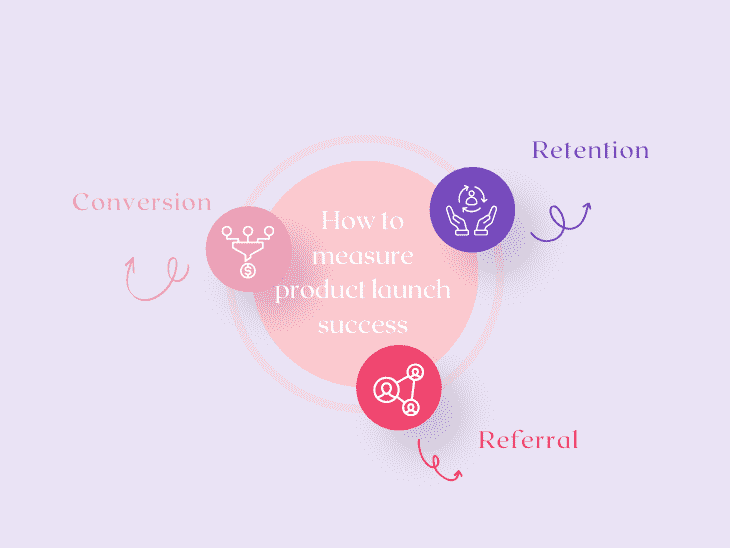

# 产品发布后如何衡量成功

> 原文：<https://blog.logrocket.com/product-management/how-to-measure-success-after-product-launch/>

产品经理使用许多[关键绩效指标(KPI)](https://blog.logrocket.com/product-management/what-metrics-kpis-product-managers-track/)来衡量产品的成功，但是同时使用它们会让你感到不知所措。

以网飞为例。你应该看看网飞的[每日和每月活跃用户(DAU 和毛)](https://blog.logrocket.com/product-management/what-metrics-kpis-product-managers-track/#retention)统计数据来判断这项服务是否成功。这是因为网飞的主要功能是流媒体电影和连续剧，以取代有线电视。它的成功依赖于活跃用户，因为在网飞上观看流媒体的人不看有线电视。

另一方面，酒店的成功不能用日活跃用户来衡量。相反，酒店推荐应用的基本指标应该是净推介值(NPS)。

关键是产品的成功是主观的，而不是放之四海而皆准的。在本指南中，我们将向您展示如何定义产品的成功，以及如何在发布后衡量它。

* * *

## 目录

* * *

## 什么是产品发布会？

需要明确的是，当我们介绍我们的产品时，我们的目标不是增加[用户参与度](https://blog.logrocket.com/product-management/what-product-management-metrics-matter-most-to-pms/#engagement)或制造轰动效应。相反，我们应该通过产品发布来度过测试阶段，并确定该产品是否在没有产品团队帮助的情况下被广泛接受。

在这种情况下，产品团队经常使用 beta 测试或试点小组通过获得用户反馈来衡量产品的性能。问题是他们面对的是一群被俘虏的用户，他们有强烈的动机继续使用产品。

产品发布的目的是确定在没有产品团队直接参与的情况下，产品是否会成功。因此，重要的是要记住 beta 测试和试点计划不是产品发布。

这些信息使我们能够准确地将产品发布定义为产品向市场的重大发布，其中产品团队不与用户进行持续的直接接触。

## 产品发布会与成熟产品有何不同？

在现有产品的基础上构建与推出新产品有着本质的不同，因为后者需要在大量不确定性的情况下运作。

你会在以下几个方面感受到模糊:

*   缺少历史[用户行为](https://blog.logrocket.com/product-management/what-is-product-experience-examples-how-to-improve-px/#what-is-product-experience-px)信息
*   没有足够的证据证明你的目标受众是合适的
*   没有足够的证据证明你选择了正确的目标问题
*   无法充分证明您提供的[价值主张](https://blog.logrocket.com/product-management/what-is-product-market-fit-measure-examples/#how-to-achieve-product-market-fit)和功能集符合受众的需求

由于这些差异，我们希望使用特定的产品指标来评估我们产品上市的成功与否。因为使用度量标准的目的是展示向定性目标的进展，我们的目标是确定这个解决方案或产品是否为目标受众解决了问题。

## 发布后衡量成功的标准

在考虑推出新产品时，要记住三大类指标:

How to measure product launch success

每一项措施都证明了我们选择的目标市场是否相信我们的产品能引起他们的共鸣，以及它是否有足够的吸引力让他们采纳并最终推广给其他人。

### 转换

当考虑转换时，重要的是要记住新发布的产品必须以某种方式货币化。这意味着我们有一个期望的行动，我们希望消费者执行。

每个产品都必须为你的企业创造价值，而做到这一点的最佳方式就是在你的产品流程中，指定哪种用户活动是最重要的。因此，确定预期活动的转化率百分比至关重要。

需要记住的一件重要事情是，不同的产品需要不同的操作。例如，用户可以免费使用谷歌搜索，但营销人员必须付费才能出现在这些搜索中。因此，消费者在谷歌上搜索的频率是追踪谷歌搜索产品的主要转换，因为它有助于以后的货币化。

有些人可能会将转化定义为参与，这意味着他们声明用户正在使用产品并以某种方式行动。使用它是完全可以接受的，但是我们必须小心避免平等地对待所有的参与。

根据产品的功能，选择能增加最大价值的活动，然后评估该功能的使用频率。记住，要衡量它相对于用户群的比例，也要衡量它的绝对值(每周使用的次数)。

### 保留

留存对于衡量用户是否真正接受了产品并改变了他们的行为是很重要的。使用和行为重复是我们正在寻找的。我们可以通过检查不同消费者群体的流失率来快速确定我们的产品是否真的增加了参与度。

整体参与是衡量成功的另一个选项。总体参与度指标(如每周活跃用户(WAU ))的问题在于，如果新用户多于流失用户，这些指标可能会上升..

然而，总体参与度并不能说明近期用户是否已经习惯了该产品。因此，我们希望计算在特定时间范围内(例如，每周或每月)返回的人的百分比。由于你有更多的时间来重新激活客户，一般来说，时间越长，越多的人可能会回到你的产品。

注意:仅比较第一个月和第二个月的七天保留期；不要将第一个月的 7 天保留期与第二个月的 30 天保留期进行比较，以确保您的比较是公平的。这个想法是将橙子和橙子进行比较，而不是将苹果和橙子进行比较。

### 介绍

推荐指标是评估你的产品是否足够有用来产生知名度和口碑的有效工具。一般来说，我们不想使用[净推介值(NPS)](https://blog.logrocket.com/product-management/what-is-a-good-net-promoter-score-nps/#what-is-a-net-promoter-score-nps) 作为推荐指标的主要预测指标。NPS 需要时间来解决，我们并不总是希望在产品一发布就让消费者接受调查。

我们希望看到他们有效地使用产品多次，而不是让他们只使用一次，然后在调查出现时就气馁。然而，我们现在可以做的一件事是为用户提供邀请其他用户加入平台的选项，无论他们是通过电子邮件邀请、社交网络帖子还是任何其他方法。

我们要确保我们有这种能力，因为它可以表明客户发现我们的产品是如此有价值，以至于他们愿意冒着社会资本的风险来推广它。为了确定消费者邀请其他用户使用产品的频率，我们可以测量邀请率。在接下来的几个月里，我们希望看到邀请率随着转化率和留存率逐渐上升。

* * *

订阅我们的产品管理简讯
将此类文章发送到您的收件箱

* * *

## 您应该如何区分这些指标的优先级？

在所有其他指标中，转化率应被放在首位。产品的目标是为用户提供如此多的价值，以至于你可以从他们的行为中获利。除非你有货币化和转化的手段，否则一个已推出的产品将无法增长。

该产品应用于提高转换率，这是您的首要任务。您可以通过消除主工作流中的摩擦、自动化数据输入或通过消除单点登录实现中的帐户创建等步骤来实现这一点。

将支持工作流链接回主工作流是提高转化率的另一种方法。例如，假设您的主要工作流是一个表单，客户必须填写信息以接收来自各个贷方的抵押报价。您可能有一个向客户解释利率的辅助工作流，或者一个解释他们当前房屋价值的工作流。

确保这些辅助工作流的末端指向主工作流，以便最终用户完成您希望他们完成的操作。例如，当您最初使用 Twitter 时，系统会提示您发布您的兴趣。为 Twitter 创造商业价值的主要转换活动是，当你添加了足够多的兴趣时，你会喜欢显示在你的 feed 上的各种推文。

在你成功地将使用转化为收入后，你需要确保你获得了留存。用这种方法，你可以确定你的产品正在被积极地使用，而不仅仅是因为它的新奇。你的产品发布的主要目标是创造长期的、可持续的价值。

把 [Clubhouse](https://www.clubhouse.com/) 当作一个例子，看看当你只关注转化而不考虑保留时会发生什么。尽管它的主要功能——创建音频聊天室——有极高的初始转换率，但它无法长期保持这一功能。这对公司的底线有很大的负面影响。

最后，您应该考虑提高推荐指标。推荐证明用户参与你的产品是有价值的，足以让消费者推荐给其他用户。口碑仍然是任何产品有机增长的最大引擎之一。

## 产品发布期间需要考虑的其他事项

特别是对于最近推出的产品，定性输入是必不可少的。

现在是与定性信息深入互动的最佳时机，如支持票、评论和用户访谈，因为你的用户可能会比未来少得多。

为了确定你是否向合适的人群营销，以及他们是否意识到你的产品的好处，你必须分析定性反馈。你想知道你是否成功地[定位了你的产品](https://blog.logrocket.com/product-management/what-is-product-positioning-examples-strategies-template/)以满足他们的需求，以及他们是否了解你的解决方案将如何解决他们预期的问题点。

使用这种定性反馈来查明任何潜在的附加产品缺陷。然后可以使用快速迭代来快速缩小这些差距，这最终会对转化率、保留率和推荐率产生影响。

## 结论

将上述指标纳入产品开发流程至关重要。为了确保你的产品能够成功地转化、保留和推荐，你应该在编写一行代码之前就开始设计。

此外，在将您的产品发布到实际环境中之前，不要忘记与工程部门合作来测量这些指标。毕竟，如果你没有一个合适的分析方法，你将无法跟踪任何测量。

逆向工作确保我们的解决方案将为我们的最终用户和业务利益相关者产生可持续的价值。从清晰的设计开始，这将转化为良好的转化率、保留率和推荐率。

*精选图片来源:[icon scout](https://iconscout.com/icon/spaceship-6163133)*

## [LogRocket](https://lp.logrocket.com/blg/pm-signup) 产生产品见解，从而导致有意义的行动

[LogRocket](https://lp.logrocket.com/blg/pm-signup) 确定用户体验中的摩擦点，以便您能够做出明智的产品和设计变更决策，从而实现您的目标。

使用 LogRocket，您可以[了解影响您产品的问题的范围](https://logrocket.com/for/analytics-for-web-applications)，并优先考虑需要做出的更改。LogRocket 简化了工作流程，允许工程和设计团队使用与您相同的[数据进行工作](https://logrocket.com/for/web-analytics-solutions)，消除了对需要做什么的困惑。

让你的团队步调一致——今天就试试 [LogRocket](https://lp.logrocket.com/blg/pm-signup) 。

[Advait Lad Follow](https://blog.logrocket.com/author/advaitlad/) Graduate Student @ UC Berkeley (Product Management) | Product enthusiast who loves to talk about features and workflows that drive people toward products.