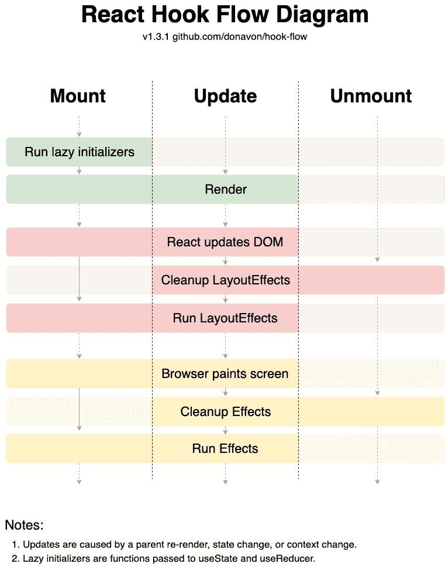

# 如何从 HOCs 迁移到 Hooks - LogRocket 博客

> 原文：<https://blog.logrocket.com/how-to-migrate-from-hocs-to-hooks-d0f7675fd600/>

未来就在眼前，你正在享受用钩子编写 React 代码的每一秒钟。你们都喜欢“使用这个”和“使用那个”,并且正在利用这个新的 React 特性实现跨领域的关注。

然后，不知从哪里冒出来，你的经理告诉你要修复一些现有代码中的一个 bug。你知道，你在 2018 年 12 月写的那篇遗产废话？你意识到你必须用生命周期和`this`来接触类组件。你昨天写的钩子可以在一秒钟内修复这个 bug，但是由于类组件不支持钩子，你只能用“老方法”了。你该怎么办？

这篇文章将向你展示两种处理这些情况的技巧——从你的钩子创建 hoc，以及从你的 hoc 创建钩子。

等等，什么是特设？

一个 HOC——或者一个更高阶的组件——是一个接受一个组件的函数，并返回一个组件，该组件使用一些额外的属性或功能来呈现所传递的组件。 [React docs](https://reactjs.org/docs/higher-order-components.html) 在更详细地解释它们方面做得很好。

### 用你的钩子创造 hoc

为什么你会想把你的花哨、光滑的钩子做成笨重、陈旧的钩子呢？听起来我们在倒退，对吗？不完全是。我们正在提供一个迁移路径，让我们**在类组件**中使用钩子逻辑。这样，我们可以开始在旧组件中使用*新*代码，而无需重写潜在的复杂逻辑。

实现一个提供钩子 API 的 HOC 是非常简单的。

```
const withMyHook = Comp => () => {
  const hookData = useMyHook();
  return <Comp ...{hookData} {...props} />;
}
```

在上面显示的代码中，我们创建了一个函数，它接收一个组件作为参数，并返回一个新的函数组件。这个函数组件调用我们的钩子，并将任何返回值传递给被传递的组件。

如果您的钩子实现需要静态数据，您可以将它作为一个参数传入:

```
const withMyHook = hookArgs => Comp => () => {
  const hookData = useMyHook(hookArgs);
  return <Comp {...hookData} {...props} />;
}
```

这里，我们将静态数据传递给我们的 HOC，它返回另一个 HOC。这就是所谓的 currying，基本上就是函数返回函数。你会这样使用它:

```
const MyDecoratedComponent = withMyHook({ 
  some: ‘value’ 
})(MyComponent);
```

如果你的钩子需要基于道具的数据，你可以考虑使用渲染道具模式:

```
const MyHook = (props) => {
 const hookData = useMyHook(props.relevantData);
 return props.children(hookData);
}
```

您的实现可能会有所不同，但是您可以将不同的实现放入存储钩子的模块中，并将特设版本或渲染属性版本导出为命名导出。

您可以像使用任何 HOC 一样使用这些 HOC——用它包装您想要增强的组件。

```
class MyComponent extends React.Component {
 …
};
const MyEnhancedComponent = withMyHook(MyComponent);
```

### 从你的 HOCs 创造钩子

如果你在使用任何非平凡的应用程序，你的代码库很可能包含一些 hoc 和渲染道具组件。随着您继续重构您的应用程序，您可能想要从这些中迁移出来，并像钩子一样重新创建您现有的共享逻辑。

重写 hoc 和渲染基于道具的组件到钩子的最大挑战是范式的改变。以前，你考虑的是生命周期方法——现在你必须考虑渲染和道具如何变化。

永远伟大的多纳文制作了这张漂亮的图表，试图将两种范式联系在一起:



Flow chart courtesy of Donavon. Code available at [https://github.com/donavon/hook-flow](https://github.com/donavon/hook-flow)

这里没有任何通用的模式可循，相反，我将展示一个例子。最后，你会对自己的重写有一些想法。

#### withScreenSize => useScreenSize

是一个为我们的组件提供当前屏幕尺寸的工具。它是这样实现的:

```
import React from ‘react’;
import debounce from ‘debounce’;
const withScreenSize = Comp => {
  return class extends React.Component {
    state = { width: null, height: null };
    updateScreenSize = debounce(() => {
      this.setState({ 
        width: window.screen.width, 
        height: window.screen.height 
      }); 
    }, 17);
    componentDidMount() {
      window.addEventListener(‘resize’, this.updateScreenSize);
    }
    componentWillUnmount() {
      window.removeEventListener(‘resize’, this.updateScreenSize);
    }
    render() {
      return <Comp {...this.props} screenSize={this.state} />
    }
  };
}
```

我们可以用这样的钩子来实现它:

```
import React from ‘react’;
import debounce from ‘debounce’;
const useScreenSize = () => {
  const [screenSize, setScreenSize] = React.useState({
    width: window.innerWidth,
    height: window.innerHeight,
  });
  const updateScreenSize = debounce(() => {
    setScreenSize({
      width: window.innerWidth,
      height: window.innerHeight,
    });
  }, 17);
  React.useEffect(() => {
    window.addEventListener(‘resize’, updateScreenSize);
    return () => {
      window.removeEventListener(‘resize’, updateScreenSize);
    };
  }, []);
 return screenSize;
};
```

我们通过`useState`钩子存储宽度和高度，并在安装组件时将其初始化为窗口尺寸。然后，我们通过使用上面的`useState`调用中的 setter 来重新实现`updateScreenSize`方法。最后，我们通过使用`useEffect`钩子来应用 resize 监听器。注意，我们传递的是一个空的依赖数组——这意味着它只会运行一次。

请记住，如果您想继续支持类组件，您可以编写一个包装器 HOC:

```
const withScreenSize = Comp => props => {
 const screenSize = useScreenSize();
 return <Comp {…props} screenSize={screenSize} />;
};
```

### 已经开始赶时髦了！

钩子已经存在了，它们将大大简化你的代码库。然而，为了从现有模式中迁移出来，有时您必须做出妥协。

本文展示了如何围绕现有的 hoc 和渲染道具组件编写包装器，以及如何开始将现有的 hoc 重构为钩子。

在从 hoc 迁移时，您遇到了哪些挑战？

## [LogRocket](https://lp.logrocket.com/blg/react-signup-general) :全面了解您的生产 React 应用

调试 React 应用程序可能很困难，尤其是当用户遇到难以重现的问题时。如果您对监视和跟踪 Redux 状态、自动显示 JavaScript 错误以及跟踪缓慢的网络请求和组件加载时间感兴趣，

[try LogRocket](https://lp.logrocket.com/blg/react-signup-general)

.

[ ](https://lp.logrocket.com/blg/react-signup-general) [](https://lp.logrocket.com/blg/react-signup-general) 

LogRocket 结合了会话回放、产品分析和错误跟踪，使软件团队能够创建理想的 web 和移动产品体验。这对你来说意味着什么？

LogRocket 不是猜测错误发生的原因，也不是要求用户提供截图和日志转储，而是让您回放问题，就像它们发生在您自己的浏览器中一样，以快速了解哪里出错了。

不再有嘈杂的警报。智能错误跟踪允许您对问题进行分类，然后从中学习。获得有影响的用户问题的通知，而不是误报。警报越少，有用的信号越多。

LogRocket Redux 中间件包为您的用户会话增加了一层额外的可见性。LogRocket 记录 Redux 存储中的所有操作和状态。

现代化您调试 React 应用的方式— [开始免费监控](https://lp.logrocket.com/blg/react-signup-general)。