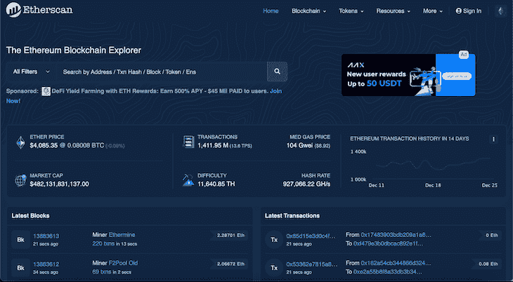
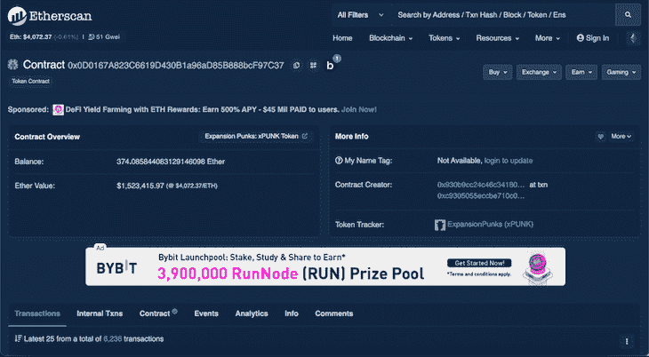
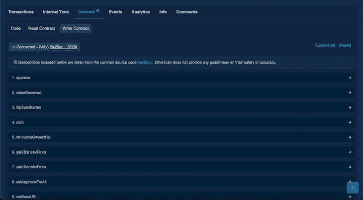
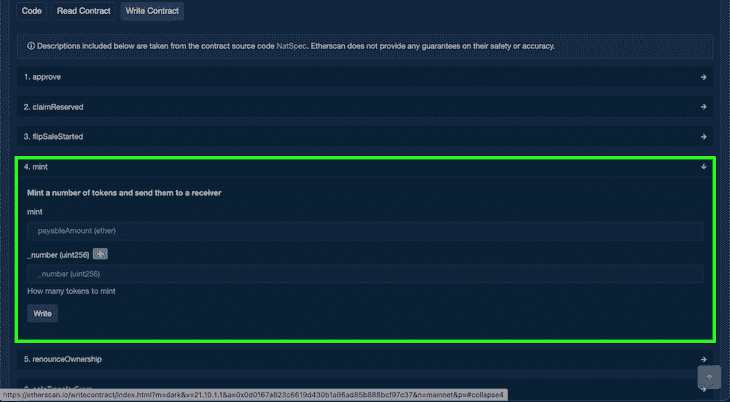
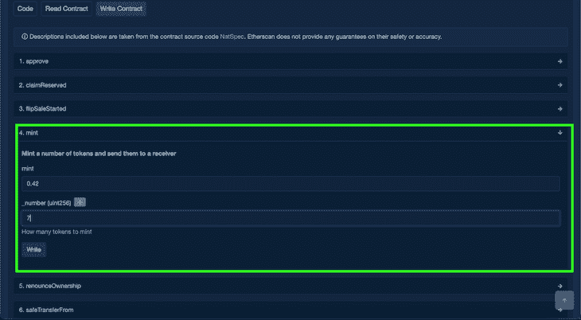

# 如何铸造一个 NFT 与以太扫描日志火箭博客

> 原文：<https://blog.logrocket.com/how-to-mint-an-nft-with-etherscan/>

[Ikeh Akinyemi Follow](https://blog.logrocket.com/author/ikehakinyemi/) Ikeh Akinyemi is a software engineer based in Rivers State, Nigeria. He’s passionate about learning pure and applied mathematics concepts, open source, and software engineering.

# 如何用以太扫描铸造 NFT

## 

2022 年 1 月 25 日 2 分钟阅读 763

NFT 提供了一种通过铸造代币在区块链上创建独特数字资产的方法。为了成功铸造 NFT，我们必须遵循 ERC-721 标准。

ERC-721 是一个自由、开放的接口标准，它描述了在以太坊区块链上构建不可替代的令牌。与可替换的 [ERC-20 代币](https://blog.logrocket.com/create-deploy-erc-20-token-ethereum-blockchain/)不同，NFT 是独一无二的数字资产，不可复制。把 NFT 想成稀有的、独一无二的收藏品，这就是它的名字。

在本教程中，我们将演示如何从 Etherscan 上的现有智能合同中创建 NFT。

我们将探索一个最近的收集项目， [Expansion Punk](https://opensea.io/collection/expansion-punk) ，使用 Etherscan 来搜索和定位智能合约。使用提供的以太网扫描接口与智能合约的公共函数进行交互，我们将使用 mint 函数直接从以太网扫描创建 NFT。

在您开始铸造之前，请记住，铸造一个特定的 NFT 集合只有在项目尚未售完的情况下才有效。

## 步骤 1:查找智能合同地址

使用唯一的 ID 地址和智能合同在 Etherscan 上索引区块链资产和活动。要在 Etherscan 上搜索智能合约，我们需要智能合约的唯一 ID 或地址。

我们可以通过打开 [OpenSea](https://opensea.io/) 上的虚拟资产的**细节**部分，找到一个 ERC-721 项目的智能合同地址。或者，我们可以检查项目的 Discord 服务器或网站的智能合同地址。

获得地址后，我们可以访问 [Etherscan.io](https://etherscan.io/) 来搜索智能合同:

## 步骤 2:使用智能合同地址搜索以太网扫描

一旦你上了 Etherscan 的网站，复制地址并粘贴到网站的搜索组件中，如上所示。

对于本教程，我们将使用扩展 Punk 智能合约地址`0x0d0167a823c6619d430b1a96ad85b888bcf97c37`来搜索智能合约的以太网扫描。

这是 Etherscan 上智能合约地址的主页。它显示有关余额、交易等的详细信息。我们最感兴趣的是**契约**标签，因为在这里我们可以找到创建 NFT 所需的函数。

点击智能合同主页上的**合同**链接，导航至**合同**标签。我们会在这个部分找到一个标有**写合同**的按钮:

点击**编写合同**按钮将打开几个选项，包括智能合同中可执行的各种界面。

但是在我们开始实现任何功能之前，我们需要首先使用 **Connect to Web3** 按钮连接到我们的 MetaMask 帐户。这将提示您在浏览器中打开元掩码扩展。如果您有多个帐户，最好选择并连接您的首选帐户。

## 步骤 4:从智能合约中创建 NFT

一旦我们连接了 MetaMask 帐户，我们就可以开始与智能合约界面进行交互了。

在大多数智能合约中，我们应该寻找的铸造 NFT 的函数是铸造函数或索赔函数。该名称对于项目是唯一的；您可以用任何首选的函数名来区分铸造函数。

这个项目使用 mint 函数名来实现它的 mint 函数。找到智能合约的 mint 函数(这是第四个函数)。如下所示展开它:

展开 **mint** 部分将显示输入字段，以提供您想要创建的选项。第一个输入字段为我们提供了在第二个输入中插入铸造价格(本例中为 0.42 ETH)和您想要铸造的数字(7)的选项。务必检查项目的铸造选项，以向输入提供所需的信息。

接下来，我们单击 **Write** 按钮将事务发送到区块链。在某些情况下，此过程可能需要一些时间来完成交易。我们可以通过调整 MetaMask 钱包上的汽油费来支付更高的汽油费，以加快这一过程。

## 结论

上述步骤包括在 Etherscan 上使用智能合约铸造不可替换令牌的过程。但是请记住，每个智能合同的步骤并不相同。在使用智能合约创建 NFT 之前，您需要知道智能合约地址，因为每个智能合约都是不同的。

此外，区块链是不可逆的，因此在确认之前一定要仔细检查所有交易。以这种方式制作 NFT 的一个很好的用例是当一个项目的网站由于高流量而关闭时。这是用项目网站上的智能合同制作 NFTs 的一个很好的替代方法。

## 加入像 Bitso 和 Coinsquare 这样的组织，他们使用 LogRocket 主动监控他们的 Web3 应用

影响用户在您的应用中激活和交易的能力的客户端问题会极大地影响您的底线。如果您对监控 UX 问题、自动显示 JavaScript 错误、跟踪缓慢的网络请求和组件加载时间感兴趣，

[try LogRocket](https://lp.logrocket.com/blg/web3-signup)

.

[https://logrocket.com/signup/](https://lp.logrocket.com/blg/web3-signup)

LogRocket 就像是网络和移动应用的 DVR，记录你的网络应用或网站上发生的一切。您可以汇总和报告关键的前端性能指标，重放用户会话和应用程序状态，记录网络请求，并自动显示所有错误，而不是猜测问题发生的原因。

现代化您调试 web 和移动应用的方式— [开始免费监控](https://lp.logrocket.com/blg/web3-signup)。