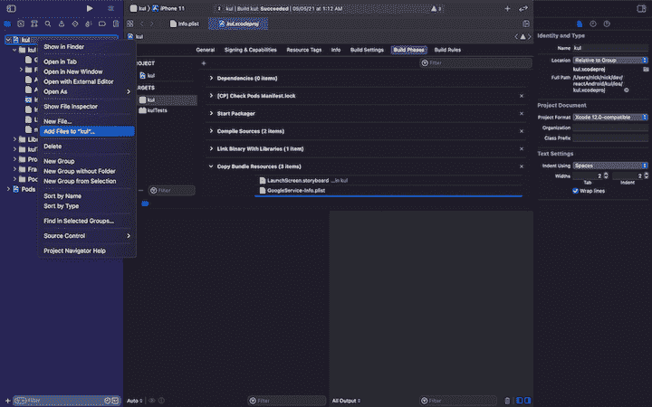
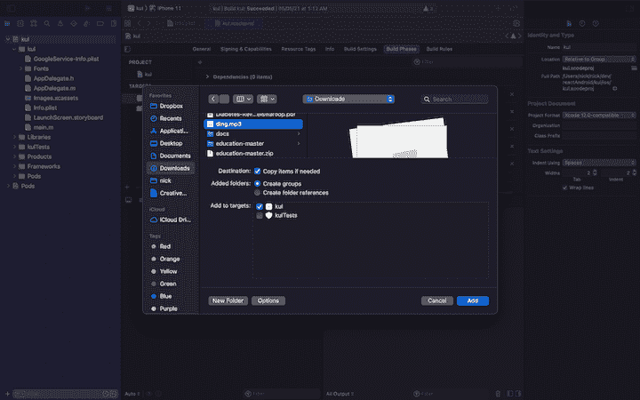
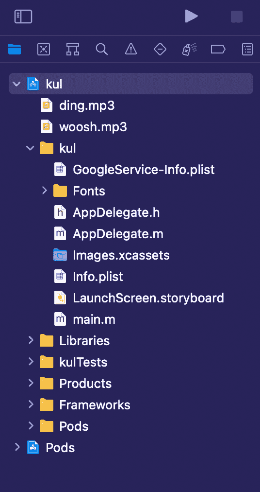

# 如何使用 react-native-sound - LogRocket 博客在 React Native 中播放声音

> 原文：<https://blog.logrocket.com/how-to-play-sounds-in-react-native-using-react-native-sound/>

在你的应用程序中添加声音是吸引用户的好方法。发出新通知时的轻微铃声，发出电子邮件时的“嗖”声，或者删除文件时的破碎声，都有助于为 React 原生应用程序建立更好的用户体验。

在本指南中，我们将探索 react-native-sound，这是一个强大的音频组件，可以为 React Native 应用程序处理与声音相关的任务。

我们将通过实际例子介绍以下内容:

为了跟上进度，你应该熟悉 React Native 的[基础知识，包括](https://blog.logrocket.com/how-to-build-ios-apps-using-react-native/) [JSX](https://blog.logrocket.com/diving-into-the-new-jsx-transform/) 、[c](https://blog.logrocket.com/a-complete-guide-to-default-props-in-react-984ea8e6972d/)组件 (class 和[f](https://blog.logrocket.com/react-pure-components-functional/)functional)，以及[造型](https://blog.logrocket.com/react-native-styling-tutorial-with-examples/)。

您可以简单地复制并粘贴本指南中的代码块，但是我建议您通读整个教程以获得完整的理解。本指南假设您已经完成了应用程序的基本设置。

## 什么是反应原生音？

[react-native-sound](https://github.com/zmxv/react-native-sound) 是 React Native 中的一个模块，用于在 iOS、Android 和 Windows 上播放声音片段。此模块使您能够添加各种来源的音频，如 app bundle(本机)、JavaScript bundle 或远程路径(本地存储或远程 URL)。

react-native-sound 更像是一个类，而不是一个类组件，这有助于使用预定义的方法来控制实例，而无需更新状态或属性。这缓解了与应用程序的缓慢重新呈现相关的担忧。

虽然它的文档警告 react-native-sound 是“alpha 质量，可能有错误”，但它是当今最受欢迎和使用最广泛的 React Native sound 库之一。

## 设置 react-native-sound (iOS 和 Android)

要开始使用 react-native-sound，如果您想要在应用程序中播放的声音无法远程获得(即，它们在应用程序的包中，而不是在设备的外部存储设备或远程服务器上)，您需要这些声音。

要将 react-native-sound 添加到您的应用程序中，只需使用您首选的包管理器(如 npm 或 yarn)在应用程序目录中输入以下命令:

```
$ yarn add react-native-sound 

```

如果你正在为 Android 构建，链接是在构建过程中处理的。

对于 iOS，只需导航到 iOS 目录并调用`pod install`。这将增加反应原生声音所需的吊舱。

## 向 React 本机应用程序添加声音

现在是时候添加你想要播放的声音了。这一步只是为了学习如何将音频文件捆绑到原生包中。我们还将讨论一种从资产目录中获取音频文件的简单方法。

对于 Android，创建原始目录并将声音复制到:

```
{appDirectory}/android/app/src/main/res/raw

```

对于 iOS，在 Xcode 中打开工作区，然后右键单击项目，点击**将文件添加到{project_name}** ，如下图所示:





结果应该是这样的:



添加声音文件后，只需构建应用程序并在模拟器上运行，最好是在真实设备上运行。

## 播放捆绑包中的声音

成功运行 app 后，就该开始编码了。

首先，我们需要在应用程序中导入声音组件:

```
import Sound from 'react-native-sound';

```

在设置我们将要播放的声音之前，我们需要指定声音的类别:

```
Sound.setCategory('Playback');

```

要初始化声音，请使用以下代码:

```
var ding = new Sound('ding.mp3', Sound.MAIN_BUNDLE, (error) => {
  if (error) {
    console.log('failed to load the sound', error);
    return;
  }
  // when loaded successfully
  console.log('duration in seconds: ' + whoosh.getDuration() + 'number of channels: ' + whoosh.getNumberOfChannels());
});

```

上面的代码使用第一个参数`ding.mp3`，这是使用第二个参数`Sound.MAIN_BUNDLE`指定的包中的一个文件，并在第三个参数中返回一个回调。

`\``getDuration`用于获取音频文件的持续时间，单位为秒，`getNumberOfChannels`用于获取音频通道的计数。

要设置播放的音量，我们可以使用以下方法:

```
ding.setVolume(1);

```

这里，`1`是最高音量，`0`是最低音量，两者之间的差值以小数位表示——例如，要将音量减小到 50%，您可以将其设置为`0.5`。

要播放文件，我们可以使用来自`Sound`的`play`方法，如下所示:

```
ding.play(success => {
  if (success) {
    console.log('successfully finished playing');
  } else {
    console.log('playback failed due to audio decoding errors');
  }
});

```

在成功完成投资回报后会有一个回调(或者如果出了什么问题，就此而言)。

总结上述步骤:

1.  设置要播放的声音的类别
2.  初始化声音文件
3.  如有必要，调节音量
4.  播放声音

下面是播放包中声音的最终代码:

```
import React, {useEffect} from 'react';
import {View, StyleSheet, TouchableOpacity} from 'react-native';
import Ionicons from 'react-native-vector-icons/Ionicons';

var Sound = require('react-native-sound');

Sound.setCategory('Playback');

var ding = new Sound('ding.mp3', Sound.MAIN_BUNDLE, (error) => {
if (error) {
    console.log('failed to load the sound', error);
    return;
  }
  // if loaded successfully
  console.log('duration in seconds: ' + ding.getDuration() + 'number of channels: ' + ding.getNumberOfChannels());

});
const App = () => {
  useEffect(() => {
    ding.setVolume(1);
    return () => {
      ding.release();
    };
  }, []);
  const playPause = () => {
    ding.play(success => {
      if (success) {
        console.log('successfully finished playing');
      } else {
        console.log('playback failed due to audio decoding errors');
      }
    });
  };
  return (
    <View style={styles.container}>
      <TouchableOpacity style={styles.playBtn} onPress={playPause}>
        <Ionicons name={'ios-play-outline'} size={36} color={'#fff'} />
      </TouchableOpacity>
    </View>
  );
};
const styles = StyleSheet.create({
  container: {
    flex: 1,
    alignItems: 'center',
    justifyContent: 'center',
    backgroundColor: '#000',
  },
  playBtn: {
    padding: 20,
  },
});
export default App;

```

## 导入声音文件

现在，对于来自 assets 目录(或应用程序中的任何目录)的文件，我们可以使用相同的旧的`require`或`import`来获取文件的实例，并使用 react-native-sound 播放它。

只需导入文件—

```
import dings from './src/assets/ding.mp3';

```

—并在`Sound`包中使用它，如下所示:

```
var ding = new Sound(dings, error => {
  if (error) {
    console.log('failed to load the sound', error);
    return;
  }
  // if loaded successfully
  console.log('duration in seconds: ' + ding.getDuration() + 'number of channels: ' + ding.getNumberOfChannels());
});

```

与捆绑文件相比，使用从资产中导入或需要的文件的不同之处在于，您不必为文件指定`basePath`。相反，回调会取代它的位置。

下面是组件播放导入文件的代码:

```
import React, {useEffect} from 'react';
import {View, StyleSheet, TouchableOpacity} from 'react-native';
import dings from './src/assets/ding.mp3';
import Ionicons from 'react-native-vector-icons/Ionicons';

var Sound = require('react-native-sound');

Sound.setCategory('Playback');

var ding = new Sound(dings, error => {
  if (error) {
    console.log('failed to load the sound', error);
    return;
  }
  // if loaded successfully
  console.log(
    'duration in seconds: ' +
      ding.getDuration() +
      'number of channels: ' +
      ding.getNumberOfChannels(),
  );
});
const App = () => {
  useEffect(() => {
    ding.setVolume(1);
    return () => {
      ding.release();
    };
  }, []);
  const playPause = () => {
    ding.play(success => {
      if (success) {
        console.log('successfully finished playing');
      } else {
        console.log('playback failed due to audio decoding errors');
      }
    });
  };
  return (
    <View style={styles.container}>
      <TouchableOpacity style={styles.playBtn} onPress={playPause}>
        <Ionicons name={'ios-play-outline'} size={36} color={'#fff'} />
      </TouchableOpacity>
    </View>
  );
};
const styles = StyleSheet.create({
  container: {
    flex: 1,
    alignItems: 'center',
    justifyContent: 'center',
    backgroundColor: '#000',
  },
  playBtn: {
    padding: 20,
  },
});
export default App;

```

下面是上面代码的结果。只需点击播放按钮即可播放声音。


## 从远程路径播放声音文件

您可能想要播放远程文件或本地存储中的文件。这基本上和使用 react-native-sound 播放捆绑文件一样简单。您只需要将 URL 作为第一个参数添加到`Sound`并将第二个参数设置为 null，因为该文件来自远程或本地存储，而不是来自应用程序。

```
var audio = new Sound(
  'https://file-examples-com.github.io/uploads/2017/11/file_example_MP3_700KB.mp3',
  null,
  error => {
    if (error) {
      console.log('failed to load the sound', error);
      return;
    }
    // if loaded successfully
    console.log(
      'duration in seconds: ' +
        audio.getDuration() +
        'number of channels: ' +
        audio.getNumberOfChannels(),
    );
  },
);

```

下面是在应用程序关闭或组件卸载后如何播放、暂停和释放音频的完整示例:

```
import React, {useEffect, useState} from 'react';
import {View, StyleSheet, TouchableOpacity} from 'react-native';
import Ionicons from 'react-native-vector-icons/Ionicons';

var Sound = require('react-native-sound');

Sound.setCategory('Playback');

var audio = new Sound(
  'https://file-examples-com.github.io/uploads/2017/11/file_example_MP3_700KB.mp3',
  null,
  error => {
    if (error) {
      console.log('failed to load the sound', error);
      return;
    }
    // if loaded successfully
    console.log(
      'duration in seconds: ' +
        audio.getDuration() +
        'number of channels: ' +
        audio.getNumberOfChannels(),
    );
  },
);
const App = () => {
  const [playing, setPlaying] = useState();
  useEffect(() => {
    audio.setVolume(1);
    return () => {
      audio.release();
    };
  }, []);
  const playPause = () => {
    if (audio.isPlaying()) {
      audio.pause();
      setPlaying(false);
    } else {
      setPlaying(true);
      audio.play(success => {
        if (success) {
          setPlaying(false);
          console.log('successfully finished playing');
        } else {
          setPlaying(false);
          console.log('playback failed due to audio decoding errors');
        }
      });
    }
  };
  return (
    <View style={styles.container}>
      <TouchableOpacity style={styles.playBtn} onPress={playPause}>
        <Ionicons
          name={playing ? 'ios-pause-outline' : 'ios-play-outline'}
          size={36}
          color={'#fff'}
        />
      </TouchableOpacity>
    </View>
  );
};
const styles = StyleSheet.create({
  container: {
    flex: 1,
    alignItems: 'center',
    justifyContent: 'center',
    backgroundColor: '#000',
  },
  playBtn: {
    padding: 20,
  },
});
export default App;

```

`.release()`用于释放为播放音频文件而保留的内存。在组件卸载后释放内存或音频不再播放是非常重要的。这有助于避免内存泄漏或其他错误。

## 

react-native-sound 是一个很棒的模块 用于 添加ingsounds或者为您的 React Native app 构建一个ing简单的音频播放器。

In this tutorial, we went over how to add and play audio from a native bundle as well as from a remote file. If you want to explore more options in this regard, I would suggest trying out the [expo-av](https://docs.expo.dev/versions/latest/sdk/av/) module of Expo [unimodules](https://docs.expo.dev/bare/installing-unimodules/) to play audio or video files in your React Native app.

## [LogRocket](https://lp.logrocket.com/blg/react-native-signup) :即时重现 React 原生应用中的问题。

[](https://lp.logrocket.com/blg/react-native-signup)

[LogRocket](https://lp.logrocket.com/blg/react-native-signup) 是一款 React 原生监控解决方案，可帮助您即时重现问题、确定 bug 的优先级并了解 React 原生应用的性能。

LogRocket 还可以向你展示用户是如何与你的应用程序互动的，从而帮助你提高转化率和产品使用率。LogRocket 的产品分析功能揭示了用户不完成特定流程或不采用新功能的原因。

开始主动监控您的 React 原生应用— [免费试用 LogRocket】。](https://lp.logrocket.com/blg/react-native-signup)