# 如何防止 CSS 溢出滚动

> 原文：<https://blog.logrocket.com/how-to-prevent-overflow-scrolling-css/>

你曾经因为网页内容不合适而在屏幕上看到水平滚动条吗？你是否打开了一个模态，而页面的其余部分(背景内容)还在滚动？你有没有用不同的浏览器测试过你的网站，但是页面水平滚动？

我相信你有。然而，每个前端开发人员都经常遇到这个问题。这是与我们的 CSS 样式相关的滚动溢出问题。

本文将讨论什么是 CSS 中的溢出滚动，解释导致这个问题的原因，并建议解决这个问题的方法，包括:

我认为我们在学习它的时候会有很多乐趣。

## CSS 中什么是溢出？

在我们看 CSS 中的溢出属性是什么意思之前，我们首先需要明白"[CSS 中的一切都是一个盒子](https://blog.logrocket.com/css-margin-vs-padding/#css-box-model)。"我们通过减少或增加高度和宽度来调整这些框的大小，以适应我们想要的设计。

在下面的图片和代码中，我们将用红色标出我们的根 HTML 文件，以便更好地理解我们的意思:

```
* {
  outline: 1px solid red;
}

```

[](https://blog.logrocket.com/?attachment_id=104726)

CSS overflow 属性指定或控制如何处理太大而无法放入元素框中的内容。溢出框中的内容被剪切或隐藏，或者可以添加滚动条来查看溢出的内容。

但是，请注意，溢出属性仅适用于具有指定高度和宽度的块元素。

溢出属性适用于两个轴，即水平轴和垂直轴。

[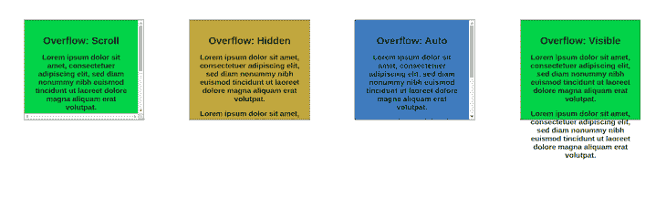](https://blog.logrocket.com/?attachment_id=104730)

上面的四个框是溢出属性的四个可能值。

overflow 属性的 scroll 值添加了水平和垂直滚动条，这样，如果内容太大而无法容纳，您可以调整或滚动内容。

### 隐藏值

“隐藏”值确保隐藏视口外部的内容，只有视口内部的部分可见。

### 自动阀门

使用 auto 值时，在视口中不可见的内容将被隐藏，并引入滚动条，以便扩展的内容能够适合并可见。

### 可见价值

使用 visible 值时，无论元素容器的高度和宽度如何，都会显示整个内容。

既然我们已经看到并理解了什么是 CSS 溢出属性，我们可以检查是什么导致了滚动问题，特别是水平滚动问题，以及如何修复它们。

### Max viewport width

视口宽度，也称为 vw，是 CSS 中长度的度量单位之一。当水平滚动时，使用这个单元有时会导致问题。

如果您为页面内容添加 100vw 的宽度，这可能会发生，这意味着它会自动构成视窗宽度加上滚动条宽度的 100%。

但是，请务必注意，滚动条总是可见的，以指示内容在视区之外或低于视区的高度。

[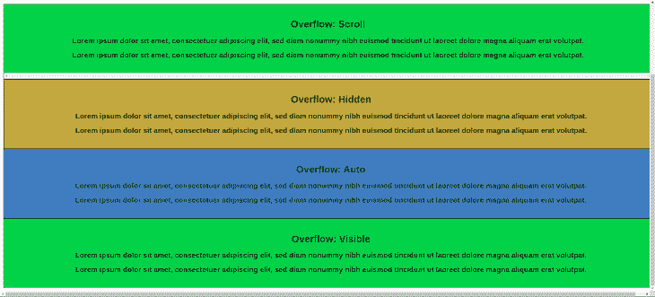](https://blog.logrocket.com/?attachment_id=104732)

要解决这个问题，请避免使用 vw 作为您的`max-width`，而是使用 100%的`max-width`。这将把父容器的宽度转换为子容器的宽度。

### CSS 网格

[CSS 网格](https://blog.logrocket.com/css-grid-getting-started/)也会导致水平滚动问题，原因有二:

1.  百分比的使用(`%`)
2.  使用像素(`px`)

让我们从使用百分比开始。在您想要水平放置四个元素的场景中，我们可以通过编写以下代码来使用 CSS 网格:

```
.grid-container {
  display: grid;
  grid-template-columns: repeat(4, 25%)
}

```

这样做很好，因为我们给四个元素相同的宽度 25% (100/4)。

[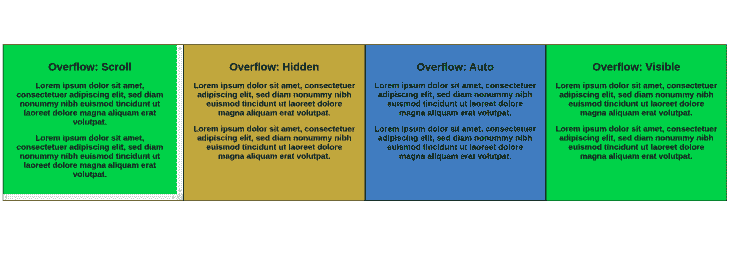](https://blog.logrocket.com/?attachment_id=104736)

此外，假设我们希望分隔这些项目，因为它们是集群的，我们可以添加一个`10px`的`grid-gap`:

```
.grid-container {
  display: grid;
  grid-template-columns: repeat(4, 25%);
  grid-gap: 10px
}

```

结果，水平滚动自动发生，因为`grid-gap`值被加到宽度上，超过 100%。

[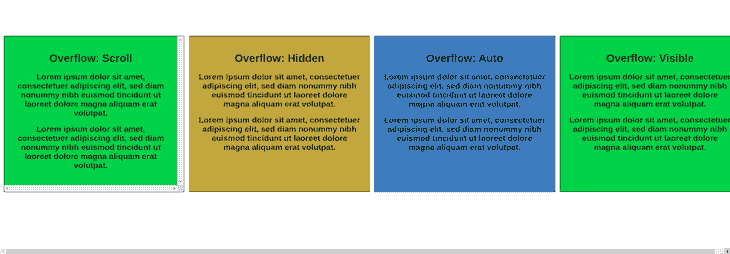](https://blog.logrocket.com/?attachment_id=104738)

下一个问题出现在使用像素时；与上面的百分比示例类似，使用像素会产生水平滚动问题。例如，假设您想要将相同的网格应用于一些容器，但使用像素，因为您想要指定您想要的内容:

```
.grid-container {
  display: grid;
  grid-template-columns: 1fr 350px 350px 1fr;
  grid-gap: 50px
}

```

虽然这不会导致桌面上的滚动问题，但它会导致任何较小屏幕上的水平滚动问题，如移动电话。为什么？像素宽度超过了移动视区宽度。

因此，作为解决这个问题的建议，避免在较小的屏幕上使用像素和百分比。相反，使用分数和桌面屏幕上的媒体查询来指定您的独特宽度。

让我们看看如何利用这一点:

```
.grid-container {
    display: grid;
    grid-template-columns: 1fr;
    grid-gap: 50px;
}
@media (min-width: 600px) {
    .grid-container {
        grid-template-columns: 1fr 350px 350px 1fr;
    }
}

```

根据图像，它在台式机上使用媒体查询中指定的`grid-column`，在较小的屏幕上使用默认的`grid-column`(`1fr`)。

[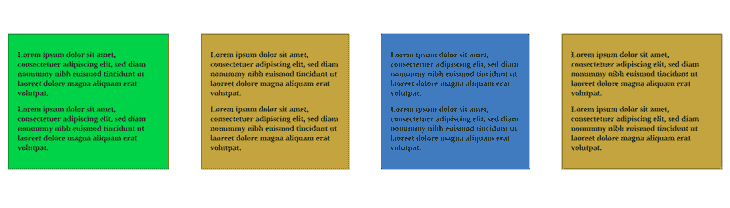](https://blog.logrocket.com/?attachment_id=104741)

[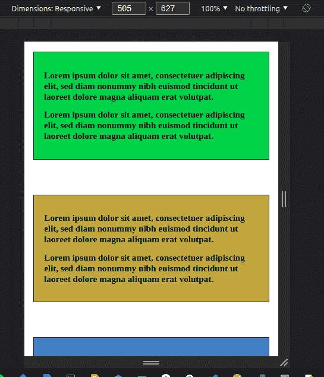](https://blog.logrocket.com/?attachment_id=104743)

### 没有用 Flexbox 包装

[使用 CSS Flexbox](https://blog.logrocket.com/how-to-build-a-basic-flexbox-layout-a-tutorial-with-examples/) 时，建议包装您的 flex 项目。但是，如果我们不这样做，而是在较小的屏幕上查看页面，flex 项目可能不适合屏幕的视窗，因此会导致水平溢出问题:

```
.flex-container {
  display: flex;
}

```

[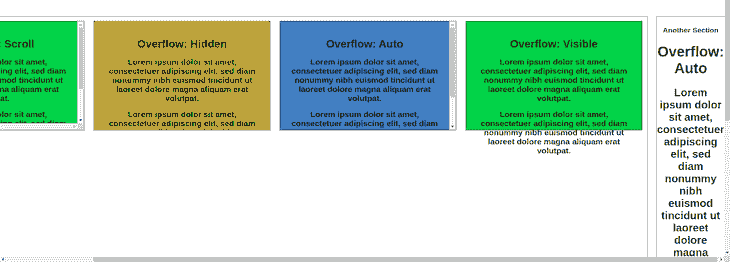](https://blog.logrocket.com/?attachment_id=104745)

为了解决这个问题，您应该始终包装您的 flex 项目。通过将`flex-wrap`添加到您的 flex 项目中，flex 项目将彼此对齐，以适应更小的屏幕:

```
.flex-container {
  display: flex;
  flex-wrap: wrap; 
}

```

[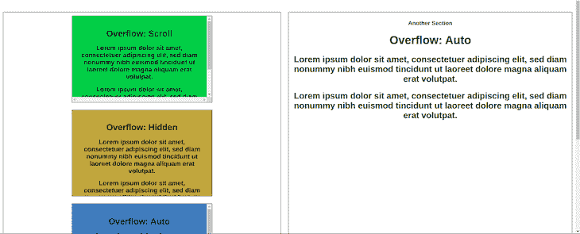](https://blog.logrocket.com/?attachment_id=104747)

### 使用没有`max-width`的图像

Whenanimage的宽度大于 父 b ox 或容器，父 boxen larges所以图像可以适合 。这有时会导致水平滚动问题。

[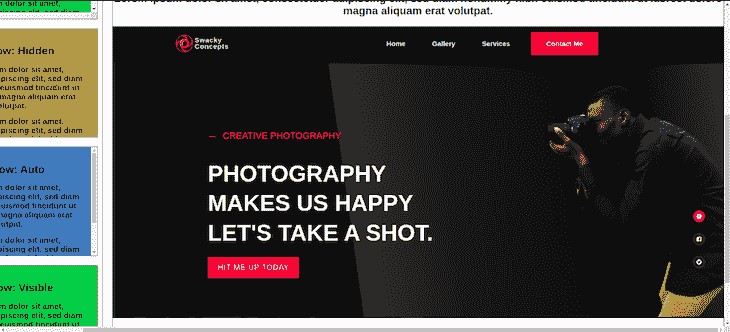](https://blog.logrocket.com/?attachment_id=104750)

要解决这个问题，只需在图像中添加一个`100%`的`max-width`。这种样式会使图像占据与父框相同的宽度，从而适合父容器，而无需将其放大:

```
image {
  max-width: 100%
}

```

[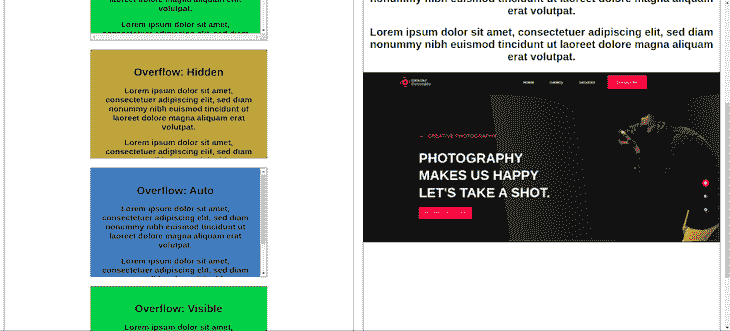](https://blog.logrocket.com/?attachment_id=104753)

我们已经看到了可能遇到水平滚动问题的不同场景和实例。当我们看到这些问题时，我们也看到了如何修复它们，但是仍然缺少一件事。

想象一下，在遇到溢出滚动问题之前，您写了许多行代码，而您甚至不知道这个问题是什么。你是做什么的？您尝试调试问题。

有两种方法可以解决这个问题:

1.  使用 CSS 调试
2.  使用 Devtools

### 使用 CSS 调试

使用 CSS 进行调试是解决问题的最有效方式。为此，将轮廓样式添加到 CSS 的根，并查看哪个框或容器重叠并导致了问题。

要使用 CSS 进行调试，请编写以下代码:

```
* {
  outline: 1px solid red;
}

```

从下面的图片中，你可以在你的网站的每个框中看到一个红色的 CSS 轮廓，你可以通过它来了解你的网站的问题所在。

[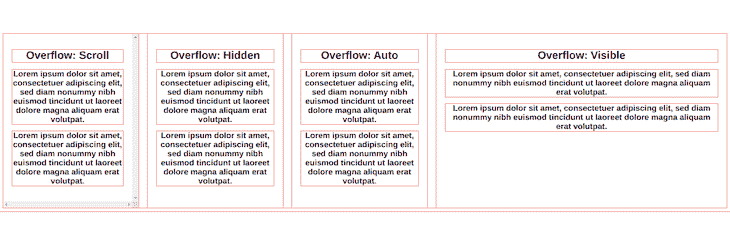](https://blog.logrocket.com/?attachment_id=104755)

类似地，你也可以[使用浏览器开发工具来调试](https://blog.logrocket.com/using-chrome-devtools-to-debug-css-grid/)水平溢出问题。Devtools 是一套内置在浏览器中的 web 开发工具，允许您测试、创建和调试软件和网站。

打开 Devtools 有不同的方法:你可以在网页上点击右键，点击 **Inspect** 选项，或者按 F12 键，Ctrl+Shift+I，或者 Ctrl+Shift+C。

然后，您可以通过删除网页内容进行调试，直到发现问题。然后，您可以转到 CSS 并进行必要的更改。

溢出滚动的问题不仅发生在水平滚动上，也可能发生在模态上。

例如，您可能打开一个模态，背景内容继续滚动。这不是您想要提供的最佳用户体验，相反，当您打开模式时，背景内容保持不变。

[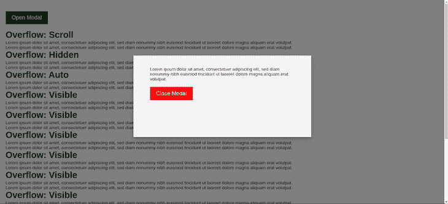](https://blog.logrocket.com/?attachment_id=104757)

下面是我们实现这一目标的两种方法。旧的方法是将位置设置为`fixed`或者将溢出设置为`hidden`。这可以工作，但它似乎不能在所有浏览器上工作，如 Safari 浏览器:

```
// set body position to fixed
const open = document.querySelector('#open-modal');
const closeModalBtn = document.querySelector('#close');
const modal = document.querySelector('.modal-container');
// Open modal
open.addEventListener('click', () => {
    modal.style.display = 'block';
    document.body.style.position = 'fixed';
});
// Close modal
closeModalBtn.addEventListener('click', () => {
    modal.style.display = 'none';
    document.body.style.position = '';
});

OR

// set body overflow to hidden
const open = document.querySelector('#open-modal');
const closeModalBtn = document.querySelector('#close');
const modal = document.querySelector('.modal-container');
// Open modal
open.addEventListener('click', () => {
    modal.style.display = 'block';
    document.body.style.overflow = 'hidden';
});
// Close modal
closeModalBtn.addEventListener('click', () => {
    modal.style.display = 'none';
    document.body.style.overflow = 'visible';
});

```

[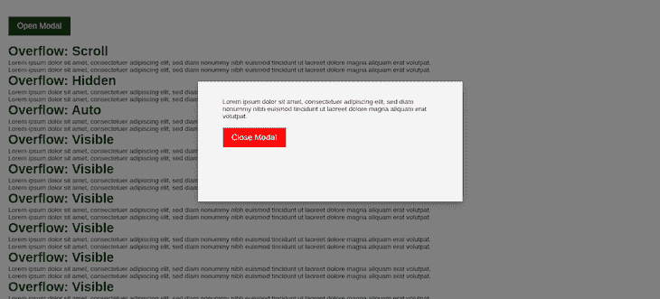](https://blog.logrocket.com/?attachment_id=104760)

同样，实现这一点的另一种方法是，当模式打开时，以编程方式添加一个新的 CSS 类，当模式关闭时，移除该类。

让我们首先为这个类编写 CSS:

```
.modal-active {
    touch-action: none;
    -webkit-overflow-scrolling: none;
    overflow: hidden;
    overscroll-behavior: none;
}

```

然后，每当我们打开模态时，让我们使用 JavaScript 添加该类:

```
const open = document.querySelector('#open-modal');
const closeModalBtn = document.querySelector('#close');
const modal = document.querySelector('.modal-container');
// Open modal
open.addEventListener('click', () => {
    modal.style.display = 'block';
// add modal-active class
    document.body.classList.add('modal-active');
});
// Close modal
closeModalBtn.addEventListener('click', () => {
    modal.style.display = 'none';
// remove modal-active class
    document.body.classList.remove('modal-active');
});

```

在模式包含一些无法看到的内容的情况下，您可以向模式添加滚动行为，以便向下滚动来查看内容:

```
.modal-content {
    overscroll-behavior-y: contain;
    overflow-y: auto;
}

```

[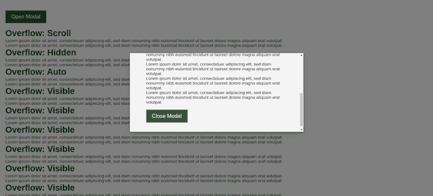](https://blog.logrocket.com/?attachment_id=104762)

## 结论

现在我们了解了溢出滚动问题的各种情况和原因，以及如何修复这些问题。

同样重要的是要注意，在建立网站时，你总是可以截断文本和断句。这是因为用户可能会键入过长的文本，这些文本可能会超出或溢出容器，从而导致混乱的设计或水平溢出滚动。

## 你的前端是否占用了用户的 CPU？

随着 web 前端变得越来越复杂，资源贪婪的特性对浏览器的要求越来越高。如果您对监控和跟踪生产环境中所有用户的客户端 CPU 使用、内存使用等感兴趣，

[try LogRocket](https://lp.logrocket.com/blg/css-signup)

.

[](https://lp.logrocket.com/blg/css-signup)[https://logrocket.com/signup/](https://lp.logrocket.com/blg/css-signup)

LogRocket 就像是网络和移动应用的 DVR，记录你的网络应用或网站上发生的一切。您可以汇总和报告关键的前端性能指标，重放用户会话和应用程序状态，记录网络请求，并自动显示所有错误，而不是猜测问题发生的原因。

现代化您调试 web 和移动应用的方式— [开始免费监控](https://lp.logrocket.com/blg/css-signup)。