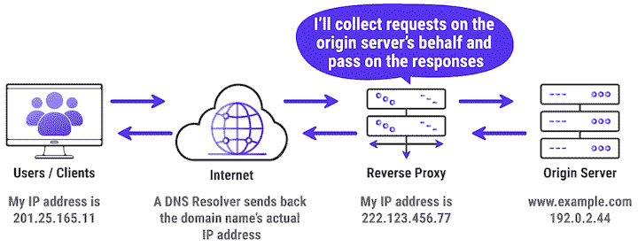
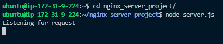
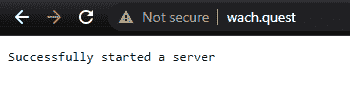
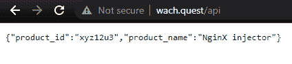

# 如何使用 Nginx 作为 Node.js 服务器的反向代理

> 原文：<https://blog.logrocket.com/how-to-run-a-node-js-server-with-nginx/>

Node.js 是几乎所有基于微服务的开发和交付的重要工具。它也是用 JavaScript 创建服务器应用程序并提供 web 服务器和应用服务器功能的领先工具。

但是 Node.js 有一些缺点和漏洞，会导致基于节点的应用程序性能不理想，甚至崩溃。例如，基于 Node.js 的 web 应用程序容易由于 IO 绑定操作或快速流量增长而导致代码执行缓慢甚至崩溃。他们有时还会在提供静态内容(如图像和 JavaScript 文件)和跨多个服务器的负载平衡方面遇到困难。

幸运的是，您可以在多个应用服务器之间[缓存静态内容](https://blog.logrocket.com/caching-headers-a-practical-guide-for-frontend-developers/)，反向代理和[负载平衡](https://blog.logrocket.com/7-ways-to-improve-node-js-performance-at-scale/)，并使用 Nginx 管理客户端之间的端口争用。这使得 Nginx 成为提高 Node.js 性能的优秀工具。

在本教程中，我们将展示如何用 Nginx 反向代理 Node.js 应用程序。我们将构建一个简单的 Node.js 应用程序，它将运行在端口 3000 上，并使用 Nginx 作为 Node.js 应用程序的反向代理服务器。该应用程序将使用域名进行寻址。



Source: [Kinsta](https://kinsta.com/blog/reverse-proxy/)

要跟进，您应该:

*   了解 web、web 服务器和 web 浏览器如何通信
*   JavaScript、Node.js、[异步编程](https://blog.logrocket.com/parallelism-concurrency-and-async-programming-in-node-js/)、计算机网络和 DNS 的基础知识
*   来自[公共云提供商](https://www.amazonaws.cn/en/getting-started/tutorials/launch-a-virtual-machine/)的 Ubuntu 虚拟机，对端口 [22](https://phoenixnap.com/kb/ssh-to-connect-to-remote-server-linux-or-windows) ，80 和 3000 开放
*   安装在本地机器上的 Node.js
*   来自 DNS 注册商的域名
*   安装在本地设备上的 Vim 文本编辑器

## 什么是服务器和 web 服务器？

服务器是一台与其他计算机通信的计算机，为它们提供这些计算机请求的信息。这些计算机也称为客户端，通过局域网(LAN)或广域网(WAN)连接到服务器。服务器通过网络在多个位置发送和收集信息。

web 上的服务器(称为 web 服务器)通过超文本传输协议(HTTP)接收来自客户机的请求，并返回 HTTP 响应，该响应可以是 HTML 网页，也可以是 API 调用的 JSON 格式。

Web 服务器是使用 HTTP 作为与其他计算机通信的客户机-服务器协议的任何数据交换的基础。作为计算机的 web 服务器包括硬件和软件，是 web 开发中的基本组件。软件方面包括理解 URL 和控制网络用户如何访问托管文件的部分。

## Nginx 是什么？

根据文档， [Nginx](https://nginx.org/en/?_ga=2.11834167.221818483.1628285825-2025993407.1628106374) (发音为“engine X”)是一个 HTTP 和反向代理服务器、邮件代理服务器和通用 TCP/UDP 代理服务器，最初由伊戈尔·塞索耶夫编写。

Nginx 用于各种有助于提高 Node.js 性能的任务。主要特性包括:

*   反向代理服务器——随着应用流量的增加，提高性能的最佳方法是在 Node.js 服务器前使用 Nginx 作为反向代理服务器，以平衡服务器间的流量负载。这是 Nginx 在 Node.js 应用程序中的核心用例
*   无状态负载平衡—这提高了性能，同时通过发送客户端请求，由任何能够访问所请求文件的服务器来完成，减少了后端服务的负载
*   缓存静态内容——在 Node.js 应用程序中提供静态内容，并使用 Nginx 作为反向代理服务器，将应用程序性能提高了一倍，最高可达每秒 1，600 个请求
*   实现 SSL/TLS 和 HTTP/2——考虑到最近在 Node.js 应用程序中从使用 SSL/TLS 到保护用户交互的转变，Nginx 也支持 HTTP/2 连接
*   性能跟踪——您可以使用 Nginx 的实时仪表板上提供的统计数据，实时跟踪 Node.js 应用程序的整体性能
*   可伸缩性—根据您所服务的资产，您可以利用 Nginx 中功能全面的 HTTP、TCP 和 UDP 负载平衡来扩展 Node.js 应用程序

Nginx 目前支持 7 种脚本语言:Go、Node.js、Perl、PHP、Python、Ruby、Java Servlet 容器(最后一种是实验模块)。它使您能够在同一台服务器上运行用不同语言编写的应用程序。

让我们设置 Node.js 应用程序。

## 创建 Node.js 应用程序

对于这个简单的 Node.js 应用程序，我们将使用 Node.js 提供的 HTTP 模块构建一个 Node.js 服务器。

```
mkdir nginx_server_project
cd nginx_server_project
npm init -y

```

上面的代码将创建文件夹`nginx_server_project`并将目录更改为文件夹。然后，我们用 npm 初始化 Node.js 应用程序，使用`-y`标志将`yes`设置为所有问题的默认答案。

 *下一步是创建包含应用程序源代码的`server.js`文件。用您选择的任何 IDE 或文本编辑器打开它:

```
touch server.js
vim server.js

```

现在是构建和启动服务器的时候了。让我们定义两个额外的子域，作为测试我们的应用程序功能是否完整的手段:

```
const http = require("http");

const server = http.createServer((req, res) => {
  const urlPath = req.url;
  if (urlPath === "/overview") {
    res.end('Welcome to the "overview page" of the nginX project');
  } else if (urlPath === "/api") {
    res.writeHead(200, { "Content-Type": "application/json" });
    res.end(
      JSON.stringify({
        product_id: "xyz12u3",
        product_name: "NginX injector",
      })
    );
  } else {
    res.end("Successfully started a server");
  }
});

server.listen(3000, "localhost", () => {
  console.log("Listening for request");
});

```

我们创建了一个带有 Node.js HTTP 模块的服务器，该模块是使用上面代码中的`require`函数导入的。在我们的服务器中，我们将根据当前的路线呈现两种不同的响应。两条路线分别是`/overview`和`/api`。

在`/overview`子域上，我们将呈现一个纯文本，而在`/api`子域上，我们将呈现一个 JSON 对象。上述应用程序将在您的虚拟机的公共 IPv4 地址上被访问，例如在端口`3000`上的`34.211.115.4`。

现在节点服务器应用程序已经准备好了，让我们安装 Nginx 并进行配置。

## 安装 Nginx

我们将使用基于 Debian 的操作系统的默认包管理器来安装 Nginx，它被称为 [apt](https://packages.debian.org/search?keywords=apt) 。Nginx 也适用于几乎所有的[操作系统](https://nginx.org/en/docs/install.html)的默认库。

在安装 Nginx 之前，确保你已经安装了 Ubuntu OS 的[先决条件。](https://nginx.org/en/linux_packages.html#Ubuntu)

接下来，我们将根据我们项目的独特需求来配置 Nginx，然后我们将准备实现它。

### 配置 Nginx

为了让 Nginx 路由到监听端口 3000 的 Node.js 应用程序，我们需要首先取消 Nginx 的默认配置，然后创建一个新的配置供 Node.js 应用程序使用。

要取消默认 Nginx 配置的链接，可以使用以下命令:

```
sudo unlink /etc/nginx/sites-available/default

```

Nginx 配置保存在`/etc/nginx/sites-available`目录中。要创建新的配置，让我们导航到这个目录并创建一个指向 Node.js 应用程序的服务器块的配置文件。

```
cd /etc/nginx/sites-available
touch myserver.config

```

将目录更改为`/etc/nginx/sites-available`后，第二条命令将创建一个名为`myserver.config` **的 Nginx 配置文件。**

接下来，打开`myserver.config`文件:

```
sudo vim /etc/nginx/sites-available/myserver.config

```

按以下配置粘贴:

```
#The Nginx server instance
server{
    listen 80;
    server_name wach.quest;
    location / {
        proxy_set_header X-Forwarded-For $proxy_add_x_forwarded_for;
        proxy_set_header Host $host;
        proxy_pass http://127.0.0.1:3000;
        proxy_http_version 1.1;
        proxy_set_header Upgrade $http_upgrade;
        proxy_set_header Connection "upgrade";
        # location /overview {
        #     proxy_pass http://127.0.0.1:3000$request_uri;
        #     proxy_redirect off;
        # }
    }
}

```

上面的配置让 Nginx 监听`your-domain.com`上的端口 80。`/`是您的统一资源标识符(URI ),具有以下属性:

*   `proxy_set_header`，设置主机头为 Nginx 服务器的主机头
*   `proxy_pass http`，它指示 Nginx 将所有匹配位置模式的请求代理到上游(后端)服务器
*   `proxy_http_version`，将传入连接转换为 HTTP 1.1
*   `proxy_set_header Upgrade`，它将代理连接转换为类型`Upgrade`，因为 WebSockets 只在升级的连接上通信
*   `proxy_set_header Connection`，确保连接头值为`U``pgrade`

点击`Esc`键保存更改并退出文件。然后，键入命令`:wq`并按下`Enter`或`return`键。

下一步，让我们通过创建一个到`sites-enabled`目录的符号来启用上面的文件，Nginx 在启动时会读取这个文件:

```
sudo ln -s /etc/nginx/sites-available/myserver.config /etc/nginx/sites-enabled/

```

服务器块现在已启用并配置为基于`listen`端口和`location`路径返回对请求的响应。

现在是时候启动 Node.js 应用程序和 Nginx 服务来触发最近的更改了。但是首先，让我们检查 Nginx 的状态，以确认配置工作正常:

```
sudo nginx -t 

```

运行上述命令的输出如下所示:

```
nginx: the configuration file /etc/nginx/nginx.conf syntax is ok
nginx: configuration file /etc/nginx/nginx.conf test is successful

```

上面的输出证实了我们的配置是成功的。接下来，重启 Nginx 以使您的更改生效:

```
sudo systemctl restart nginx

```

Nginx 再次运行后，让我们允许通过 Nginx 防火墙的完全访问:

```
sudo ufw allow 'Nginx Full'

```

接下来，导航到 Node.js 应用程序的目录:

```
cd ~/nginx_server_project

```

使用以下命令启动 Node.js 服务器应用程序:

```
node server.js

```



打开浏览器，使用`your-domain.com`访问 Node.js 应用程序:



现在，我们可以在浏览器上导航到地址`your-domain.com/overview`并访问我们应用程序的`/overview`端点:


为了进一步测试我们定义的其他路径是否都正常工作，让我们尝试最后一个路径，`your-domain.com/api`:



## 结论

在本教程中，我们学习了如何将 Nginx 设置为后端应用程序的 Node.js 服务器。

我们使用 Node.js 和 Nginx 构建了一个简单的 Node.js 应用程序。然后，我们配置 Nginx 监听端口 3000，并在浏览器上提供我们在 Node.js 应用程序中预定义的内容。

Ngnix 是一个很好的 web 应用交付工具，在 ADC 和 web 服务器层都提供了性能和可伸缩性。

## 200 只显示器出现故障，生产中网络请求缓慢

部署基于节点的 web 应用程序或网站是容易的部分。确保您的节点实例继续为您的应用程序提供资源是事情变得更加困难的地方。如果您对确保对后端或第三方服务的请求成功感兴趣，

[try LogRocket](https://lp.logrocket.com/blg/node-signup)

.

[](https://lp.logrocket.com/blg/node-signup)[https://logrocket.com/signup/](https://lp.logrocket.com/blg/node-signup)

LogRocket 就像是网络和移动应用程序的 DVR，记录下用户与你的应用程序交互时发生的一切。您可以汇总并报告有问题的网络请求，以快速了解根本原因，而不是猜测问题发生的原因。

LogRocket 检测您的应用程序以记录基线性能计时，如页面加载时间、到达第一个字节的时间、慢速网络请求，还记录 Redux、NgRx 和 Vuex 操作/状态。

[Start monitoring for free](https://lp.logrocket.com/blg/node-signup)

.*