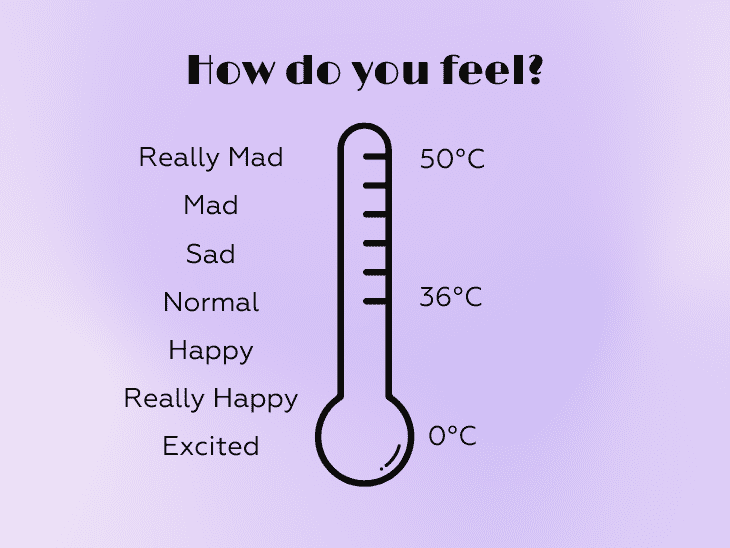
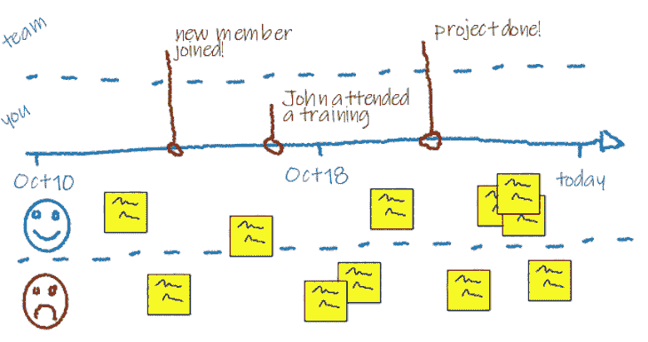
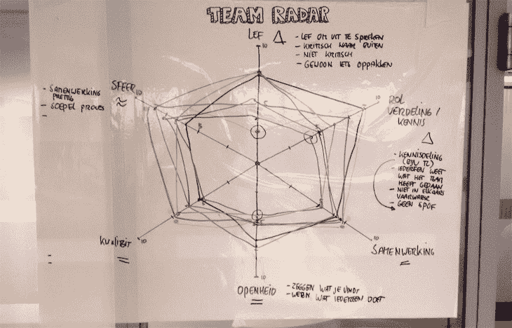
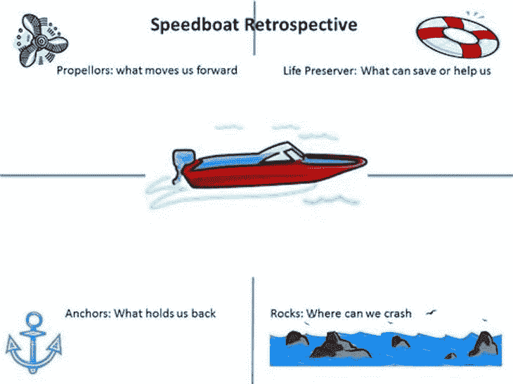
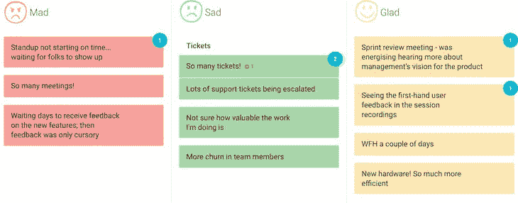
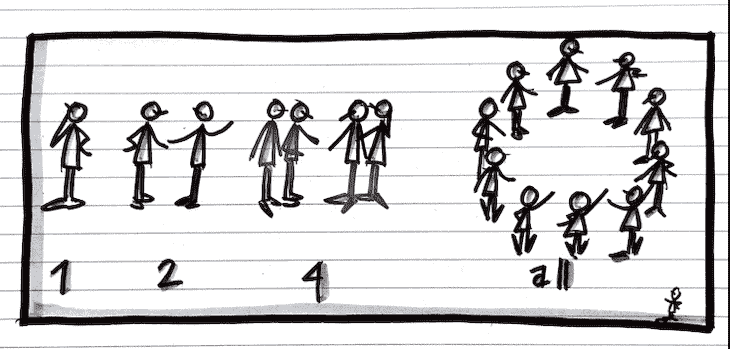
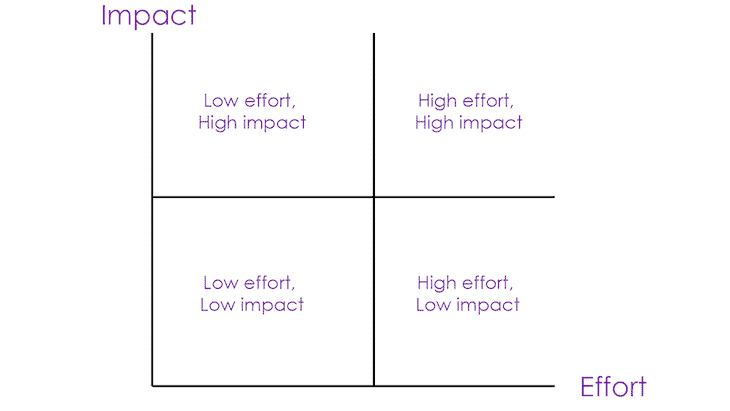
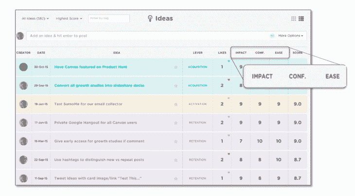
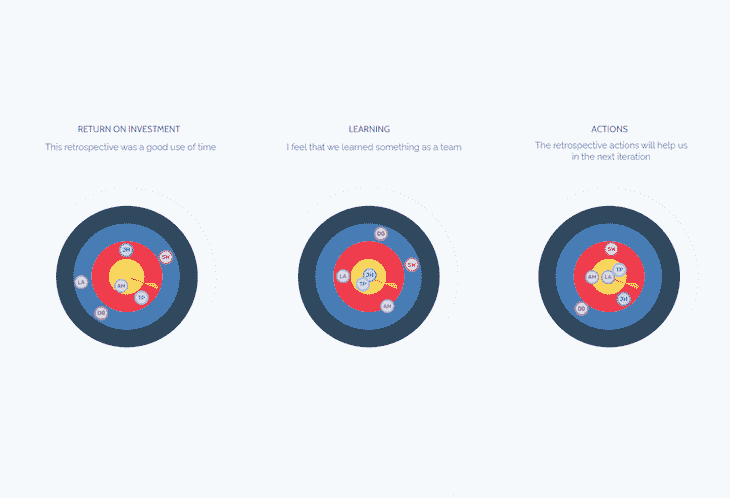

# 20 种全新的回顾会议形式和理念

> 原文：<https://blog.logrocket.com/product-management/how-to-run-effective-sprint-retrospectives-20-formats-ideas/>

sprint 回顾会可能是敏捷团队最强有力的会议。如果推动得好，它允许团队提高效率，在冲突发生之前解决冲突，并帮助每个人超越自我。

然而，促成一次回顾会议往往比看起来更难。许多人陷入同样的重复结构:

1.  让人们为好的和坏的事情写便条
2.  讨论或投票给便利贴
3.  选择 2-3 个行动点

虽然这种方法本身没有问题，但当这种格式被一遍又一遍地重复时，问题就出现了。人们很快就习惯了，并感到厌倦，会议不再迫使团队深入思考如何改进流程。

试着把回顾混起来。每次都想出新点子似乎很难，但事实上，只需要 10-20 分钟的准备就能想出一个令人兴奋的复古形式——这是一项值得的投资。

* * *

## 目录

* * *

## 搭建舞台

复古通常需要热身。它让每个人都处于正确的情绪中，并可能带来影响回顾方向的额外见解。

一些热身运动包括:

* * *

### 1.登记入住

#### 目的

1.  帮助人们抛开其他顾虑，专注于回顾会
2.  帮助人们清楚地表达他们想从回顾展中得到什么

#### 描述

欢迎参与者后，问他们一个简短的问题。每个人以循环的方式回答。

问题示例包括:

*   哪一个词可以描述你在本次会议中对自己的要求？
*   一句话，你对回顾展有什么希望？

* * *

### 2.温度读数

#### 目的

快速了解回顾参与者的情绪，并可能从中获得额外的见解。

#### 描述

画一个温度计，让每个人给一个能反映他们心情的温度点上一票。可能的话，让他们写下他们为什么那样投票。

* * *

### 3.亚马逊评论

#### 目的

快速收集[定性和定量数据](https://blog.logrocket.com/product-management/what-product-management-metrics-matter-most-to-pms/#qualitative-or-quantitative),了解团队的冲刺进展情况。

#### 描述

请大家写一篇[短评冲刺](https://blog.logrocket.com/product-management/sprint-review-vs-retrospective/#what-is-the-purpose-of-a-sprint-review)，内容包括:

*   标题
*   描述
*   星级(1-5)

然后，让大家看别人的评论。可以公开也可以匿名。

* * *

### 4.一个词

#### 目的

快速了解团队如何看待最后一次迭代。

#### 描述

请大家只用一个词来形容冲刺。你可以通过进一步询问团队成员为什么选择给定的单词来扩展练习。

* * *

### 5.即兴网络

#### 目的

激励每个人，帮助参与者打破僵局。

#### 描述

选择一个主题，给人们 1-2 分钟时间两人一组讨论这个问题。可以运行几次迭代。如果参与者彼此不太了解，这种方法非常有效。人们可以谈论 sprint 进展如何，对会议的期望，甚至像他们最喜欢的爱好这样的基本事情。

## 收集数据

要真正提高，你首先需要收集数据。在某些情况下，你会把数据带到会议上。在其他情况下，你需要在回顾中收集它。

对于这些情况，请尝试以下格式:

* * *

### 6.时间表

#### 目的

了解具体事件和情况如何影响整个冲刺和团队的士气。

#### 描述

创建一个从[冲刺](https://blog.logrocket.com/product-management/what-are-five-types-of-scrum-meetings/#what-are-sprints)开始到完成的时间表。然后，写下所有相关事件(大型会议、非常事件、关键错误等)。).之后，写下在冲刺阶段发生的积极和消极的事情，并将其相应地放在时间轴上。

[Medium](%E2%80%9Chttps://medium.com/@tarminyatur/timeline-retrospective-961cf5329f7b%E2%80%9D)

* * *

### 7.团队雷达

#### 目的

根据团队的价值观评估团队生活的好坏。

#### 描述

创建一个列出所有团队原则/规则的雷达图。要么让每个人在它上面画一个雷达图，要么使用投票系统来定义每个值的分数。结果，你将会鸟瞰到团队是如何按照约定的价值观和原则交付的。

[Medium](%E2%80%9Chttps://medium.com/the-liberators/retrospective-do-the-team-radar-1794057653e9%E2%80%9D)

* * *

### 8.帆船

#### 目的

定义团队实现目标的障碍和机会。

#### 描述

画一艘帆船的草图。为四种象限创造空间:

*   **螺旋桨**——是什么推动你作为一个团队前进？
*   **救生圈** —遇到问题时，什么能救你？
*   锚——是什么让你慢了下来？
*   **岩石** —该计划的核心风险是什么？

回答问题并添加便笺条。

[@ancoraemparo](https://twitter.com/ancoraemparo/status/1426131412906909703)

* * *

### 9.疯狂悲伤高兴

#### 目的

定义引起特定情绪的事件和情景。

* * *

订阅我们的产品管理简讯
将此类文章发送到您的收件箱

* * *

#### 描述

创建三列。要求团队写下让他们疯狂、悲伤和高兴的事情。你要确保你强调了人们有这些情绪的原因。还有一个更简单的变化，有两个专栏:在最后一次冲刺中，什么让你感到骄傲？是什么让你觉得抱歉？

[TeamRetro](https://www.teamretro.com/retrospectives/mad-sad-glad-retrospective)

* * *

## 产生洞察力

当您收集了相关数据后，您需要就如何前进和应对挑战提出见解。

以下格式有利于将数据转化为可操作的见解:

* * *

### 10.1-2-4-全部

#### 目的

让每个人平等地参与寻找解决方案。

#### 描述

1.  向团队提出挑战
2.  让每个人单独想一个解决办法
3.  要求团队两人一组讨论并构建他们的解决方案
4.  请两人一组组成四人小组，进一步讨论并构建他们的解决方案
5.  向小组展示所有解决方案

对于较小的小组，您可以尝试 1-2-all 变体:

[Learning Moments](https://learning-moments.net/2018/10/08/the-power-of-the-little-liberating-structure-1-2-4-all/)

* * *

### 11.交替头脑风暴

#### 目的

结合集体讨论和个人工作的优势。

#### 描述

个人头脑风暴往往会产生更多的见解，但集体头脑风暴允许人们相互启发，从而提高创造力。二者交替，利益最大化。

1.  向团队提出挑战
2.  让每个人独自思考解决方案(个人头脑风暴)
3.  让每个人向整个小组说出他们的解决方案(小组头脑风暴),激发创造力并分享灵感
4.  让人们回到单人头脑风暴
5.  如果需要，重复

* * *

### 12.三枚镍币

#### 目的

帮助团队扩展他人的想法。

#### 描述

每个人有五分钟时间进行头脑风暴，并单独写下想法。五分钟后，每个人把纸递给右边的人。那个人有五分钟的时间写下基于已经写在纸上的想法的想法。重复，直到论文回到原来的作者。

* * *

## 决定做什么

一个伟大的复古以清晰的后续步骤结束。确保你至少有一个。如果您有许多关于处理的想法和见解，尝试使用相似性映射将第一个分组。

以下是一些追溯格式，用于绘制前进路线:

* * *

### 13.点投票

#### 目的

通过投票快速确定想法的优先顺序。

#### 描述

列出解决问题的所有想法。然后，每个参与者投票选出他们最喜欢的想法。这种练习有许多不同的形式:

*   它可以是匿名的或公开的
*   人们可以为同一个想法投很多票，或者最多投一票
*   投票数可能是有限的，也可能是无限的

[Agile Scrum Group](https://agilescrumgroup.nl/dot-voting/)

* * *

### 14.努力和影响扩展

#### 目的

找到低挂的水果和值得采取的大赌注。

#### 描述

根据你预期的影响和实现这些想法的努力程度，对所有想法进行评级。影响大、花费少的想法是容易实现的，应该优先考虑。高努力但高影响的大赌注也值得考虑。

[Buildd](https://buildd.co/product/2x2-impact-effort-matrix)

* * *

### 15.标准评分

#### 目的

根据定义的标准列表确定解决方案的优先级。

#### 描述

决定你做决定时要考虑什么标准。然后，根据标准给每个想法打 1-5 分。将分数相加，对分数最高的想法进行优先排序。

[Medium](https://medium.com/@nimay/inside-product-introduction-to-feature-priority-using-ice-impact-confidence-ease-and-gist-5180434e5b15)

* * *

### 16.问题圈

#### 目的

通过在团队内部提问来选择接下来的行动步骤。

#### 描述

让团队成员坐成一圈(如果是远程会议，则选择特定的顺序)。转向你右边的人，问这个问题:“从你的角度来看，我们在下一次迭代中尝试的最高优先级是什么？”这个人应该回答问题，然后转向他们的右边，或者问一个问题来扩展讨论，或者开始一个新的讨论。一直循环下去，直到你满意或者时间用完。

* * *

## 闭幕回顾

用会议的最后几分钟来适当地结束回顾。如果会议没有结束就突然结束，那就更难记住了。

尝试这些格式:

* * *

### 17.增值

#### 目的

通过分享欣赏来改善团队关系。

#### 描述

请参与者分享他们对团队或某个人的欣赏。如果回顾是艰难的和充满冲突的，这种练习特别有效。此外，这种类型的谈话会极大地鼓舞士气。

* * *

### 18.温度读数

#### 目的

快速了解回顾参与者的心情，并将其与他们在签到时的心情进行比较。

#### 描述

规则与签到练习的情况相同。画一个温度计，让每个人给一个能反映他们心情的温度点上一票。可能的话，请他们写下为什么这样投票。这使您可以比较这些变化，并评估会议本身的有效性。

* * *

### 19.什么，那又怎样，现在怎么办？

#### 目的

回顾回顾会最重要的成果。

#### 描述

作为一个小组或使用 1-2(-4)-所有变体，讨论并写下三组问题的答案:

1.  发生了什么事？你注意到了什么？有哪些突出的事实或观察？
2.  为什么这很重要？出现了什么样的模式或结论？我/我们可以做出什么假设？
3.  现在怎么办？什么行动最有意义？

* * *

### 20.复古的靶心

#### 目的

在最重要的方面对会议进行评估。

#### 描述

决定一套标准来评估你的回顾。然后，为每个标准准备一个镖靶。请参与者根据标准对会议的进展情况进行投票。越靠近靶心，会议越顺利。可以公开，也可以匿名。如果需要也可以进行后续讨论。如果定期重复这个练习来比较会议是否会随着时间的推移而改进，效果会更好。

[Metro Retro](https://metroretro.io/templates/bullseye-diagram)

* * *

*精选图片来源:[icon scout](https://iconscout.com/icon/agile-5804828)*

## [LogRocket](https://lp.logrocket.com/blg/pm-signup) 产生产品见解，从而导致有意义的行动

[LogRocket](https://lp.logrocket.com/blg/pm-signup) 确定用户体验中的摩擦点，以便您能够做出明智的产品和设计变更决策，从而实现您的目标。

使用 LogRocket，您可以[了解影响您产品的问题的范围](https://logrocket.com/for/analytics-for-web-applications)，并优先考虑需要做出的更改。LogRocket 简化了工作流程，允许工程和设计团队使用与您相同的[数据进行工作](https://logrocket.com/for/web-analytics-solutions)，消除了对需要做什么的困惑。

让你的团队步调一致——今天就试试 [LogRocket](https://lp.logrocket.com/blg/pm-signup) 。

* * *

[Bart Krawczyk Follow](https://blog.logrocket.com/author/bartkrawczyk/) Learning how to build beautiful products without burning myself out (again). Writing about what I discovered along the way.