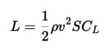

# 如何使用 react-markdown - LogRocket 博客安全地呈现 Markdown

> 原文：<https://blog.logrocket.com/how-to-safely-render-markdown-using-react-markdown/>

Markdown 格式是开发人员社区的一个长期主题。自 2004 年以来，我们一直使用 Markdown 为各种平台创建内容，包括博客、网络论坛、聊天应用程序、所见即所得编辑器等等。

在本教程中，我们将向您展示如何使用 react-markdown 从 React 组件安全地呈现 Markdown。

## 什么是降价反应？

[react-markdown](https://github.com/remarkjs/react-markdown) 是一个 react 组件，它将 markdown 文本转换成相应的 HTML 代码。它建立在[备注](https://github.com/remarkjs/remark)之上，是一个降价预处理器。

react-markdown 使您能够安全地渲染 markdown，因为它不依赖于`dangerouslySetInnerHTML`属性。相反，它使用语法树来构建虚拟 DOM。

使用`dangerouslySetInnerHTML`属性解析 HTML 是危险的，因为如果你不确定来源，它可能会注入恶意脚本。这可能会使您的软件容易受到[跨站脚本(XSS)攻击](https://owasp.org/www-community/attacks/xss/)，在这种攻击中，不良行为者将代码注入原本良性的应用程序和网站，向不知情的用户发送恶意脚本。

Markdown language 旨在帮助您轻松创建编辑内容。这就是为什么它只包含基本标签。默认情况下，react-markdown 不支持 HTML，因此会阻止脚本注入。这使得它可以安全使用。

## 安装 react-降价

您可以使用 npm 安装`react-markdown`库:

```
npm install react-markdown

```

或者，您可以使用 yarn 安装库:

```
yarn add react-markdown

```

您不需要安装任何其他库来使用 react-markdown。然而，你可以选择使用一些插件来增强它的功能。我们稍后将讨论这些插件。

## 使用 react-markdown:简单的例子

因为 react-markdown 库提供了一个组件，所以我们需要将 markdown 文本作为子组件放入其中。这将返回转换后的 HTML 代码。

这里有一个例子:

```
import React from 'react'
import ReactMarkdown from 'react-markdown'
export default function MarkdownToHtml(){
  return(
    <ReactMarkdown>*React-Markdown* is **Awesome**</ReactMarkdown>
  )
}

```

呈现的输出将是"**React-Markdown**is*Awesome*

## 支持的降价语法

下面是 react-markdown 支持的 Markdown 语法列表，无需使用任何外部插件。

## 使用带有 react-markdown 的插件

如果您想超越上述语法，react-Markdown 的父项目 remark 已经创建了许多插件，您可以使用它们来增强库的功能。

例如，react-markdown 不支持自动链接、删除线、表格、任务列表等。默认情况下。如果您曾经在 GitHub 上创建过自述文件，您可能已经使用 Markdown 创建了任务列表和表格。为了迎合这种需求，remark 创造了 [remark-gfm](https://github.com/remarkjs/remark-gfm) ，代表 [Github 风味减价](https://github.github.com/gfm/)。

为了使用插件，react-markdown 提供了两个道具——`remarkPlugins`和`rehypePlugins`——它们接受您希望使用的所有插件的数组。你可以在`remarkPlugin`道具中放置备注插件，比如`remark-gfm`和`remark-maths`，在`rehypePlugins`道具中重新排版插件，比如`rehype-katex`。

例如，如果你想支持删除线特性，你需要使用 remark-gfm。让我们创建一个快速演示来展示这是如何工作的。

首先，安装`remark-gfm`:

```
npm install remark-gfm

```

现在您可以在代码中使用它:

```
import React from 'react'
import ReactMarkdown from 'react-markdown'
import gfm from 'remark-gfm'
export default function MarkdownToHtml(){
  return(
    <ReactMarkdown remarkPlugins={[gfm]}>*React-Markdown* now supports ~strikethrough~. Thanks to gfm plugin.</ReactMarkdown>
  )
}

```

现在，由于 remark-gfm 插件，输出将是" **React-Markdown** 现在支持~~删除线~ ~。"

如果要支持数学表达式(如书面公式、方程、分数等。)或 [KaTeX](https://katex.org/) ，一个流行的数学排版库，你可以考虑使用 [remark-math](https://github.com/remarkjs/remark-math) 和[retype-KaTeX](https://github.com/rehypejs/rehype)。这些插件使你能够将普通语言的符号转换成人类可读的数学格式。

这里有一个例子:

```
$$
L = \frac{1}{2} \rho v^2 S C_L
$$

```

上面用 KaTeX 解析的例子如下所示:



前往官方文档，获取可以与 react-markdown 一起使用的[注释插件的完整列表。](https://github.com/remarkjs/remark/blob/main/doc/plugins.md#list-of-plugins)

## `remark-gfm`插件的特殊语法

下表显示了您可以使用`remark-gfm`插件启用的特殊功能，包括创建[表格](https://www.akashmittal.com/react-table-learn-filter-sort-pagination-in-10-minutes/)、删除线文本和待办事项列表的能力。

请查看下面的现场演示:

阿卡什·米塔尔([@阿卡什·米塔尔](https://codepen.io/akash-mittal) )
在 [CodePen](https://codepen.io) 上使用 Remark-gfm 的 React-Markdown 表。

结论

在这个 react-markdown 教程中，我们学习了如何安全地将 markdown 语法呈现给适当的 HTML。我们还回顾了如何通过将各种插件传递给所提供的组件来使用 react-markdown 的各种插件，包括`remark-gfm`。

## 使用 LogRocket 消除传统反应错误报告的噪音

是一款 React analytics 解决方案，可保护您免受数百个误报错误警报的影响，只针对少数真正重要的项目。LogRocket 告诉您 React 应用程序中实际影响用户的最具影响力的 bug 和 UX 问题。

## 自动聚合客户端错误、反应错误边界、还原状态、缓慢的组件加载时间、JS 异常、前端性能指标和用户交互。然后，LogRocket 使用机器学习来通知您影响大多数用户的最具影响力的问题，并提供您修复它所需的上下文。

[LogRocket](https://lp.logrocket.com/blg/react-signup-issue-free)

关注重要的 React bug—[今天就试试 LogRocket】。](https://lp.logrocket.com/blg/react-signup-issue-free)

[ ](https://lp.logrocket.com/blg/react-signup-general) [  ](https://lp.logrocket.com/blg/react-signup-general) [LogRocket](https://lp.logrocket.com/blg/react-signup-issue-free)

automatically aggregates client side errors, React error boundaries, Redux state, slow component load times, JS exceptions, frontend performance metrics, and user interactions. Then LogRocket uses machine learning to notify you of the most impactful problems affecting the most users and provides the context you need to fix it.

Focus on the React bugs that matter — [try LogRocket today](https://lp.logrocket.com/blg/react-signup-issue-free).