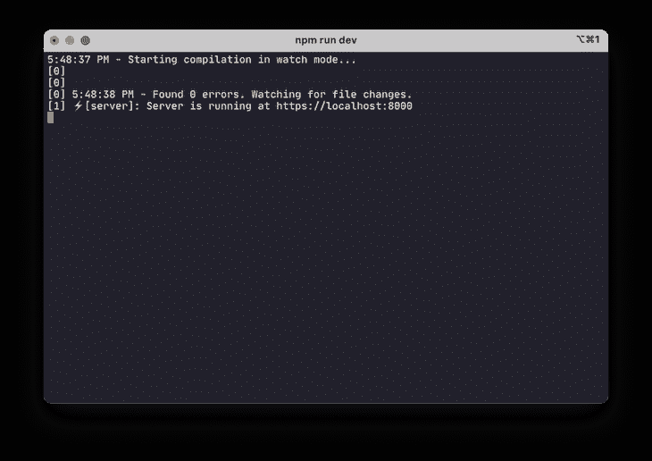
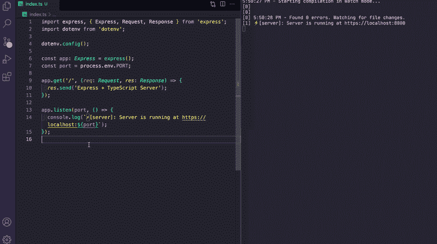

# 如何用 Node.js 和 Express - LogRocket Blog 设置 TypeScript

> 原文：<https://blog.logrocket.com/how-to-set-up-node-typescript-express/>

***编者按**:这篇文章最后一次更新是在 2022 年 3 月 23 日，以更新已经过时的代码。*

当您构建用 JavaScript 编写的服务器并使用 Node.js 和 Express 时，开发的简易性是非常好的。但是，当您的应用服务器扩展时，或者您在世界各地的开发团队中工作时，会发生什么呢？在这些情况下，TypeScript 会有所帮助。

在本文中，我们将介绍一种初学者友好的方法来在 Express 应用程序中设置 TypeScript，理解随之而来的基本约束。

要充分利用本教程，请确保您具备以下条件:

*   安装在本地开发环境中的 Node.js 版本≥ v12.x
*   访问像 npm 或 Yarn 这样的包管理器
*   Node.js 和 Express 的基础知识

## 目录

## 创建一个`package.json`文件

从在本地开发环境中保存辅助项目的地方创建一个新目录开始。在该目录中，使用 npm 的初始化器命令创建一个`package.json`文件:

```
mkdir node-express-typescript
cd node-express-typescript/
npm init --yes
```

当您初始化一个`package.json`文件时，`--yes`标志使用您在 npm config 中设置的默认设置。新创建的`package.json`文件可能类似于下面的代码:

```
{
  "name": "express-typescript",
  "version": "1.0.0",
  "description": "",
  "main": "index.js",
  "scripts": {
    "test": "echo \"Error: no test specified\" && exit 1"
  },
  "type": "module",
  "keywords": [],
  "author": "",
  "license": "ISC"
}
```

## 使用 Express 创建最小服务器

初始化完`package.json`文件，我们来添加一个快递包。在终端窗口中，运行以下命令:

```
npm install express dotenv
```

接下来，要触发一个最小服务器，在项目的根目录下用下面的代码创建一个名为`index.js`的新文件:

```
const express = require('express');
const dotenv = require('dotenv');

dotenv.config();

const app = express();
const port = process.env.PORT;

app.get('/', (req, res) => {
  res.send('Express + TypeScript Server');
});

app.listen(port, () => {
  console.log(`[server]: Server is running at http://localhost:${port}`);
});
```

[`dotenv`包用于从`.env`文件中读取环境变量](https://blog.logrocket.com/customizing-node-js-env-files/)。在 Node.js 应用程序的根目录下创建它，然后为`PORT=8000`创建环境变量。

要启动服务器，回到终端并触发命令`node index.js`:


Express 服务器现在已经启动并运行了！

## 安装 TypeScript

我们将从安装 TypeScript 作为开发依赖项开始。与此同时，我们将为 Express 和 Node.js 安装`@types`声明包，它们以声明文件的形式提供类型定义。

声明文件是预定义的模块，为 TypeScript 编译器描述 JavaScript 值的形状或存在的类型。类型声明通常包含在扩展名为`.d.ts`的文件中。这些声明文件适用于所有最初用 JavaScript 而不是 TypeScript 编写的库。

[definitely typed GitHub repository](https://github.com/DefinitelyTyped/DefinitelyTyped)维护 TypeScript 类型定义，以便直接在 Node.js 和其他 JavaScript 项目中使用，因此您不必从头开始定义这些类型。要添加这些类型或与特定库或模块相关的声明文件，您必须寻找以`@types`名称空间开始的包。

打开终端窗口，使用以下命令安装上述软件包:

```
npm i -D typescript @types/express @types/node
```

`-D`标志，也称为`--dev`标志，是包管理器将这些库安装为`devDependencies`的规范。

一旦安装了这些库，转到`package.json`文件，在那里您会看到一个新的`devDependencies`对象:

```
{
"devDependencies": {
"@types/express": "^4.17.13",
"@types/node": "^17.0.10",
"typescript": "^4.5.5"
}
}
```

## 正在生成`tsconfig.json`

现在，我们有了一个使用一些默认配置选项编译的 TypeScript 项目。`tsconfig.json`文件提供了这些默认选项，也为我们提供了调整或定制编译器选项的能力。

通常，`tsconfig.json`文件位于项目的根目录下。为了生成它，我们将使用`tsc`命令:

```
npx tsc --init

```

上面的命令将生成一个名为`tsconfig.json`的新文件，具有以下默认编译器选项:

```
target: es2016
module: commonjs
strict: true
esModuleInterop: true
skipLibCheck: true
forceConsistentCasingInFileNames: true
```

如果你打开`tsconfig.json`文件，你会看到很多其他的编译器选项被注释掉了。在`tsconfig.json`中，`compilerOptions`是必填字段，需要指定。上面配置中使用的选项有:

*   `target`:允许我们指定编译器将输出的目标 JavaScript 版本
*   `module`:允许我们在编译的 JavaScript 代码中使用模块管理器。支持 CommonJS，它是 Node.js 中的一个标准
*   `strict`:启用严格类型检查选项的选项
*   `esModuleInterop`:允许我们将 ES6 模块编译成 CommonJS 模块
*   `skipLibCheck`:如果设置为`true`，跳过默认库声明文件的类型检查
*   `forceConsistentCasingInFileNames`:设置为`true`时，启用区分大小写的文件命名

您必须启用的一个选项叫做`outDir`，它指定了编译步骤之后输出将位于何处。您可以在`tsconfig.json`文件中搜索这个选项并取消注释。

默认情况下，该选项的值设置为根目录。改为`dist`:

```
{
  "compilerOptions": {
    "outDir": "./dist"

    // rest options remain same
  }
}
```

虽然可能还有其他配置选项可以添加到 TypeScript 编译器中，但上面列出的选项是可以帮助您入门的基本规范。

## 创建扩展名为`.ts`的 Express 服务器

现在，您可以轻松地将`index.js`中的最小服务器代码转换成一个`index.ts`文件。

首先，将文件重命名为`index.ts`。`.ts`扩展名是一个文件扩展名，它决定了当我们构建服务器时，什么类型的脚本文件被编译成 JavaScript 文件。

打开`index.ts`文件，进行修改，如下图所示:

```
import express, { Express, Request, Response } from 'express';
import dotenv from 'dotenv';

dotenv.config();

const app: Express = express();
const port = process.env.PORT;

app.get('/', (req: Request, res: Response) => {
  res.send('Express + TypeScript Server');
});

app.listen(port, () => {
  console.log(`⚡️[server]: Server is running at http://localhost:${port}`);
});
```

## 监视文件更改并构建目录

在处理 Node.js 项目时，我喜欢使用的另一个与开发相关的实用程序库是 [nodemon](https://www.npmjs.com/package/nodemon) 。nodemon 是一个帮助开发基于 Node.js 的应用程序的工具，它在检测到目录中的文件更改时自动重新启动 Node.js 应用程序。

我们还将安装另一个名为[并发](https://www.npmjs.com/package/concurrently)的开发依赖项，这将允许我们运行多个命令，如 nodemon 来查看文件更改，以及运行`tsc`命令来编译代码:

```
npm install -D concurrently nodemon

```

安装这些开发依赖项后，更新`package.json`文件中的`scripts`:

```
{
  "scripts": {
    "build": "npx tsc",
    "start": "node dist/index.js",
    "dev": "concurrently \"npx tsc --watch\" \"nodemon -q dist/index.js\""
  }
}
```

`build`命令将在`dist`目录中编译 JavaScript 代码。`dev`命令用于在开发模式下运行 Node.js 服务器。

现在，回到终端窗口，运行`npm run dev`来触发开发服务器:



没有错误，表明服务器正在成功运行。您可以进入浏览器窗口查看结果。

由于 nodemon 检测到更改，让我们尝试编辑从`res.send()`发送的消息，同时查看终端，看看 nodemon 是否检测到任何文件更改:



要编译代码，您需要运行命令`npm run build`。该命令成功执行后，会创建一个新的`dist`目录。在这个目录中，TypeScript 代码被编译成有效的 JavaScript:

```
'use strict';
var __importDefault =
  (this && this.__importDefault) ||
  function (mod) {
    return mod && mod.__esModule ? mod : { default: mod };
  };
Object.defineProperty(exports, '__esModule', { value: true });
const express_1 = __importDefault(require('express'));
const dotenv_1 = __importDefault(require('dotenv'));
dotenv_1.default.config();
const app = (0, express_1.default)();
const port = process.env.PORT;
app.get('/', (req, res) => {
  res.send('Express + TypeScript Server is running.');
});
app.listen(port, () => {
  console.log(`⚡️[server]: Server is running at http://localhost:${port}`);
});

```

如果您指定任何其他目录作为`tsconfig.json`文件中属性`outDir`的值，该目录将在此处反映，而不是在`dist`处。

## 结论

使用 TypeScript 有它的好处，但是它确实有一点学习曲线。你得仔细分析在你的 Node.js 和 Express 后端项目中使用 TypeScript 是否有利，这可能取决于你项目的需求。

确保检查不同的[类型定义](https://github.com/DefinitelyTyped/DefinitelyTyped/tree/master/types)或者去官方的[类型文档](https://www.typescriptlang.org/docs/home.html)探索更多。我希望你喜欢这个项目！如果你有任何问题，一定要留下评论。编码快乐！

## [LogRocket](https://lp.logrocket.com/blg/typescript-signup) :全面了解您的网络和移动应用

[](https://lp.logrocket.com/blg/typescript-signup)

LogRocket 是一个前端应用程序监控解决方案，可以让您回放问题，就像问题发生在您自己的浏览器中一样。LogRocket 不需要猜测错误发生的原因，也不需要向用户询问截图和日志转储，而是让您重放会话以快速了解哪里出错了。它可以与任何应用程序完美配合，不管是什么框架，并且有插件可以记录来自 Redux、Vuex 和@ngrx/store 的额外上下文。

除了记录 Redux 操作和状态，LogRocket 还记录控制台日志、JavaScript 错误、堆栈跟踪、带有头+正文的网络请求/响应、浏览器元数据和自定义日志。它还使用 DOM 来记录页面上的 HTML 和 CSS，甚至为最复杂的单页面和移动应用程序重新创建像素级完美视频。

[Try it for free](https://lp.logrocket.com/blg/typescript-signup)

.