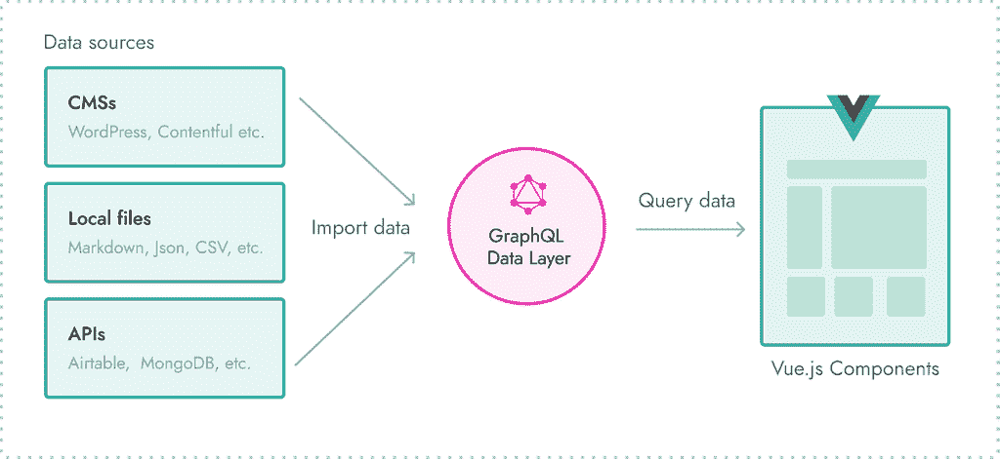
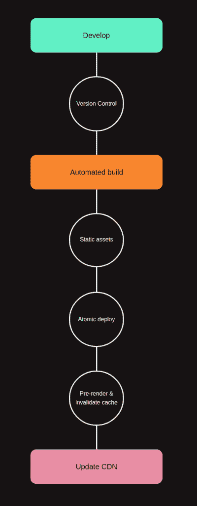

# 如何设置您的 Gridsome 应用程序以使用 TypeScript - LogRocket Blog

> 原文：<https://blog.logrocket.com/how-to-set-up-your-gridsome-app-to-use-typescript/>

根据该平台的官方[网站](https://gridsome.org/)“grid some 是一个免费和开源的静态网站生成器，帮助人们建立快速、高性能、可访问的网站和应用程序，并默认优化搜索引擎”。

它是构建在 Vue.js 框架之上的框架(是的，你没听错。是一个框架的框架)。它利用 Vue.js 引擎构建静态网站，使用 GraphQL 作为查询从数据源导入的资源的[数据层](https://gridsome.org/docs/data-layer/)。它使用 [PRPL 架构模式](https://developers.google.com/web/fundamentals/performance/prpl-pattern/)来提高网站的性能。

PRPL 的缩写意思是:

*   重新加载—预加载最重要的资源
*   ender —尽快渲染初始路线
*   **P** 重新缓存—预缓存剩余资产
*   **L** azy load —惰性加载其他路线和非关键资产

PRPL 模式是用于服务渐进式 Web 应用程序(pwa)的架构模式。



Gridsome 是基于 [JAMstack 工作流](https://jamstack.org/)的，你所需要的只是静态内容的标记/降价，以及 JavaScript 的功能和 API 来帮助完成不那么容易的事情。它受 Gatsby.js 的影响很大，Gatsby.js 是一个基于 React 的静态站点生成器，但建立在 Vue.js 之上，Gridsome 是 Gatsby . js 的直接替代物。

[TypeScript](https://www.typescriptlang.org/) 是 JavaScript 的类型化变体。Typescript 帮助您编写静态类型的 JavaScript，并在构建时向下编译 JavaScript(JavaScript 的类固醇)。

## 先决条件

本教程假设读者具备以下条件:

## 什么是 JAMstack？

JAMstack 是构建高速网站和应用的最佳实践、架构模式和工作流的集合，它优先考虑提供更好的性能、更高的安全性、更低的使用成本、可扩展性和更好的开发人员体验。

> “基于客户端 JavaScript、可重用 API 和预建标记的现代 web 开发架构”
> —马蒂亚斯·比尔曼(Netlify 的首席执行官&联合创始人)

JAMstack 架构利用预渲染文件并直接从 CDN 提供服务，消除了管理或运行 web 服务器的需求。内容更新通过 WordPress 或 Drupal 等传统 CMS 推送，代码库使用 Git 等版本控制系统管理，部署使用 Zeit、Netlify 等提供 CI/CD 的服务自动化。



The JAMstack workflow credits: [https://jamstack.wtf/](https://jamstack.wtf/)

## 如何建立 Gridsome 项目

要使用 Gridsome，我们必须首先安装 Gridsome CLI 工具。

这个工具帮助你用一个默认的启动程序动态地引导 Gridsome 项目。

可以使用 Yarn 通过以下命令完成安装:

```
yarn global add @gridsome/cli
```

全局安装 Gridsome 包使我们能够使用`gridsome`关键字来执行某些操作。

接下来，我们使用`create`命令创建一个新项目:

```
gridsome create gridsome-typscript
```

该命令首先从包含引导您的项目所需的配置文件的[默认启动程序](https://github.com/gridsome/gridsome-starter-default)中克隆一个可定制的启动程序项目，然后更新`package.json`文件并安装项目所需的依赖项。

现在，使用以下命令进入我们项目的目录:

```
cd gridsome-typscript
```

## 了解 Gridsome 目录结构

Gridsome starter 项目的结构如下:

```
# gridsome-typescript

├── gridsome.config.js
├── gridsome.server.js
├── package.json
├── README.md
├── src
│    ├── components
│    │      └── README.md
│    ├── favicon.png
│    ├── layouts
│    │   ├── Default.vue
│    │   └── README.md
│    ├── main.js
│    ├── pages/
│    │   ├── About.vue
│    │   ├── Index.vue
│    │   └── README.md
│    └── templates
│         └── README.md
├── static
│   └── README.md
└── yarn.lock
```

让我们花点时间来理解文件和文件夹代表什么，以及我们如何使用它们。

*   `package.json` —包含有关项目的信息，如项目中安装了哪些依赖项以及可以运行的脚本
*   `gridsome.config.js` —站点和所用插件的配置以及 [webpack](https://webpack.js.org/) 在此完成。你可以设置你的网站名称，元数据，图标，网站描述等。你可以在这里了解更多关于配置你的网站的信息
*   `gridsome.server.js` —该文件包含服务器的配置。它提供了使用服务器 API 来执行操作的访问权限，例如从本地或外部源加载数据、在开发期间配置 Express server Gridsome 运行以及创建自定义 GraphQL 模式
*   `/src` —这个文件夹包含了你在任何项目中编写的大部分代码，它包含了你的应用程序的关键部分，比如组件、模板、页面、布局、自定义实用程序和资产，比如样式表和图像
*   `/static` —该文件夹包含静态资产，只需要在站点建立后访问，如静态 pdf 文件和您的 robot.txt 文件。在构建过程中，该文件夹的内容被复制到`dist`目录

## 从。js 到。分时（同 timesharing）

为了开始在我们的`.vue`文件中使用 Typescript，我们需要安装 [TypeScript](https://www.typescriptlang.org/docs/) ，webpack 的 [TypeScript 加载器](https://github.com/TypeStrong/ts-loader)和`[gridsome-typescript](https://github.com/xerebede/gridsome-plugin-typescript)`插件。

```
yarn add -D typescript ts-loader gridsome-plugin-typescript
```

接下来，我们需要在`gridsome.config.js`文件中注册我们的`gridsome-typescript`插件:

```
plugins: [
  {
    use: 'gridsome-plugin-typescript',
  }
]
```

然后，我们在项目的基本目录下创建一个`tsconfig.json`文件，包含以下内容:

```
{
    "compilerOptions": {
        "target": "es5",
        "module": "es2015",
        "moduleResolution": "node",
        "noImplicitReturns": true,
        "outDir": "./built/",
        "sourceMap": true,
        "strict": true
    },
    "include": [
        "./src/**/*"
    ]
}
```

该文件包含影响我们项目中 TypeScript 行为的规则和配置集，`tsconfig.json`文件指定了编译项目所需的根文件和编译器选项。

在您的`src`文件夹中创建一个包含以下内容的`vue-shims.d.ts`:

```
declare module "*.vue" {
    import Vue from "vue";
    export default Vue;
}
```

这个文件帮助 TypeScript 理解`.vue`的内容。

现在我们可以在我们的`.vue`文件中使用 TypeScript，所有需要做的就是添加来设置我们的单文件组件中的`script`标签的语言为`ts`:

```
<script lang="ts">

</script>
```

## 使用一个预制的启动器

您还可以使用[gridsome-typescript](https://github.com/xerebede/gridsome-starter-typescript)starter 来引导您的 grid some 项目。这个启动器被配置为使用 typescript，您只需要安装它就可以使用它。

这个初学者利用 ESLint 来执行某些代码实践和规则，它有助于报告错误和避免 bug。ESLint 帮助我们提高整体代码质量。

要开始使用它，请创建一个新项目:

```
gridsome create gridsome-typescript https://github.com/cleitonper/gridsome-starter-typescript.git
```

将目录更改为您的项目文件夹:

```
cd gridsome-typescript
```

启动您的项目:

```
gridsome develop
```

在运行`gridsome develop`命令后，您应该看到您的应用程序在`[http://localhost:8080](http://localhost:8080)`上运行。

## 结论

在本文中，我们看到了如何启动 Gridsome 项目以及如何将 TypeScript 集成到其中，我们还看到了什么是 JAMstack。要了解更多关于 Gridsome 的信息，请查看他们详细的文档。你可以访问 Typescript-eslint [文档](https://github.com/typescript-eslint/typescript-eslint/blob/master/docs/getting-started/linting/README.md)来了解如何配置[预制启动器](https://github.com/xerebede/gridsome-starter-typescript)，也可以查看 JAMStack [官方网站](https://jamstack.org/)和这篇[文章](https://blog.logrocket.com/why-you-should-be-using-jamstack/)来了解更多关于 JAMStack 的信息，以及为什么你可能想在下一个项目中采用它。

## 像用户一样体验您的 Vue 应用

调试 Vue.js 应用程序可能会很困难，尤其是当用户会话期间有几十个(如果不是几百个)突变时。如果您对监视和跟踪生产中所有用户的 Vue 突变感兴趣，

[try LogRocket](https://lp.logrocket.com/blg/vue-signup)

.

[](https://lp.logrocket.com/blg/vue-signup)[https://logrocket.com/signup/](https://lp.logrocket.com/blg/vue-signup)

LogRocket 就像是网络和移动应用程序的 DVR，记录你的 Vue 应用程序中发生的一切，包括网络请求、JavaScript 错误、性能问题等等。您可以汇总并报告问题发生时应用程序的状态，而不是猜测问题发生的原因。

LogRocket Vuex 插件将 Vuex 突变记录到 LogRocket 控制台，为您提供导致错误的环境，以及出现问题时应用程序的状态。

现代化您调试 Vue 应用的方式- [开始免费监控](https://lp.logrocket.com/blg/vue-signup)。

## [LogRocket](https://lp.logrocket.com/blg/typescript-signup) :全面了解您的网络和移动应用

[](https://lp.logrocket.com/blg/typescript-signup)

LogRocket 是一个前端应用程序监控解决方案，可以让您回放问题，就像问题发生在您自己的浏览器中一样。LogRocket 不需要猜测错误发生的原因，也不需要向用户询问截图和日志转储，而是让您重放会话以快速了解哪里出错了。它可以与任何应用程序完美配合，不管是什么框架，并且有插件可以记录来自 Redux、Vuex 和@ngrx/store 的额外上下文。

除了记录 Redux 操作和状态，LogRocket 还记录控制台日志、JavaScript 错误、堆栈跟踪、带有头+正文的网络请求/响应、浏览器元数据和自定义日志。它还使用 DOM 来记录页面上的 HTML 和 CSS，甚至为最复杂的单页面和移动应用程序重新创建像素级完美视频。

[Try it for free](https://lp.logrocket.com/blg/typescript-signup)

.