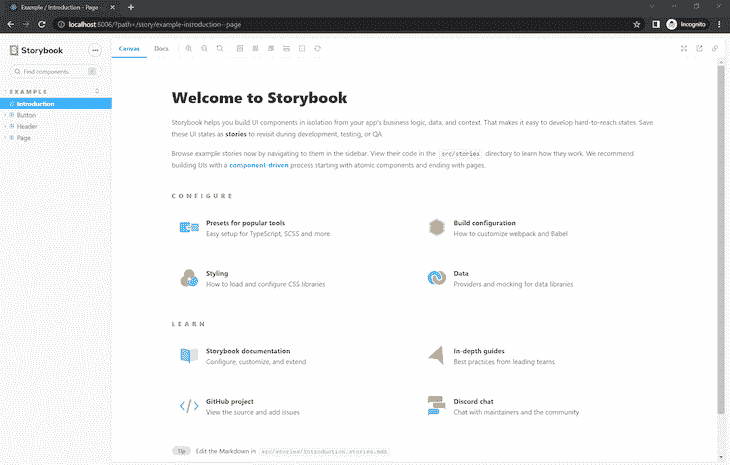
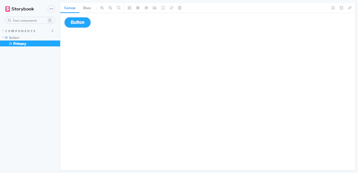
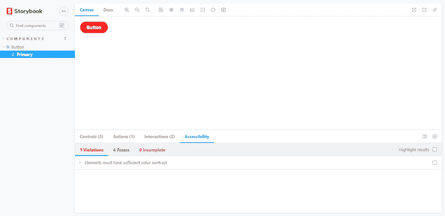
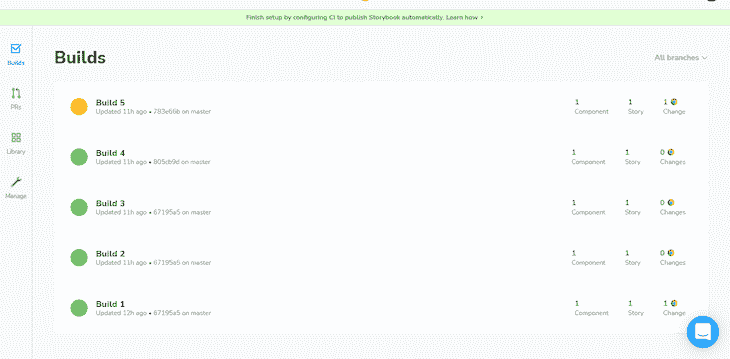
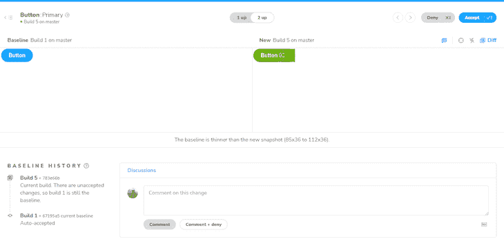
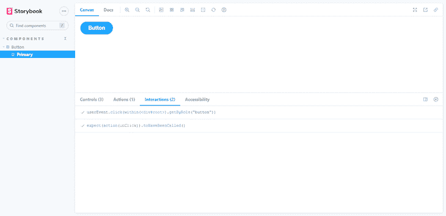

# 如何用 React Storybook 简化组件测试

> 原文：<https://blog.logrocket.com/how-to-simplify-component-testing-react-storybook/>

编者按:这篇文章最后一次更新是在 2022 年 6 月 6 日，它包含了 Storybook 的新特性，比如可访问性测试。

每个开发人员的目标都是构建有效的软件。我们可以通过隔离它并在测试中显示它的行为来确保我们的软件代码完美地工作。然而，我们不能对我们的组件说同样的话，这些组件是在我们的应用程序环境中测试的。

Storybook 允许我们以隔离的方式查看组件并与之交互。这就像单元测试一样，只是针对 UI 组件。

根据 [Storybook 的文档](https://storybook.js.org/docs/basics/introduction/)，Storybook 是一个用户界面开发环境，也是 UI 组件的游乐场。Storybook 使开发人员能够独立地创建组件，并在一个隔离的开发环境中交互地展示组件。

在本文中，我们将探索 Storybook 如何帮助我们创建 UI 组件并改进我们的组件测试。

如果您想研究代码或跟随代码，您可以在 GitHub 上查看[源代码。我们开始吧！](https://github.com/fullstackmafia/react-storybook-app)

## 故事书入门

首先，我们将[引导一个新的 React 项目](https://blog.logrocket.com/using-storybook-to-develop-react-components-faster/)。在这里，我们将通过 CLI 安装 Storybook:

```
#create a react app
npx create-react-app my-storybook-app

#navigate to the newly created app
cd my-storybook-app

#install storybook
npx sb init

#run via npm
npm run storybook

#running via yarn
yarn storybook

```

Storybook 的测试页面应该从我们浏览器中的本地地址`[http://localhost:6006/](http://localhost:6006/)`开始:



我们将创建一个用于测试的组件，一个名为`Button.jsx`的按钮，它将显示要供应的咖啡杯数。这个基本组件由 [Storybook 的默认导出元数据](https://storybook.js.org/docs/react/writing-stories/introduction#default-export)控制，它控制故事如何被列出:

```
// /src/components/Button.jsx

import React from "react";
import PropTypes from "prop-types";
import "./button.css";
export const Button = ({ backgroundColor, size, label, ...props }) => {
  return (
    <div>
      <button
        type="button"
        className={["storybook-button", `storybook-button--${size}`].join(" ")}
        id="button"
        style={backgroundColor && { backgroundColor }}
        {...props}
      >
        {label}
      </button>
    </div>
  );
};
Button.propTypes = {
  backgroundColor: PropTypes.string,
  size: PropTypes.oneOf(["small", "medium", "large"]),
  label: PropTypes.string.isRequired,
  onClick: PropTypes.func,
};
Button.defaultProps = {
  backgroundColor: null,
  size: "medium",
  onClick: undefined,
};

```

故事书作品使用故事；story 是一个函数，它包含一个组件的单一状态，并将该组件呈现到屏幕上以供测试。让我们为我们的`Button.jsx`组件写一个故事。在`src/stories`中，创建一个名为`Button.stories.jsx`的文件:

```
import React from "react";
import { Button } from "../components/Button";

export default {
  title: "Components/Button",
  component: Button,
  argTypes: {
    backgroundColor: { control: "color" },
    onClick: { action: "clicked" },
  },
};
const Template = (args) => <Button {...args} />;
export const Primary = Template.bind({});
Primary.args = {
  label: "Button",
};

```

在 Storybook 中，我们的组件如下所示:



## 用户界面测试

Storybook 提供了几种不同的测试 UI 组件的技术。出于各种原因，组件需要接受测试，其中一些原因包括检测 bug、防止代码在新的提交过程中被破坏，以及为从事该项目的其他开发人员提供指导。

让我们研究一下 Storybook 可以无缝进行组件测试的一些方法。

## 可访问性测试

可访问性测试根据一组基于 [WCAG](https://www.w3.org/WAI/standards-guidelines/wcag/) 规则和其他行业公认的最佳实践的启发式规则来审核呈现的 DOM。这些作为质量保证的第一道防线来捕捉明显的可访问性违规。

Storybook 的 accessibility 在活动故事上运行 [Axe](https://github.com/dequelabs/axe-core) ，在面板中可视化测试结果，并列出所有违反规则的 DOM 节点。Axe 库在团队中很受欢迎，因为它集成了大多数现有的测试环境。平均来说，Axe 可以自动检测 57%的 WCAG 违规。

要安装附加组件，请运行以下代码:

```
npm i -D @storybook/addon-a11y

```

然后，将`@storybook/addon-a11y`添加到`.storybook/main.js`中的`addons`数组中:

```
module.exports = {
 stories: ['../src/**/*.stories.mdx', '../src/**/*[email protected](js|jsx|ts|tsx)'],
 addons: [
   '@storybook/addon-links',
   '@storybook/addon-essentials',
   '@storybook/preset-create-react-app',
+  '@storybook/addon-a11y',
 ],
};

```

让我们看看我们的组件:



乍一看，该组件似乎已准备好发货。但是，当我们打开 accessibility 选项卡时，测试揭示了一些不同的东西。


The accessibility add-on has a `Highlight results` checkbox, which aids in identifying the components that are failing. This comes in handy, especially when working with larger components, preventing us from executing tests individually in each component.

注意这个附加组件是如何发现一个写着`Ensures the contrast between foreground and background colors meets WCAG 2 AA contrast thresholds`的违例的。本质上，文本和背景之间没有足够的对比度。我们可以通过将文本颜色从`gray.400`改成`gray.600`稍微深一点的灰色来解决这个问题。

## 自动化视觉测试

自动化视觉测试自动验证我们的用户界面的视觉效果是否符合预期。在跨浏览器测试中，自动化视觉测试可以检测出开发人员没有注意到的失误。

有许多用于视觉测试的工具，但是我推荐故事书维护者创造的 T2 彩色工具，在闪电般的云浏览器环境中运行视觉测试。

## 设置彩色附加组件

Chromatic 是为 Storybook 构建的云服务，允许您在零配置的情况下运行可视化测试。要开始，注册 GitHub、GitLab、Bitbucket 或你的电子邮件地址，为故事书项目生成一个唯一的`<project-token>`。

接下来，从 npm 安装 [Chromatic CLI 包](https://www.npmjs.com/package/chromatic):

```
# With npm
npm install chromatic --save-dev

# With yarn
yarn add --dev chromatic

```

软件包安装完成后，运行以下命令:

```
npx chromatic --project-token <your-project-token>

```

别忘了把`your-project-token`换成 Chromatic 提供的。

当 Chromatic 完成时，它应该已经成功地部署了 Storybook 项目并建立了基线，这是所有组件故事的起点。此外，Chromatic 为我们提供了已出版故事书的链接，我们可以与我们的团队分享以收集反馈:



## 捕捉用户界面更改

每次我们运行 Chromatic 时，它都会生成新的快照，并将它们与现有的基线进行比较，这对于检测 UI 更改和防止潜在的 UI 退化是非常理想的:



如果变更是有意的，接受它们作为基线。否则，拒绝它们以防止 UI 退化。

## 交互测试

故事书允许我们用交互测试来验证用户界面的功能。随着我们构建更复杂的 UI，比如页面，组件变得不仅仅负责呈现 UI。它们还获取数据并管理状态。

## 设置互动插件

我们可以使用`play`函数和`[@storybook/addon-interactions](https://storybook.js.org/addons/@storybook/addon-interactions/)`在 Storybook 中设置交互测试。

`play`函数是一小段代码，在故事渲染完成后运行。我们可以使用`play`函数来测试用户工作流。

Storybook 会自动安装和配置`@storybook/addon-interactions`附加组件。它包括辅助工具和一个回放界面，模拟用户在浏览器中的行为。

更新`Button.stories.jsx`文件，用`play`函数在 Storybook 中设置交互测试:

```
import React from "react";
import { Button } from "../components/Button";

export default {
  title: "Components/Button",
  component: Button,
  argTypes: {
    backgroundColor: { control: "color" },
    onClick: { action: "clicked" },
  },
};
const Template = (args) => <Button {...args} />;
export const Primary = Template.bind({});

+ Primary.play = async ({ args, canvasElement }) => {
+  const canvas = within(canvasElement);
+  await userEvent.click(canvas.getByRole("button"));
+  await expect(args.onClick).toHaveBeenCalled();
+ };

Primary.args = {
  label: "Button",
};

```

一旦故事加载到 UI 中，它就模拟了组件的行为。



## 结论

Storybook 提供了一个测试 UI 组件的好方法。似乎我们正在抛弃单元测试，但事实并非如此。单元测试旨在找出代码中的错误；在这种情况下，我们测试 React 组件。如果我们的 UI 出了问题，我们仍然会调查我们必须修复的标记，这意味着集成和快照测试在这种情况下与单元测试一样好。

## 使用 LogRocket 消除传统反应错误报告的噪音

[LogRocket](https://lp.logrocket.com/blg/react-signup-issue-free)

是一款 React analytics 解决方案，可保护您免受数百个误报错误警报的影响，只针对少数真正重要的项目。LogRocket 告诉您 React 应用程序中实际影响用户的最具影响力的 bug 和 UX 问题。

[ ](https://lp.logrocket.com/blg/react-signup-general) [  ](https://lp.logrocket.com/blg/react-signup-general) [LogRocket](https://lp.logrocket.com/blg/react-signup-issue-free)

自动聚合客户端错误、反应错误边界、还原状态、缓慢的组件加载时间、JS 异常、前端性能指标和用户交互。然后，LogRocket 使用机器学习来通知您影响大多数用户的最具影响力的问题，并提供您修复它所需的上下文。

关注重要的 React bug—[今天就试试 LogRocket】。](https://lp.logrocket.com/blg/react-signup-issue-free)