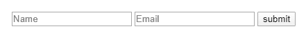
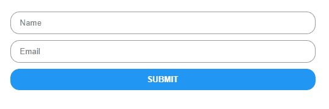
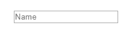
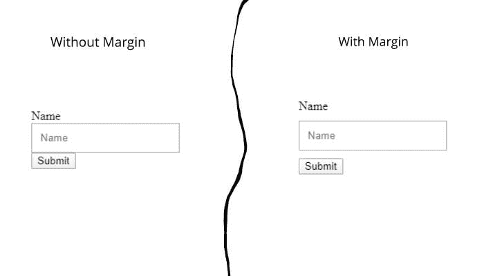
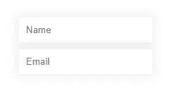
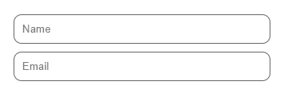
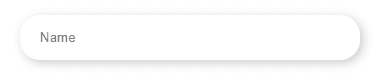
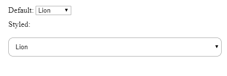
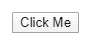
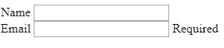

# 如何用 CSS 设计表单样式:初学者指南

> 原文：<https://blog.logrocket.com/how-to-style-forms-with-css-a-beginners-guide/>

应用程序主要通过表单收集数据。以一个通用的注册表单为例:有几个字段供用户输入信息，如他们的姓名、电子邮件等。

在过去，网站只有简单、乏味的 HTML 表单，没有风格。那是在 CSS 改变一切之前。现在，我们可以使用 CSS 的最新功能创建更有趣、更生动的表单。

[https://www.youtube.com/embed/14iT1MPISz8](https://www.youtube.com/embed/14iT1MPISz8)

视频

不要只相信我的话。下面是一个没有任何 CSS 的典型 HTML 表单。



这是同样的表单，加入了一些 CSS 元素。



在本教程中，我们将向您展示如何重新创建上面显示的表单，以及其他一些令人惊叹的修改，您可以实现这些修改来创建视觉上令人印象深刻的、用户友好的表单。

我们将分六步演示如何用 CSS 设计表单的样式:

1.  设置`[box-sizing](https://developer.mozilla.org/en-US/docs/Web/CSS/box-sizing)`
2.  输入元素的 CSS 选择器
3.  文本输入字段的基本样式方法
4.  样式化其他输入类型
5.  UI 伪类
6.  不可定制的输入

在我们开始之前，理解表单没有特定的样式是很重要的。可能性只受到你想象力的限制。本指南旨在帮助您开始使用 CSS 创建自己独特的设计。

我们开始吧！

## 1.设置`box-sizing`

我通常不仅为表单设置`* {box-sizing:border-box;}`，也为网页设置。当您设置它时，所有元素的宽度将包含填充。

例如，按如下方式设置宽度和填充。

```
.some-class {
  width:200px;
  padding:20px;
}

```

没有`box-sizing:border-box`的`.some-class`的宽度将超过`200px`，这可能是一个问题。这就是为什么大多数开发者对所有元素都使用`border-box`的原因。

下面是代码的一个更好的版本。它还支持`:before`和`:after`伪元素。

```
*, *:before, *:after {
  box-sizing: border-box;
}

```

提示:`*`选择器选择文档中的所有元素。

## 2.输入元素的 CSS 选择器

选择输入元素最简单的方法是使用 [CSS 属性选择器](https://blog.logrocket.com/advanced-css-selectors-for-common-scenarios/)。

```
input[type=text] {
  // input elements with type="text" attribute
}
input[type=password] {
  // input elements with type="password" attribute
}

```

这些选择器将选择文档中的所有输入元素。如果您需要指定任何选择器，您将需要向元素添加类。

```
<input type="text" class="signup-text-input" />

```

然后:

```
.signup-text-input {
   // styles here
}

```

## 3.单行文本输入字段的基本样式方法

单行字段是表单中最常用的输入字段。通常，单行文本输入是一个简单的带边框的框(这取决于浏览器)。

下面是带有占位符的单行字段的 HTML 标记。

```
<input type="text" placeholder="Name" />

```

它看起来会像这样:



您可以使用以下 CSS 属性来使这个输入字段更有吸引力。

*   填充(增加内部间距)
*   边距(在输入字段周围添加边距)
*   边境
*   方框阴影
*   边框半径
*   宽度
*   字体

让我们放大这些属性。

### 填料

向输入字段添加一些内部空间有助于提高清晰度。您可以使用`padding`属性来实现这一点。

```
input[type=text] {
  padding: 10px;
}

```


### 边缘

如果输入字段附近有其他元素，您可能希望在它周围添加一个边距以防止聚集。

```
input[type=text] {
  padding:10px;
  margin:10px 0; // add top and bottom margin
}

```



### 边境

在大多数浏览器中，文本输入字段都有边框，您可以自定义边框。

```
.border-customized-input {
   border: 2px solid #eee;
}

```

您也可以完全移除边框。

```
.border-removed-input {
  border: 0;
}

```

提示:移除边框时，一定要添加背景色或`box-shadow`。否则，用户将看不到输入。

一些网页设计者更喜欢只显示下边框，因为感觉有点像在笔记本上写字。

```
.border-bottom-input {
  border:0; // remove default border
  border-bottom:1px solid #eee; // add only bottom border
}

```

### 方框阴影

你可以使用 CSS `[box-shadow](https://www.w3schools.com/cssref/css3_pr_box-shadow.asp)`属性来添加阴影。您可以通过调整属性的五个值来实现一系列效果。

```
input[type=text] {
  padding:10px;
  border:0;
  box-shadow:0 0 15px 4px rgba(0,0,0,0.06);
}

```



### 边框半径

属性会对表单的感觉产生巨大的影响。通过弯曲框的边缘，可以显著改变输入字段的外观。

```
.rounded-input {
  padding:10px;
  border-radius:10px;
}

```



您可以通过一起使用`box-shadow`和`border-radius`来实现另一种外观。



### 宽度

使用`width`属性设置输入的宽度。

```
input {
  width:100%;
}

```

### 字体

大多数浏览器对表单元素使用不同的字体系列和大小。如果需要，我们可以从文档中继承字体。

```
input, textarea {
  font-family:inherit;
  font-size: inherit;
}

```

## 4.样式化其他输入类型

您可以设计其他输入类型的样式，例如文本区域、单选按钮、复选框等等。让我们仔细看看。

### 文本区域

文本区域类似于文本输入，只是它们允许多行输入。当您想要从用户那里收集更长形式的数据，比如评论、消息等时，通常会使用这些工具。您可以使用我们之前讨论过的所有基本 CSS 属性来设置文本区域的样式。

[`resize`](https://www.w3schools.com/cssref/css3_pr_resize.asp) 属性在文本区域也非常有用。在大多数浏览器中，默认情况下，文本区域可以沿 x 轴和 y 轴调整大小(值:`both`)。您可以设置为`both`、`horizontal`或`vertical`。

看看这个我设计的文本区域:

参见 [CodePen](https://codepen.io) 上 Supun Kavinda([@ SupunKavinda](https://codepen.io/SupunKavinda))
的笔 [dyomzez](https://codepen.io/SupunKavinda/pen/dyomzez) 。

在这个例子中，我使用`resize:vertical`只允许垂直调整大小。这种做法在大多数表单中使用，因为它可以防止讨厌的水平滚动条。

注意:如果您需要创建自动调整大小的文本区域，您将需要使用一种 [JavaScript 方法](https://stackoverflow.com/questions/454202/creating-a-textarea-with-auto-resize)，这超出了本文的范围。

### 复选框和单选按钮

默认的复选框和单选按钮很难设计，需要更复杂的 CSS(和 HTML)。

要设置复选框的样式，请使用下面的 HTML 代码。

```
<label>Name
  <input type="checkbox" />
  <span></span>
</label>

```

需要注意一些事情:

*   因为我们使用`<label>`来包装`<input>`，如果你点击`<``label``>`中的任何元素，那么`<input>`也会被点击
*   我们将隐藏`<input>`,因为浏览器不允许我们对它进行太多的修改
*   `<span>`创建自定义复选框
*   我们将使用`input:checked` [伪类选择器](https://developer.mozilla.org/en-US/docs/Learn/CSS/Building_blocks/Selectors/Pseudo-classes_and_pseudo-elements)来获取选中状态并样式化自定义复选框

这里有一个自定义的复选框(更多解释见 CSS 中的注释):

参见 [CodePen](https://codepen.io) 上 Supun Kavinda([@ SupunKavinda](https://codepen.io/SupunKavinda))
的笔 [yLNKQBo](https://codepen.io/SupunKavinda/pen/yLNKQBo) 。

这里有一个自定义单选按钮:

参见 [CodePen](https://codepen.io) 上 Supun Kavinda([@ SupunKavinda](https://codepen.io/SupunKavinda))
的笔 [eYNMQNM](https://codepen.io/SupunKavinda/pen/eYNMQNM) 。

在这两个例子中，我们使用了相同的概念(`input:checked`)来创建定制元素。

在浏览器中，复选框是箱形的，而单选按钮是圆形的。最好在自定义输入中保持这种约定，以避免混淆用户。

### 选择菜单

选择菜单使用户能够从多个选项中选择一个项目。

```
<select name="animal">
    <option value="lion">Lion</option>
    <option value="tiger">Tiger</option>
    <option value="leopard">Leopard</option>
</select>

```

你可以把柠檬做成看起来更迷人的样式。

```
select {
  width: 100%;
  padding:10px;
  border-radius:10px;
}

```



但是，您不能设置下拉菜单(或`<option>`元素)的样式，因为它们的默认样式取决于操作系统。样式化这些元素的唯一方法是使用 JavaScript 的自定义下拉菜单。

### 小跟班

像大多数元素一样，按钮有默认的样式。



```
<button>Click Me</button>

```

让我们加点料。

```
button {

  /* remove default behavior */
  appearance:none;
  -webkit-appearance:none;

  /* usual styles */
  padding:10px;
  border:none;
  background-color:#3F51B5;
  color:#fff;
  font-weight:600;
  border-radius:5px;
  width:100%;

}

```


## 5.UI 伪类

下面是一些常用于表单元素的 [UI 伪类](https://developer.mozilla.org/en-US/docs/Learn/Forms/UI_pseudo-classes)。

这些可用于显示基于元素属性的通知:

*   `:required`
*   `:valid`和`:invalid`
*   (我们已经用过了)

这些可用于创建每个状态的效果:

### 使用`:required`生成的消息

要显示要求输入的消息:

```
<label>Name
  <input type="text">
  <span></span>
</label>
<label>Email
  <input type="text" required>
  <span></span>
</label>

label {
  display:block;
}
input:required + span:after {
  content: "Required";
}

```



如果用 JavaScript 删除`required`属性，`"Required"`消息将被自动删除。

注意:`<input>`不能包含其他元素。因此，它不能包含`:after`或`:before`伪元素。因此，我们需要使用另一个`<span>`元素。

我们可以对`:valid`和`:invalid`伪类做同样的事情。

### `:hover`和`:focus`

当鼠标指针悬停在某个元素上时，选择该元素。`:focus`选择一个被聚焦的元素。

这些伪类通常用于创建过渡和轻微的视觉变化。例如，您可以更改宽度、背景颜色、边框颜色、阴影强度等。使用带有这些属性的`transition`属性会使这些更改更加平滑。

下面是一些表单元素的悬停效果(尝试悬停在元素上)。

参见 [CodePen](https://codepen.io) 上 Supun Kavinda([@ SupunKavinda](https://codepen.io/SupunKavinda))
的笔 [yLNKZqg](https://codepen.io/SupunKavinda/pen/yLNKZqg) 。

当用户将鼠标悬停在元素上，看到元素发生微妙的变化时，他们会觉得该元素是可操作的。这是设计表单元素时的一个重要考虑因素。

你是否注意到(在一些浏览器中)当聚焦于表单元素时会出现一个蓝色的轮廓？您可以使用`:focus`伪类来移除它，并在元素获得焦点时添加更多效果。

下面的代码删除所有元素的焦点轮廓。

```
*:focus {outline:none !important}

```

要添加焦点轮廓:

```
input[type=text]:focus {
  background-color: #ffd969;
  border-color: #000;
  // and any other style
}

```

你见过搜索输入在聚焦时会变大吗？试试这个输入。

参见 [CodePen](https://codepen.io) 上 Supun Kavinda([@ SupunKavinda](https://codepen.io/SupunKavinda))
的笔 [KKpoJJa](https://codepen.io/SupunKavinda/pen/KKpoJJa) 。

6.不可定制的输入

## 设计表单元素的样式在历史上一直是一项艰巨的任务。有一些形式元素，我们没有太多的控制造型。例如:

`<input type="color">`

*   `<input type="file">`
*   `<progress>`
*   `<option>`、`<optgroup>`、`<datalist>`
*   这些元素由浏览器提供，并基于操作系统进行样式化。样式化这些元素的唯一方法是使用定制控件， *，这些控件是使用可样式化的 HTML 元素创建的，如`div`、`span`等。*

 *例如，在样式化`<input type="file">`时，我们可以隐藏默认输入，使用自定义按钮。

表单元素的自定义控件是为大多数主流 JavaScript 库开发的。你可以在 GitHub 上找到它们。

结论

## 您现在应该了解了如何设计简单表单元素的样式，以及当浏览器输入字段难以设计样式时如何使用自定义控件。正如我在本文开始时所说的，这些只是 CSS 表单样式的基本构件。你应该以这些建议为基础，让你的想象力自由驰骋。

作为结束语，记得让你的所有表格[都有反应](https://developer.mozilla.org/en-US/docs/Learn/CSS/CSS_layout/Responsive_Design)。

寻找更多的表单设计灵感？看看这个[码笔收藏](https://codepen.io/collection/KuDsH/)。

你的前端是否占用了用户的 CPU？

## 随着 web 前端变得越来越复杂，资源贪婪的特性对浏览器的要求越来越高。如果您对监控和跟踪生产环境中所有用户的客户端 CPU 使用、内存使用等感兴趣，

.

[try LogRocket](https://lp.logrocket.com/blg/css-signup)

LogRocket 就像是网络和移动应用的 DVR，记录你的网络应用或网站上发生的一切。您可以汇总和报告关键的前端性能指标，重放用户会话和应用程序状态，记录网络请求，并自动显示所有错误，而不是猜测问题发生的原因。

[](https://lp.logrocket.com/blg/css-signup)[https://logrocket.com/signup/](https://lp.logrocket.com/blg/css-signup)

现代化您调试 web 和移动应用的方式— [开始免费监控](https://lp.logrocket.com/blg/css-signup)。

Modernize how you debug web and mobile apps — [Start monitoring for free](https://lp.logrocket.com/blg/css-signup).*