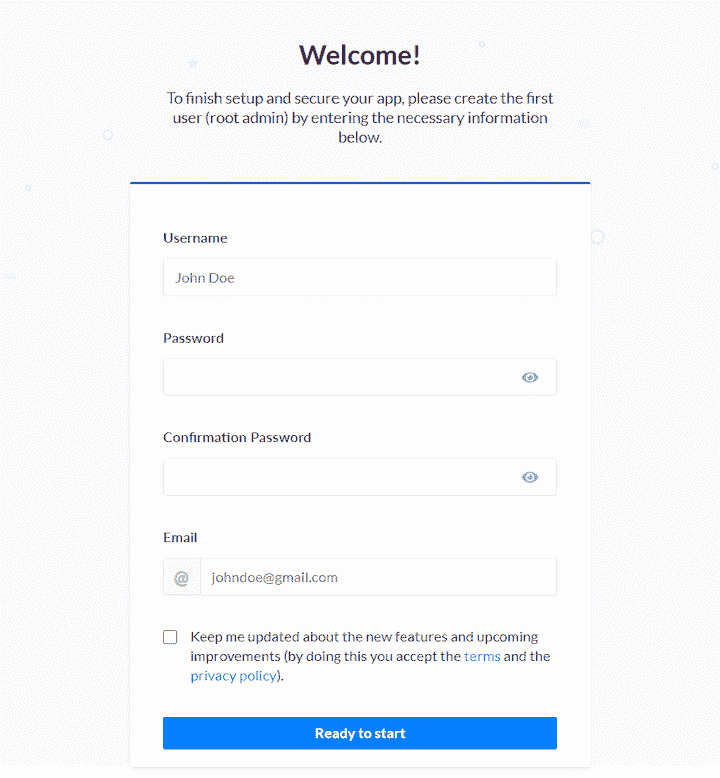
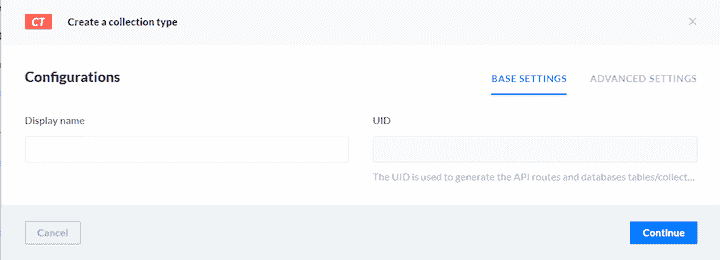
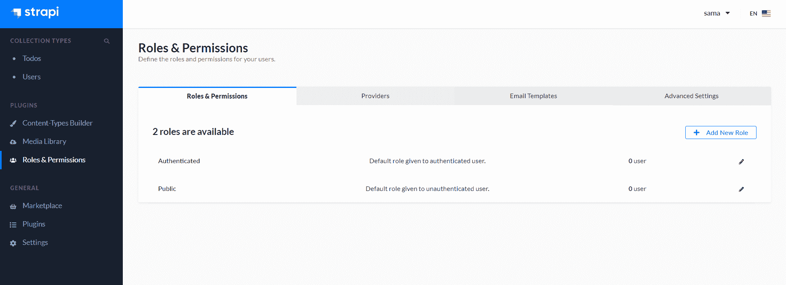
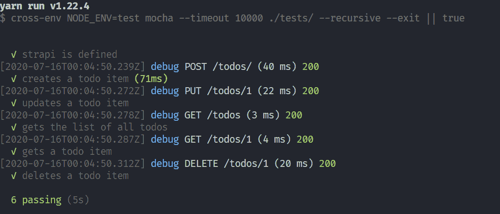

# 如何用 Mocha 和 Chai 测试 Strapi 端点

> 原文：<https://blog.logrocket.com/how-to-test-strapi-endpoints-with-mocha-and-chai/>

测试是开发应用程序时经常被忽略的基本构件。它为用户提供了成品质量的保证措施，通常有助于发现错误。

在本教程中，我们将介绍如何测试用 [Strapi](https://blog.logrocket.com/how-to-create-an-api-with-strapi/) 构建的 RESTful APIs，这是一个开源的无头 JavaScript CMS。它用于快速构建可定制的 API，而不用担心底层架构的细节。

我们将使用 [Mocha](https://mochajs.org/) 测试框架和 [Chai](https://www.chaijs.com/) 断言库来测试构建在 Strapi 上的端点。

## 先决条件

本教程假设您具备以下条件:

*   JavaScript 知识
*   Node.js v12.x 或更高版本
*   npm v6.x 或更高版本
*   测试知识
*   Postman(一个 API 客户端)

## 装置

要开始使用 Strapi，请打开您的终端并运行以下命令来安装。

```
npx create-strapi-app strapi-mocha-chai --quickstart

```

上面的命令将初始化一个名为`strapi-mocha-chai`的 Strapi 项目。`--quicktart`标志将用一个 Sqlite 数据库初始化 Strapi。如果您希望能够选择自己喜欢的数据库，请省略该标志。

安装后，应用程序应该会自动启动。如果没有，运行`npm develop`启动它。

在浏览器上导航至`[http://localhost:1337/](http://localhost:1337/)`查看应用程序。您应该会看到如下所示的屏幕。



填写表格并提交。提交之后，它会将您带到仪表板，在这里您可以开始创建 API 端点。

## 创建端点

我们将使用以下端点创建一个待办事项应用程序。

*   POST `/todos` —创建新待办事项的端点
*   GET `/todos` —获取所有待办事项列表的端点
*   获取`/todos/:id` —获取单个待办事项的点
*   PUT `/todos/:id` —更新现有 todo 的端点
*   删除`/todos/:id` —删除现有待办事项的端点

为了创建这些 RESTful API 端点，我们必须创建一个类似于数据库定义的内容类型。转到边栏上的“插件”,然后在打开的页面上单击“内容类型构建器”。

1.  点按“创建新收藏类型”您应该会看到如下所示的模态。
    
2.  键入“Todos”作为显示名称，然后单击“继续”
3.  另一种模式将会出现。单击“文本”并键入标题作为名称
4.  转到“高级设置”并选中“必需”
5.  单击“添加另一个字段”
6.  单击“Boolean”并在名称字段中键入“completed”
7.  转到“高级设置”并点击“假”作为默认值
8.  单击“完成”,然后单击“保存”
9.  现在已经创建了内容类型。让我们快速添加一些示例数据
10.  转到边栏上的“收藏类型”并点击“待办事项”
11.  在打开的页面上点击“添加新待办事项”,插入一个示例待办事项，然后保存

最后，让我们创建端点。

1.  单击“插件”部分中的“角色和权限”。
2.  单击“公共”并向下滚动到“权限”
3.  在“权限”下的待办事项中勾选以下复选框，然后保存

*   `create`
    *   `delete`
    *   `find`
    *   `findone`
    *   最后，打开 Postman 检查端点是否按预期工作。我已经为集合创建了[个文档。打开它，点击“运行在邮差”来测试你的邮差客户端。](https://documenter.getpostman.com/view/6435569/T17GgoJU?version=latest)

测试

## 要开始测试，您必须首先安装必要的库。

打开您的终端并运行下面的代码。

安装后，转到`package.json`并在`script`部分添加一个测试命令。

```
yarn add mocha chai chai-http cross-env

```

Mocha 是一个简单灵活的用于 Node.js 应用程序的 JavaScript 测试框架。它允许串行和异步测试。Chai 是一个可以和 Mocha 配对的 BDD/TDD 断言库。`chai-http`插件允许您创建集成测试并测试 HTTP、API 或外部服务。

```
"scripts": {
  "develop": "strapi develop",
  "start": "strapi start",
  "build": "strapi build",
  "strapi": "strapi",
  "test": "cross-env NODE_ENV=test mocha --timeout 10000"
}

```

为了将您的测试环境从开发环境中分离出来，在您运行任何测试之前，使用`cross-env`来设置`NODE_ENV`进行测试。

设置测试环境

### 在开始编写测试之前，您需要为您的测试创建一个单独的数据库配置，这样它就不会干扰开发数据库。

在根目录中打开您的终端并运行以下命令。

这在下面的路径`./config/env/test/`中创建了一个`database.json`。在你的编辑器中打开`database.json`,粘贴以下内容。

```
cd config
mkdir env && cd env
mkdir test && cd test
touch database.json

```

属性是临时数据库的位置，它将在每次运行测试时重新生成。在运行测试之前，您还需要创建一个 Strapi 服务器的实例。

```
{
  "defaultConnection": "default",
  "connections": {
    "default": {
      "connector": "bookshelf",
      "settings": {
        "client": "sqlite",
        "filename": ".tmp/test.db"
      },
      "options": {
        "useNullAsDefault": true,
        "pool": {
          "min": 0,
          "max": 15
        }
      }
    }
  }
}

```

将以下内容粘贴到您的终端中。

更多来自 LogRocket 的精彩文章:

* * *

### 这将在下面的路径`/tests/helpers/`中创建一个`strapi.js`文件。打开文件并粘贴以下内容。

* * *

```
mkdir tests
cd tests and mkdir helpers
touch strapi.js

```

测试 Strapi 实例

```
const Strapi = require('strapi');
const http = require('http');
let instance;
async function setupStrapi() {
  if (!instance) {
    /** the following code in copied from `./node_modules/strapi/lib/Strapi.js` */
    await Strapi().load();
    instance = strapi; // strapi is global now
    await instance.app
      .use(instance.router.routes()) // populate KOA routes
      .use(instance.router.allowedMethods()); // populate KOA methods
    instance.server = http.createServer(instance.app.callback());
  }
  return instance;
}
module.exports = { setupStrapi };

```

### 我们将在测试目录中创建我们的测试。导航到`/tests/`并创建一个名为`app.test.js`的文件。打开文件并粘贴下面的代码。

上面测试了 Strapi 实例，看它是否被初始化。Strapi 实例在`before`钩子中初始化，它在任何测试运行之前运行。

```
const fs = require('fs');
const { setupStrapi } = require('./helpers/strapi');
const chai = require('chai');
const expect = chai.expect;

before((done) => {
  setupStrapi();
  done();
});

after((done) => {
  const dbSettings = strapi.config.get('database.connections.default.settings');
  if (dbSettings && dbSettings.filename) {
    const tmpDbFile = `${__dirname}/../${dbSettings.filename}`;
    if (fs.existsSync(tmpDbFile)) {
      fs.unlinkSync(tmpDbFile);
    }
  }
  done();
});

it('strapi is defined', (done) => {
  expect(strapi).to.exist;
  done()
});

```

测试之后，删除`after`钩子中的测试数据库，以便在再次运行测试之前生成一个新的数据库。

测试端点

### 要开始测试端点，在路径`./tests/todo/`中创建一个名为`index.test.js`的文件，并粘贴下面的代码。

如前所述，您需要在执行测试之前设置一个 Strapi 连接的实例，并在每次测试完成后重新生成测试数据库。然后，继续为每个端点创建测试，以确保它们按预期工作。

```
const fs = require('fs');
const { setupStrapi } = require('../helpers/strapi');
const chai = require('chai');
const chaiHttp = require('chai-http');
const expect = chai.expect;
chai.use(chaiHttp);

let app;

before(async () => {
  app = await setupStrapi();
});

after((done) => {
  const dbSettings = app.config.get('database.connections.default.settings');
  if (dbSettings && dbSettings.filename) {
    const tmpDbFile = `${__dirname}/../${dbSettings.filename}`;
    if (fs.existsSync(tmpDbFile)) {
      fs.unlinkSync(tmpDbFile);
    }
  }
  done();
});

it('creates a todo item', (done) => {
  chai
    .request(app.server)
    .post('/todos/')
    .send({
      "title": "Sample 2",
      "completed": true
    }).end((error, response) => {
      expect(response).to.have.status(200);
      expect(response).to.have.property('body');
      expect(response.body).to.have.property('title');
      done();
    })
});

it('updates a todo item', (done) => {
  chai
    .request(app.server)
    .put('/todos/1')
    .send({
      "title": "Updated todo",
      "completed": true
    }).end((error, response) => {
      expect(response).to.have.status(200);
      expect(response).to.have.property('body');
      expect(response.body.title).to.equal('Updated todo');
      done();
    })
});

it('gets the list of all todos', (done) => {
  chai
    .request(app.server)
    .get('/todos')
    .end((error, response) => {
      expect(response).to.have.status(200);
      expect(response.body).to.be.an('array');
      done();
    })
});

it('gets a todo item', (done) => {
  chai
    .request(app.server)
    .get('/todos/1')
    .end((error, response) => {
      expect(response).to.have.status(200);
      expect(response.body).to.be.an('object');
      done();
    })
});

it('deletes a todo item', (done) => {
  chai
    .request(app.server)
    .delete('/todos/1')
    .end((error, response) => {
      expect(response).to.have.status(200);
      expect(response.body).to.be.an('object');
      done();
    })
});

```

要运行测试，打开终端并运行`yarn test`。您应该会得到类似下面截图的结果。



结论

## 在本教程中，我们介绍了如何使用 Mocha 测试框架和 Chai 断言库测试 Strapi 应用程序。

测试总是软件开发生命周期中不可或缺的一部分，你不应该忽视它。

本教程的资源库可以在 [GitHub](https://github.com/sa-ma/strapi-mocha-chai) 上找到。

您是否添加了新的 JS 库来提高性能或构建新特性？如果他们反其道而行之呢？

## 毫无疑问，前端变得越来越复杂。当您向应用程序添加新的 JavaScript 库和其他依赖项时，您将需要更多的可见性，以确保您的用户不会遇到未知的问题。

LogRocket 是一个前端应用程序监控解决方案，可以让您回放 JavaScript 错误，就像它们发生在您自己的浏览器中一样，这样您就可以更有效地对错误做出反应。

[LogRocket](https://lp.logrocket.com/blg/javascript-signup) 可以与任何应用程序完美配合，不管是什么框架，并且有插件可以记录来自 Redux、Vuex 和@ngrx/store 的额外上下文。您可以汇总并报告问题发生时应用程序的状态，而不是猜测问题发生的原因。LogRocket 还可以监控应用的性能，报告客户端 CPU 负载、客户端内存使用等指标。

[](https://lp.logrocket.com/blg/javascript-signup)[https://logrocket.com/signup/](https://lp.logrocket.com/blg/javascript-signup)

自信地构建— [开始免费监控](https://lp.logrocket.com/blg/javascript-signup)。

Build confidently — [Start monitoring for free](https://lp.logrocket.com/blg/javascript-signup).