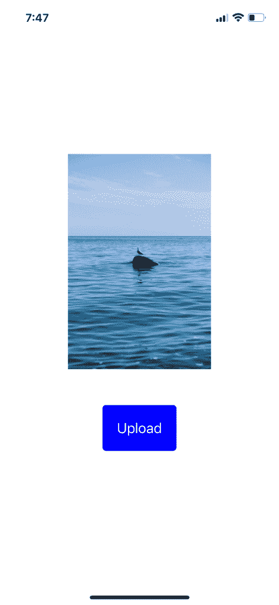
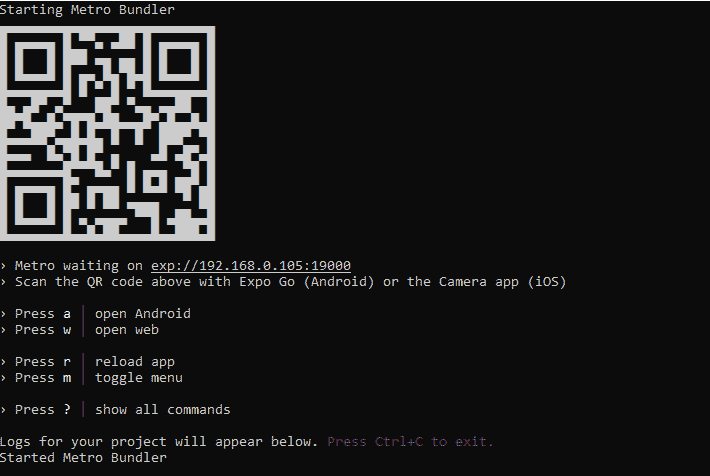
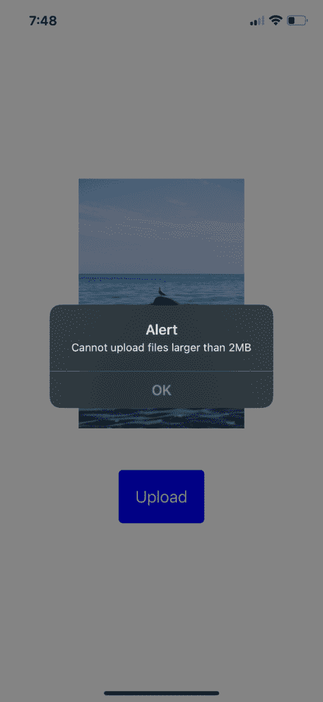
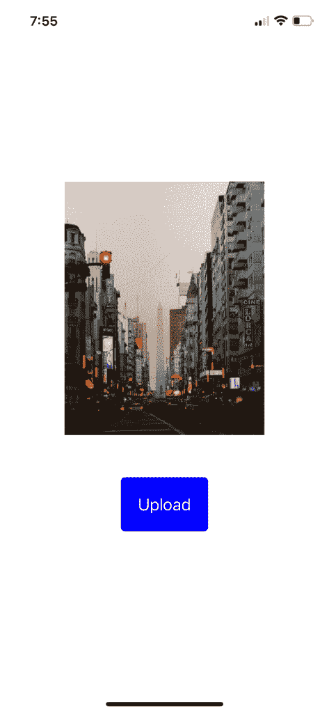
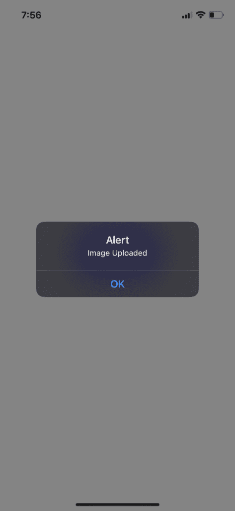

# 如何从 React Native 上传图片到 Laravel API 

> 原文：<https://blog.logrocket.com/how-to-upload-images-react-native-laravel-api/>

如今，开发人员同时从事前端和后端项目是很常见的。根据[最近的开发者调查](https://www.statista.com/statistics/869224/worldwide-software-developer-working-hours/)，React Native 是全球最受欢迎的构建跨平台移动应用的框架之一。Laravel 是一个 PHP web 框架，具有优雅的代码结构，开发人员可以用它来创建 REST APIs。Laravel 目前拥有 [71k GitHub stars](https://github.com/laravel/laravel) ，显示了其在开发者社区中的受欢迎程度。

本文将介绍从 React 本地应用程序上传图片到 Laravel API 的细节。

## 内容

## 入门指南

从 React 本地应用上传图片似乎很简单。但是，React Native 并没有提供一种直接的方式将 app 与 [Laravel 的端点](https://blog.logrocket.com/whats-new-laravel-9/)连接起来。

因此，您需要采取一些步骤，并使用 Axios 之类的 HTTP 库从您的应用程序上传图像。您还需要在数据库中存储每个图像的公共 URL。

让我们从使用 [composer](https://getcomposer.org/) 创建 Laravel 项目开始。

```
> composer create-project laravel/laravel image-upload

```

运行下面的命令，在迁移的同时创建一个`Image`模型类。

```
> php artisan make:model Image -m

```

然后，在生成的迁移类的`up()`函数中指定所需的列，如下所示:

```
public function up()
{
    Schema::create('images', function (Blueprint $table) {
        $table->id();
        $table->string('url');
        $table->timestamps();
    });
}

```

接下来，运行以下命令来执行数据库更改。

```
> php artisan migrate

```

现在数据库已经准备好了，让我们来设置 API 代码。

## 设置 Laravel 图像上传 API

让我们创建一个 POST API 来处理来自 React 本机应用程序的图像上传请求。

运行以下命令创建一个控制器来处理传入的请求。

```
php artisan make:controller ImageUploadController

```

接下来，在`ImageUploadController`类中，创建一个处理程序类方法`uploadImage`，如下所示。

```
use App\Models\Image;
use Illuminate\Http\Request;
use Illuminate\Support\Facades\URL;
use Illuminate\Support\Facades\Validator;
use Illuminate\Validation\Rules\File;

class ImageUploadController extends Controller
{
    public function uploadImage(Request $request)
    {
        $validator = Validator::make($request->all(), ['image' => ['required', File::image()->max(2 * 1024)]]);
        if ($validator->fails()) return response()->json($validator->messages());
        $image = new Image();
        $file = $request->file('image');
        $filename = uniqid() . "_" . $file->getClientOriginalName();
        $file->move(public_path('public/images'), $filename);
        $url = URL::to('/') . '/public/images/' . $filename;
        $image['url'] = $url;
        $image->save();
        return response()->json(['isSuccess' => true, 'url' => $url]);
    }
}

```

在`uploadImage`方法中，我们使用`Validator`实用程序类来验证请求中是否有图像，以及文件大小是否小于 2MB。如果验证失败，我们返回验证错误消息作为响应。

在上面的代码中，我们将图像存储在公共路径中，以便可以通过 URL 访问它。为了使文件名唯一，您可以使用`uniqid()`函数为原始文件名添加一个唯一的 ID。

## 为图像上传创建端点

接下来，通过将以下代码片段添加到`routes/api.php`文件，将控制器方法附加到 API 端点:

```
use App\Http\Controllers\ImageUploadController;

Route::post('/upload', [ImageUploadController::class, 'uploadImage'])
    ->name('images.upload');

```

现在，使用以下命令在您的系统上运行 API 服务器:

```
> php artisan serve --host 0.0.0.0

```

要从本地 IP 地址启用 API 访问，请使用`--host 0.0.0.0`选项。您将需要它，因为 React 本地应用程序将向本地 IP 地址发出 HTTP 请求。

要在 Windows 上查找本地 IP 地址，请运行以下命令:

```
> ipconfig

```

若要在 macOS 上查找本地 IP 地址，请检查网络设置。或者，您可以使用 [ngrok](https://ngrok.com/) 使您的本地主机可以通过 URL 公开访问。

## 使用 Expo 配置 React 本机应用程序

在本指南中，我们将使用 [Expo](https://expo.dev/) 来创建 React 本地项目。Expo 是一个开发工具，可以让您在任何设备上运行 React 本机应用程序，而无需使用仿真器。

```
> npx create-expo-app ImageUploaderApp

```

接下来，让我们安装一些将在项目中使用的依赖项。我们将使用`expo-image-picker`库从设备的图库中选择图像，并使用`axios`库将照片上传到我们的 Laravel API。

要安装这些库，请打开终端并导航到您的项目目录。然后，运行以下命令:

```
> npm i expo-image-picker axios

```

既然已经安装了这些依赖项，我们就可以开始编写代码了！

## 构建 React 本机 UI 以预览和上传图像

让我们为 React 本地应用程序创建 UI。

首先创建一个定制的`Button`组件，如下所示:

```
import React from "react";
import { TouchableOpacity, Text, StyleSheet } from "react-native";

interface ButtonProps {
  onPress: () => void;
  text: string;
}

export const Button = ({ onPress, text }: ButtonProps) => (
  <TouchableOpacity onPress={onPress} style={styles.button}>
    <Text style={styles.buttonText}>{text}</Text>
  </TouchableOpacity>
);

const styles = StyleSheet.create({
  button: {
    backgroundColor: "blue",
    padding: 20,
    borderRadius: 5,
  },
  buttonText: {
    fontSize: 20,
    color: "#fff",
  },
});

```

接下来，创建一个`Thumbnail`组件，它将预览从图库中选择的图像。

```
import React from "react";
import { View, Image, StyleSheet } from "react-native";

interface ThumbnailProps {
  uri: string;
}

export const Thumbnail = ({ uri }: ThumbnailProps) => (
  <View>
    <Image source={{ uri }} style={styles.thumbnail} />
  </View>
);

const styles = StyleSheet.create({
  thumbnail: {
    width: 300,
    height: 300,
    resizeMode: "contain",
    marginBottom: 50,
  },
});

```

我们可以在主`App.js`文件中一起使用这些组件来创建应用程序的用户界面。

接下来，在`App.js`文件中创建一个函数`openImagePickerAsync()`，该函数将检查并请求图库许可。当用户授予权限时，在状态中设置选中的图像，并使用`Thumbnail`组件显示图像。

```
import * as ImagePicker from "expo-image-picker";
import React, { useState } from "react";
import { Button } from "./components/Button";
import { Thumbnail } from "./components/Thumbnail";
import { StatusBar } from "expo-status-bar";
import { StyleSheet, View, Platform } from "react-native";

...

export default function App() {

  const [selectedImage, setSelectedImage] = useState<ImagePicker.ImageInfo>();

  const openImagePickerAsync = async () => {
    let permissionResult =
      await ImagePicker.requestMediaLibraryPermissionsAsync();
    if (permissionResult.granted === false) {
      alert("Permission to access camera roll is required!");
      return;
    }
    let pickerResult = await ImagePicker.launchImageLibraryAsync({
      quality: 1,
      mediaTypes: ImagePicker.MediaTypeOptions.Images,
    });
    if (pickerResult.cancelled === true) return;
    setSelectedImage(pickerResult);
  };

  const uploadImage = async () => {
    // upload logic will go here
  }

  return (
    <View style={styles.container}>
      {selectedImage ? (
        <>
          <Thumbnail uri={selectedImage.uri} />
          <Button onPress={uploadImage} text="Upload" />
        </>
      ) : (
        <Button onPress={openImagePickerAsync} text="Pick a photo" />
      )}
      <StatusBar style="auto" />
    </View>
  );
}

```

此时，应用程序的用户界面应该如下所示:


一旦从图库中选择了图像，我们希望显示一个上传按钮，该按钮将向 Laravel 服务器发出 API 请求。

在`uploadImage()`函数中，创建一个`FormData`对象并追加图像数据。[调用`axios.post()`方法](https://blog.logrocket.com/how-to-make-http-requests-like-a-pro-with-axios/)向上传端点发出 POST 请求。在`headers`中，添加`Content-Type: multipart/form-data`使文件上传到服务器。

```
const API_BASE = 'YOUR LOCAL IP ADDRESS' // 192.168.1.1;

const uploadImage = async () => {
    if (!selectedImage) return;
    const canUpload = await checkFileSize(selectedImage.uri);
    if (!canUpload) {
      alert("Cannot upload files larger than 2MB");
      setSelectedImage(undefined);
      return;
    }
    const uri =
      Platform.OS === "android"
        ? selectedImage.uri
        : selectedImage.uri.replace("file://", "");
    const filename = selectedImage.uri.split("/").pop();
    const match = /\.(\w+)$/.exec(filename as string);
    const ext = match?.[1];
    const type = match ? `image/${match[1]}` : `image`;
    const formData = new FormData();
    formData.append("image", {
      uri,
      name: `image.${ext}`,
      type,
    } as any);
    try {
      const { data } = await axios.post(`${API_BASE}/api/upload`, formData, {
        headers: { "Content-Type": "multipart/form-data" },
      });
      if (!data.isSuccess) {
        alert("Image upload failed!");
        return;
      }
      alert("Image Uploaded");
    } catch (err) {
      console.log(err);
      alert("Something went wrong");
    } finally {
      setSelectedImage(undefined);
    }
};

```

下面是带有上传按钮的示例应用程序:



## 检查图像文件大小

在将文件上传到服务器之前，检查文件的大小是一个很好的做法。让我们通过安装`expo-file-system`库来实现这一点。

```
> npm i expo-file-system
```

```
import * as FileSystem from "expo-file-system";
...

const checkFileSize = async (
  fileURI: string,
  maxSize = 2
): Promise<boolean> => {
  const fileInfo = await FileSystem.getInfoAsync(fileURI);
  if (!fileInfo.size) return false;
  const sizeInMb = fileInfo.size / 1024 / 1024;
  return sizeInMb < maxSize;
};

```

在上面的代码中，`FileSystem.getInfoAsync()`方法接受文件 URI 作为参数，并返回以字节为单位的文件大小。

现在，运行`npm run start`命令来构建 React 原生应用程序。

```
> npm run start

```



你需要在你的设备上安装 Expo 应用来安装和运行你的 React 本地应用。安装完成后，扫描终端上显示的二维码。你可以从官方文件中了解更多关于世博会的信息。

一旦你的应用在设备上运行，尝试上传大于 2MB 的图像。您应该会看到如下所示的错误消息:



现在，试着上传一张小一点的图片；您应该会看到一条消息，表明图像已成功上传。





## 结论

在本文中，我们演示了如何将图片从 React 本地应用上传到 Laravel API。

我们首先设置了 Laravel API，并为图像上传创建了一个端点。然后，我们使用 Expo 配置了 React 本地项目，并创建了用于预览和上传图像的 UI 组件。最后，我们使用 Axios 将图像上传到 Laravel API。

将图片从 React Native 上传到 Laravel API 是一个非常简单的过程。只要按照本文中概述的步骤操作，您应该很快就能完成。如果您有任何问题或遇到任何问题，请在下面留下您的评论。

干杯，编码快乐！

## [LogRocket](https://lp.logrocket.com/blg/react-native-signup) :即时重现 React 原生应用中的问题。

[](https://lp.logrocket.com/blg/react-native-signup)

[LogRocket](https://lp.logrocket.com/blg/react-native-signup) 是一款 React 原生监控解决方案，可帮助您即时重现问题、确定 bug 的优先级并了解 React 原生应用的性能。

LogRocket 还可以向你展示用户是如何与你的应用程序互动的，从而帮助你提高转化率和产品使用率。LogRocket 的产品分析功能揭示了用户不完成特定流程或不采用新功能的原因。

开始主动监控您的 React 原生应用— [免费试用 LogRocket】。](https://lp.logrocket.com/blg/react-native-signup)