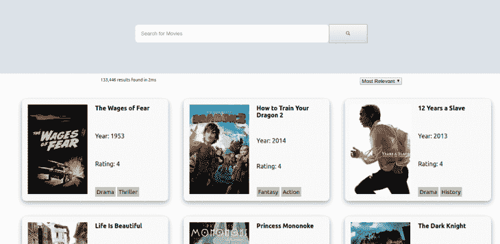
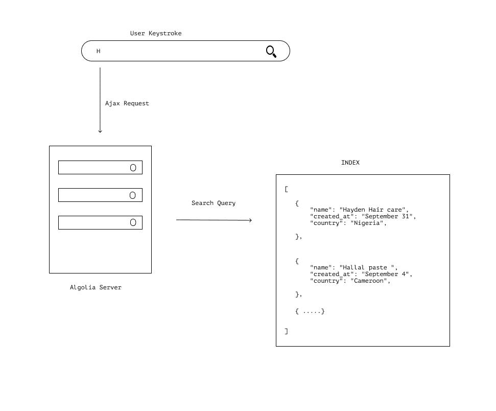
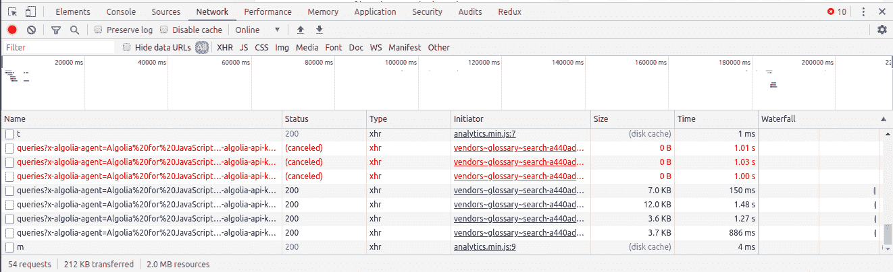

# 如何使用 Algolia 进行即时搜索

> 原文：<https://blog.logrocket.com/how-to-use-algolia-for-instant-search/>

构建任何网站或网络应用最重要的部分之一就是它的搜索功能。搜索功能有助于更轻松、更快速地与产品互动。我们生活在一个分秒必争的世界，糟糕的搜索体验可能会导致用户停止使用某个产品。

在本教程中，我们将:

*   看看 Algolia，以及我们如何使用它为我们的应用程序构建即时搜索体验
*   了解 [Algolia InstantSearch 库](https://www.algolia.com/products/instantsearch/)如何帮助消除构建和维护随你输入搜索系统的相关问题
*   了解即时搜索如何帮助提高我们搜索系统的性能和效率
*   此外，看看如何通过构建一个电影搜索应用程序来开始在您的应用程序中实现 Algolia InstantSearch

我们的应用程序的最终版本应该是这样的:

## 先决条件:

本教程需要满足以下先决条件:

## 入门指南

### 什么是即时搜索？

这是一个预测搜索功能，它试图预测和猜测用户搜索查询最有可能完成的内容，并在搜索框中输入每一次按键时立即显示与用户输入相关的信息。

### 什么是 Algolia？

据其[网站](https://www.algolia.com)显示:

> Algolia 是一款搜索即服务解决方案，通过可定制的预建小部件和工具，帮助您在应用程序中构建实时搜索，从而简化搜索系统的构建。

### Algolia 即时搜索是如何工作的？

为了理解 Algolia 即时搜索服务的工作原理，我们需要了解以下关键术语:

*   `INDEX` —将在我们的应用程序中用于查询和搜索的信息集。它是`RECORDS`的集合
*   `RECORDS`—JSON 对象的数组，这些对象包含最终显示给用户的数据/信息。它们由`ATTRIBUTES`组成
*   `ATTRIBUTES` —描述其父项`RECORD`的键值对内容

## 即时搜索逻辑

InstantSearch 包与 [Algolia API](https://www.algolia.com/doc/rest-api/search/) 交互，当用户在搜索框中输入按键时，会向 Algolia 服务器发出请求，服务器依次将搜索查询与可用的`INDEX`进行比较，并通过`RECORD`过滤包含相关`ATTRIBUTE`的查询，然后发送回与搜索词相关的`RECORDS`。



Algolia 为我们提供了预配置的 UI 小部件，作为我们 Algolia powered 应用程序的构建模块。这些小部件利用 Algolia API 来帮助简化与 Algolia API 的交互和呈现数据。



我们将在本教程中使用的小部件有:

*   `InstantSearch`—该小部件是所有 Algolia 即时搜索小部件的父组件。它直接与 Algolia API 接口
*   这个组件包含了搜索栏，并提供了一种获取用户查询的方法
*   `RefinementList` —这是一个小部件，它提供了一组过滤器，根据属性来细化从 Algolia API 获得的查询结果数据
*   `Hits` —这是一个小部件，显示特定查询的所有结果
*   `HighLights` —这个小部件有助于突出显示查询结果的属性
*   `HitsPerPage` —此小部件用于控制每页显示的结果数量
*   `Pagination` —此小工具用于更改`Hit`页面
*   `Stats` —此小部件显示检索数据所花费的时间以及匹配搜索查询的命中数

关于 React InstantSearch 小部件及其功能的完整列表，请参考[本 API 参考](https://www.algolia.com/doc/api-reference/widgets/react/)。

## 构建我们的电影搜索应用

我们将使用 [create-react-app](https://create-react-app.dev/) 样板来引导我们的项目，这样我们就不必担心在应用程序中使用 Algolia 进行即时搜索的配置了。

运行以下命令，使用样板文件创建一个新的 React 应用程序:

```
#Using NPM
npx create-react-app react-instant

#or, Using Yarn
yarn create react-app react-instant
```

然后使用命令切换到我们项目的目录:

```
cd react-instant
```

接下来，我们使用以下命令安装 React 即时搜索包:

```
npm install react-instantsearch-dom
#or, Using Yarn
yarn add react-instantsearch-dom
```

我们还需要安装 [algoliasearch](https://github.com/algolia/algoliasearch-client-javascript) 包，algoliasearch 是一个与 Algolia API 通信的 HTTP 客户端。

运行命令:

```
npm install algoliasearch
or 
yarn add algoliasearch
```

在你的`src`文件夹中创建一个名为`components`的文件夹，这个文件夹将存放我们应用程序的`Search`组件。

我们需要删除样板文件中不需要的内容，打开你的`src/App.js`并删除不必要的代码。它应该是这样的:

```
import React from 'react';
import './App.css';
function App() {
  return (
        <div className="App">

        </div>
  );
}
export default App;
```

继续在 components 文件夹中创建一个名为`Search.js`的文件，并在文件中包含以下内容:

```
# /src/components/Search.js

import React from 'react';
function Search () {            
        return (

          );
}
export default Search;
```

然后我们继续将`algoliasearch`和`InstantSearch`组件导入到我们的`Search.js`文件中:

```
import algoliasearch from 'algoliasearch'
import { InstantSearch } from 'react-instantsearch-dom'
```

导入后，在搜索组件中初始化它:

```
return(
   <InstantSearch>

   </InstantSearch>

 );
```

然后，我们继续配置我们的应用程序，以使用我们的 API 密钥、应用程序 ID 和索引名称。

出于本教程的目的，我们将使用 Algolia 提供的已经配置好的索引进行测试，该索引包含创建我们的应用程序所需的所有数据。

这些配置的值应该替换为您从 Algolia 仪表盘上获得的值。

在您的`Search.js`文件中，紧接在您的 import 语句之后，包含以下内容。

```
const searchClient = algoliasearch("latency", "6be0576ff61c053d5f9a3225e2a90f76")
```

添加`searchClient`作为`InstantSearch`组件的属性，并包含`indexName`作为值为`movies`的属性。

```
function Search() {

    return (
        < InstantSearch searchClient={searchClient} indexName="movies" >

        </InstantSearch >
    );
....
```

接下来，我们创建一个包含我们的`SearchBox`的`Header`组件，并从 InstantSearch 导入`SearchBox`组件:

```
import { InstantSearch, SearchBox } from 'react-instantsearch-dom';
....
const Header = () => (
    <header className="header">
        <SearchBox
            className="search-bar"
            translations={{placeholder: 'Search for Movies'}}
        />
    </header>
)
....
```

然后我们继续配置我们的`Hits`来接收来自 Algolia API 的结果:

```
const Hit = ({ hit }) => (
    <a href={"/"} >
        <div className="card">
            <div className="card-image">
                
            </div>
          <div className="card-contents">
                <Highlight attribute="title" hit={hit} className="card-title" />
                <Highlight attribute="year" hit={hit}  className="card-year"/>
                <div className="card-rating">Rating: {hit.rating}</div>
                <div className="card-genre"> <span>{hit.genre[0]}</span> <span>{hit.genre[1]}</span> </div>
            </div>
        </div>
    </a>
);
```

我们的`Hits`组件接收`hit`作为道具，然后我们将使用`hit`道具与我们的[预配置索引](https://github.com/algolia/datasets/tree/master/movies)数据进行交互。

接下来，我们创建一个内容组件，它将包含将在我们的应用程序中显示的所有内容，我们将`Hits`、`Hightlight`、`Pagination`和`SortBy`组件导入其中:

```
import { InstantSearch, SearchBox, Hits, Highlight, Stats, SortBy, Pagination } from 'react-instantsearch-dom';
....
const Content = () => (
    <main>
        <div className="information">
            <div className="stats"> <Stats/> </div>
            <div className="">
                <SortBy defaultRefinement="movies"
                    items={[
                        { value: 'movies', label: 'Most Relevant' },   
                    ]}
                />
            </div>
        </div>

        <Hits hitComponent={Hit} />
        <div> <Pagination/> </div>
    </main>
);
....
```

您的`Search.js`文件的内容现在应该看起来像这样:

```
import React from 'react';
import algoliasearch from 'algoliasearch'
import { InstantSearch, SearchBox, Hits, Highlight, Stats, SortBy, Pagination } from 'react-instantsearch-dom';

const searchClient = algoliasearch("latency", "6be0576ff61c053d5f9a3225e2a90f76")

function Search() {

    return (
        < InstantSearch searchClient={searchClient} indexName="movies" >
            <Header />
            <div className="body-content">
                <Content/>
            </div>
        </InstantSearch >
    );        
};
const Header = () => (
    <header className="header">
        <SearchBox
            className="search-bar"
            translations={{ placeholder: 'Search for Movies' }}
        />
    </header>
);
const Hit = ({ hit }) => (
    <a href={"/"} >
        <div className="card">
            <div className="card-image">
                
            </div>
             <div className="card-contents">                
                <Highlight attribute="title" hit={hit} className="card-title" />
                <Highlight attribute="year" hit={hit}  className="card-year"/>
                <div className="card-rating">Rating: {hit.rating}</div>
                <div className="card-genre"> <span>{hit.genre[0]}</span> <span>{hit.genre[1]}</span> </div>
            </div>
        </div>
    </a>
);
const Content = () => (
    <main>
        <div className="information">
            <div className="stats"> <Stats/> </div>
            <div className="">
                <SortBy defaultRefinement="movies"
                    items={[
                        { value: 'movies', label: 'Most Relevant' },   
                    ]}
                />
            </div>
        </div>
        <Hits hitComponent={Hit} />
        <div> <Pagination/></div>
    </main>
);
export default Search;
```

在你的组件文件夹中创建一个`Search.css`文件，包含以下样式，让我们的应用看起来更漂亮:

```
.header{
    padding-top: 4em;
    width: 100%;
    display: flex;
    background-color: #dce2e9;
    height: 20vh
}
.search-bar{
    display: flex;
    justify-content: center;
    width: 100%
}
input{
    min-width: 500px;
    border: none;
    border-radius: .5em;
    padding: 15px

}
.ais-SearchBox-submit{
    width: 100px;
    padding: 15px;
    color: #c4c4c4
}
.ais-SearchBox-reset{
    display: none
}
main{
    width: 100%;
}
ul{
    width: 100%;
    display: flex;
    flex-wrap: wrap
}
li{
    list-style-type: none;
}
.ais-Hits-item{
    width: 32%;
}
.card{
    background-color: #f9f9f9;
    display: flex;
    border-radius: 10px;
    margin:20px;
    padding: 15px;
    box-shadow: 0 4px 8px 0 rgba(0, 0, 0, 0.2), 0 6px 20px 0 rgba(0, 0, 0, 0.19);
}
.card-contents{
    margin-left: 20px;
    display: flex;
    align-content: center;
    flex-direction: column;
    justify-content: space-between
}
.card-title{
    font-weight: bold
}
.card-genre > span{
    font-size: 15px;
    width: 20px;
    padding: 4px;
    background-color: #c4c4c4
}
.information{
    padding-top: 10px;
    display: flex;
    justify-content: space-around;
    font-size: 11px
}
a{
    text-decoration: none
}
a:visited{
    color: black;
}
.ais-Pagination-list{
    display: flex;
    justify-content: center
}
.ais-Pagination-item{
    margin: 5px
}
```

然后将`Search`组件导入到我们的`App.js`文件中:

```
....
import Search from './components/Search'

....
<div className="App">
  <Search/>

</div>
....
```

在您的终端上运行以下命令:

```
#using NPM
npm start

#or,using yarn
yarn start
```

我们的应用程序应该看起来像这样:

当我们输入搜索查询时，它会相应地改进我们的电影卡。

## 结论

我们已经了解了如何在 React 应用中配置 Algolia。要了解更多关于 Algolia 搜索服务的信息，你可以查看它的[文档](https://www.algolia.com/doc/)。

你可以在 [GitHub](https://github.com/Jolaolu/react-instant) 上查看本教程的资源库，也可以查看正在运行的[应用](https://instanta.now.sh/)的部署版本。

## 使用 LogRocket 消除传统反应错误报告的噪音

[LogRocket](https://lp.logrocket.com/blg/react-signup-issue-free)

是一款 React analytics 解决方案，可保护您免受数百个误报错误警报的影响，只针对少数真正重要的项目。LogRocket 告诉您 React 应用程序中实际影响用户的最具影响力的 bug 和 UX 问题。

[ ](https://lp.logrocket.com/blg/react-signup-general) [  ](https://lp.logrocket.com/blg/react-signup-general) [LogRocket](https://lp.logrocket.com/blg/react-signup-issue-free)

自动聚合客户端错误、反应错误边界、还原状态、缓慢的组件加载时间、JS 异常、前端性能指标和用户交互。然后，LogRocket 使用机器学习来通知您影响大多数用户的最具影响力的问题，并提供您修复它所需的上下文。

关注重要的 React bug—[今天就试试 LogRocket】。](https://lp.logrocket.com/blg/react-signup-issue-free)