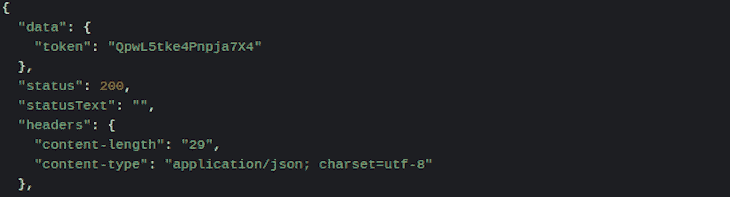
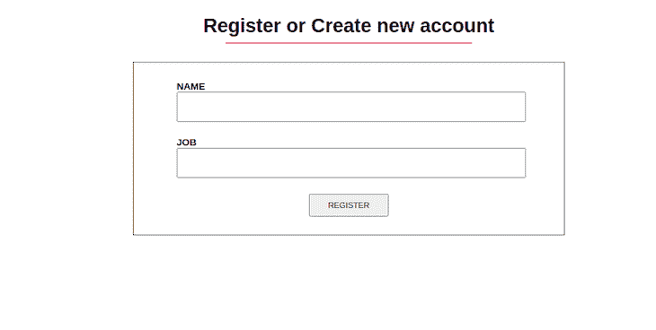

# 如何使用 Axios POST requests 

> 原文：<https://blog.logrocket.com/how-to-use-axios-post-requests/>

***编者按:**本指南旨在理解 Axios `POST`请求，最近一次更新是在 2023 年 2 月 8 日，包括了关于错误处理、使用 async/await 方法以及更新所有过时代码的章节。*

向 web 服务器发送请求是我们在 web 开发前端最常做的事情之一。创建一个脸书帖子，上传一张新的 Instagram 图片，发送一条推文，或者登录并注册新网站，所有这些都会向服务器发送请求。

Axios 是一个开源库，它通过提供一个名为`POST`的基于承诺的 HTTP 客户端方法来帮助我们发送所有这些请求。在本文中，我们将学习如何在普通 JavaScript 和 React 这样的框架中使用 Axios `POST`方法。在继续之前，对 React 和 React 表单元素如何工作有一个[的理解是很重要的。你可以](https://blog.logrocket.com/tag/react/)[在 React 这里](https://blog.logrocket.com/?post_type=post&s=react+forms&orderby=relevance&order=DESC&post_type=post)阅读更多关于表单的内容。

*向前跳转:*

## Axios 简介

Axios 库[向浏览器和 Node.js 中的`REST`端点发出异步 HTTP 请求](https://blog.logrocket.com/how-to-make-http-requests-like-a-pro-with-axios/)，因为 Axios 是 Node.js 和浏览器的轻量级 HTTP 客户端，它允许用户利用 [JavaScript 的异步/等待](https://blog.logrocket.com/understanding-asynchronous-javascript/)。

Axios 也非常类似于[原生 JavaScript Fetch API](https://blog.logrocket.com/patterns-for-data-fetching-in-react-981ced7e5c56/#usingthefetchapi) 。它提供了许多方法，如`POST`、`PUT`、`PATCH`、`GET`、`DELETE`等等。然而，在本文中，我们将只关注`POST`方法。为了理解使用`POST`方法，让我们考虑以下场景:

以登录脸书为例。当我们开始使用该应用程序时，它会要求我们注册或登录，如果我们已经有一个帐户。我们必须填写所需的表单细节，并将它们发送到服务器来完成这两项工作。

然后，该服务器会检查我们输入的内容，并带我们进入主应用程序，或者如果详细信息不正确，会显示一条错误消息。Axios `POST`是允许我们这样做的 Axios 方法。下面是 Axios `POST`请求的样子:

```
axios.post(url[, data[, config]])

```

根据上面的代码，Axios `POST`有三个参数:T1、`data`和`config`。`URL`是我们向其发送请求的服务器路径(注意，它是字符串格式)。

然后，`data`封装我们发送或解析给`URL`的请求体。它是对象格式的，这意味着它有一个键和值。关键是服务器接受的模式，而值是我们解析的任何数据类型。`config`是第三个参数，我们在这里指定头内容类型、授权等等。它也是一种对象格式。

现在我们已经了解了 Axios 是什么以及它的`POST`方法，让我们继续来看看如何使用它。

## 为什么要用 Axios？

您可能想知道为什么应该使用 Axios 而不是原生 JavaScript `fetch()`方法。相比较而言，Axios 比`fetch()`有一些优势，我们很快就会看到。

首先，Axios 允许我们只使用一个承诺(`.then()`)并且默认使用 JSON 数据。这与 Fetch API 不同，后者要求您首先在第一个承诺中将请求体转换为 JSON 字符串，如下所示:

```
// With Fetch
fetch(url)
 .then((response) => response.json())
 .then((data) => console.log(data))
 .catch((error) => console.log(error));

// With Axios
axios.get(url)
 .then((response) => console.log(response))
 .catch((error) => console.log(error));

```

其次，与 Fetch API 不同，Axios 既可以在服务器上使用，也可以在客户端上使用。Axios 函数也被命名为与 HTTP 方法相匹配。要执行一个`POST`请求，可以使用`.post()`方法，依此类推:

```
axios.post()   // to perform POST request
axios.get()    // to perform GET request
axios.put()    // to perform PUT request
axios.delete() // to perform DELETE request
axios.patch    // to perform PATCH request

```

通过 Fetch API 使用 Axios `POST`的其他原因包括:

*   取消请求和请求超时，这是`fetch()`不允许的
*   通过抛出包括网络错误在内的各种错误，更好地处理错误
*   拦截 HTTP 请求的能力
*   更广泛的浏览器支持

## 使用 Axios `POST`

在本文前面，我们提到了如何在普通 JavaScript 和 React 中使用 Axios `POST`方法。因此，我们将从前者开始，然后进行到后者。

请记住，本文的大部分内容将集中在使用 React 上，我们将使用虚拟 API 中的 [reqres.in 进行调用。](https://reqres.in/)

### 如何用普通 JavaScript 发送 Axios `POST`

要在普通 JavaScript 中使用 Axios，我们必须先在 HTML 中添加 CDN 链接，然后才能在`script`文件中使用它。让我们首先创建两个文件来使用:`index.html`和`index.js`:

```
// index.html

<!DOCTYPE html>
<html>
  <head>
    <title>Parcel Sandbox</title>
    <meta charset="UTF-8" />
  </head>
  <body>
    <div id="app">
      <h1>Login Account</h1>
      <form action="">
        <label for="email">
          Email
          <input type="email" name="" id="email" />
        </label>
        <label for="password">
          Password
          <input type="password" name="" id="password" />
        </label>
        <button id="btn">Login</button>
      </form>
    </div>
    <script src="https://unpkg.com/axios/dist/axios.min.js"></script>
    <script src="index.js"></script>
  </body>
</html>

```

这个 HTML 文件创建了一个简单的登录页面，包含两个输入字段:电子邮件和密码字段以及一个登录按钮。在底部，就在`index.js`链接的上方，我们添加了 Axios CDN。

接下来，我们转到我们创建的`index.js`文件，并使用它们的`ID`获取电子邮件输入、密码输入和按钮元素。然后，我们可以添加一个`onClick`事件侦听器，每当我们单击**按钮**时，它就会触发该函数:

```
// index.js

const emailInput = document.getElementById("email");
const passwordInput = document.getElementById("password");
const btn = document.getElementById("btn");

btn.addEventListener("click", () => {
  const email = emailInput.value;
  const password = passwordInput.value;

  axios.post("https://reqres.in/api/login", {
      email: email,
      password: password
    })
    .then((response) => {
      console.log(response);
    });
});

```

根据我们在 dummy API 中的要求，分别使用`[[email protected]](/cdn-cgi/l/email-protection)`和`cityslicka`作为电子邮件和密码值。如果你点击**登录按钮**，你会在你的控制台得到一个响应`token`，并带有一个`200`状态码告诉你`POST`请求成功，如下图所示:



### 在 React 中发送 Axios `POST`

我们现在可以在 React 中执行刚才在 JavaScript 示例中执行的相同的`POST`请求。我们将首先使用 npm 或 Yarn 安装 Axios 包，以便在 React 中使用 Axios。在您的终端中，通过运行以下命令之一来安装 Axios:

```
$ npm install axios

$ yarn add axios

```

安装了 Axios 之后，让我们转到我们的`App.js`文件。不像在 JavaScript 中，我们将首先从我们安装的 Axios 包中导入 Axios，然后再使用它。然后，在我们的`handleSubmit`函数中，我们将使用`POST`方法调用 Axios，就像我们在普通示例中所做的那样:

```
import React, { useState } from "react";
import axios from "axios";

const App = () => {
  const [data, setData] = useState({
    email: "",
    password: ""
  });

  const handleChange = (e) => {
    const value = e.target.value;
    setData({
      ...data,
      [e.target.name]: value
    });
  };

  const handleSubmit = (e) => {
    e.preventDefault();
    const userData = {
      email: data.email,
      password: data.password
    };
    axios.post("https://reqres.in/api/login", userData).then((response) => {
      console.log(response.status, response.data.token);
    });
  };

  return (
    <div>
      <h1>Login Account</h1>
      <form onSubmit={handleSubmit}>
        <label htmlFor="email">
          Email
          <input
            type="email"
            name="email"
            value={data.email}
            onChange={handleChange}
          />
        </label>
        <label htmlFor="password">
          Password
          <input
            type="password"
            name="password"
            value={data.password}
            onChange={handleChange}
          />
        </label>
        <button type="submit">Login</button>
      </form>
    </div>
  );
};

```

上面的代码是一个实际例子，说明了我们可以在哪里以及如何进行 Axios `POST`调用。

## `POST`请求使用带 React 挂钩的 Axios

让我们看另一个例子，我们创建一个新用户或注册为新用户。我们将使用`[useState React Hooks](https://blog.logrocket.com/guide-usestate-react/)`来保存用户的状态。接下来，我们在我们的`handleChange`函数中为我们的状态(`name`和`job`)设置文本输入的值。

最后，在`form submission`时，我们用状态中的数据发出 Axios `POST`请求。参见下面的代码:

```
// App.js

import React, { useState } from "react";
import './styles.css';
import axios from "axios";

const App = () => {
  const [state, setState] = useState({
    name: "",
    job: ""
  });

  const handleChange = (e) => {
    const value = e.target.value;
    setState({
      ...state,
      [e.target.name]: value
    });
  };

  const handleSubmit = (e) => {
    e.preventDefault();
    const userData = {
      name: state.name,
      job: state.job
    };
    axios.post("https://reqres.in/api/users", userData).then((response) => {
      console.log(response.status, response.data);
    });
  };

  return (
    <div>
      <h1>Register or Create new account</h1>
      <hr />
      <form onSubmit={handleSubmit}>
        <label htmlFor="name">
          Name
          <input
            type="text"
            name="name"
            value={state.name}
            onChange={handleChange}
          />
        </label>
        <label htmlFor="job">
          Job
          <input
            type="text"
            name="job"
            value={state.job}
            onChange={handleChange}
          />
        </label>
        <button type="submit">Register</button>
      </form>
    </div>
  );
};

```

你也可以创建一个`styles.css`文件，复制下面的 CSS 样式来设计应用程序。这没什么特别的，但是让 UI 视图看起来有点酷:

```
// styles.css

body {
  padding: 0;
  margin: 0;
  box-sizing: border-box;
  font-family: sans-serif;
}
h1 {
  text-align: center;
  margin-top: 30px;
  margin-bottom: 0px;
}
hr {
  margin-bottom: 30px;
  width: 25%;
  border: 1px solid palevioletred;
  background-color: palevioletred;
}
form {
  border: 1px solid black;
  margin: 0 28%;
  padding: 30px 0;
  display: flex;
  flex-direction: column;
  align-items: center;
  justify-content: center;
}
label {
  width: 80%;
  text-transform: uppercase;
  font-size: 16px;
  font-weight: bold;
}
input {
  display: block;
  margin-bottom: 25px;
  height: 6vh;
  width: 100%;
}
button {
  padding: 10px 30px;
  text-transform: uppercase;
  cursor: pointer;
}

```

这样，我们的注册应用程序就可以使用我们的`POST`方法。



## 对 Axios 使用 async/await 语法

类似地，您可以使用 [async/await 函数](https://blog.logrocket.com/javascript-generators-the-superior-async-await/)来发出一个 Axios `POST`请求。为了使用`async`和`await`，我们将使用`try…catch`方法。我们在`try`块中进行调用，然后在`catch`块中得到我们的错误。参见下面的代码:

```
  const handleSubmit = async () => {
    try {
      const response = await axios.post(url, userData);
      console.log(response);
    } catch (error) {
      console.log(error);
    }
  };

```

从上面的代码来看，我们正在等待来自我们的`POST`请求的响应，然后才能用响应执行操作。它的工作方式类似于我们在前一个例子中看到的`.then()`。

## 如何处理 Axios 中的`POST`请求错误

如前所述，使用 Axios 优于原生 Fetch API 的一个优点是，它允许我们更好地处理错误响应。

使用 Axios，它可以捕捉到`.catch()`块中的错误，并允许我们检查某些条件，以了解错误发生的原因，这样我们就可以知道如何处理它们。下面让我们看看如何使用第一个示例来实现这一点:

```
const App = () => {
  const [data, setData] = useState({
    email: "",
    password: ""
  });

  const handleChange = (e) => {
    const value = e.target.value;
    setData({
      ...data,
      [e.target.name]: value
    });
  };

  const handleSubmit = (e) => {
    e.preventDefault();
    const userData = {
      email: data.email,
      password: data.password
    };
    axios
      .post("https://reqres.in/api/login", userData)
      .then((response) => {
        console.log(response);
      })
      .catch((error) => {
        if (error.response) {
          console.log(error.response);
          console.log("server responded");
        } else if (error.request) {
          console.log("network error");
        } else {
          console.log(error);
        }
      });
  };

  return (
    <div>
      <h1>Login Account</h1>
      <form onSubmit={handleSubmit}>
        <label htmlFor="email">
          Email
          <input
            type="email"
            name="email"
            value={data.email}
            onChange={handleChange}
          />
        </label>
        <label htmlFor="password">
          Password
          <input
            type="password"
            name="password"
            value={data.password}
            onChange={handleChange}
          />
        </label>
        <button type="submit">Login</button>
      </form>
    </div>
  );
};

```

在第一个`error`条件中，我们检查是否有响应，即我们的请求是否被发送，服务器是否响应。

我们在这里可以得到的错误范围从告诉我们用户不存在或缺少凭证的`400`错误，告诉我们页面没有找到的`404`错误，到告诉我们页面不可用的`501`错误，等等。

在第二个`error`条件中，我们检查请求是否被发出，但是服务器没有收到响应。网络错误或脱机 internet 网络通常是导致此错误的原因。

最后，如果收到的错误不属于这两个类别，那么最后一个`error`块捕获它并告诉我们发生了什么。我们还可以使用`error.toJSON()`使我们的错误响应更具可读性。

## 发出多个并发的`GET`请求

这一节是额外的一节，介绍了如何使用带有错误处理的 Axios 同时执行多个`[GET](https://blog.logrocket.com/understanding-axios-get-requests/)`请求。由于 Axios 返回了一个承诺，我们可以使用`Promise.all()`执行多个`GET`请求:

```
const getFirstUsers = axios.get("https://reqres.in/api/unknown");
const getSecondUsers = axios.get("https://reqres.in/api/users?page=2");

Promise.all([getFirstUsers, getSecondUsers]).then((response) => {
  const firstResponse = response[0];
  const secondResponse = response[1];
});

```

然而，Axios 有一个名为`.all()`的内置功能，它的工作方式与`Promise.all()`一样:

```
const firstRequest = axios.get("https://reqres.in/api/unknown");
const secondRequest = axios.get("https://reqres.in/api/users?page=2");
const thirdRequest = axios.get("https://reqres.in/api/users/2");

axios.all([firstRequest, secondRequest, thirdRequest]).then(
  axios.spread((...res) => {
     const firstRes = res[0];
     const secondRes = res[1];
     const thirdRes = res[2];

     console.log(firstRes, secondRes, thirdRes);
  })
)
.catch((error) => {
  if (error.response) {
     // the request was made and the server responded with a status code
     console.log(error.response);
     console.log(error.response.status);
  } else if (error.request) {
     // the request was made but no response was received
     console.log("network error");
  } else {
     // something happened when setting up the request
     console.log(error);
  }
});

```

你可以在你选择的任意数量的 API 上执行`GET`请求，就像在`Promise.all()`中一样。然后它以数组的形式调用它们，并返回一个承诺。Axios 还允许您传播响应。

然而，上面的代码看起来有点长，不可读，所以让我们用`Promise.all()`重写它，使它更可读:

```
 let API = [
    "https://reqres.in/api/unknown",
    "https://reqres.in/api/users?page=2",
    "https://reqres.in/api/users/2"
  ];

Promise.all(
  API.map(async (api) => {
    const res = await axios.get(api);
      console.log(res);
  })
).catch((error) => {
  if (error.response) {
    // the request was made and the server responded with a status code
    console.log(error.response);
    console.log(error.response.status);
  } else if (error.request) {
    // the request was made but no response was received
    console.log("network error");
  } else {
    // something happened when setting up the request
    console.log(error.toJSON());
  }
});

```

现在，它看起来更短，可读性更强。我们在这里做的很简单:我们将所有试图调用的端点添加到一个名为`API`的数组中。然后我们通过`API`数组进行映射，并对每个数组执行`GET`请求。我们还使用 async/await 来等待每个 API 调用，然后再进行下一个调用。

然后所有的响应都在`Promise.all`下被解析，这意味着`Promise.all()`在返回承诺之前等待所有的输入承诺被解析。

## 结论

我们现在已经通过在普通 JavaScript 和 React 中执行 Axios `POST`请求，看到了是什么让 Axios 优于原生 Fetch API。我们还研究了 Axios 如何让我们更好地处理错误，并使用`Axios.all`和`Promise.all`执行多个请求。

* * *

### 更多来自 LogRocket 的精彩文章:

* * *

然而，请注意今天仍然有效的`Axios.all`已经被弃用，建议使用`[Promise.all](https://blog.logrocket.com/using-axios-all-make-concurrent-requests/#:~:text=Promise.all%20vs.%20axios.all)`来代替。推而广之，这也包括了`Axios.spread`。希望你理解了我们在本文中所做的一切，现在可以轻松地执行`POST`和并发`GET`请求了。谢谢。

## 使用 LogRocket 消除传统反应错误报告的噪音

[LogRocket](https://lp.logrocket.com/blg/react-signup-issue-free)

是一款 React analytics 解决方案，可保护您免受数百个误报错误警报的影响，只针对少数真正重要的项目。LogRocket 告诉您 React 应用程序中实际影响用户的最具影响力的 bug 和 UX 问题。

[ ](https://lp.logrocket.com/blg/react-signup-general) [  ](https://lp.logrocket.com/blg/react-signup-general) [LogRocket](https://lp.logrocket.com/blg/react-signup-issue-free)

自动聚合客户端错误、反应错误边界、还原状态、缓慢的组件加载时间、JS 异常、前端性能指标和用户交互。然后，LogRocket 使用机器学习来通知您影响大多数用户的最具影响力的问题，并提供您修复它所需的上下文。

关注重要的 React bug—[今天就试试 LogRocket】。](https://lp.logrocket.com/blg/react-signup-issue-free)