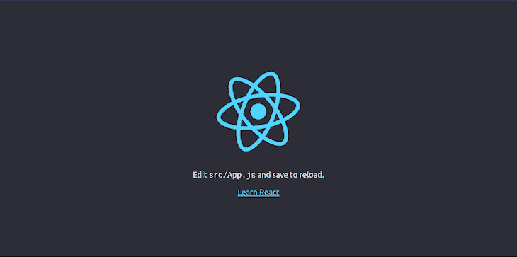

# 如何在 React 中使用布尔玛 CSS

> 原文：<https://blog.logrocket.com/how-to-use-bulma-css-with-react/>

开源 CSS 框架布尔玛专为 mobile first 设计，使用 Flexbox 方法构建，提供现成的前端组件，无需 JavaScript 即可构建响应性 web 界面，非常适合与 React 一起使用。

布尔玛以拥有最简单的网格系统而闻名，它非常平滑，以至于各列可以根据所用设备的屏幕大小自动调整大小。

不像大多数 CSS 框架，布尔玛不是一个全有或全无的框架；它使您能够导入和使用特定的组件，如面包屑或表单，而无需导入整个框架。它还提供了过多的已经定制的[组件](https://bulma.io/documentation/components)、[元素](https://bulma.io/documentation/elements)、[栏](https://bulma.io/documentation/columns)、[布局](https://bulma.io/documentation/layout)和[表单](https://bulma.io/documentation/form)用于设计网站，让用户快速启动并运行。

因为布尔玛不包含任何 JavaScript，所以在使用 React 时，您可以完全控制组件的功能，让您自由地以自己认为合适的方式编写 JavaScript 代码，而不是受限于布尔玛对编写 JavaScript 的看法。对于想要使用自己的 JavaScript 实现的开发者来说，布尔玛遵循严格的纯 CSS 方法的事实使他们能够实现这一点。

布尔玛在 Chrome，Edge，Firefox，Opera，Safari 和 Internet Explorer (10+版)上都有浏览器支持，为你提供 CSS 类来帮助你设计你的网站。

在本教程中，你将学习如何使用布尔玛 CSS 反应。

## 在 React 中使用布尔玛 CSS

虽然布尔玛的创建者声称使用布尔玛不需要任何 CSS 知识，但对 CSS 有一个基本的了解将会支持你在任何 CSS 框架中的工作，包括布尔玛。

本教程假设您对 CSS 以及以下内容有基本的了解:

*   安装在本地开发机器上的节点 8.10 或更高版本
*   安装在本地开发机器上的 npx 5.2 或更高版本
*   HTML 和 JavaScript 的基础知识
*   基本了解如何在 React 中创建组件

现在，让我们看看如何在 React 中使用不同的布尔玛 CSS 元素和组件。

### 在 React 中安装布尔玛

首先，让我们通过使用 [Create React App](https://blog.logrocket.com/getting-started-with-create-react-app-d93147444a27/) 并运行以下命令来启动 React 应用程序:

```
npx create-react-app bulma-tutorial

```

一旦 React 应用程序成功安装在您的本地机器上，使用`cd bulma-tutorial`命令切换到它的目录，并使用`npm install bulma`命令将布尔玛包安装到您的 React 项目中。

安装布尔玛后，运行`npm start`通过`localhost:3000`访问浏览器窗口上的应用程序。



现在，导航到`src`文件夹，点击`App.js`，粘贴下面的代码片段:

```
import 'bulma/css/bulma.min.css';

const App = () => {
      return (
        <div classname="main"> 
          <div className="buttons">
            <button class="button is-primary">Primary</button>
            <button class="button is-link">Link</button>
            <button class="button is-info">Info</button>
            <button class="button is-success">Success</button>
            <button class="button is-warning">Warning</button>
            <button class="button is-danger">Danger</button>
            <button class="button is-black">Black</button>
            <button class="button is-white">White</button>
            <button class="button is-dark">Dark</button>
            <button class="button is-light">Light</button>
          </div>
        </div>
      )
  }

export default App;

```

通过将布尔玛 CSS 导入到我们的项目中，我们现在可以访问布尔玛的组件、元素、变量等等，并在我们的项目中使用布尔玛。

### React 中的布尔玛风格

这是创建的组件`App`和添加的父组件`div`。然后，通过导出组件，我们可以在应用程序的其他部分定位它。

```
const App = () => {
      return (
        <div classname="main">
          ...
        </div>
      )
  }

export default App;

```

这里，我们添加了一个包含 10 个`buttons`的`div`，并用布尔玛 CSS 对其进行了样式化。

```
<div className="buttons">
  <button class="button is-primary">Primary</button>
  <button class="button is-link">Link</button>
  <button class="button is-info">Info</button>
  <button class="button is-success">Success</button>
  <button class="button is-warning">Warning</button>
  <button class="button is-danger">Danger</button>
  <button class="button is-black">Black</button>
  <button class="button is-white">White</button>
  <button class="button is-dark">Dark</button>
  <button class="button is-light">Light</button>
</div>

```

大多数布尔玛元素都有[可选样式](https://bulma.io/documentation/overview/modifiers/)，需要使用`is-`或`has-`来访问它们**。**例如，在上面的代码片段中，您会注意到每个按钮包含两个值:元素的名称`button`，它向布尔玛发出信号，表明这个元素是一个按钮；以及访问 style 类属性的修饰符`is-dark`。

因此，例如，如果你想给你的应用程序的一个元素涂上青绿色，你可以使用`is-primary`修饰符语法。

可在布尔玛使用的默认颜色阴影及其各自的修饰符如下:

*   `is-primary`是绿松石
*   `is-link`是蓝色
*   `is-info`是青色
*   `is-success`是绿色
*   `is-warning`是黄色
*   `is-danger`是红色
*   `is-white`是白色
*   `is-black`是黑色的
*   `is-dark`黑暗
*   `is-white`是白色

按钮完成后，保存代码并返回浏览器窗口，查看更新后的页面。如果一切都做得正确，它应该看起来像下面的屏幕:

参见 [CodePen](https://codepen.io) 上 Didicodes([@ edyasikpo](https://codepen.io/edyasikpo))
的钢笔 [颜色——布尔玛 CSS 教程](https://codepen.io/edyasikpo/pen/dyNmxVE)。

### 改变元素和组件的大小

了解了如何将颜色应用到 React 中的元素和组件后，我们可以继续使用布尔玛的修改器类`is-small`、`is-medium`和`is-large`来操作按钮，以调整任何元素或组件的大小。

正如每个修饰符的名字所暗示的，元素将通过添加`is-small`而变小，通过添加`is-medium`而变中，通过添加`is-large`到元素的属性而变大。

让我们将这些属性添加到我们的`App.js`文件的代码中，看看它是如何运行的:

```
import 'bulma/css/bulma.min.css';

const App = () => {
      return (
        <div classname="main"> 
          <div className="buttons">
            <button class="button is-success is-small">Small</button>
            <button class="button is-warning is-medium">Medium</button>
            <button class="button is-danger is-large">Large</button>
          </div>
      </div>
      )
  }

export default App;
```

通过将`is-small`、`is-medium`和`is-large`添加到代码库中，您的 React 应用程序现在应该如下所示:

参见 [CodePen](https://codepen.io) 上 Didicodes([@ edyasikpo](https://codepen.io/edyasikpo))
的钢笔 [尺寸——布尔玛 CSS 教程](https://codepen.io/edyasikpo/pen/ZELozKP)。

### 控制元素和组件的状态

控制应用程序中元素或组件状态的能力非常重要。要在 React 应用程序中做到这一点，请使用以下三个布尔玛 CSS 属性中的任意一个:

*   `is-outlined`
*   `is-loading`
*   `disabled`

在下面的代码片段中，第一个按钮的状态通过添加`is-outlined`来描述，第二个按钮通过添加`is-loading`来显示装载轮，第三个按钮通过添加`is-disabled`来禁用。

```
import 'bulma/css/bulma.min.css';

const App = () => {
      return (
        <div classname="main"> 
          <div className="buttons">
            <button class="button is-success is-outlined">Outlined</button>
            <button class="button is-warning is-loading">Loading</button>
            <button class="button is-danger" disabled>Disabled</button>
          </div>
      </div>
      )
  }

export default App;

```

您可以在下面看到这段代码的输出:

### 利用布尔玛定制的代码片段

如前所述，布尔玛提供了一系列已经定制的组件，你可以用它们来快速定制你的 React 应用，而不是从头开始设计。

例如，如果我们想旋转导航栏，布尔玛提供了样板代码，我们可以从他们的网站上复制一段代码，粘贴到`App.js`文件中，并在`img`和`hr`元素中添加结束标记。

```
import 'bulma/css/bulma.min.css';
const App = () => {
      return (
        <div>
            <nav class="navbar" role="navigation" aria-label="main navigation">
              <div class="navbar-brand">
                <a class="navbar-item" href="https://bulma.io">
                  
                </a>

                <a role="button" class="navbar-burger" aria-label="menu" aria-expanded="false" data-target="navbarBasicExample">
                  <span aria-hidden="true"></span>
                  <span aria-hidden="true"></span>
                  <span aria-hidden="true"></span>
                </a>
              </div>

              <div id="navbarBasicExample" class="navbar-menu">
                <div class="navbar-start">
                  <a class="navbar-item">
                    Home
                  </a>

                  <a class="navbar-item">
                    Documentation
                  </a>

                  <div class="navbar-item has-dropdown is-hoverable">
                    <a class="navbar-link">
                      More
                    </a>

                    <div class="navbar-dropdown">
                      <a class="navbar-item">
                        About
                      </a>
                      <a class="navbar-item">
                        Jobs
                      </a>
                      <a class="navbar-item">
                        Contact
                      </a>
                      <hr class="navbar-divider"/>
                      <a class="navbar-item">
                        Report an issue
                      </a>
                    </div>
                  </div>
                </div>

                <div class="navbar-end">
                  <div class="navbar-item">
                    <div class="buttons">
                      <a class="button is-primary">
                        <strong>Sign up</strong>
                      </a>
                      <a class="button is-light">
                        Log in
                      </a>
                    </div>
                  </div>
                </div>
              </div>
            </nav>
          </div>

      )
  }

export default App;

```

现在，我们在我的网站上有了一个简单的复制和粘贴的导航栏，并可以使用本教程中使用的概念进一步定制它。

参见 [CodePen](https://codepen.io) 上 Didicodes([@ edyasikpo](https://codepen.io/edyasikpo))
的 Pen[NavBar-布尔玛 CSS 教程](https://codepen.io/edyasikpo/pen/YzNLdqd)。

结论

## 尽管本教程涵盖了使用 React 布尔玛的一些基础知识，但它们提供了一个在设计样式时进行扩展的基础。你可以通过访问他们的官方文档来了解更多关于布尔玛是如何工作的，访问代码片段，并进行实验。也可以随意探索我在 CodePen 上创建的这些布尔玛教程。

如果你有任何问题，可以在下面的评论区留言。

[LogRocket](https://lp.logrocket.com/blg/react-signup-general) :全面了解您的生产 React 应用

## 调试 React 应用程序可能很困难，尤其是当用户遇到难以重现的问题时。如果您对监视和跟踪 Redux 状态、自动显示 JavaScript 错误以及跟踪缓慢的网络请求和组件加载时间感兴趣，

.

[try LogRocket](https://lp.logrocket.com/blg/react-signup-general)

LogRocket 结合了会话回放、产品分析和错误跟踪，使软件团队能够创建理想的 web 和移动产品体验。这对你来说意味着什么？

[ ](https://lp.logrocket.com/blg/react-signup-general) [](https://lp.logrocket.com/blg/react-signup-general) 

LogRocket 不是猜测错误发生的原因，也不是要求用户提供截图和日志转储，而是让您回放问题，就像它们发生在您自己的浏览器中一样，以快速了解哪里出错了。

不再有嘈杂的警报。智能错误跟踪允许您对问题进行分类，然后从中学习。获得有影响的用户问题的通知，而不是误报。警报越少，有用的信号越多。

LogRocket Redux 中间件包为您的用户会话增加了一层额外的可见性。LogRocket 记录 Redux 存储中的所有操作和状态。

现代化您调试 React 应用的方式— [开始免费监控](https://lp.logrocket.com/blg/react-signup-general)。

Modernize how you debug your React apps — [start monitoring for free](https://lp.logrocket.com/blg/react-signup-general).