# 如何使用 Chromatic 2.0 - LogRocket 博客

> 原文：<https://blog.logrocket.com/how-to-use-chromatic-2-0/>

在过去几年中，前端 web 开发的复杂性增加了。构建一个可伸缩的、可靠的 UI 系统，并在各种设备和浏览器上运行，这是一个相当大的挑战。随着 UI 系统随着新组件、样式变化、新视口断点、覆盖等的扩展，维护变得越来越困难。如果没有可靠和定期的回归测试，bug 会逐渐被引入到 UI 中，对可用性、可访问性、表示和可维护性产生负面影响。这些错误通常在代码发布后的产品中被发现，并在发布后立即被修复。

产品负责人、设计师、QA 和其他团队成员通常会在视觉特性的工作完成后，对表示、UX、SEO 和可访问性有一些额外的反馈。这些问题通常也是在代码交付生产后解决的。这些场景发生的频率比你想象的要高，甚至到了我们已经习惯了这种工作方式的程度——在将代码发布到产品中之后，逐渐修复、修改和改进 UI。第一次就把 UI 组件做好似乎是一项困难的任务，所有的问题和反馈都要在将代码发布到产品之前解决。

在本文中，我们将找出 Chromatic 如何帮助我们解决这些让开发团队和产品所有者都头疼的问题。

## CSS 和视觉回归测试

我们正在进行回归测试，以确保我们的代码更改不会在项目的其他地方引起任何问题。由于 CSS 的[基本概念](https://developer.mozilla.org/en-US/docs/Learn/CSS/Building_blocks/Cascade_and_inheritance)(继承、特性和级联)，我们可以看到这是如何应用于 CSS 的。根据代码的结构，如果我们修改 CSS 中的一个元素，我们可能会以意想不到的方式影响更多的 DOM 元素。在过程的早期捕捉那些变化是困难的，因为这些测试和变化最终需要由人来验证。

例如，假设我们正在修改一个通用的`button` CSS 类。假设这些变化适用于网站上的每个按钮是安全的。按钮可以出现在各种布局中，与输入等其他元素一起出现在不同的背景上。浏览所有按钮并检查按钮在所有支持的浏览器和分辨率下是否看起来都不错需要多少小时？

由于时间或预算的限制，我们通常无法可靠地测试那些变更。我们跳过它们，或者只对与任务相关的组件进行快速检查。通过这种方式，我们也逐渐将 bug 引入到我们的前端代码中，因为它们没有被注意到，并且只有在有人注意到它们出现在实时网站上时才修复它们。

在我们谈论 Chromatic 如何改进视觉回归测试工作流之前，我们必须先介绍一下 Storybook。

## 什么是故事书？

如果您不熟悉 Storybook 或者没有机会使用它， [Storybook](https://storybook.js.org/) 是一个工具，用于在独立于主项目环境的隔离环境中开发、记录和测试单个 UI 组件(也称为 stories)。Storybook 支持各种前端框架，如 React、Vue、Angular、Svelte 等。

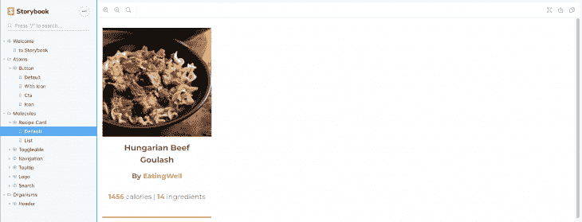

例如，在一个复杂的项目中，开发人员可以在开发 API 端点时用 Storybook 中的模拟数据可视化地构建组件和屏幕(不同的状态和变化),并在端点准备就绪时将它们连接起来。此外，Storybook 可以用于让新开发人员入门，以便他们可以快速熟悉可用的组件和项目结构。

Storybook 还支持各种扩展基本功能的插件，并为开发人员提供更多的选项和控制。其中一个插件是 [docs 插件](https://github.com/storybookjs/storybook/tree/next/addons/docs)，它为 Storybook 增加了降价支持。它为 Storybook 组件提供了一个专用的文档选项卡，开发人员可以使用它来更详细地描述 UI 组件，而不仅仅是直观地显示它。

在一个隔离的环境中拥有单个 UI 组件的概述是有用的，但是这仍然没有解决视觉回归测试的主要问题——我们如何捕捉 CSS 中的变化影响了哪些 UI 组件和屏幕？此外，产品所有者、设计者和 QA 通常不能访问现成的故事书环境，因为它是开发环境的一部分。

## 输入半音阶 2.0

[Chromatic](https://www.chromatic.com/) 是 Storybook 的云服务，旨在为 UI 开发和测试工作流程带来重大改进。由 Storybook 核心维护人员开发，它包括以下工具和功能:

*   **团队共享故事书实例**–故事书可以由整个团队发布、更新和查看
*   **文档**–Chromatic 使用 Storybook 构建一个 UI 组件库，它可以直观地概述可用的 UI 组件，简化测试，并作为团队成员之间反馈和同步的中心
*   **视觉回归测试**——每次新故事书发布，Chromatic 都会生成截图，并向整个团队展示修改内容以供审核。这种概述使团队成员能够及早发现并修复视觉错误，并对 UI 的任何更改提供反馈
*   **Git 和 CI 支持**–Chromatic 可以与 CI (Travis、CircleCI、Jenkins、Codeship)和 Git (GitHub、Bitbucket、GitLab)集成，以改进版本控制和部署工作流

除了付费计划，Chromatic 还提供了一个免费账户计划，这对于在小规模的创业项目和小团队中尝试 Chromatic 非常有用。免费帐户计划包括上述所有核心功能，唯一的限制是每月快照数量(每月 5，000 张快照)，支持单一浏览器(Chrome)。组件快照的数量和支持的浏览器范围(Firefox 和 IE 11)随着付费计划而增加。

## 半音阶 2.0 设置

首先，让我们假设我们有一个安装了 Storybook 的项目，并且所有的 Storybook 组件都准备好了。我将继续使用 GitHub 作为我的项目库，并将其与 Chromatic 连接。在代码示例和截图中，我使用了我的开源 React 项目， [Recipe Magic](https://recipe-magic.netlify.com/) 。我建立了一个故事书，上面有一些组件。

我们还假设故事书没有任何构建错误。为了检查这一点，我们需要确保以下命令不会抛出错误:

```
npm run build-storybook
```

现在我们准备在我们的项目上设置 Chromatic，并准备发布我们的故事书供整个团队查看和评论。

首先，我们必须使用 GitHub、Bitbucket 或 GitLab 帐户在 Chromatic 上设置一个帐户。我不得不称赞 Chromatic 不需要信用卡就可以注册免费账户计划。
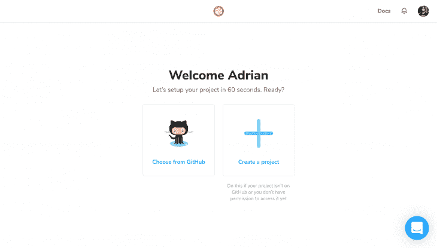

注册后，我们准备在我们的项目中设置半音阶:

```
npm install --save-dev chromatic
```

最后，我们需要发布 Storybook 实例。以下命令从 Storybook 运行 build 命令，将构建推送到 Chromatic cloud service，并拍摄各个故事的快照:

```
npx chromatic --project-token=<your-project-token>
```


Our Storybook instance is now in sync with Chromatic. We can see the builds and snapshots show up on the Chromatic dashboard.

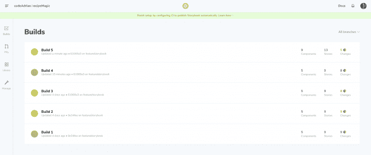

该命令也可以添加到项目`package.json`文件中，以加速部署过程:

```
"scripts": {
  "chromatic": "npx chromatic --project-token="
},
```

## 共享故事书实例和用户界面库

Chromatic 为每个已发布的版本发布一个现成的故事书实例。这允许团队成员查看单个 UI 组件并测试它们，而不需要在他们的机器上设置项目。

开箱即用，故事书不提供讨论和反馈的功能。Chromatic 扩展了 Storybook 的基本功能，生成了一个 UI 库，其中的每个组件都成为讨论和反馈的中心。用户可以发布评论和任务，这些评论和任务可以标记为已解决，因为正在应用所请求的更改或错误修复。
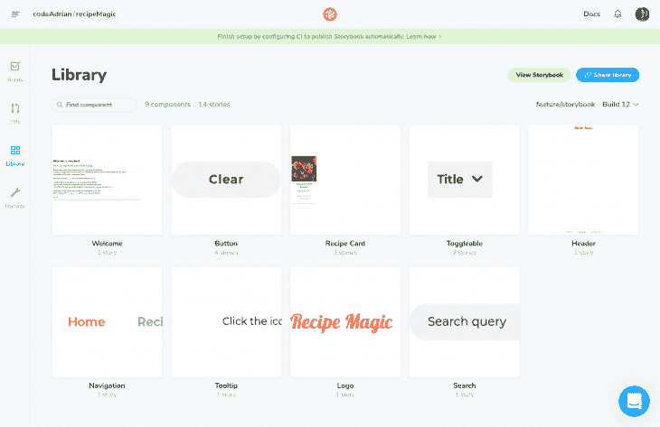

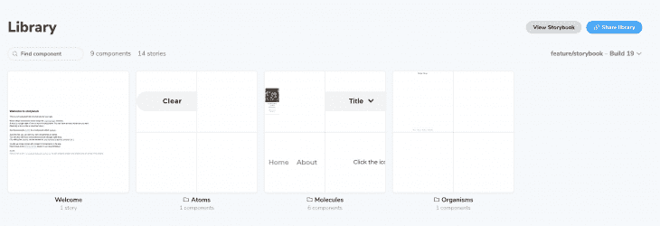

每个组件都有两个主视图和一个可选视图:

*   **画布**–交互式故事书渲染
*   **快照**–在仪表板上发布构建之前由 Chromatic 捕获的图像
*   **文档(可选)**–故事书文档。故事书需要[文档插件](https://github.com/storybookjs/storybook/tree/next/addons/docs)

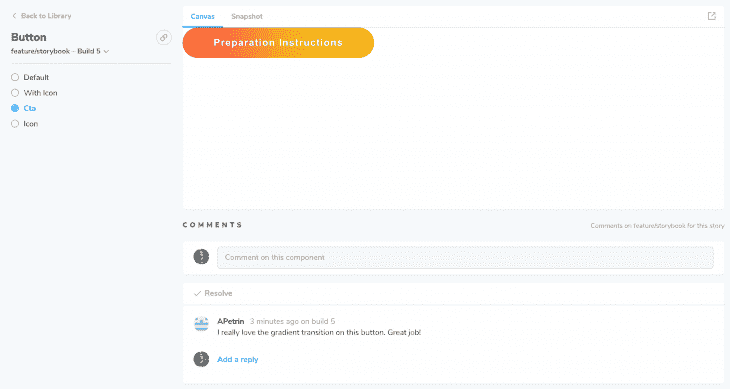

我发现 Chromatic UI 库非常有用，它允许在组件级的构建和 Git 分支之间切换。它允许用户轻松地在组件的不同版本之间切换，并比较不同 Git 分支和构建之间的变化。

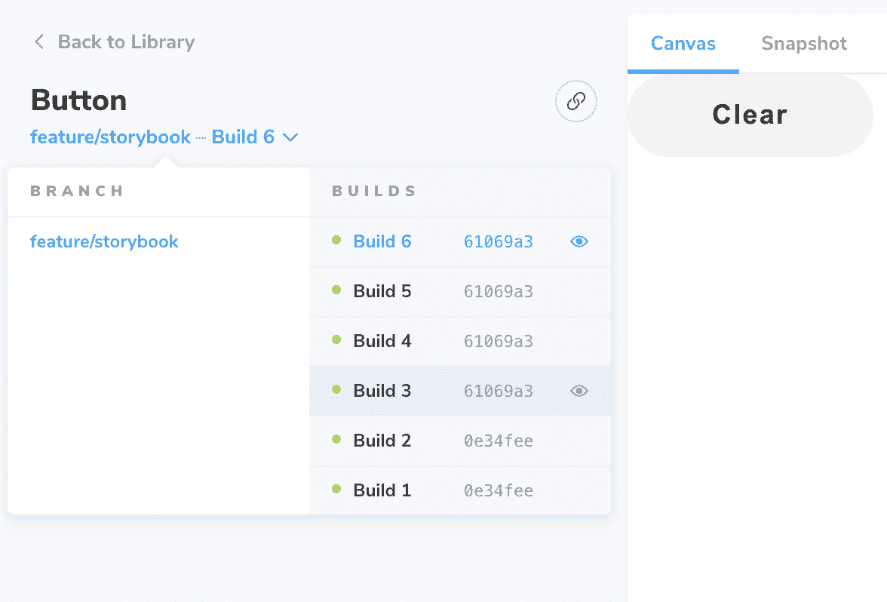

## 视觉回归测试

视觉回归测试是 Chromatic 中的一个旗舰特性。它允许用户比较每个构建之间的视觉(表示)变化，检查它们，并提供反馈。每一个新的构建总是与先前接受的(评审的)构建进行比较。

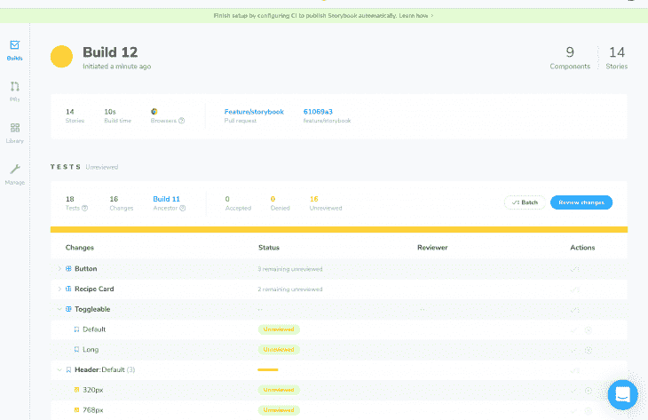

Chromatic 生成单个组件和故事的快照(图像),并比较这些图像以检测变化。它具有各种 diff 选项，可以直观地比较每个新版本中故事的变化。

这个比较屏幕还显示 DOM diff 来捕捉标记中的任何变化，以便团队可以解决任何潜在的语法、语义、可访问性和 SEO 问题。

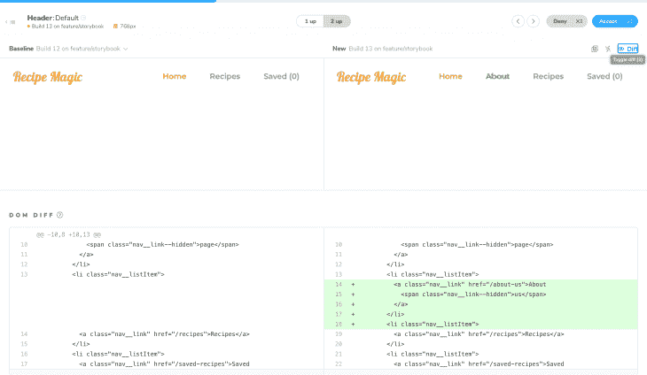

## Git 和 CI 集成

Git 和 CI 集成是任何寻求改进开发工作流的测试自动化工具的必备工具。

Git 支持是现成的，可以很容易地从仪表板上启用并连接到 Git repo。我在 GitHub 上测试了这个特性，发现 Chromatic 只需要一些[额外的权限](https://www.chromatic.com/docs/access)(取决于 Git 平台)就可以访问 Pull 请求数据。

在给予 Chromatic 所需的权限后，拉请求状态检查显示 Chromatic UI 测试和审查状态。

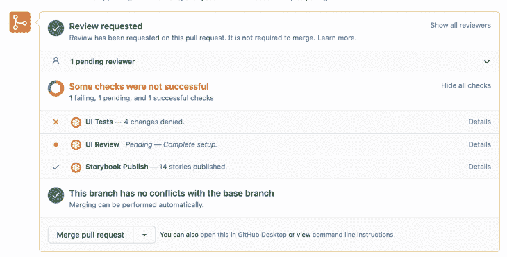

Chromatic 提供了一个有用的 pull requests overview 页面，团队可以在这里获得与每个 pull requests 相关的 UI 测试状态的详细概述。例如，团队成员可以查看已审核批准的 UI 组件变更、已拒绝的 UI 组件变更、与 PR 构建相关的注释以及阻止合并拉请求的问题。

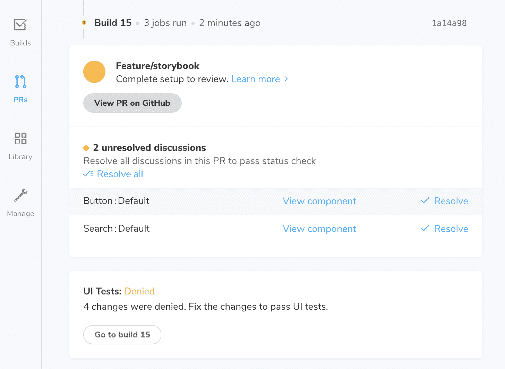

Chromatic 可以很容易地与几个 CI 集成，如 GitHub Actions、Circle CI、Travis CI 和 Jenkins，并在 [CI 集成文档](https://www.chromatic.com/docs/ci)中提供必要的说明和代码片段。

## 彩色视觉回归测试

让我们通过一个简单的场景来看看如何使用 Chromatic 进行可视化回归测试。

让我们假设 QA 已经注意到文本较短的按钮(例如“添加”)有一个小的可点击区域，并请求增加按钮宽度。前端开发人员需要确保这些按钮至少有 200 像素宽，以便可点击的区域更大。

然后，开发人员添加以下代码行，验证这些更改是否显示在这些特定的按钮上，创建一个拉请求，并在 Chromatic 上发布更新后的故事书。

```
button {
    /* ... */
    min-width: 200px;
}
```

改进了按钮 UX，使其符合要求，这样代码就可以部署了，对吗？让我们看看半音阶对这种变化有什么看法。

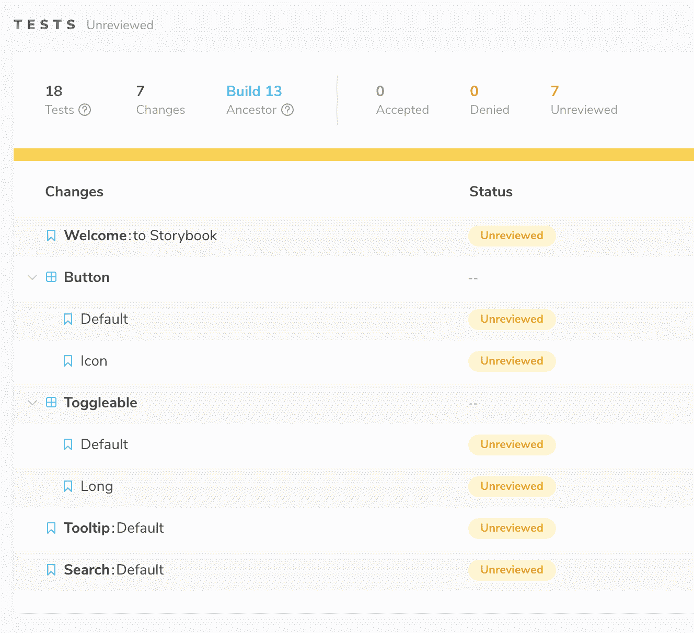

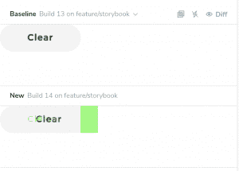

The buttons are indeed wider

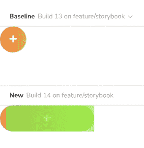

This doesn’t look right

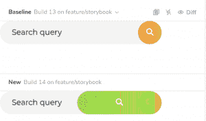

This also doesn’t look right

幸运的是，这个 pull 请求直到有人审查并批准了 Chromatic 上的更改后才被合并。如前所述，这种情况经常发生在较大规模的项目中——微小的 CSS 变化可能会导致倒退，而且在将代码部署到生产环境之前，这些变化通常不会被注意到。

QA 可以标记被接受的和被拒绝的以及需要修复的组件更改。他们还可以对没有通过回归测试的单个组件提供详细的反馈。这种反馈有助于开发人员理解问题，重现问题，并快速有效地解决问题。

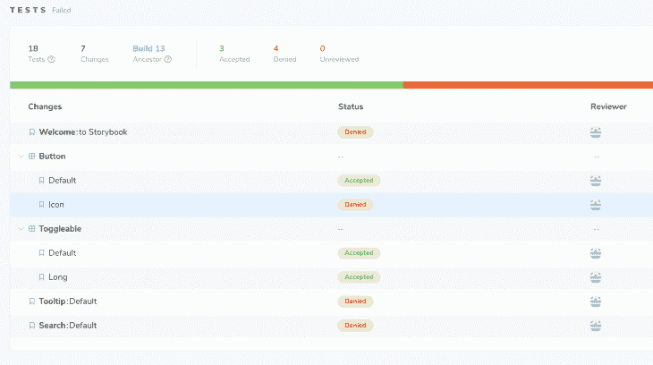

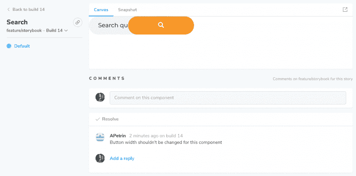

一些复杂的问题可能需要额外的截图或视频来更容易地理解和再现它们。不幸的是，反馈输入只支持文本评论，没有任何媒体附件选项，所以视频和图像是使用外部文件共享服务的链接添加到反馈中的。

## 故事书的彩色配置

Chromatic 为 Storybook 增加了几个选项，指导 Chromatic 如何生成快照，如何加载外部资源(字体、图像、外部 CSS 文件等)。)，它如何处理 CSS 和 JavaScript 动画，忽略哪些故事或 DOM 元素等。

还有一点很重要，不用说太多细节，Chromatic 支持各种 CLI(命令行界面)标志。这些标志控制 Chromatic 的行为和处理故事书构建的方式。我们已经提到了`--exit-zero-on-changes`标志，但是还有更多特定于各种用例的 CLI 选项。如果你感兴趣，我推荐你查看一下官方的 Chromatic 文档，找到你需要的 CLI 选项。正如我们所看到的，Chromatic 易于设置，并且开箱即用，只需最少的配置。

让我们看看可以在故事书文件中设置的彩色选项。

## 配置范围

Storybook 支持三种配置范围:

*   **全局级别**–选项将应用于所有故事
*   **组件级**–选项将应用于故事书中的所有故事
*   **故事级别**–选项将应用于故事书组件中的单个故事

需要在一个`.storybook/preview.js`文件中设置故事书的全局彩色配置。我们只需要将包含`chromatic`属性的对象传递给`addParameters`故事书函数。

```
import { addParameters } from '@storybook/react';

addParameters({ chromatic: { /* Chromatic config */ });
```

要将彩色配置应用到一个故事书文件中的所有故事，我们需要在默认导出中为`parameters`对象添加`chromatic`属性:

```
export default {
    /* Storybook config */
    parameters: {
        chromatic: { /* Chromatic config */ },
    }
}

/* Storybook Stories */
```

我们可以用类似的方式为一个特定的故事设置色彩配置。我们只需要将相同的色度属性应用于各个故事对象的故事属性:

```
/* Storybook Stories */
export const MyStory = () => <Component /* Component props */ />;

MyStory.story = {
    /* Storybook config */
    parameters: {
        chromatic: { /* Chromatic config */ },
    }
};
```

## 响应快照

正如本文介绍中所讨论的，我们正在不同的视口宽度上测试 UI。默认情况下，Chromatic 在桌面宽度上拍摄快照，但它提供了在不同视口宽度上拍摄组件快照的配置选项。

```
parameters: {
    chromatic: { viewports: [320, 768, 1280] }
},
```

在 Chromatic 上发布配置好的故事书后，新的快照会出现在构建中。Chromatic 使用这些新快照进行可视化回归测试，其方式与前面的例子相同。

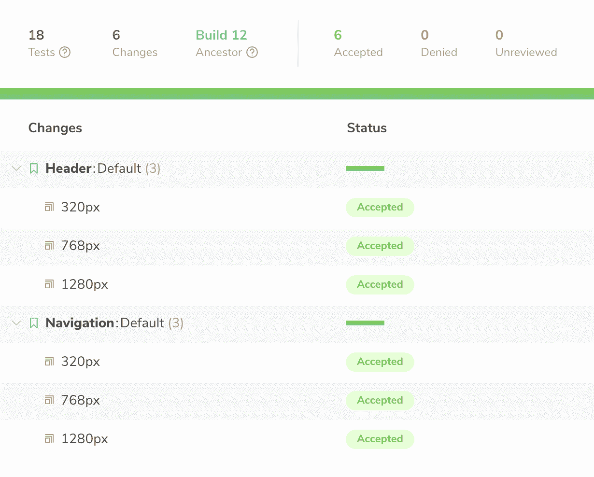

请注意，色度会为每个定义的视口宽度生成一个快照，这可能会增加快照的使用，因此请注意您的快照数量限制。

## 处理 CSS 动画

一些 UI 元素上可能有一些动画——无论它们是只运行一次还是重复运行的动画，它们都会影响 Chromatic 拍摄快照和检测变化的方式。

默认情况下，色度暂停第一个动画帧上的所有 CSS 动画。一些 UI 元素可以有一个进入动画(例如淡入动画)。如果 Chromatic 在开始帧暂停动画，DOM 元素将不会显示在快照中，导致 Chromatic 无法检测到生成的组件快照中的任何更改。

我们可以指示半音阶在结束时暂停动画，而不是在开始时。这样，Chromatic 会将当前动画帧设置为最后一帧，就像动画已经完成一样，并最终拍摄快照:

```
parameters: {
  chromatic: { pauseAnimationAtEnd: true }
}
```

## 处理 JavaScript 动画

尽管 CSS 动画对于[在大多数浏览器中获得最佳性能](https://blog.prototyp.digital/improving-css-performance-and-file-size-an-in-depth-guide/#improving-css-animation-performance)是必不可少的，但 CSS 只支持简单的动画。如果 UI 有一个复杂的动画，或者动画需要对用户动作做出反应，该怎么办？在这些情况下，选择之一是使用 JavaScript。

Chromatic `pauseAnimationAtEnd`参数不能影响 JavaScript 动画，所以我们需要对它们使用不同的方法。根据用例，添加一个简单的`delay`参数就足够了。例如，一个持续时间为 1.5 秒的复杂 JavaScript 淡入动画，我们需要将延迟参数值设置为接近该值的值:

```
parameters: {
  chromatic: { delay: 1600 }, /* 1600ms = 1.6s */
},
```

延迟的最大值是 15000 毫秒(15 秒)。建议不要过度使用`delay`参数，这样半音阶的构建会尽可能快。

`delay`参数也可用于确保加载所有外部资源(图像、字体、外部样式)。尽管如此，建议将这些资源添加到故事书测试中([与故事书](https://www.chromatic.com/docs/resource-loading)一起提供)以避免任何问题。例如，服务器可能会延迟响应，静态资源可能会被删除，或者 URL 可能会更改。

## 检测代码是否在色度环境下运行

出于这样或那样的原因，为 JavaScript 动画设置一个固定的延迟可能是不可能的。我们还会遇到一些场景，在拍摄快照时，有些用户动作或场景无法用 Chromatic 模拟。在这些情况下，我们可以检测特定的组件是否运行在 Chromatic 环境中，从而禁用那些阻止 Chromatic 可靠地拍摄 UI 组件快照的效果或功能。

色度模块包括`isChromatic`函数，该函数根据代码是否运行在色度环境中返回一个布尔值:

```
import isChromatic from "chromatic/isChromatic";

export const StoryName = () => {
  const isChromaticEnv = isChromatic():

  if(isChromaticEnv) { /* ... */ }

  /* UI Component code */  
}

```

## 从半音阶构件中排除组件或故事

并不是故事书里的所有故事都是为了 UI 测试而设计的，需要包含在色彩构建和 UI 测试中。开发人员可以使用一个故事来测试或展示特定的过渡或动画，搭建页面或框架屏幕，或者使用它来处理一些尚未完全完成的元素，等等。

色度提供了一个参数，可用于指示色度忽略特定的故事或组件。这样，Chromatic 就不会拍摄组件的快照，这将减少快照的使用，并根据情况简化 UI 测试审查:

```
parameters: {
  chromatic: { disable: true }
}
```

## 忽略特定的 DOM 元素

Chromatic 还有一个忽略特定 DOM 元素的选项。例如，该参数可用于指示 Chromatic 忽略`iframe`元素、动画 GIF 图像、带有用于显示由来自 API 的 JavaScript 加载的媒体的`id`的空容器(例如，电子商务网站上的分数徽章)等。

默认情况下，Chromatic 将忽略具有`chromatic-ignore` CSS 类名或`data-chromatic="ignore"` HTML 数据属性的 DOM 和 HTML 元素。

## 彩色故事书配置示例

在下面的示例中，header 组件的 Storybook 包含两个故事:

*   **默认**–带有徽标、导航链接和搜索栏的默认标题
*   **最小**–简化的标题，没有导航链接和搜索栏

两个头都有一个进入 CSS 动画，所以我们使用`pauseAnimationAtEnd`将其设置为最后一帧。第一个故事在三个断点(最小的移动设备、最小的平板电脑和最小的桌面视窗宽度)具有不同的布局，第二个故事在两个断点(最小的移动设备和最小的平板电脑视窗宽度)具有不同的布局:

```
/* header.story.js */

import React from 'react';
import { Header } from 'components';

export default {
    title: 'Header',
    component: Header,
    parameters: {
        chromatic: { 
          viewports: [320, 768, 1280], 
          pauseAnimationAtEnd: true 
        }
    }
};

export const Default = () => <Header />;

export const Minimal = () => <Header minimal />;

Minimal.story = {
  parameters: {
    chromatic: { viewports: [320, 768] }
  }
}

```

对于每次构建，Chromatic 总共拍摄该组件的五个快照(第一个组件在三个视口处，第二个组件在两个视口宽度处)。

## 结论

视觉回归测试对于大型和更复杂的 UI 代码库是必不可少的。这些测试需要确保可以安全地添加新的 UI 特性和组件，而不会对当前 UI 造成任何意外问题。这些测试还需要覆盖组件可能拥有的各种视窗、浏览器和状态。

即使可以为回归测试建立自动化测试，它最终也需要由人来验证。像 Chromatic 这样的云服务可以通过在用户界面中只显示相关的变化来简化这个过程。

Chromatic 看起来是不断增长的 UI 开发工具箱的一个很好的补充。通过允许团队尽早发现回归，简化和自动化 UI 测试，提供详细的 UI 文档和参考，并为整个团队提供一个收集单个 UI 组件反馈的中心点，它无疑为项目带来了价值。

如果你有兴趣，我会推荐你去试试。一个免费的账户更适合测试一个小项目(或者一个附带项目)的工作流程，并做出进一步的决定。

## 参考

[基础网络–视觉回归测试](https://baseweb.design/blog/visual-regression-testing/)

[故事书文档](https://storybook.js.org/docs/basics/introduction/)

[彩色文档](https://www.chromatic.com/docs/)

## 使用 [LogRocket](https://lp.logrocket.com/blg/signup) 消除传统错误报告的干扰

[](https://lp.logrocket.com/blg/signup)

[LogRocket](https://lp.logrocket.com/blg/signup) 是一个数字体验分析解决方案，它可以保护您免受数百个假阳性错误警报的影响，只针对几个真正重要的项目。LogRocket 会告诉您应用程序中实际影响用户的最具影响力的 bug 和 UX 问题。

然后，使用具有深层技术遥测的会话重放来确切地查看用户看到了什么以及是什么导致了问题，就像你在他们身后看一样。

LogRocket 自动聚合客户端错误、JS 异常、前端性能指标和用户交互。然后 LogRocket 使用机器学习来告诉你哪些问题正在影响大多数用户，并提供你需要修复它的上下文。

关注重要的 bug—[今天就试试 LogRocket】。](https://lp.logrocket.com/blg/signup-issue-free)