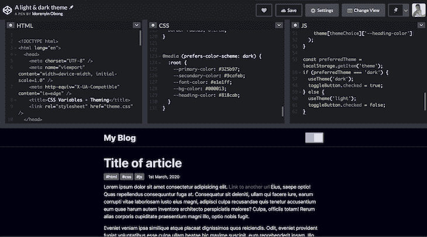
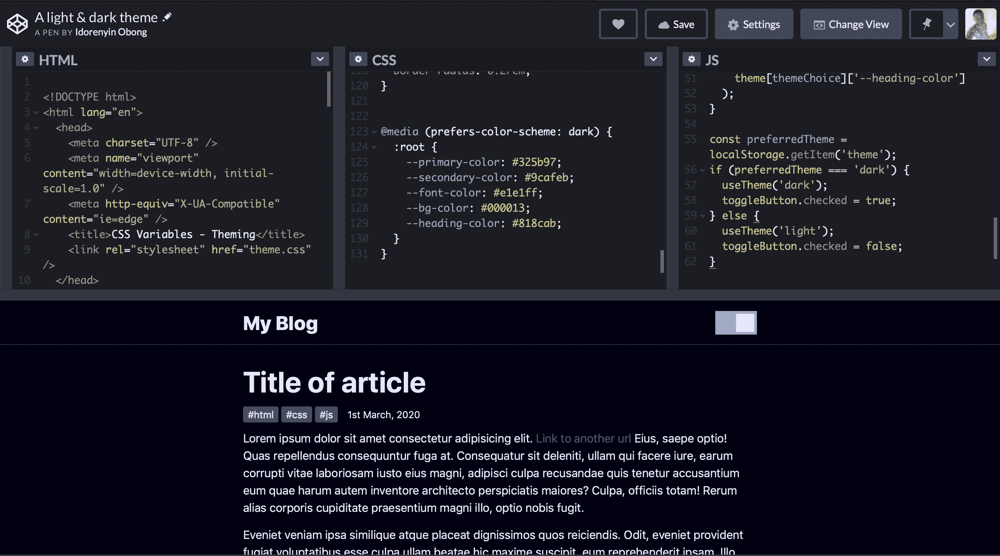

# 如何像 pro 一样使用 CSS 变量

> 原文：<https://blog.logrocket.com/how-to-use-css-variables-like-a-pro/>

像大多数编程语言一样，原生 CSS 现在支持变量，并且它们会一直支持下去。

如果你对 CSS 有所了解，你可能听说过 CSS 预处理程序，比如 [Sass](https://blog.logrocket.com/the-definitive-guide-to-scss/) 等等。不管您选择的前端框架是什么，您都可能在项目中使用过它们。或者也许你没有，你只是用了[普通的老 CSS](https://blog.logrocket.com/how-to-create-yin-yang-symbol-pure-css/) 。

不管怎样，这些预处理程序的主要卖点是你可以像在编程语言中一样使用变量。您声明一个变量，给它赋值，并在整个文档中使用它，使维护变得轻而易举。

在本教程中，我们将通过首先揭开 CSS 变量的神秘面纱，然后构建两个利用它的简单项目，对这个概念做一个简单的介绍。如果你渴望尽快行动起来，你可以在 CodePen 上找到这两个项目的代码( [这里](https://codepen.io/KingIdee/pen/MWwbVBL) 和 [这里](https://codepen.io/KingIdee/pen/JjdbvPX) ) 。

本教程需要一些基本的 CSS 知识。事不宜迟，我们开始吧！

[https://www.youtube.com/embed/W8LlgS9YCP4](https://www.youtube.com/embed/W8LlgS9YCP4)

视频

## 我们将建造什么

为了巩固我们关于 CSS 变量的知识，我们将构建两个非常简单的项目。第一部分将演示如何创建按钮变体。这个概念在 Bootstrap 中很流行，在 Bootstrap 中，某些元素共享 CSS 规则，这些规则赋予它们默认的设计，但通过颜色或其他属性来区分。第二个项目将是一个基于主题的设计——具体来说，是一个由 JavaScript 操纵的明暗主题。

## 如何使用 CSS 变量

也被称为自定义属性或级联变量， [CSS 变量](https://blog.logrocket.com/how-to-create-better-themes-with-css-variables-5a3744105c74/)有 myraid 用例。最常见的一种是管理网站，其中许多值与文档中的值相似。这有助于减少与重构或更新代码相关的摩擦。

### 基础知识

要在 CSS 中声明一个变量，为该变量取一个名字，然后附加两个连字符(–)作为前缀。

```
element {
  --bg-color: #405580;
}

```

这里的`element`指的是可以访问这个 CSS 文件的任何有效的 HTML 元素。

变量名为`bg-color`，附加两个连字符。要访问一个变量，使用`var()`符号并传入变量名。

```
body {
  background-color: var(--bg-color);
}

```

`background-color`将采用我们之前声明的`bg-color`的值。开发人员通常在文档的`:root`元素中声明他们所有的变量。

```
:root {
  --primary-color: #0076c6;
  --blur: 10px;
}

```

在这里声明变量会使它们具有全局作用域，并可用于整个文件。

### CSS 变量继承

就像传统的 CSS 一样，CSS 变量本质上是级联的——也就是说，它们继承了。如果没有定义自定义属性，元素的值将从其父元素继承。

HTML:

```
<div class="container">
  <span class="container-inner"></span>
  <article class="post">
    <h1 class="post-title">Heading text</h1>
    <p class="post-content">Paragraph text</p>
  </article>
</div>

```

CSS:

```
.container {
  --padding: 1rem;
}
.container-inner {
  padding: var(--padding);
}
.post {
  --padding: 1.5rem;
}
.post-content {
  padding: var(--padding);
}

```

`.container-inner`和`.post-content`类的填充是不同的，因为默认情况下，目标选择器将从其最近的父类继承。在这种情况下，`.post-content`选择器从它的直接父代`.post`继承填充值，使用`1.5rem`的值而不是`1rem`的值。

### 回退值和无效值

使用自定义属性时，可能会引用文档中未定义的自定义属性。您可以指定一个回退值来代替该值。提供回退值的语法仍然是`var()`符号。在第一个值后添加逗号分隔的值列表。第一个逗号之后的任何内容都被视为后备值。

```
:root {
  --light-gray: #ccc;
}

p {
  color: var(--light-grey, #f0f0f0, #f9f9f9) /* No --light-grey, so #f0f0f0 is 
  used as a fallback value */
}

```

你有没有注意到我拼错了值`--light-gray`？这将导致该值未定义，在这种情况下，浏览器将使用第一个回退值。如果由于某种原因，它找不到回退值，下一个值将会进入，以此类推。如果浏览器找不到任何提供的值，它将使用初始默认颜色。

回退值的另一个用例是当值对于所提供的属性无效时。

```
:root { 
  --text-danger: 16px; 
} 

body { 
  color: var(--text-color); 
} 

```

在这个代码片段中，`--text-danger`自定义属性是用值`16px`定义的，这在技术上没有错。但是当浏览器用`--text-color`的值代替`var(--text-color)`时，它试图使用`16px`的值，这在 CSS 中不是有效的颜色属性值。

浏览器将其视为无效值，并检查 color 属性是否可由父元素继承。如果是，它就使用它。否则，它会回到默认颜色(在大多数浏览器中为黑色)。

现在让我们深入研究我们的第一个项目。

## 项目 1:构建按钮变体

在诸如 Bootstrap 这样的 CSS 框架中，变量使得跨元素共享基本设计变得更加容易。以`.bg-danger`类为例，它将一个元素的背景色变成红色，并将它自己的颜色变成白色。在第一个项目中，您将构建类似的东西。

首先创建一个项目文件夹。在您的终端中，您可以一个接一个地运行这些命令。

```
# create a base project folder
mkdir css-variables-pro 

# change directory to the created folder 
cd css-variables-pro

# create a new folder for the first project
mkdir button-variations

# change directory to the new folder
cd button-variations

# create two files
touch variations.html variations.css

```

这将创建一个名为`css-variables-pro`的项目文件夹。这个文件夹将存放您将要构建的两个项目。接下来，为第一个项目创建了一个名为`button-variations`的子文件夹和两个文件。

将下面的代码片段粘贴到您创建的`variations.html`文件中。

```
<!-- css-variables-pro/button-variations/variations.html -->
<!DOCTYPE html>
<html lang="en">
  <head>
    <meta charset="UTF-8" />
    <meta name="viewport" content="width=device-width, initial-scale=1.0" />
    <meta http-equiv="X-UA-Compatible" content="ie=edge" />
    <title>CSS Variables - Button Variations</title>
    <link rel="stylesheet" href="variations.css" />
  </head>
  <body>
    <section>
      <div class="container">
        <h1 class="title">CSS Color Variations</h1>
        <div class="btn-group">
          <button class="btn primary">Primary</button>
          <button class="btn secondary">Secondary</button>
          <button class="btn link">Link</button>
          <button class="btn success">Success</button>
          <button class="btn error">Error</button>
        </div>
      </div>
    </section>
  </body>
</html>

```

这种标记的结构非常标准。注意每个按钮元素有两个类:`btn`类和第二个类。在这种情况下，我们将把`btn`类称为基类，将第二个类称为修饰符类。

将这段代码粘贴到您的`variations.css`文件中:

```
/* css-variables-pro/button-variations/variations.css */

* {
 border: 0;
}
:root {
 --primary: #0076c6;
 --secondary: #333333;
 --error: #ce0606;
 --success: #009070;
 --white: #ffffff;
}
/* base style for all buttons */
.btn {
 padding: 1rem 1.5rem;
 background: transparent;
 font-weight: 700;
 border-radius: 0.5rem;
 cursor: pointer;
 outline: none;
}
/* variations */
.primary {
 background: var(--primary);
 color: var(--white);
}
.secondary {
 background: var(--secondary);
 color: var(--white);
}
.success {
 background: var(--success);
 color: var(--white);
}
.error {
 background: var(--error);
 color: var(--white);
}
.link {
 color: var(--primary);
}

```

`btn`类包含所有按钮的基本样式和变体，其中各个修饰符类可以访问它们的颜色，这些颜色是在文档的`:root`级别定义的。这不仅对按钮非常有帮助，对 HTML 中可以继承自定义属性的其他元素也非常有帮助。

例如，如果明天您发现`--error`自定义属性的值对于红色来说太暗了，您可以很容易地将其切换到`#f00000`，瞧:使用该自定义属性的所有元素都通过一次更改进行了更新。我不知道你怎么想，但对我来说这听起来像是一种减压方法。

你的第一个项目应该是这样的:



## 项目 2:构建站点范围的主题

在第二个项目中，我们将建立一个明暗主题。除非用户已经将系统设置为深色主题，否则浅色主题将默认生效。在页面上，我们将创建一个切换按钮，允许用户在主题之间切换。

打开之前创建的`css-variables-pro`文件夹。在该文件夹中，为您的第二个项目创建另一个文件夹，并将其命名为`theming`。或者，您可以使用以下命令:

```
# create a new folder called theming
mkdir theming

```

接下来，进入主题文件夹。

```
cd theming

```

创建三个新文件。

```
# create three files namely theme.html, theme.css, and theme.js
touch theme.html theme.css theme.js

```

这部分涉及到一点 JavaScript *。*首先，打开你的`theme.html`，粘贴下面的标记。

```
<!-- theme.html -->
<!DOCTYPE html>
<html lang="en">
  <head>
    <meta charset="UTF-8" />
    <meta name="viewport" content="width=device-width, initial-scale=1.0" />
    <meta http-equiv="X-UA-Compatible" content="ie=edge" />
    <title>CSS Variables - Theming</title>
    <link rel="stylesheet" href="theme.css" />
  </head>
  <body>
    <header>
      <div class="container">
        <div class="container-inner">
          <a href="#" class="logo">My Blog</a>
          <div class="toggle-button-container">
            <label class="toggle-button-label" for="checkbox">
              <input type="checkbox" class="toggle-button" id="checkbox" />
              <div class="toggle-rounded"></div>
            </label>
          </div>
        </div>
      </div>
    </header>
    <article>
      <div class="container">
        <h1 class="title">Title of article</h1>
        <div class="info">
          <div class="tags">
            <span>#html</span>
            <span>#css</span>
            <span>#js</span>
          </div>
          <span>1st March, 2020</span>
        </div>
        <div class="content">
          <p>
            Lorem ipsum dolor sit amet consectetur adipisicing elit.
            <a href="#">Link to another url</a> Eius, saepe optio! Quas
            repellendus consequuntur fuga at. Consequatur sit deleniti, ullam
            qui facere iure, earum corrupti vitae laboriosam iusto eius magni,
            adipisci culpa recusandae quis tenetur accusantium eum quae harum
            autem inventore architecto perspiciatis maiores? Culpa, officiis
            totam! Rerum alias corporis cupiditate praesentium magni illo, optio
            nobis fugit.
          </p>
          <p>
            Eveniet veniam ipsa similique atque placeat dignissimos
            quos reiciendis. Odit, eveniet provident fugiat voluptatibus esse
            culpa ullam beatae hic maxime suscipit, eum reprehenderit ipsam.
            Illo facilis doloremque ducimus reprehenderit consequuntur
            cupiditate atque harum quaerat autem amet, et rerum sequi eum cumque
            maiores dolores.
          </p>
        </div>
      </div>
    </article>
    <script src="theme.js"></script>
  </body>
</html>

```

这个片段代表了一个简单的博客页面，它有一个标题、一个主题切换按钮、一篇虚拟文章以及指向相应 CSS 和 JavaScript 文件的链接。

现在，打开`theme.css`文件并粘贴以下内容。

```
:root {
 --primary-color: #0d0b52;
 --secondary-color: #3458b9;
 --font-color: #424242;
 --bg-color: #ffffff;
 --heading-color: #292922;
 --white-color: #ffffff;
}
/* Layout */
* {
 padding: 0;
 border: 0;
 margin: 0;
 box-sizing: border-box;
}
html {
 font-size: 14px;
 font-family: -apple-system, BlinkMacSystemFont, 'Segoe UI', Roboto, Oxygen,
  Ubuntu, Cantarell, 'Open Sans', 'Helvetica Neue', sans-serif;
}
body {
 background: var(--bg-color);
 color: var(--font-color);
}
.container {
 width: 100%;
 max-width: 768px;
 margin: auto;
 padding: 0 1rem;
}
.container-inner {
 display: flex;
 justify-content: space-between;
 align-items: center;
}

/* Using custom properties */
a {
 text-decoration: none;
 color: var(--primary-color);
}
p {
 font-size: 1.2rem;
 margin: 1rem 0;
 line-height: 1.5;
}
header {
 padding: 1rem 0;
 border-bottom: 0.5px solid var(--primary-color);
}
.logo {
 color: var(--font-color);
 font-size: 2rem;
 font-weight: 800;
}
.toggle-button-container {
 display: flex;
 align-items: center;
}
.toggle-button-container em {
 margin-left: 10px;
 font-size: 1rem;
}
.toggle-button-label {
 display: inline-block;
 height: 34px;
 position: relative;
 width: 60px;
}
.toggle-button-label .toggle-button {
 display: none;
}
.toggle-rounded {
 background-color: #ccc;
 bottom: 0;
 cursor: pointer;
 left: 0;
 position: absolute;
 right: 0;
 top: 0;
 transition: 0.4s;
}
.toggle-rounded:before {
 background-color: #fff;
 bottom: 4px;
 content: '';
 height: 26px;
 left: 4px;
 position: absolute;
 transition: 0.4s;
 width: 26px;
}
input:checked + .toggle-rounded {
 background-color: #9cafeb;
}
input:checked + .toggle-rounded:before {
 transform: translateX(26px);
}
article {
 margin-top: 2rem;
}
.title {
 font-size: 3rem;
 color: var(--font-color);
}
.info {
 display: flex;
 align-items: center;
 margin: 1rem 0;
}
.tags {
 margin-right: 1rem;
}
.tags span {
 background: var(--primary-color);
 color: var(--white-color);
 padding: 0.2rem 0.5rem;
 border-radius: 0.2rem;
} 

```

这个代码片段可以分为两个主要部分:布局部分和自定义属性部分。后者才是你应该重点关注的。如您所见，这些变量应用于上面的链接、段落、标题和文章元素中。

这种方法背后的想法是，默认情况下，网站使用浅色主题，当复选框被选中时，浅色主题的值会转换为深色。

因为您不能通过 CSS 触发这些站点范围的变化，所以 JavaScript 在这里是至关重要的。在下一节中，我们将连接在明亮和黑暗主题之间切换所需的 JavaScript 代码。

或者，您可以使用 [`prefers-color-scheme`](https://developer.mozilla.org/en-US/docs/Web/CSS/@media/prefers-color-scheme) 媒体查询通过 CSS 自动触发一个变化，以检测用户请求的是亮主题还是暗主题。换句话说，你可以直接更新网站来使用光明主题的黑暗变体。

将以下代码片段添加到您刚刚编写的所有 CSS 代码中。

```
/* theme.css */
@media (prefers-color-scheme: dark) {
 :root {
  --primary-color: #325b97;
  --secondary-color: #9cafeb;
  --font-color: #e1e1ff;
  --bg-color: #000013;
  --heading-color: #818cab;
 }
}

```

我们正在监听用户的设备设置，如果他们已经在使用深色主题，我们会将主题调整为深色。

通过添加以下代码片段来更新`theme.js`文件:

```
// theme.js
const toggleButton = document.querySelector('.toggle-button');
toggleButton.addEventListener('change', toggleTheme, false);

const theme = {
 dark: {
  '--primary-color': '#325b97',
  '--secondary-color': '#9cafeb',
  '--font-color': '#e1e1ff',
  '--bg-color': '#000013',
  '--heading-color': '#818cab'
 },
 light: {
  '--primary-color': '#0d0b52',
  '--secondary-color': '#3458b9',
  '--font-color': '#424242',
  '--bg-color': '#ffffff',
  '--heading-color': '#292922'
 }
};

function toggleTheme(e) {
 if (e.target.checked) {
  useTheme('dark');
  localStorage.setItem('theme', 'dark');
 } else {
  useTheme('light');
  localStorage.setItem('theme', 'light');
 }
}

function useTheme(themeChoice) {
 document.documentElement.style.setProperty(
  '--primary-color',
  theme\[themeChoice\]['--primary-color']
 );
 document.documentElement.style.setProperty(
  '--secondary-color',
  theme\[themeChoice\]['--secondary-color']
 );
 document.documentElement.style.setProperty(
  '--font-color',
  theme\[themeChoice\]['--font-color']
 );
 document.documentElement.style.setProperty(
  '--bg-color',
  theme\[themeChoice\]['--bg-color']
 );
 document.documentElement.style.setProperty(
  '--heading-color',
  theme\[themeChoice\]['--heading-color']
 );
}

const preferredTheme = localStorage.getItem('theme');
if (preferredTheme === 'dark') {
 useTheme('dark');
 toggleButton.checked = true;
} else {
 useTheme('light');
 toggleButton.checked = false;
}

```

现在我们来分解一下网站的现状。

用户访问该页面。媒体查询`prefers-color-scheme`确定用户使用的是亮主题还是暗主题。如果是深色主题，网站会更新以使用自定义属性的深色变体。假设用户没有使用深色主题，或者他们的操作系统不支持深色主题。浏览器将默认为 light 主题，允许用户通过选中或取消选中该框来控制该行为。

根据复选框是否被选中，调用`useTheme()`函数来传递主题变量，并将用户的当前选择保存到本地存储。一分钟后你就会明白为什么它会被保存。

函数是所有神奇事情发生的地方。基于传递的主题变量，对`theme`常量执行查找，并用于在亮暗模式之间切换。

难题的最后一部分是保持当前主题，这是通过从本地存储中读取最后一个首选主题并在用户再次访问网站时自动设置它来实现的。

你可能会想出一百万种其他方法来实现这一点。您可以随意浏览代码，并根据自己的需要做尽可能多的修改。

你的第二个项目应该是这样的:



## 结论

通过构建这些简单的项目，您可以像专业人士一样学习如何使用 CSS 变量。当然还有比我解释的更多的东西，所以可以随意修改代码以进一步探索。

CSS 变量有助于简化您构建网站和复杂动画的方式，同时仍然允许您编写可重用的优雅代码。要了解更多信息，请参考关于 [MDN](https://developer.mozilla.org/en-US/docs/Web/CSS/--*) 的文档。

## 你的前端是否占用了用户的 CPU？

随着 web 前端变得越来越复杂，资源贪婪的特性对浏览器的要求越来越高。如果您对监控和跟踪生产环境中所有用户的客户端 CPU 使用、内存使用等感兴趣，

[try LogRocket](https://lp.logrocket.com/blg/css-signup)

.

[](https://lp.logrocket.com/blg/css-signup)[https://logrocket.com/signup/](https://lp.logrocket.com/blg/css-signup)

LogRocket 就像是网络和移动应用的 DVR，记录你的网络应用或网站上发生的一切。您可以汇总和报告关键的前端性能指标，重放用户会话和应用程序状态，记录网络请求，并自动显示所有错误，而不是猜测问题发生的原因。

现代化您调试 web 和移动应用的方式— [开始免费监控](https://lp.logrocket.com/blg/css-signup)。