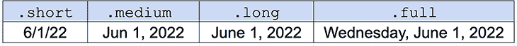
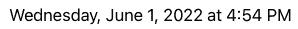
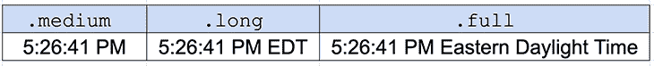
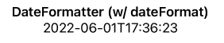
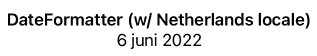

# 如何在 Swift 中使用 DateFormatter

> 原文：<https://blog.logrocket.com/how-to-use-dateformatter-swift/>

日期和时间是编程的重要组成部分。它们帮助我们跟踪数据实例，并允许我们按时间顺序组织数据集。

尽管它们很重要，日期和时间的格式和解释并不总是像人们希望的那样简单。

例如，如果纽约市的日期是 2022 年 5 月 3 日，时间是下午 3 点 20 分，普通纽约人会说现在是 2022 年 5 月 3 日下午 3 点 20 分。然而，对于伦敦的人来说，同样的日期和时间会有很大的不同，他们会将该日期解释为 2022 年 3 月 5 日，并说时间是 18:20。

这些差异源于三大因素:时区(东部标准时间 vs .英国夏令时)；日期格式(月/日/年与日/月/年)；以及时钟类型差异(美国使用 12 小时制，尽管伦敦可以同时使用这两种时钟，但他们的政府文件通常使用 24 小时制)。

这只是两个城市之间的一些日期和时间差异，但是想象一下世界上所有国家之间的差异(甚至是国家内部的差异)。

这就是为什么如果你想让你的应用程序尽可能容易访问，你需要有适当的逻辑来准确地以不同环境可以理解的格式表示日期和时间。

在本帖中，我将向您展示如何使用 Swift 的`[DateFormatter](https://developer.apple.com/documentation/foundation/dateformatter)`以及其他一些现有的库来格式化您的日期。首先，我们从`DateFormatter`开始。

## 设置我们的环境

在我们开始之前，让我们先做好准备。创建新的 Swift 应用程序，并在 Xcode 中打开它。

接下来，转到你的`ContentView.swift`文件，在主体之外，实例化新的`Date`和`DateFormatter`对象。

```
let date = Date();
let dateFormatter = DateFormatter();

```

`[Date](https://developer.apple.com/documentation/foundation/date)`将给出我们当前时区的当前日期和时间。对我来说，是 2022 年 6 月 1 日星期三。

`dateFormatter`是`DateFormatter`类的一个实例，它允许我们在`date`上操作各种格式化功能。这很重要，因为如果不先正确格式化，我们将无法在`Text`视图中显示`date`。让我们看看如何在我们的`ContentView`的`body`中格式化它。

```
​​var body: some View {
        dateFormatter.dateStyle = .short
        return Text(dateFormatter.string(from: date))
            .padding()
}

```

上面的代码将日期缩写成数字形式。例如，我今天的日期(2022 年 6 月 1 日)将变成 6/1/22。

## 实施`DateFormatter`

要开始使用`DateFormatter`，我们需要指定我们想要的样式。的。我们指定的样式以数字或者缩写的形式呈现了`date`。这意味着月、日和年用数字表示。还要注意，年份只有两个数字，而不是整整四个。

然后，`.string`允许我们将`date`转换成字符串类型(这是我们的`Text`视图所需要的)。是根据`dateFormatter`的样式，也就是。`short`在我们的情况下。

如果我们想用缩写字符串显示日期，用数字显示日期，用完整的四位数显示年份，会怎么样呢？那很简单！我们会使用。`medium`代替。`short`。

如果我们想用完整的月份名称、数字日期和完整的年份来显示日期呢？

你猜对了，我们会用。`long`。

我们可以进一步利用这一点。`full`，它给出了星期几、完整的月份名称、一天的数字和整年。你可以在下面看到它们。



## 应用`timeStyle`

如果您还想显示时间，您可以将`timeStyle`应用到`dateFormatter`。这个选项同样适用于`dateStyle`，你仍然可以使用内置的`.short`、`.medium`、`.long`和`.full`格式。

你这样分配`timeStyle`:

```
dateFormatter.timeStyle = .short

```

如果您在`dateFormatter.dateStyle`后添加上述行，它会将缩短的时间添加到您的日期中。您可以在下面看到结果:



这个例子将`dateStyle`表示为`.full`，将`timeStyle`表示为`.short`。

以下是其他时间样式:



***注意:**，上面显示的时间与之前的例子有些不同，因为我花了一些时间来更改`timeStyle`。*

## 使用`dateFormat`

除了设置`dateStyle`和`timeStyle`，我们还可以使用`dateFormat`。我们将提供一个表示我们想要的日期和时间格式的字符串。

让我们实例化另一个名为`dateFormatter2`的`DateFormatter`实例。这一次，让我们用 `dateFormat`代替`dateStyle`和`timeStyle.`见下文:

```
dateFormatter2.dateFormat = "yyyy-MM-dd'T'HH:mm:ss" 

     …

Text(dateFormatter2.string(from: date))
                .padding(.bottom)

```

现在让我们看看它在用户界面中的样子:



完美！

### 设计日期

为了清楚起见，让我们从日期开始分解`dateFormat`。

今年(`yyyy`)是 2022 年。我们用的是全年，但如果你想只显示“22”，可以用`yy`。

月份(`MM`)为 06，对应 6 月。如果您想显示不带 0 的月份，只需将其保留为`M`。如果你想把月份作为一个字符串，输入`MMMM`。

最后一天(`dd`)是 01。如果您想显示前面没有 0 的日期，只需将其保留为`D`。

### 设计时间

要格式化小时或`HH`，您有两种选择。第一种是将时间格式化为`HH`，这与 24 小时制一致。第二种选择是使用 12 小时制，为此你只需要用`H`来代替它。

`mm`代表分钟，`ss`代表秒。这些都是不言自明的。

要改变这些数字的顺序，只需将它们放在字符串的不同部分。例如，`"MM-dd-yyyy'T'h:mm:ss"`看起来会像`06-01-2022T5:48:55`。

到目前为止一切顺利！我们现在可以使用`DateFormatter`使用提供的格式或我们自己的字符串来格式化我们的日期和时间。

只有一个警告。还记得我提到的不同国家、城市、大陆等等有不同的时区和日期风格吗？如果有一种方法可以根据我们在世界上的位置来安排我们的日期就好了…

…好消息是我们可以！这是可能的，因为[本地化](https://www.donnywals.com/formatting-dates-in-the-users-locale-using-dateformatter-in-swift/)。

## 使用日期和时间格式的本地化

本地化利用了 [locales](https://www.locale.to/what-is-a-locale/) ，即用于定义用户位置、语言和语法的参数集。如果你想让一个应用程序在世界各地都能使用，这一点很重要。

本地化不仅仅是翻译。虽然您可以使用语言 API 将英语的“June 1”翻译成荷兰语的“juni 15 ”,以便在荷兰使用，但从地区的角度来看，这在技术上仍然是不正确的。

在荷兰，人们阅读日期是一个月的前一天。从技术上讲，“6 月 1 日”应该本地化为“1 juni”

好消息是`DateFormatter`已经为我们处理了很多这样的事情。然而，我们可以通过操作`DateFormatter`的`locale`属性来手动更新它的区域设置。

这个属性决定了格式化程序的语言环境。如果我们不改变这个属性，使用的地区将是美国英语(在 Swift 中用“`en_us`”表示)。

如果我们想使用荷兰作为我们的地区，我们可以这样设置值:

```
dateFormatter2.locale = Locale(identifier: "nl")

```

让我们看看我们的日期看起来像我们的新场所。



完美！这样，我们不仅完成了语言更改，还完成了区域设置格式化。这总体上创建了更准确的日期。

## 结论

Swift 中的日期格式可以是开箱即用的简单格式，但我们有各种灵活性和定制选项。有些情况下可能需要更短的日期，而其他情况下可能需要更长的日期。

你可能还会发现，将月份显示为字符串比数字更容易被你的应用程序接受或理解。您还可以通过实现本地化来更好地适应全球用户，让他们对您的应用程序更熟悉。

时间是我们最宝贵的财富。我们至少可以有效地格式化它。

这篇文章的所有代码都可以在 GitHub 上找到。

## 使用 [LogRocket](https://lp.logrocket.com/blg/signup) 消除传统错误报告的干扰

[](https://lp.logrocket.com/blg/signup)

[LogRocket](https://lp.logrocket.com/blg/signup) 是一个数字体验分析解决方案，它可以保护您免受数百个假阳性错误警报的影响，只针对几个真正重要的项目。LogRocket 会告诉您应用程序中实际影响用户的最具影响力的 bug 和 UX 问题。

然后，使用具有深层技术遥测的会话重放来确切地查看用户看到了什么以及是什么导致了问题，就像你在他们身后看一样。

LogRocket 自动聚合客户端错误、JS 异常、前端性能指标和用户交互。然后 LogRocket 使用机器学习来告诉你哪些问题正在影响大多数用户，并提供你需要修复它的上下文。

关注重要的 bug—[今天就试试 LogRocket】。](https://lp.logrocket.com/blg/signup-issue-free)