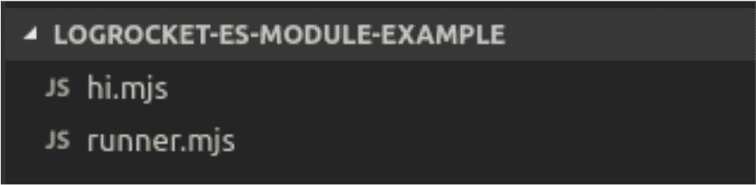
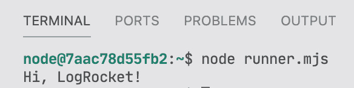
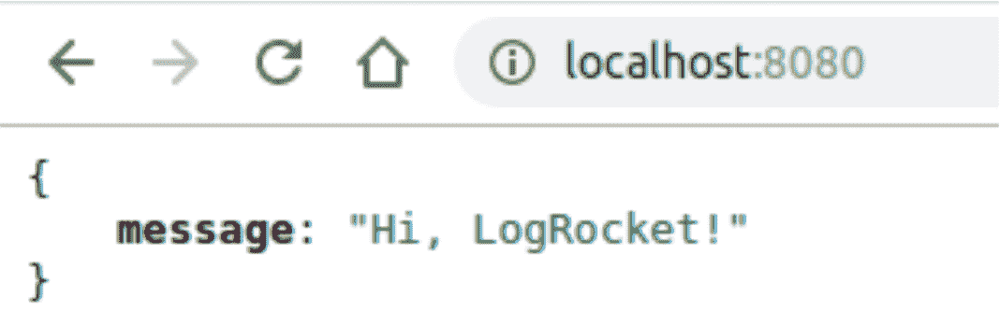

# 将 ECMAScript 模块(ESM)用于 Node.js 

> 原文：<https://blog.logrocket.com/how-to-use-ecmascript-modules-with-node-js/>

***编者按:*** *本帖于 2021 年 4 月更新，包含 ES 模块的更新及相关信息。*

自 2009 年以来，就在 Kevin Dangoor 启动了 CommonJS 项目之后，一场新的讨论开始了，关于 JavaScript 如何更好地适应构建应用程序的过程，不仅要在 web 浏览器中运行，还要将其能力扩大到越来越广泛的可能性。当然，这些必须包括后端世界。

它成功的关键实际上是由于它的 API，它带来了一个丰富的标准库，类似于我们为其他语言如 [Python](https://blog.logrocket.com/how-python-can-help-you-learn-es6/) 、Java 等所拥有的标准库。今天，多亏了 CommonJS，我们在服务器端应用程序、命令行工具、基于 GUI 的桌面和混合应用程序(Titanium、Adobe AIR 等)中有了 JavaScript。)，还有更多。

无论如何，每次你使用一个`require()`，你实际上是在使用 CommonJS 模块的实现，默认情况下它在 Node.js 中。

## 什么是 ECMAScript 模块(ESM)？

CommonJS 模块虽然由于 Node.js 而无处不在，但并不是 JavaScript 语言规范的正式组成部分。另一方面，ECMAScript 模块(简称 es 模块或 ESM)是 JavaScript 语言规范的一个相对较新的补充，正在寻求统一和标准化模块在 JavaScript 应用程序中的加载方式。

这是将 ES 模块与[节点](https://blog.logrocket.com/how-to-use-event-driven-programming-in-node-js/)一起使用的第一个问题:CommonJS 已经是一个模块系统，ESM 必须找到与其共存的最佳方式。这应该不是问题，除了一个重要的事实:ESM 是异步加载的，而 CommonJS 是同步加载的。

当谈到像 [Babel](https://babeljs.io/) 和 [webpack](https://webpack.js.org/) 这样的工具时，负载也由同步进程承担，因此考虑到它们允许浏览器和服务器端的应用程序在没有本机支持的情况下运行的同构特性，我们会有一些问题。

在本文中，我们将探索在 Node.js 宇宙中支持这两个世界的旅程已经走了多远。我们将创建几个示例，让您更深入地了解如何迁移您的代码库，以利用 ESM 的强大功能。

## ES 模块使用简介

如果您是 ES 模块的初学者，让我们仔细看看如何使用它们。如果你曾经使用过 React 或 Vue.js，你可能会看到这样的东西:

```
import React, {Fragment} from 'react';
// or
import Vue from './vue.mjs';

```

特别是第一个例子，它是一个很好的例子，因为它展示了默认导出和命名导出之间的区别。考虑下面的代码片段:

```
export default React;

```

我们只能为每个文件导出一个默认模块。这就是为什么`Fragment`必须导入到`{ }` s 中的原因，因为它不是默认包含的。它的输出看起来像:

```
export const Fragment = … ;

```

很明显，你可以创造你自己的，就像这样:

```
export const itsMine = 'It is my module';

```

将这段代码保存到一个`mjs`扩展文件中，正如我们在 React 示例中看到的，您可以将它导入到另一个文件中:

```
import { itsMine } from './myESTest.mjs'

alert(itsMine); // it'll alert 'It is my module' text

```

当我们将扩展名`mjs`与`js`文件进行比较时，它可能会导致一些混淆。对于 JavaScript 规范来说，两者是有区别的。例如，按照定义，模块是严格的(就像在`'use strict'`中一样)，所以这意味着在实现你的 JavaScript 模块时，要进行大量的检查，并且禁止“不安全”的动作。

对于 JavaScript 引擎来说,`js`和`mjs`的区别是必要的，这样才能知道它处理的是模块还是脚本。例如，如果您得到一个 CommonJS 脚本，您不允许在其中使用`'import from'`(只有`require`)，所以他们可以强制每个扩展导入适当的、各自的模块脚本:

*   `mjs import from mjs`
*   `js require js`

但是互操作性很重要；那么在下面的场景中会发生什么呢？

*   `mjs import from js`
*   `js require mjs`

说到 es 模块，众所周知它们是静态的——也就是说，你只能在编译时“访问”它们，而不能在运行时访问。这就是为什么我们必须把它们放在文件的开头。

### 从 js 导入 mjs

这里要注意的第一件事是你不能在一个`mjs`文件中使用`require`。(如果您尝试这样做，您将会看到一个错误，指出“require is not defined。”)相反，我们必须使用我们以前见过的导入语法:

```
import itsMine from './myESTest.js'

```

但前提是默认导入(`module.exports`)已经导出到 CommonJS 文件(`myESTest.js`)。很简单，不是吗？

### js 需要 mjs

然而，当相反的情况发生时，我们不能简单地使用:

```
const itsMine require('./myESTest.mjs')

```

记住，ESM 不能通过`require`功能导入。另一方面，如果您尝试使用`import from`语法，我们会得到一个错误，因为 CommonJS 文件不允许使用它:

```
import { itsMine } from './myESTest.mjs' // will err

```

多米尼奇·德尼科拉提出了一个通过`import()`函数以多种方式动态导入 ES 模块的过程。请参考链接，了解更多信息。有了它，我们的代码将如下所示:

```
async function myFunc() {
const { itsMine } = await import('./myESTest.mjs')
}
myFunc()

```

但是，请注意，这种方法将引导我们使用异步函数。您也可以通过回调、承诺和其他技术来实现这一点，在这里会有更详细的描述[。](http://2ality.com/2017/01/import-operator.html)

*注意:这种类型的导入只能从节点 10+开始使用。*

## 使用 ES 模块运行 Node.js

在 Node.js 中运行 ES 模块有两种主要方式:

1.  通过使用高于 12.0.0 的 Node.js 版本。
2.  通过一个将 ES 模块支持添加到 Node 旧版本的库，在本例中是 [ESM](https://www.npmjs.com/package/esm) ，它将实现的所有主要部分捆绑在一个地方

在 Node GitHub repo 中，您可以找到一个名为“[Plan for New Modules Implementation](https://github.com/nodejs/modules/blob/main/doc/archive/plan-for-new-modules-implementation.md)”的归档页面，在这里您可以遵循 Node.js 团队为支持 Node.js 中的 ECMAScript 模块而遵循的官方计划。

### 使用官方的 ES 模块支持

让我们从 Node.js 提供的第一种(也是官方的)方式开始，在您的节点环境中使用 ES 模块。

首先，如前所述，确保您的机器上的 Node 版本高于 12。您可以使用 [NVM](https://github.com/nvm-sh/nvm) 的能力来管理和升级您当前的版本。

然后，我们将创建一个单独的例子，只是为了让您体验一下模块是如何工作的。创建以下结构:



Our project structure.

第一个文件`hi.mjs`将存放一个函数的代码，该函数将连接一个字符串参数并返回一条 hello 消息:

```
// Code of hi.mjs
export function sayHi(name) {
    return "Hi, " + name + "!"
}

```

注意，我们正在利用`export`特性。第二个文件`runner.mjs`将负责导入我们的函数并将消息打印到控制台:

```
// Code of runner.mjs
import { sayHi } from './hi.mjs'

console.log(sayHi('LogRocket'))

```

要运行我们的代码，只需发出以下命令:

```
node runner.mjs

```

这将是输出:



## 使用 ESM 库

虽然在前端，我们可以利用 Babel、webpack 或类似的工具来帮助我们在本地支持尚不可用的情况下使用 ES 模块，但我们有另一个针对 Node.js 的解决方案，在类似的情况下更简洁:它是 ESM 包。

> 注意:只有旧版本的 Node 才需要这种方法。node 的最新版本支持开箱即用的 ES 模块。

它基本上由一个模块加载器组成，该加载器在 CommonJS 模块系统之上添加了对 ES 模块的支持。不需要依赖关系；它允许您超级快速地使用 Node.js v6+中的 ES 模块。当然，它完全符合 Node ES 模块规范。

现在让我们考虑一个不同的`hello world`，这次是在网络上，用 [Express.js](https://expressjs.com/) 。我们将创建一个 CJS 文件来与 ESM 文件对话。

但是首先，在我们项目的根文件夹中，运行以下命令来设置您的`package.json`文件:

```
npm init -y
npm install --save esm
npm install --save express

```

完成后，创建两个新文件:

*   `runner.js`将是执行的起点，但是现在作为一个单独的 JavaScript 文件
*   `hi-web.mjs`将存储快速访问 hello 功能的代码

让我们从`hi-web.mjs`源代码开始:

```
import express from "express";
import { sayHi } from "./hi.mjs";

const app = express();

app.get("/", (req, res) => res.json({ "message": sayHi("LogRocket") }));

app.listen(8080, () => console.log("Hello ESM with esm !!"));

```

注意，在这里，我们使用的是托管`sayHi()`函数的前一个`mjs`文件。一旦我们看到我们可以完美地从另一个文件导入`mjs`文件，这就不是什么大新闻了。看看我们如何将这个文件导入到我们的启动脚本中:

```
// runner.js code
require = require("esm")(module);
module.exports = require("./hi-web.mjs").default;

```

一旦我们不使用动态导入，就必须使用`default`。ESM 包重写了`require`，还向正在使用的节点版本模块添加了功能。它进行一些内联和按需转换，实时处理和缓存执行。

在运行这个例子之前，请确保修改您的`package.json`,以理解哪个文件将是起点:

```
...

"scripts": {
    "start": "node runner.js"
},

```

在运行 npm start 命令之后，当我们的服务器启动时，我们应该在控制台中看到一条消息，并且请求 localhost:8080 将在浏览器中显示以下输出:



浏览器输出。

## 结论

有关 ES 模块如何与 Node 一起工作的更多详细信息，请访问他们的[官方文档](https://nodejs.org/api/esm.html)。

在处理基本代码转换时，请记住以下要点:

*   将您的`js`文件迁移到`mjs`时，将基本导出(`module.exports`)更改为新的 ESM `export`语句
*   所有的`require`必须更改为各自的导入语句
*   如果你正在动态地使用`require`，记住也要通过`await import`(或者我们已经看到的动态`import()`函数)进行导入
*   还要更改其他文件中引用您要迁移的内容的其他`require`
*   `mjs`文件在浏览器中使用时，必须使用正确的媒体类型，即`text/javascript`或`application/javascript`。由于浏览器不关心扩展，Node.js 是唯一需要扩展存在的东西。这是检测文件是 CJS 模块还是 ES 模块的方法

好好学习！

## 200 只显示器出现故障，生产中网络请求缓慢

部署基于节点的 web 应用程序或网站是容易的部分。确保您的节点实例继续为您的应用程序提供资源是事情变得更加困难的地方。如果您对确保对后端或第三方服务的请求成功感兴趣，

[try LogRocket](https://lp.logrocket.com/blg/node-signup)

.

[](https://lp.logrocket.com/blg/node-signup)[https://logrocket.com/signup/](https://lp.logrocket.com/blg/node-signup)

LogRocket 就像是网络和移动应用程序的 DVR，记录下用户与你的应用程序交互时发生的一切。您可以汇总并报告有问题的网络请求，以快速了解根本原因，而不是猜测问题发生的原因。

LogRocket 检测您的应用程序以记录基线性能计时，如页面加载时间、到达第一个字节的时间、慢速网络请求，还记录 Redux、NgRx 和 Vuex 操作/状态。

[Start monitoring for free](https://lp.logrocket.com/blg/node-signup)

.