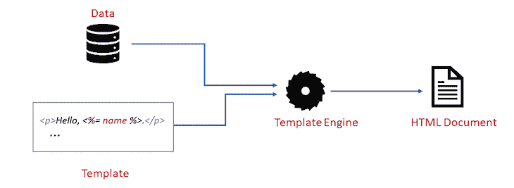
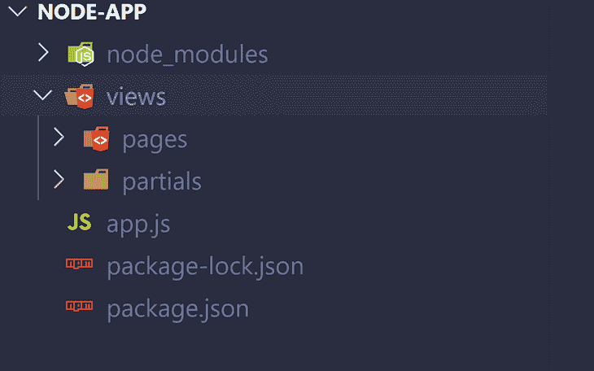
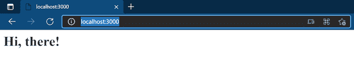
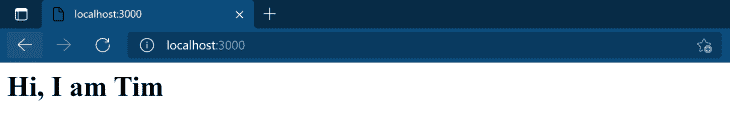
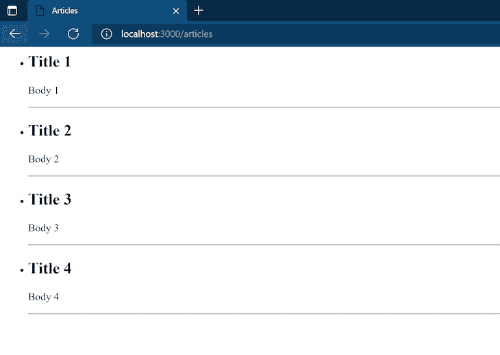
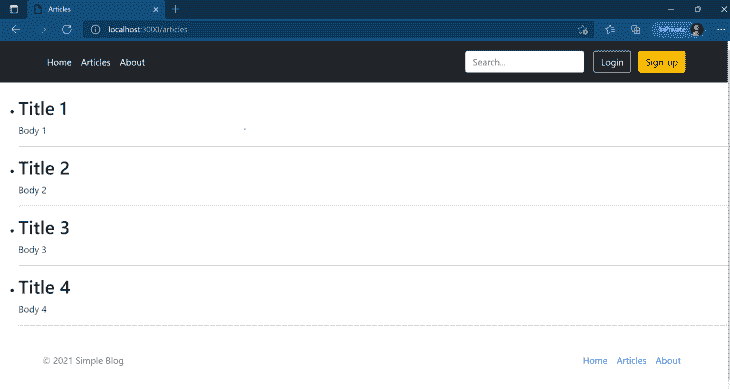
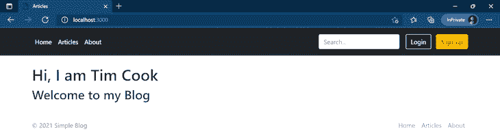
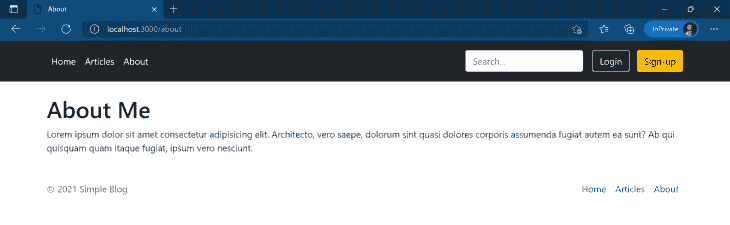

# 如何使用 EJS 模板化你的 Node.js 应用

> 原文：<https://blog.logrocket.com/how-to-use-ejs-template-node-js-application/>

## 介绍

如果您在 Node.js 中编写一个后端应用程序，并且希望将 HTML 发送回与之交互的客户端，那么您必须找到一种方法将处理后的数据“混合”或插入到您发送的 HTML 文件中。

对于简单的数据插值和测试，一种方法是将 HTML 字符串与数据连接起来，或者使用 JavaScript 中的模板字符串。但是如果你想用大量的 HTML 代码和动态内容编写应用程序，你最好使用专门为此目的设计的工具，比如模板引擎。

EJS 是最流行的 JavaScript 模板引擎之一。顾名思义，它允许我们在模板语言中嵌入 JavaScript 代码，然后使用模板语言生成 HTML。

在本文中，我将向您详细介绍如何用 EJS 来模板化您的节点应用程序。首先，我们将介绍模板引擎和设置 EJS 的基础知识，但我们将继续学习在节点应用程序中使用 EJS 的更高级的指南。

## 模板引擎

根据维基百科的定义，模板引擎是设计用来将模板和数据模型结合起来产生真正的 HTML 代码的软件。



模板引擎处理将数据插入 HTML 代码的任务，同时提供一些难以通过连接字符串复制的功能(如 EJS 的部分功能)。

## 介绍 EJS

如前所述，EJS 是最流行的 JavaScript 模板引擎之一。选择它的原因之一是 EJS 代码看起来像纯 HTML。

它保留了 HTML 的语法，同时允许数据插值，不像 [Pug](https://blog.logrocket.com/getting-started-with-pug/) (另一个模板引擎)使用不同的缩进和空格语法。

EJS 文件以文件扩展名`.ejs`保存。

## 如何使用 Express 在 Node.js 应用程序中设置 EJS

我们将在本教程中使用 Express，因为它是最好的节点框架之一。很简约，很容易上手。

让我们从头开始一个项目。创建一个要放置项目文件的新文件夹。

通过在终端中运行`npm init -y`在文件夹中初始化一个新的节点项目，然后要安装 Express 和 EJS，运行:

```
npm install -S express ejs

```

安装后，在根文件夹中创建一个`app.js`文件和一个`views`文件夹。在`views`文件夹中，创建两个文件夹`pages`和`partials`；我将很快解释为什么我们需要这些文件夹。



现在，在`views/pages`文件夹中创建一个名为`index.ejs`的文件。

首先，将以下内容复制到`app.js`:

```
const express = require('express')
const app = express()
const port = 3000

app.set('view engine', 'ejs')

app.get('/', (req, res) => {
    res.render('pages/index')
})
app.listen(port, () => {
  console.log(`App listening at port ${port}`)
})

```

而下面的变成了`index.ejs`:

```
<h1>Hi, there!</h1>

```

如果您在终端上从根文件夹运行`node app.js`，然后访问`[localhost:3000]([http://localhost:3000/](http://localhost:3000/))`，您应该会看到以下结果:



现在，让我们浏览一下代码的某些部分，了解一下到底发生了什么。

`app.set('view engine', 'ejs')`不言自明。我们将 EJS 设置为快速应用视图引擎。默认情况下，Express 在解析模板文件时会查看一个`views`文件夹，这就是为什么我们必须创建一个`views`文件夹。

在`res.render('pages/index')`中，我们在响应对象上调用`render`方法。这将呈现所提供的视图(在本例中是`pages/index`，并将呈现的 HTML 字符串发送回客户端。

请注意，我们不必提供文件扩展名，因为 Express 会自动解析它；它知道我们从`app.set('view engine', 'ejs')`开始使用的视图引擎。我们也不必将路径写成`views/pages/index`，因为默认情况下使用的是`views`文件夹。

## 传递要呈现的数据

回想一下，我们的目标是将数据与模板结合起来。我们可以通过向`res.render`传递第二个参数来实现。第二个参数必须是一个对象，它可以在 EJS 模板文件中访问。

更新`app.js`像这样:

```
const express = require('express')
const app = express()
const port = 3000
app.set('view engine', 'ejs')

const user = {
    firstName: 'Tim',
    lastName: 'Cook',
}
app.get('/', (req, res) => {
    res.render('pages/index', {
        user: user
    })
})
app.listen(port, () => {
  console.log(`App listening at port ${port}`)
})

```

更新`index.ejs`太:

```
<h1>Hi, I am <%= user.firstName  %></h1>

```

运行`node app.js`,你应该得到这个:



## EJS 语法

你已经看到了 EJS 的基本语法。语法如下:

```
<startingTag content closingTag>

```

这是`<%= user.firstName %>`的语法。

EJS 有不同的标签用于不同的目的。这个开始标签`<%=`被称为“转义输出”标签，因为如果内容中的字符串有禁止使用的字符，如`>`和`&`，这些字符将在输出字符串中被转义(被 HTML 代码替换)。

## EJS 的逻辑

EJS 名副其实，因为我们提供了可以包含逻辑(称为“scriptlet”)作为其内容的标签`<%`。任何 JavaScript 语法都可以用在这个标签中。

要了解这一点，请更新`app.js`:

```
const express = require('express')
const app = express()
const port = 3000
app.set('view engine', 'ejs')
const user = {
    firstName: 'Tim',
    lastName: 'Cook',
    admin: true,
}
app.get('/', (req, res) => {
    res.render('pages/index', {
        user
    })
})
app.listen(port, () => {
  console.log(`App listening at port ${port}`)
})

```

然后更新`index.js`:

```
<h1>Hi, I am <%= user.firstName  %></h1>
<% if (user.admin) { %>
    <p>Let me tell you a secret: <b>I am an admin</b></p>
<% } %>

```

如果您运行该应用程序，您将看到显示的`if`语句中的段落。
改变用户对象中的`admin: false`，段落不会显示。

注意 scriptlet `<%*if*(user.admin) { %>`的语法。开始的`{`在开始和结束标签之间被捕获，结束的`}`在单独的开始和结束标签中被捕获。

## 循环浏览数据

因为`<%`标签可以包含任何有效的 JavaScript 代码，所以我们也可以在 EJS 中循环显示数据。在`views/pages`中创建一个名为`articles.ejs`的新文件。

接下来，更新`app.js`:

```
const express = require('express')
const app = express()
const port = 3000
app.set('view engine', 'ejs')

const posts = [
    {title: 'Title 1', body: 'Body 1' },
    {title: 'Title 2', body: 'Body 2' },
    {title: 'Title 3', body: 'Body 3' },
    {title: 'Title 4', body: 'Body 4' },
]
const user = {
    firstName: 'Tim',
    lastName: 'Cook',
}
app.get('/', (req, res) => {
    res.render('pages/index', {
        user
    })
})
app.get('/articles', (req, res) => {
    res.render('pages/articles', {
        articles: posts
    })
})
app.listen(port, () => {
  console.log(`App listening at port ${port}`)
})

```

`articles.ejs`也应该这样更新:

```
<!DOCTYPE html>
<html lang="en">
<head>
    <meta charset="UTF-8">
    <meta http-equiv="X-UA-Compatible" content="IE=edge">
    <meta name="viewport" content="width=device-width, initial-scale=1.0">
    <title>Articles</title>
</head>
<body>
    <ul>
        <% articles.forEach((article)=> { %>
            <li>
                <h2>
                    <%= article.title %>
                </h2>
                <p>
                    <%= article.body %>
                </p>
            </li>
            <hr />
        <% }) %>
    </ul>
</body>
</html>

```

当您运行该应用程序时，请访问[http://localhost:3000/articles](http://localhost:3000/articles)，您应该会看到以下内容:



我们将包含一个`title`和一个`body`的 post 对象数组`articles`传递给了`articles.ejs`模板。然后，在模板中，我们使用`forEach`遍历数组，将每个 post 对象呈现为一个列表项。

注意，在循环`<% articles.forEach((article)=> { %>`的每次迭代中引用数组中每一项的`article`变量在模板代码的其他部分都是可访问的，直到我们到达右括号`<% }) %>`的末尾。

## EJS 部分

网站的某些部分在不同的页面上保持不变，比如页眉、页脚和侧边栏。EJS 为我们提供了允许我们重用视图的部分。

回想一下，我们之前创建了`views/partials`文件夹。在这个文件夹中创建两个名为`head.ejs`和`footer.ejs`的新文件。

`head.ejs`的内容应该如下:

```
<!DOCTYPE html>
<html lang="en">
<head>
    <meta charset="UTF-8">
    <meta http-equiv="X-UA-Compatible" content="IE=edge">
    <meta name="viewport" content="width=device-width, initial-scale=1.0">
    <link href="https://cdn.jsdelivr.net/npm/[email protected]/dist/css/bootstrap.min.css" rel="stylesheet"
        integrity="sha384-1BmE4kWBq78iYhFldvKuhfTAU6auU8tT94WrHftjDbrCEXSU1oBoqyl2QvZ6jIW3" crossorigin="anonymous">

    <title>Articles</title>
</head>

```

我在`head.ejs`中包含了一个到[引导](https://blog.logrocket.com/whats-new-bootstrap-5-1-0/)的链接，因为我将使用来自[引导示例页面](https://getbootstrap.com/docs/5.1/examples/)的代码样本。

现在，更新`footer.ejs`如下:

```
</html>
<div class="container">
  <footer class="d-flex flex-wrap justify-content-between align-items-center py-3 my-4">
      <p class="col-md-4 mb-0 text-muted">&copy; 2021 Simple Blog</p>
      <ul class="nav col-md-4 justify-content-end">
          <li class="nav-item"><a href="/" class="nav-link px-2">Home</a></li>
          <li class="nav-item"><a href="/articles" class="nav-link px-2">Articles</a></li>
          <li class="nav-item"><a href="#" class="nav-link px-2">About</a></li>
      </ul>
  </footer>
</div>

```

和`articles.ejs`:

```
<%- include('../partials/head') %>
<body>
    <ul>
        <% articles.forEach((article)=> { %>
            <li>
                <h2>
                    <%= article.title %>
                </h2>
                <p>
                    <%= article.body %>
                </p>
            </li>
            <hr />
        <% }) %>
    </ul>
</body>
<%- include('../partials/footer') %>

```

我已经用`include`函数包含了`head.ejs`和`footer.ejs`分音。它接受文件的相对路径作为参数。因为`pages`和`partials`在同一个文件夹中，要从`pages`访问`partials`，我们必须先从`pages`文件夹(`../partials/head'`)出来。

另外，注意使用的 EJS 标签(`<%-`)而不是上面提到的转义输出标签(`<%=`)。`<%-`被称为“非转义输出”标签，当你想要输出原始 HTML 时使用。

请务必小心使用。不要在用户输入时使用它，因为它会使您的应用程序暴露于攻击之下。

让我们在`views/partials`中创建另一个名为`header.ejs`的分部。以下是`header.ejs`的内容:

```
<header class="p-3 bg-dark text-white mb-4">
    <div class="container">
        <div class="d-flex flex-wrap align-items-center justify-content-center justify-content-lg-start">
            <ul class="nav col-12 col-lg-auto me-lg-auto mb-2 justify-content-center mb-md-0">
                <li><a href="/" class="nav-link px-2 text-white">Home</a></li>
                <li><a href="/articles" class="nav-link px-2 text-white">Articles</a></li>
                <li><a href="#" class="nav-link px-2 text-white">About</a></li>
            </ul>
            <form class="col-12 col-lg-auto mb-3 mb-lg-0 me-lg-3">
                <input type="search" class="form-control form-control-dark" placeholder="Search..." aria-label="Search">
            </form>
            <div class="text-end">
                <button type="button" class="btn btn-outline-light me-2">Login</button>
                <button type="button" class="btn btn-warning">Sign-up</button>
            </div>
        </div>
    </div>
</header>

```

将`articles.ejs`更新为:

```
<%- include('../partials/head') %>
<%- include('../partials/header') %>
<body>
    <ul>
        <% articles.forEach((article)=> { %>
            <li>
                <h2>
                    <%= article.title %>
                </h2>
                <p>
                    <%= article.body %>
                </p>
            </li>
            <hr />
        <% }) %>
    </ul>
</body>
<%- include('../partials/footer') %>

```

运行`node app.js`，访问[http://localhost:3000/articles](http://localhost:3000/articles)，你应该会看到这个:



通过导入片段，我们已经将标题和引导样式包含到了`articles`页面中。我们也可以在其他页面上使用这些部分。

我们还将更新`index.ejs`以包含部分:

```
<%- include('../partials/head') %>
<%- include('../partials/header') %>
<div class="container">
    <h1>Hi, I am <%= user.firstName  %> <%= user.lastName %></h1>
    <h2>Welcome to my Blog</h2>
</div>

<%- include('../partials/footer') %>

```

再次运行应用程序，您可以在 [http://localhost:3000/](http://localhost:3000/) 看到新的索引页面



注意，我们可以在 EJS 标签中使用任何 JavaScript 操作符，因此我们可以这样写:

```
...    
<h1>Hi, I am <%= user.firstName + " " + user.lastName  %> 
...

```

## 将数据传递给分部

索引页有问题，你能看出来吗？

页面的标题是**文章**，因为`head.ejs`部分有网页标题硬编码成这样，这是不可取的。我们希望页面的标题反映页面的内容，所以我们必须将标题作为参数传入。

EJS 让这变得很容易，因为分部变量可以访问父视图中的每个变量，所以我们只需在调用`res.render`的同时传递对象中的变量。

更新对`app.js`中`res.render`的调用，如下所示:

```
...
app.get('/', (req, res) => {
    res.render('pages/index', {
        user,
        title: "Home Page"
    })
})
app.get('/articles', (req, res) => {
    res.render('pages/articles', {
        articles: posts,
        title: "Articles"
    })
})
...

```

然后更新`head.ejs`中的 title 标签:

```
...
    <title> 
        <%= title %>  
    </title>

...

```

再次运行应用程序，每个页面都应该有正确的标题。

当包含变量时，也可以将变量传递给分部变量，如下所示:

```
<%- include('../partials/head', {title :'Page Title'}) %>

```

以这种方式传递的变量优先于通过`render`传递的变量。

无论您选择通过父视图还是在调用`include`期间将变量传递给分部，您都必须确保在试图在分部中使用该变量之前该变量已经存在。如果它不存在，那么将抛出一个异常。

为了避免这种情况，您可以在分部中为变量提供一个默认值，例如，我们可以如下更新`head.ejs`:

```
...
    <title> 
        <%= typeof title != 'undefined' ? title : 'Page Title' %>  
    </title>
...

```

我们使用三元运算符来检查`title`不是`undefined`，如果是，我们提供默认值`Page Title`。

# 结论

在本文中，我们回顾了模板引擎，介绍了 JavaScript 的 EJS 以及如何使用它。我们已经看到了如何重用部分代码，以及如何向它们传递数据。

如果你想了解更多关于 EJS 的可能性，这里是 EJS 语法参考。

我有意省略了 **About** 页面的实现，让您自己完成。作为一个挑战，创建一个像这样的关于的**页面，并确保链接在页眉和页脚中工作。**



你可以在 GitHub 上查看这篇文章的代码。

## 200 只显示器出现故障，生产中网络请求缓慢

部署基于节点的 web 应用程序或网站是容易的部分。确保您的节点实例继续为您的应用程序提供资源是事情变得更加困难的地方。如果您对确保对后端或第三方服务的请求成功感兴趣，

[try LogRocket](https://lp.logrocket.com/blg/node-signup)

.

[](https://lp.logrocket.com/blg/node-signup)[https://logrocket.com/signup/](https://lp.logrocket.com/blg/node-signup)

LogRocket 就像是网络和移动应用程序的 DVR，记录下用户与你的应用程序交互时发生的一切。您可以汇总并报告有问题的网络请求，以快速了解根本原因，而不是猜测问题发生的原因。

LogRocket 检测您的应用程序以记录基线性能计时，如页面加载时间、到达第一个字节的时间、慢速网络请求，还记录 Redux、NgRx 和 Vuex 操作/状态。

[Start monitoring for free](https://lp.logrocket.com/blg/node-signup)

.