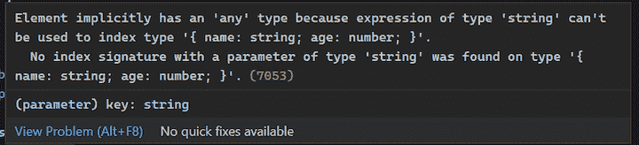
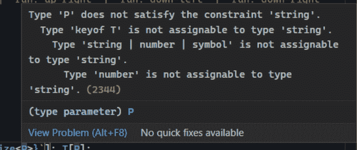

# 如何在 TypeScript 中使用 keyof 运算符

> 原文：<https://blog.logrocket.com/how-to-use-keyof-operator-typescript/>

在 JavaScript 中，我们经常使用 [`Object.keys`](https://developer.mozilla.org/en-US/docs/Web/JavaScript/Reference/Global_Objects/Object/keys) 来获取属性键列表。在 TypeScript 世界中，等价的概念是`keyof`操作符。虽然它们很相似，`keyof`只在类型级别工作，返回一个文字联合类型，而`Object.keys`返回值。

在 TypeScript 2.1 中引入的`keyof`操作符使用如此频繁，以至于它已经成为 TypeScript 中高级类型的构建块。在本文中，我们将研究`keyof`操作符，以及它通常如何与其他 TypeScript 特性一起使用，以通过 TypeScript 泛型、TypeScript 映射类型和 TypeScript 字符串文字类型实现更好的类型安全。

让我们看看每一个是如何与`keyof`操作符交互的。

*向前跳转:*

## 定义`keyof`操作符

[打字手册文档](https://www.typescriptlang.org/docs/handbook/2/keyof-types.html)说:

*`keyof`操作符接受一个对象类型，并产生其键的字符串或数字联合。*

下面显示了一个简单的用法。我们将`keyof`操作符应用于`Staff`类型，并得到一个`staffKeys`类型作为回报，它代表所有的属性名。结果是字符串文字类型的并集:"`name` " | " `salary`":

```
type Staff = {
 name: string;
 salary: number;
 } 
type staffKeys = keyof Staff; // "name" | "salary"

```

在上面的例子中，`keyof`操作符用于对象类型。它还可以用于非对象类型，包括基元类型。以下是几个例子:

```
type BooleanKeys = keyof boolean; // "valueOf"

type NumberKeys = keyof number; // "toString" | "valueOf" | "toFixed" | "toExponential" | "toPrecision" | "toLocaleString"

type SymbolKeys = keyof symbol; 
//typeof Symbol.toPrimitive | typeof Symbol.toStringTag | "toString" | "valueOf"

```

如您所见，当应用于基本类型时，它就没那么有用了。

## `Object.keys`与`keyof`操作员

在 JavaScript 中，`Object.keys`用于返回对象的键数组。在下面的代码中，返回的键用于访问每个属性的值:

```
const user = {
  name: 'John',
  age: 32
};

console.log(Object.keys(user));
// output: Array ["name", "age"]
Object.keys(user).forEach(key => {
  console.log(user[key])
}) // output: John, 32

```

值得注意的是`Object.keys`忽略了 JavaScript 中的符号属性。为了解决这个问题，你可以使用`Object.getOwnPropertySymbols`，它返回一个只包含符号键的数组。

`Object.keys`在 TypeScript 中类似地工作。下面是`Object.keys`的打字稿声明:

```
interface ObjectConstructor {
 //...
 keys(o: object): string[]
 //...
}

```

如果我们在 TypeScript 中运行前面的代码片段，我们会得到与`Object.keys`相同的输出:

```
const user = {
  name: 'John',
  age: 32
};

```

但是，当我们迭代键并通过键访问 object 属性时，TypeScript 会抛出一个错误。请注意，该错误仅在 TypeScript 严格模式打开时发生:

```
Object.keys(user).forEach(key => {
  console.log(user[key]) // error is shown
})

```



这个错误是因为我们试图使用`string`类型键来访问联合类型为“`name`”|“【T2”)的对象。

您可能想知道为什么 TypeScript 不返回类型化的键作为“`name`”|“`age`”？

这是故意的。[安德斯·海尔斯伯格](https://github.com/ahejlsberg)在此[评论](https://github.com/microsoft/TypeScript/pull/12253#issuecomment-263132208)中解释原因。

简而言之，强类型的`Object.keys`在编译时很好。但是对象在运行时通常有额外的属性。如果是这种情况，`Object.keys`将返回额外的键，这些额外的键将违反这样的假设，即`keyof`是对象的键的穷举列表。这可能会导致应用程序崩溃。我创建了一个 [StackBlitz 示例](https://stackblitz.com/edit/typescript-noyck2?file=index.ts)来演示这种行为。

要解决这个限制，最简单的解决方案是使用带有`keyof`操作符的类型断言:

```
type userKeyType = keyof typeof user; //  "name" | "age"
Object.keys(user).forEach((key) => {
 console.log(user[key as userKeyType])
})

```

一个更优雅的解决方案是通过[声明合并](https://www.typescriptlang.org/docs/handbook/declaration-merging.html#merging-interfaces)来扩展`ObjectConstructor`接口:

```
interface ObjectConstructor {
  keys<T>(o: T): (keyof T)[];
}

Object.keys(user).forEach((key) => {
  console.log(user[key]);
});

```

请注意，两种变通办法都有 Anders 评论中描述的相同限制。

因此，请谨慎使用这些变通办法。只有当您确定在运行时不会有额外的属性添加到您的对象时，才需要使用这些方法；否则，可能会导致意外崩溃。

## 对 TypeScript 泛型使用`keyof`

`keyof`操作符可用于在通用函数中应用约束。

下面的函数可以使用泛型、索引访问类型和运算符`keyof`来检索对象属性的类型:

```
function getProperty<T, K extends keyof T>(obj: T, key: K): T[K] {
  return obj[key];
}

```

如果您是 TypeScript 新手，这可能看起来有点复杂。让我们来分解一下:

*   `keyof T`返回字符串文字类型的并集。`extends`关键字用于对`K`应用约束，因此`K`只是字符串类型之一
*   `extends`表示“可转让”而非“继承”；`K extends keyof T`意味着任何类型为`K`的值都可以赋给字符串联合类型
*   索引访问操作符`obj[key]`返回与属性相同的类型

我们可以在下面看到如何使用`getProperty`类型:

```
const developer: Staff = {
  name: 'Tobias',
  salary: 100, 
};

const nameType = getProperty(developer, 'name'); // string 
// Compiler error 
const salaryType getProperty(developer, ‘pay’); //Cannot find name 'pay'.(2304)

```

因为我们为第二个参数应用了类型约束，所以编译器将验证该键是否匹配类型为`T`的属性名之一。在上面的例子中，当一个无效的键`'``pay``'`被传递时，编译器显示错误。

如果我们不使用`keyof`操作符，我们可以手工声明一个联合类型:

```
type staffKeys = 'name' | 'salary';
function getProperty<T, K extends staffKeys>(obj: T, key: K): T[K] {
return obj[key];
}

```

应用了相同类型的约束，但是手动方法的可维护性较差。与`keyof`操作符方法不同，类型定义是重复的，原始`Staff`类型的更改不会自动传播。

## 对 TypeScript 映射类型使用`keyof`

keyof 操作符的一个常见用法是与[映射类型](https://www.typescriptlang.org/docs/handbook/2/mapped-types.html)一起使用，它通过迭代键将现有类型转换为新类型，通常是通过`keyof`操作符。

下面是如何使用`OptionsFlags`映射类型转换`FeatureFlags`类型的示例:

```
type OptionsFlags<T> = {
 [Property in keyof T]: boolean;
};
// use the OptionsFlags
type FeatureFlags = { 
  darkMode: () => void;
  newUserProfile: () => void; 
};

type FeatureOptions = OptionsFlags<FeatureFlags>;
// result 
/*
type FeatureOptions = {
  darkMode: boolean; 
  newUserProfile: boolean; 
 } 
*/

```

在这个例子中，`OptionsFlags`被定义为接受类型参数`T`的泛型类型。`[Property in keyof T]`表示类型`T`的所有属性名的迭代，方括号是索引签名语法。因此，`OptionsFlags`类型包含了来自类型`T`的所有属性，并将它们的值重新映射为布尔值。

### 对条件映射类型使用`keyof`

在前面的例子中，我们将所有属性映射到一个布尔类型。我们可以更进一步，使用条件类型来执行条件类型映射。

在下面的例子中，我们只将非函数属性映射到布尔类型:

```
type OptionsFlags<T> = {
  [Property in keyof T]: T[Property] extends Function ? T[Property] : boolean };

type Features = {
  darkMode: () => void;
  newUserProfile: () => void;
  userManagement: string;
  resetPassword: string
 };

 type FeatureOptions = OptionsFlags<Features>;
 /**
  * type FeatureOptions = {
    darkMode: () => void;
    newUserProfile: () => void;
    userManagement: boolean;
    resetPassword: boolean;
} */

```

我们可以看到在示例中将`Features`类型映射到`FeatureOptions`类型是多么方便。但是最好的是——源`FeatureFlags`类型中的任何未来变化将自动反映在`FeatureOptions`类型中。

### 将`keyof`用于实用程序类型

TypeScript 提供了一组内置的映射类型，称为[实用程序类型](https://www.typescriptlang.org/docs/handbook/utility-types.html)。`Record`型就是其中之一。为了理解`Record`类型是如何工作的，我们可以看看它下面的定义:

```
// Construct a type with set of properties K of T
type Record<K extends string | number | symbol, T> = { [P in K]: T; }

```

如您所见，它只是在将所有属性键映射到类型`T`后返回一个新类型。
我们可以用`Record`类型重写前面的`FeatureOptions`类型例子:

```
type FeatureOptions = Record<keyof FeatureFlags, boolean>; 
// result 
/* type FeatureOptions = { 
  darkMode: boolean; 
  newUserProfile: boolean; 
} 
*/

```

这里，我们使用`record`类型获取一组属性并将它们转换为布尔类型，从而得到相同的`FeatureOptions`类型。

`keyof`操作符与实用程序类型的另一个常见用法是与`Pick`类型一起使用。`Pick`类型允许你从一个对象类型中选择一个或多个属性，并用选择的属性创建一个新类型。

* * *

### 更多来自 LogRocket 的精彩文章:

* * *

`keyof`操作符确保应用了约束，以便只有有效的属性名可以传递给第二个参数`K`:

```
type Pick<T, K extends keyof T> = {
  [P in K]: T[P];
 };

```

以下示例显示了如何使用`Pick`从`FeatureOption`类型派生出`FeatureDarkModeOption`类型:

```
type FeatureDarkModeOption = Pick<FeatureOptions, 'darkMode'>;
 /**type FeatureDarkModeOption = {
    darkMode: boolean;
} */

```

## 将`keyof`与 TypeScript 模板字符串文字一起使用

在 TypeScript 4.1 中引入的模板文字类型允许我们在类型中连接字符串。有了模板文字类型和`keyof`，我们可以用所有可能的组合组成一组字符串:

```
type HorizontalPosition = { left: number; right: number };
type VerticalPosition = { up: number; down: number };
type TransportMode = {walk: boolean, run: boolean};

type MovePosition = `${keyof TransportMode}: ${keyof VerticalPosition}-${keyof HorizontalPosition}`;
/* result
type MovePosition = "walk: up-left" | "walk: up-right" | "walk: down-left" | "walk: down-right" | "run: up-left" | "run: up-right" | "run: down-left" | "run: down-right"
*/

```

在本例中，我们创建了一个大型联合类型`MovePosition`，它是`TransportMode`、`HorizontalPosition`和`VerticalPosition`类型的组合。手动创建这些联合类型会使它们容易出错并且难以维护。

### 属性重映射和`keyof`

除了 TypeScript 4.1 中的模板字符串文字类型，还提供了一组现成的实用工具来帮助进行字符串操作。这些实用程序使得用重新映射的属性构造类型变得更加容易。

这里有一个例子:

```
interface Person {
  name: string;
  age: number;
  location: string;
}

type CapitalizeKeys<T> = {
  [P in keyof T as `${Capitalize<string & P>}`]: T[P];
}

type PersonWithCapitalizedKeys = CapitalizeKeys<Person>;
/* result:
type PersonWithCapitalizedKeys = {
    Name: string;
    Age: number;
    Location: string;
}
*/

```

在 as `${Capitalize<string & P>}`中，我们使用 as 将左侧映射到大写的键，并且仍然可以访问原始键`P`。

你可能注意到我们用了`<string & P>`，那是什么意思？如果我们删除`string &`，编译器错误将如下所示:



出现此错误是因为`Capitalize`类型要求类型参数为`string` | `number` | `bigint` | `boolean` | `null` | `undefined`。但是`P`是`string` | `number` | `symbol`的联合类型。`P`中的符号类型与`Capitalize`不兼容。

因此，我们在我们的`string`类型和`P`类型之间应用`&` ( [交集](https://www.typescriptlang.org/docs/handbook/unions-and-intersections.html)),它只返回`string`类型。

### 高级属性重新映射用例

我们可以更进一步创造更酷的东西:

```
type Getter<T> = {
  [P in keyof T as `get${Capitalize<string & P>}`]: () => T[P]
};

```

上面的例子展示了一个使用属性重映射的新的`Getter`类型。

在下面的代码片段中，我们使用`Getter`类型创建一个`PersonWithGetter`类型。新类型有助于加强`Getter`接口的类型安全:

```
type PersonWithGetter = Getter<Person>;
/* result
type PersonWithGetters = {
    getName: () => string;
    getAge: () => number;
    getLocation: () => string;
}*/

```

让我们扩展一下上面的例子。下面是一个`AsyncGetter`型。我们遍历来自`keyof`的属性`P`，并应用前缀 get 和后缀`Async`。我们还应用`Promise`作为返回类型:

```
type AsyncGetter<T> = {
  [P in keyof T as `get${Capitalize<string & P>}Async`]: () => Promise<T[P]>;
}

type PersonWithAsyncGetters = AsyncGetter<Person>;
/* Result:
type PersonWithAsyncGetters = {
    getNameAsync: () => Promise<string>;
    getAgeAsync: () => Promise<number>;
    getLocationAsync: () => Promise<string>;
}*/

```

在这些例子中，我们从`Person`接口派生了两个新类型。我们现在可以应用这些派生类型来使代码类型安全并保持一致的接口。当`Person`接口发生变化时，这种变化会自动传播到派生的类型中。如果改变破坏了任何东西，我们将得到编译器错误。

## 摘要

在本文中，我们研究了`keyof`操作符，并讨论了如何将它与泛型、条件类型和模板文字类型一起使用。

操作符是大型打字机器中的一个小而关键的齿轮。当您将它与 TypeScript 中的其他工具一起正确使用时，您可以构造简洁且约束良好的类型，以提高代码中的类型安全性。

## [LogRocket](https://lp.logrocket.com/blg/typescript-signup) :全面了解您的网络和移动应用

[](https://lp.logrocket.com/blg/typescript-signup)

LogRocket 是一个前端应用程序监控解决方案，可以让您回放问题，就像问题发生在您自己的浏览器中一样。LogRocket 不需要猜测错误发生的原因，也不需要向用户询问截图和日志转储，而是让您重放会话以快速了解哪里出错了。它可以与任何应用程序完美配合，不管是什么框架，并且有插件可以记录来自 Redux、Vuex 和@ngrx/store 的额外上下文。

除了记录 Redux 操作和状态，LogRocket 还记录控制台日志、JavaScript 错误、堆栈跟踪、带有头+正文的网络请求/响应、浏览器元数据和自定义日志。它还使用 DOM 来记录页面上的 HTML 和 CSS，甚至为最复杂的单页面和移动应用程序重新创建像素级完美视频。

[Try it for free](https://lp.logrocket.com/blg/typescript-signup)

.