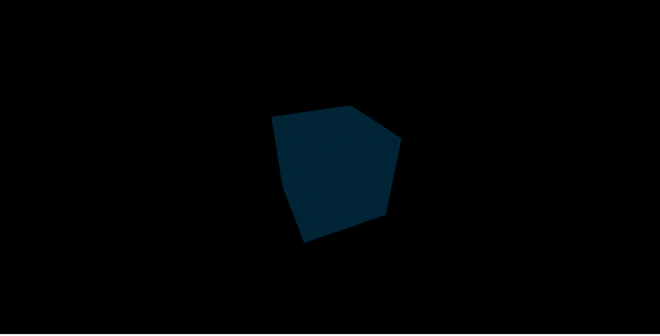
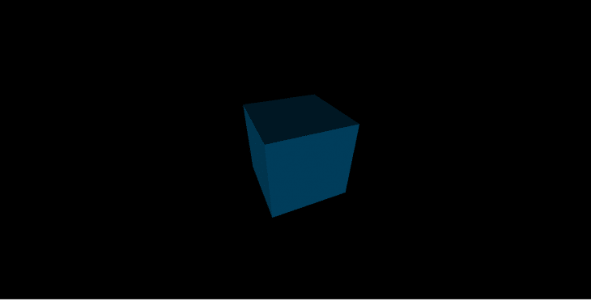
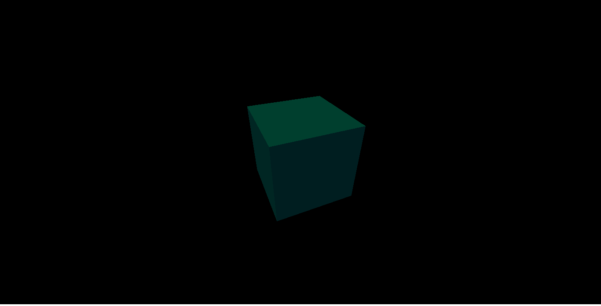

# 如何在 Three.js - LogRocket 博客中使用光照和 WebGLRenderer

> 原文：<https://blog.logrocket.com/how-to-use-lighting-and-renderers-in-three-js/>

[Three.js](https://threejs.org/) 是一个 js 图形库，用于在浏览器中渲染 3D 图形。主要的图形组织使用 Three.js 为电影、动画、广告和游戏创建和渲染 3D 场景。

Three.js 在浏览器中使用 WebGL 引擎进行场景渲染。该 API 基于 OpenGL (GL 代表图形库)，一种桌面图形 API。在这篇文章中，我们将看看 Three.js 中的灯光类型和 WebGLRenderer。

## 光

首先，让我们学习如何在 Three.js 中使用灯光，这样我们就知道可以使用的灯光类型以及每种灯光的效果。

Three.js 提供了几种不同类型的灯光。Three.js 中的所有灯光都是`THREE.Light`的实例。它们为我们提供照明，使我们能够照亮场景中的物体。

并非 Three.js 中对象的所有材质纹理都受光照影响。只有具有`MeshLambertMaterial`和`MeshPhongMaterial`材质纹理的对象才能受到光照的影响。

以下是 Three.js 中可用的灯光类型:

### 环境的

环境光用于场景中对象的照明。它不会将光线指向某个方向，因此无法投射阴影。

```
THREE.AmbientLight(color) 

```

物体被`AmbientLight`中的`color`照亮。环境光同等地影响场景中所有被照亮的对象，本质上是一种颜色被添加到对象材质颜色中的光。

```
var cubeGeometry = new THREE.CubeGeometry(20, 20, 20);
var basicMaterial = new THREE.MeshLambertMaterial({
    color: 0x0095DD
});

var cubeMesh = new THREE.Mesh(cubeGeometry, basicMaterial);

var light = new THREE.AmbientLight(0x404040);
scene.add(light);

scene.add(cubeMesh)

```

例如，这会用柔和的白光照亮立方体对象:



```
var light = new THREE.AmbientLight(0xf6e86d);

```

这段代码将用绿色照亮立方体对象。


### 方向的

顾名思义，平行光来自特定的点，直接射向目标。

这种光可以投射阴影，光线都是平行的，就像太阳一样，好像它无限远。

```
THREE.DirectionalLight(color, intensity = 1)

```

对于这种类型的光，所有的光都是平行的，来自一个给定的方向，好像光源非常远。

对于方向灯，光的方向是从`light.position`到`light.target.position`的方向；两者都是可以改变的向量，目标默认为世界的原点。

这是我们从太阳到地球得到的那种光。我们知道光源很远，光线是平行的。

另一个例子是在一个封闭的大厅里有一个手电筒或灯，在房间的远处角落里有一个大范围的灯。这将引导大厅中的光线，照亮大厅中的物体并投射阴影。

`color`是光的颜色，`intensity`是光的强度/亮度。默认值为 1，表示最高强度。

```
var light = new THREE.DirectionalLight(0x404040, 0.5);
scene.add(light);

```

### 半球

半球光直接从场景上方照射到地面。光色从上到下逐渐淡化，不投阴影。

```
THREE.HemisphereLight(skyColor, groundColor, intensity = 1)

```

请注意，它模拟了来自太阳的折射光，有点像两个相反的平行光。

`skyColor`是天空中起点的颜色。`groundColor`是地面灯光的颜色。`intensity`控制颜色的亮度。

```
var light = new THREE.HemisphereLight(0x404040, 0xFFFFFF, 0.5);
scene.add(light);

```



The light starts from the sky with soft white color and fades to normal light at the ground. See as the top of the cube is illuminated with the soft white color and its sides are in shades of normal light and soft white light.

这是另一个例子:

```
var light = new THREE.HemisphereLight(0xf6e86d, 0x404040, 0.5);
scene.add(light);

```



顶部的浅色从绿色的`0xf6e86d`开始，这就是立方体顶部有绿色色调的原因。然后就褪成了`0x404040`的颜色。

### 要点

点光源从一个位置发出，向各个方向照射。被它照亮的物体都在它的光线线上。

```
THREE.PointLight(color, intensity = 1, distance = 0)

```

就像房间里的灯泡一样，光线从一个点(即灯泡)发出，向四面八方传播，但只照亮半径内的物体。点光源可以投射阴影。

构造函数中的`color`弧是要发射的光的颜色。`intensity`是光线的强度，默认值为 1。`distance`是发出的光可以行进的距离或光的最大范围，默认值为 0，表示没有限制。

### 地点

由此产生的光的类型形成了从特定点到特定方向的光锥。离光源越远，锥形光的尺寸越大。光锥内的对象被照亮，它可以在对象上投射阴影。

```
THREE.SpotLight(color, intensity, distance = 0, angle = Math.PI/2)
```

`color`是光的颜色。`intensity`是光的强度。`distance`是光从它的源头传播的距离。`angle`是光从其方向散射的最大角度。

## WebGLRenderer

Three.js 现在只使用[webglrenderer](https://threejs.org/docs/#api/en/renderers/WebGLRenderer)在我们的浏览器中渲染 3D 物体，它使用浏览器的 WebGL API 渲染物体和场景。这就需要支持 WebGL 的浏览器显示场景。一般来说，大多数现代桌面浏览器对 WebGL 都有很好的支持，但有些移动设备还不支持 WebGL。

WebGL 之所以速度快，是因为它使用了客户端的图形处理单元来工作。客户端的 CPU 不做任何事情，也不是渲染的一部分。WebGL 是高性能的，因为 CPU 是空闲的，而专门为图形渲染构建的 GPU 则完成这项工作。

使用三个。WebGLRenderer，我们首先创建它的一个实例:

```
var renderer = new THREE.WebGLRenderer({
    antialias: true
});

```

传递给构造函数的 object param 中的`antialias`选项在 Three.js 中设置了一个非常强大的功能。Three.js 中的抗锯齿消除了场景中渲染的对象的锯齿边缘，使场景中的对象看起来栩栩如生。

接下来，我们可以通过调用`setSize()`方法来设置渲染窗口的大小:

```
renderer.setSize(window.innerWidth, window.innerHeight);

```

第一个参数是渲染窗口的宽度。我们将它设置为客户端浏览器的宽度。第二个参数是渲染窗口的高度，我们将其设置为客户端浏览器的高度。

接下来，我们调用渲染器上的`render`方法来渲染我们的场景。

```
renderer.render(scene, camera);

```

场景包含对象和灯光。这里，第一个参数是我们想要渲染的场景，第二个参数是我们将用来查看场景中对象的摄像机。

最后，渲染器被追加到页面文档中。

```
document.body.appendChild(renderer.domElement);

```

渲染器中的`domElement`属性保存我们添加到文档主体的 DOM 元素。这使得我们的场景在浏览器中可见。

## 结论

我们在 Three.js 中介绍了所有可用的照明类型，从水平照明到点照明，并举例说明它们是如何工作的。我们还学习了 Three.js 中的 WebGLRenderer，展示了它的性能和用途。

Three.js 非常强大和快速，所以下次你想为你的浏览器构建图形时，你应该考虑使用 Three.js。

## 您是否添加了新的 JS 库来提高性能或构建新特性？如果他们反其道而行之呢？

毫无疑问，前端变得越来越复杂。当您向应用程序添加新的 JavaScript 库和其他依赖项时，您将需要更多的可见性，以确保您的用户不会遇到未知的问题。

LogRocket 是一个前端应用程序监控解决方案，可以让您回放 JavaScript 错误，就像它们发生在您自己的浏览器中一样，这样您就可以更有效地对错误做出反应。

[](https://lp.logrocket.com/blg/javascript-signup)[https://logrocket.com/signup/](https://lp.logrocket.com/blg/javascript-signup)

[LogRocket](https://lp.logrocket.com/blg/javascript-signup) 可以与任何应用程序完美配合，不管是什么框架，并且有插件可以记录来自 Redux、Vuex 和@ngrx/store 的额外上下文。您可以汇总并报告问题发生时应用程序的状态，而不是猜测问题发生的原因。LogRocket 还可以监控应用的性能，报告客户端 CPU 负载、客户端内存使用等指标。

自信地构建— [开始免费监控](https://lp.logrocket.com/blg/javascript-signup)。