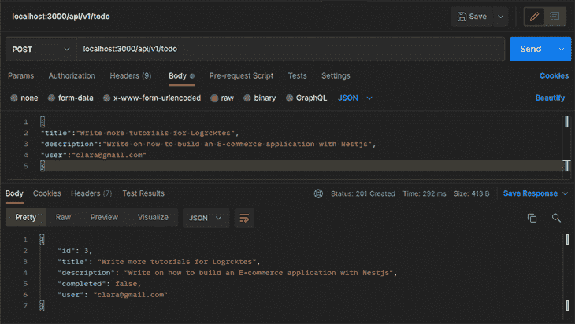
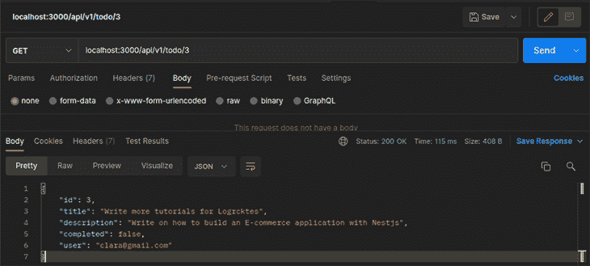

# 如何在 Prisma - LogRocket 博客中使用 NestJS

> 原文：<https://blog.logrocket.com/how-to-use-nestjs-prisma/>

NestJS 是一个用于创建可伸缩的服务器端 Node.js 应用程序的框架。它使用现代 JavaScript，完全支持并使用 TypeScript 构建，并结合了面向对象、函数式和函数式反应式编程的元素。

本教程将演示如何使用 Nest 和 Prisma 来构建一个 REST API。简要说明一下，该演示是使用 Prisma v3.11.0 运行的。下面是我们将介绍的内容:

## Prisma 是什么？

Prisma 是下一代节点和类型脚本对象关系映射器(ORM)。它为 PostgreSQL、MySQL、SQL Server、SQLite 和 MongoDB(目前正在预览中)提供了一个开源数据库工具包，使开发人员能够更快地构建应用程序，并减少错误。

Prisma 为您提供了一种声明性的方法，以更清晰的格式定义应用程序的数据模型和关系。此外，如果您已经有了一个数据库，您不必经历从零开始创建数据库模型的痛苦，因为 Prisma 的自省功能会为您处理这些—它非常灵活。

### Prisma 是用来做什么的？

Prisma 通过简化数据库访问、保存和减少重复的 CRUD 样板文件来提高类型安全性。Prisma 易于集成到您的首选框架中，是创建可靠和可伸缩的 web APIs 的理想数据库工具包。Prisma 与各种框架快速集成，如 GraphQL 、Next.js、Nest、Apollo 和 Express.js

Prisma 解决了传统 ORM 的许多缺点，例如缺乏类型安全性、混合的业务和存储逻辑，以及由延迟加载导致的不可预测的查询。

## 初始项目设置

要开始学习本教程，请确保您已经:

在我们开始构建 Nest 应用程序之前，您需要使用下面的命令安装 Nest CLI:

```
npm i -g @nestjs/cli

```

等待安装完成。安装完成后，使用下面的命令创建一个新的嵌套应用程序:

```
nest new prisma-api

```

选择 npm 作为首选包管理器，并点击`Enter`。该应用程序将经历一些安装过程。你可以在等的时候喝杯咖啡。

一旦 npm 安装了运行应用程序所需的所有软件包，请将目录更改为项目文件夹，并使用以下命令运行服务器:

```
npm run start:dev

```

## Prisma 入门

本教程使用 Prisma v3.11.0。使用以下命令安装 Prisma CLI 作为开发依赖项:

```
npm install prisma --save-dev

```

安装完成后，使用 npx 通过以下命令在本地调用 Prisma CLI:

```
npx prisma

```

现在，使用 Prisma `init`命令创建初始 Prisma 设置:

```
npx prisma init

```

以上命令使用以下文件创建一个新的 Prisma 目录:

*   `schema.prisma`:指定您的数据库连接并包含数据库模式
*   `.env`:一个 [dotenv](https://github.com/motdotla/dotenv) 文件，通常用于在一组环境变量中存储数据库凭证

### 连接到数据库

安装了 Prisma 后，在计算机上进行设置相当容易。对于本教程中的演示，我们将连接到一个 SQLite 数据库。首先，打开`datasource/schema.prisma`文件，用下面的代码片段更新内容:

```
generator client {
  provider = "prisma-client-js"
}

datasource db {
  provider = "sqlite"
  url = env("DATABASE_URL")
}

```

在上面的代码片段中，我们指定`sqlite`作为我们的数据库提供者。现在，修改`.env`文件来指定数据库文件的位置。

```
DATABASE_URL="file:./todos.sqlite"

```

### 创建数据库模式

随着数据库连接的建立，您现在可以通过在`schema.prisma`文件中定义一个模式来创建数据库表。对于本教程中的演示，我们将定义一个`Todo`模式，代码片段如下:

```
model Todo {
  id          Int      @id @default(autoincrement())
  title       String
  description String?
  completed   Boolean? @default(false)
  user        String
}

```

生成 SQL 迁移文件，并使用以下命令对数据库运行这些文件:

```
npx prisma migrate dev --name init

```

上面的命令将生成下面的文件夹结构:

```
prisma
 ┣ migrations
 ┃ ┣ 20220315212227_init
 ┃ ┃ ┗ migration.sql
 ┃ ┗ migration_lock.toml
 ┣ schema.prisma
 ┣ todos.sqlite
 ┗ todos.sqlite-journal

```

### 设置 Prisma 客户端和 Prisma 服务

Prisma Client 是一个类型安全的数据库客户端，由您的 Prisma 模型定义生成。它公开了专门为您的模型定制的 CRUD 操作。

使用以下命令安装 Prisma 客户端:

```
npm install @prisma/client

```

设置好 Prisma Client 后，在`src`文件夹中创建一个`prisma.service`文件，用下面的代码片段提取 Prisma Client API 用于服务中的数据库查询:

```
import { INestApplication, Injectable, OnModuleInit } from '@nestjs/common';
import { PrismaClient } from '@prisma/client';

@Injectable()
export class PrismaService extends PrismaClient implements OnModuleInit {
  async onModuleInit() {
    await this.$connect();
  }

  async enableShutdownHooks(app: INestApplication) {
    this.$on('beforeExit', async () => {
      await app.close();
    });
  }
}

```

在上面的代码片段中，我们创建了一个新的`PrismaService`，它负责实例化`PrismaClient`并连接到您的数据库。

## 生成一个`todo`模块

设置好 Prisma 服务后，使用下面的命令为所有的`todo`逻辑生成一个`todo`模块:

```
nest generate module todo

```

接下来，使用下面的命令为用户模块生成一个服务文件:

```
nest generate service todo/service/todo --flat

```

然后，用下面的代码片段更新`todo.service`文件的内容:

```
import { Injectable } from '@nestjs/common';
import { PrismaService } from '../../prisma.service';
import { Todo, Prisma } from '@prisma/client';
@Injectable()
export class TodoService {
  constructor(private prisma: PrismaService) {}
  async getAllTodo(): Promise<Todo[]> {
    return this.prisma.todo.findMany();
  }
  async getTodo(id: number): Promise<Todo | null> {
    return this.prisma.todo.findUnique({ where: { id: Number(id) } });
  }
  async createTodo(data: Todo): Promise<Todo> {
    return this.prisma.todo.create({
      data,
    });
  }
  async updateTodo(id: number): Promise<Todo> {
    return this.prisma.todo.update({
      where: { id: Number(id) },
      data: { completed: true },
    });
  }
  async deleteTodo(id: number): Promise<Todo> {
    return this.prisma.todo.delete({
      where: { id: Number(id) },
    });
  }
}

```

在上面的代码片段中，我们已经为我们的用户服务创建了所有的 CRUD 操作。

现在，使用下面的命令生成一个`todo`控制器来定义用户服务的所有 API 路由:

```
nest generate controller tod/controller/todo --flat

```

用下面的代码片段更新`todo.controller.ts`文件的内容:

```
import {
  Controller,
  Get,
  Param,
  Post,
  Body,
  Put,
  Delete,
} from '@nestjs/common';
import { TodoService } from '../service/todo.service';
import { Todo } from '@prisma/client';
@Controller('api/v1/todo')
export class TodoController {
  constructor(private readonly todoService: TodoService) {}
  @Get()
  async getAllTodo(): Promise<Todo[]> {
    return this.todoService.getAllTodo();
  }
  @Post()
  async createTodo(@Body() postData: Todo): Promise<Todo> {
    return this.todoService.createTodo(postData);
  }
  @Get(':id')
  async getTodo(@Param('id') id: number): Promise<Todo | null> {
    return this.todoService.getTodo(id);
  }
  @Put(':id')
  async Update(@Param('id') id: number): Promise<Todo> {
    return this.todoService.updateTodo(id);
  }
  @Delete(':id')
  async Delete(@Param('id') id: number): Promise<Todo> {
    return this.todoService.deleteTodo(id);
  }
}

```

打开`todo.module.ts`文件，导入`PrismaService`，并使用下面的代码片段将其添加到提供者数组中:

```
...
import { PrismaService } from 'src/prisma.service';

@Module({
  controllers: [...],
  providers: [..., PrismaService],
})
...

```

至此，您已经成功创建了您的 Nest Prisma REST API！现在让我们使用 Postman 测试应用程序。

## 测试我们的应用

创建了演示应用程序的所有 API 路由后，启动 Postman 并测试端点。

添加`todo`路线:



获取`todo`路线:



继续操作其他端点。本教程的代码在我的 GitHub 库上有[，可以随意复制！](https://github.com/Claradev32/Prisma-api)

## 结论

在本教程中，您已经学习了如何使用 NestJS 和 Prisma 来构建 REST API。我们从介绍这些工具开始，学习如何创建一个 Nest 项目，并使用 SQLite 设置 Prisma。我们还定义了一个`todo`模式，进行了迁移，并使用 Prisma 执行了 CRUD 操作。

现在你有了这些知识，你将如何在你的下一个 Nest 项目中使用 Prisma？也许您可以了解更多关于 Prisma CRUD 操作的知识，并为演示应用程序添加更多功能。

## 使用 [LogRocket](https://lp.logrocket.com/blg/signup) 消除传统错误报告的干扰

[](https://lp.logrocket.com/blg/signup)

[LogRocket](https://lp.logrocket.com/blg/signup) 是一个数字体验分析解决方案，它可以保护您免受数百个假阳性错误警报的影响，只针对几个真正重要的项目。LogRocket 会告诉您应用程序中实际影响用户的最具影响力的 bug 和 UX 问题。

然后，使用具有深层技术遥测的会话重放来确切地查看用户看到了什么以及是什么导致了问题，就像你在他们身后看一样。

LogRocket 自动聚合客户端错误、JS 异常、前端性能指标和用户交互。然后 LogRocket 使用机器学习来告诉你哪些问题正在影响大多数用户，并提供你需要修复它的上下文。

关注重要的 bug—[今天就试试 LogRocket】。](https://lp.logrocket.com/blg/signup-issue-free)