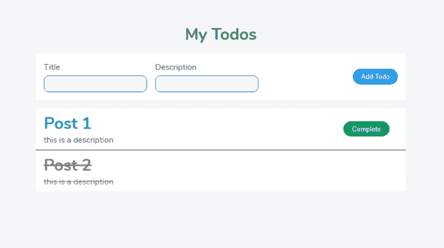
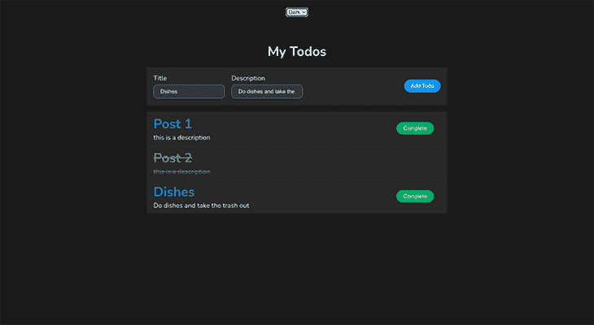

# 如何在 TypeScript - LogRocket 博客中使用 React 上下文

> 原文：<https://blog.logrocket.com/how-to-use-react-context-typescript/>

***编者按*** *:本帖于 2022 年 2 月 15 日更新，增加了一个主题化示例，改进并更新了对 React 上下文 API 的引用，并删除了过时的信息。*

在对代码进行了大量改进和添加之后，如健壮的静态类型检查、可理解性和类型推断，TypeScript 变得越来越受欢迎。当 TypeScript 与 React 一起使用时，它提供了改进的开发人员体验和项目的更多可预测性。

在本指南中，我们将通过从头构建一个待办事项应用程序来学习如何在 React 上下文中使用 TypeScript。为了充分利用本教程，您需要[对 React 和 TypeScript](https://blog.logrocket.com/using-typescript-with-react-tutorial-examples/) 有一个基本的了解。

在本帖中，我们将讨论:

让我们开始吧。

## 什么是 React 上下文 API？

React Context API 是在 React v16 中引入的，作为一种在组件树中[共享数据的方式，而不需要在每一层向下传递属性。](https://blog.logrocket.com/solving-prop-drilling-react-apps/)

对于被认为是“全局的”但对于 Redux 或 MobX 这样的专用状态管理器来说不够大或不够复杂的数据，如用户的当前语言、当前主题，甚至是发送到 API 之前来自多步表单的数据，上下文 API 是理想的选择。

## 设置应用程序

为了演示 React Context，我们将构建一个待办事项应用程序，它使用 Context API 来管理列表上的任务以及主题化。

我们将使用[创建 React 应用](https://create-react-app.dev/)以便拥有一个没有麻烦的现代配置，但是欢迎您使用 [Webpack](https://webpack.js.org/) 从头开始设置一个新的应用。

首先打开您的终端并运行以下命令:

```
npx create-react-app react-context-todo --template typescript

```

要使用 CRA 轻松创建 TypeScript 项目，需要添加标志`--template typescript`，否则应用程序将只支持 JavaScript。

接下来，让我们按如下方式构建项目:

```
src
├── @types
│   └── todo.d.ts
├── App.tsx
├── components
│   ├── AddTodo.tsx
│   └── Todo.tsx
├── containers
│   └── Todos.tsx
├── context
│   └── todoContext.tsx
├── index.tsx
├── react-app-env.d.ts
└── styles.css

```

这里，有两个文件需要加下划线:

*   `context/todoContext.tsx`文件，导出为待办功能创建的上下文，以及它的提供者
*   文件`@types`中的`todo.d.ts`包含应用程序中与待办事项列表实现相关的部分的类型定义

拥有专用的类型定义文件是最佳实践，因为它改进了项目的结构。声明的类型既可以通过引用使用而不导入，也可以通过将它们显式导入到另一个文件中来使用(尽管它们必须先被导出)。理想情况下，我们希望导入类型，这样就不会污染全局名称空间。

有了这些，我们现在可以动手做一些有意义的事情了。

## 创建待办事项类型

TypeScript 类型允许您定义变量或函数应该期望的值，以便帮助编译器在运行时之前捕捉错误。

```
// @types.todo.ts
export interface ITodo {
  id: number;
  title: string;
  description: string;
  status: boolean;
}
export type TodoContextType = {
  todos: ITodo[];
  saveTodo: (todo: ITodo) => void;
  updateTodo: (id: number) => void;
};

```

正如你所看到的，接口`ITodo`定义了待办事项的形状。接下来，我们有类型`TodoContextType`,它需要一组待办事项和添加或更新待办事项的方法。

## 创建上下文

React Context 允许您跨组件共享和管理状态，而无需传递属性。上下文将只向需要使用数据的组件提供数据。

```
// context/todoContext.tsx
import * as React from 'react';
import { TodoContextType, ITodo } from '../@types/todo';

export const TodoContext = React.createContext<TodoContextType | null>(null);

const TodoProvider: React.FC<React.ReactNode> = ({ children }) => {
  const [todos, setTodos] = React.useState<ITodo[]>([
    {
      id: 1,
      title: 'post 1',
      description: 'this is a description',
      status: false,
    },
    {
      id: 2,
      title: 'post 2',
      description: 'this is a description',
      status: true,
    },
  ]);

```

这里，我们首先创建一个新的上下文，并将其类型设置为匹配`TodoContextType`或`null`。在创建上下文时，我们暂时将默认值设为`null`；预期值将在提供程序上分配。接下来，我们创建向组件消费者提供上下文的组件`TodoProvider`。在这里，我用一些数据初始化状态，让`todos`工作。

```
// context/todoContext.tsx
const saveTodo = (todo: ITodo) => {
  const newTodo: ITodo = {
    id: Math.random(), // not really unique - but fine for this example
    title: todo.title,
    description: todo.description,
    status: false,
  }
  setTodos([...todos, newTodo])
}

const updateTodo = (id: number) => {
  todos.filter((todo: ITodo) => {
    if (todo.id === id) {
      todo.status = true
      setTodos([...todos])
    }
  })
}

```

函数`saveTodo`将基于接口`ITodo`创建一个新的待办事项，然后将该对象添加到待办事项数组中。下一个函数`updateTodo`将在待办事项数组中查找作为参数传递的待办事项 id，然后更新它。

```
// context/todoContext.tsx
 return (
    <TodoContext.Provider value={{ todos, saveTodo, updateTodo }}>
      {children}
    </TodoContext.Provider>
  );
};

export default TodoProvider;

```

接下来，我们将这些值传递给上下文，使它们可供组件使用。

```
// context/todoContext.tsx
import * as React from 'react';
import { TodoContextType, ITodo } from '../@types/todo';

export const TodoContext = React.createContext<TodoContextType | null>(null);

const TodoProvider: React.FC<React.ReactNode> = ({ children }) => {
  const [todos, setTodos] = React.useState<ITodo[]>([
    {
      id: 1,
      title: 'post 1',
      description: 'this is a description',
      status: false,
    },
    {
      id: 2,
      title: 'post 2',
      description: 'this is a description',
      status: true,
    },
  ]);
  const saveTodo = (todo: ITodo) => {
    const newTodo: ITodo = {
      id: Math.random(), // not really unique - but fine for this example
      title: todo.title,
      description: todo.description,
      status: false,
    };
    setTodos([...todos, newTodo]);
  };
  const updateTodo = (id: number) => {
    todos.filter((todo: ITodo) => {
      if (todo.id === id) {
        todo.status = true;
        setTodos([...todos]);
      }
    });
  };
  return <TodoContext.Provider value={{ todos, saveTodo, updateTodo }}>{children}</TodoContext.Provider>;
};

export default TodoProvider;

```

有了这个，我们现在能够使用上下文了。因此，让我们在下一节中创建组件。

## 创建组件并使用上下文

下面，我们有一个表单组件，它允许我们处理用户使用`useState`钩子输入的数据。一旦我们获得了表单数据，我们就使用从上下文对象中提取的函数`saveTodo`来添加一个新的待办事项。

```
// components/AddTodo.tsx
import * as React from 'react';
import { TodoContext } from '../context/todoContext';
import { TodoContextType, ITodo } from '../@types/todo';

const AddTodo: React.FC = () => {
  const { saveTodo } = React.useContext(TodoContext) as TodoContextType;
  const [formData, setFormData] = React.useState<ITodo | {}>();
  const handleForm = (e: React.FormEvent<HTMLInputElement>): void => {
    setFormData({
      ...formData,
      [e.currentTarget.id]: e.currentTarget.value,
    });
  };
  const handleSaveTodo = (e: React.FormEvent, formData: ITodo | any) => {
    e.preventDefault();
    saveTodo(formData);
  };
  return (
    <form className="Form" onSubmit={(e) => handleSaveTodo(e, formData)}>
      <div>
        <div>
          <label htmlFor="name">Title</label>
          <input onChange={handleForm} type="text" id="title" />
        </div>
        <div>
          <label htmlFor="description">Description</label>
          <input onChange={handleForm} type="text" id="description" />
        </div>
      </div>
      <button disabled={formData === undefined ? true : false}>Add Todo</button>
    </form>
  );
};
export default AddTodo;

```

注意，我在`useContext`钩子上使用类型转换来防止 TypeScript 抛出错误，因为上下文在开始时将是`null`。

```
// components/Todo.tsx
import * as React from 'react';
import { ITodo } from '../@types/todo';

type Props = {
  todo: ITodo;
  updateTodo: (id: number) => void;
};

const Todo: React.FC<Props> = ({ todo, updateTodo }) => {
  const checkTodo: string = todo.status ? `line-through` : '';
  return (
    <div className="Card">
      <div className="Card--text">
        <h1 className={checkTodo}>{todo.title}</h1>
        <span className={checkTodo}>{todo.description}</span>
      </div>
      <button onClick={() => updateTodo(todo.id)} className={todo.status ? `hide-button` : 'Card--button'}>
        Complete
      </button>
    </div>
  );
};
export default Todo;

```

正如您在这里看到的，我们有一个显示单个待办事项的表示组件。它接收`todo`对象和更新它的函数，作为需要匹配上面定义的`Props`类型的参数。

* * *

### 更多来自 LogRocket 的精彩文章:

* * *

```
// containers/Todos.tsx
import * as React from 'react';
import { TodoContextType, ITodo } from '../@types/todo';
import { TodoContext } from '../context/todoContext';
import Todo from '../components/Todo';

const Todos = () => {
  const { todos, updateTodo } = React.useContext(TodoContext) as TodoContextType;
  return (
    <>
      {todos.map((todo: ITodo) => (
        <Todo key={todo.id} updateTodo={updateTodo} todo={todo} />
      ))}
    </>
  );
};

export default Todos;

```

该组件在页面加载时显示待办事项列表。它从待办事项上下文中提取`todos`和函数`updateTodo`。接下来，我们遍历数组，将想要显示的对象传递给`Todo`组件。

随着这一步的推进，我们现在能够在`App.tsx`文件中提供待办事项上下文来完成应用程序的构建。因此，让我们在下一部分使用上下文提供者。

## 提供背景

```
// App.tsx
import * as React from 'react'
import TodoProvider from './context/todoContext'
import Todos from './containers/Todos'
import AddTodo from './components/AddTodo'
import './styles.css'

export default function App() {
  return (
    <TodoProvider>
      <main className='App'>
        <h1>My Todos</h1>
        <AddTodo />
        <Todos />
      </main>
    </TodoProvider>
  )
}

```

在这里，我们导入了包装待办事项上下文消费者的`TodoProvider`组件。也就是说，我们现在可以使用其他组件中的`useContext`钩子访问`todos`数组和函数来添加或更新待办事项。

这样，我们现在可以在终端上打开项目并运行以下命令:

```
  yarn start

```

或者

```
  npm start

```

如果一切正常，您将能够在浏览器中看到以下内容:

```
http://localhost:3000

```



## 使用上下文 API 进行主题化

在这一节中，我们将再看一下上下文 API 的另一个应用:主题化。

```
// @types/theme.d.ts
export type Theme = 'light' | 'dark';
export type ThemeContextType = {
  theme: Theme;
  changeTheme: (theme: Theme) => void;
};
};

```

我们创建了实现主题化所必需的类型:`Theme`指定了可能的主题模式，`ThemeContextType`指定了当我们使用主题时在主题上下文中可用的属性。

接下来，我们创建一个`themeContext.tsx`文件，导出原始主题上下文及其提供者。

```
// context/themeContext.tsx
import * as React from 'react';
import { Theme, ThemeContextType } from '../@types/theme';

export const ThemeContext = React.createContext<ThemeContextType | null>(null);

const ThemeProvider: React.FC<React.ReactNode> = ({ children }) => {
  const [themeMode, setThemeMode] = React.useState<Theme>('light');
  return (
    <ThemeContext.Provider value={{ theme: themeMode, changeTheme: setThemeMode }}>
      {children}
    </ThemeContext.Provider>
  );
};

export default ThemeProvider;

```

创建上下文后，我们创建一个`ThemeWrapper`组件，它既可以使用上下文，也可以在应用程序上切换主题。

```
// components/ThemeWrapper.tsx
import React from 'react';
import { ThemeContextType, Theme } from '../@types/theme';
import { ThemeContext } from '../context/themeContext';

const ThemeWrapper: React.FC = ({ children }) => {
  const { theme, changeTheme } = React.useContext(ThemeContext) as ThemeContextType;
  const handleThemeChange = (event: React.ChangeEvent<HTMLSelectElement>) => {
    changeTheme(event.target.value as Theme);
  };

  return (
    <div data-theme={theme}>
      <select name="toggleTheme" onChange={handleThemeChange}>
        <option value="light">Light</option>
        <option value="dark">Dark</option>
      </select>
      {children}
    </div>
  );
};
export default ThemeWrapper;

```

准备好`ThemeWrapper`后，我们现在可以将其导入`App.tsx`并进行测试。

```
// App.tsx
import * as React from 'react';
import TodoProvider from './context/todoContext';
import ThemeProvider from './context/themeContext';
import Todos from './containers/Todos';
import AddTodo from './components/AddTodo';
import ThemeWrapper from './components/ThemeWrapper';
import './styles.css';

export default function App() {
  return (
    <ThemeProvider>
      <TodoProvider>
        <ThemeWrapper>
          <main className="App">
            <h1>My Todos</h1>
            <AddTodo />
            <Todos />
          </main>
        </ThemeWrapper>
      </TodoProvider>
    </ThemeProvider>
  );
}

```



一旦 select 元素的 change 处理程序修改了`data-theme`属性，预先编写的 CSS 文件就会处理剩下的部分。

你可以在这里找到源代码[。](https://codesandbox.io/s/react-context-typescript-vk41i7)

## 结论

TypeScript 是一种很棒的语言，它使我们的代码变得更好。在本教程中，我们已经学习了如何在 React 上下文中使用 TypeScript。希望这对你的下一个项目有所帮助。感谢阅读。

## 使用 LogRocket 消除传统反应错误报告的噪音

[LogRocket](https://lp.logrocket.com/blg/react-signup-issue-free)

是一款 React analytics 解决方案，可保护您免受数百个误报错误警报的影响，只针对少数真正重要的项目。LogRocket 告诉您 React 应用程序中实际影响用户的最具影响力的 bug 和 UX 问题。

[ ](https://lp.logrocket.com/blg/react-signup-general) [  ](https://lp.logrocket.com/blg/react-signup-general) [LogRocket](https://lp.logrocket.com/blg/react-signup-issue-free)

自动聚合客户端错误、反应错误边界、还原状态、缓慢的组件加载时间、JS 异常、前端性能指标和用户交互。然后，LogRocket 使用机器学习来通知您影响大多数用户的最具影响力的问题，并提供您修复它所需的上下文。

关注重要的 React bug—[今天就试试 LogRocket】。](https://lp.logrocket.com/blg/react-signup-issue-free)

## [LogRocket](https://lp.logrocket.com/blg/typescript-signup) :全面了解您的网络和移动应用

[](https://lp.logrocket.com/blg/typescript-signup)

LogRocket 是一个前端应用程序监控解决方案，可以让您回放问题，就像问题发生在您自己的浏览器中一样。LogRocket 不需要猜测错误发生的原因，也不需要向用户询问截图和日志转储，而是让您重放会话以快速了解哪里出错了。它可以与任何应用程序完美配合，不管是什么框架，并且有插件可以记录来自 Redux、Vuex 和@ngrx/store 的额外上下文。

除了记录 Redux 操作和状态，LogRocket 还记录控制台日志、JavaScript 错误、堆栈跟踪、带有头+正文的网络请求/响应、浏览器元数据和自定义日志。它还使用 DOM 来记录页面上的 HTML 和 CSS，甚至为最复杂的单页面和移动应用程序重新创建像素级完美视频。

[Try it for free](https://lp.logrocket.com/blg/typescript-signup)

.